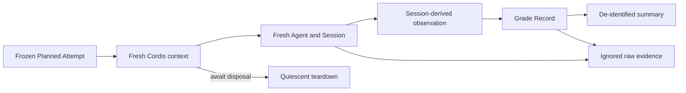

# Agent Note: Isolated evaluation Attempt runtime

Status: implemented

English | [中文](2026-09-17-isolated-evaluation-attempt-runtime.zh.md)

## Problem

A controlled evaluation cannot attribute failures or compare interventions when Attempts share an Agent, Session, sidecar fault counter, mutable process configuration, or incomplete evidence files. A summary-only runner also loses the Session events and query outcomes needed to distinguish model behaviour from provider, sandbox, sidecar, and warehouse failures.

## Decision

The G25a controlled runner creates a fresh Cordis root, Agent, Session, audit database, and query sidecar for every Attempt. The host modules load through the source runtime under `tsx/esm`; the Loader resolves preset rows from the repository's complete `node_modules/.pnpm/node_modules/` closure so host services and their private symbols retain one module identity.

Each Attempt applies the same provider, model, semantic corpus, query project, wall-clock limit, model-call limit, query-call limit, and one-transport-retry policy before mounting its arm preset. A generated per-Attempt sidecar launcher supplies the resolved `maxc` executable without mutating process-global environment state, and fault cases receive an independent fault counter.

Raw Session events, query rows, runtime failures, and per-Attempt launchers stay under the ignored `eval-results/g25a/raw/` tree. Committable summaries retain only identities, digests, categorical grades, tool names, cost counters, reference-result digests, and raw locators. Every Agent handle is disposed before its root context, and both operations are awaited.

Stage admission remains separate from model grading. Reference SQL runs before and after Stage 1 with an explicit `MAXC_CONFIG`; a changed digest or expected-value mismatch stops the experiment. Stage 0 proves that every preset mounts the same complete tool catalogue. Stage admission then requires policy and floor to expose that full catalogue and requires every state-machine request catalogue to be its subset; a case that correctly ends before a later phase need not expose that phase's tools. Task parity, model-visible Task inclusion, readable query outcomes, scorer safety, and infrastructure-failure rates are also evaluated from sealed Attempt evidence before Stage 2 can begin. This complements the [locked protocol preflight](2026-09-17-locked-evaluation-protocol-preflight.md), which rejects an internally inconsistent manifest before external work starts.

## Alternatives considered

**Reuse `HarnessAgentResponder`.** Rejected because it does not inject the frozen absolute-date Task working set into the model request and does not expose real `query_data` outcomes to this experiment's scorer.

**Share one root context or sidecar across Attempts.** Rejected because a crash, fault counter, scoped registration, or incomplete teardown could affect a later arm and destroy Attempt-level attribution.

**Commit raw Session and query evidence.** Rejected because those artifacts can contain full model text and warehouse rows. The ignored Evidence Cut preserves them locally while the repository stores only de-identified summaries.

## Consequences

Per-Attempt startup costs more time than a shared harness, but faults and cleanup are attributable and reproducible. A failed smoke remains inspectable without entering the decision denominator. If a frozen Stage 1 rule conflicts with a required case path, the runner stops before Stage 2; changing that rule requires an explicit protocol amendment rather than an execution-time exception.
