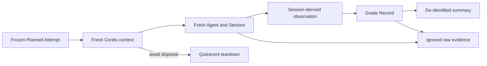

# Agent Note: 隔离的评测 Attempt 运行时

Status: implemented

[English](2026-09-17-isolated-evaluation-attempt-runtime.md) | 中文

## 问题

如果多个 Attempt 共用 Agent、Session、sidecar 故障计数器、可变进程配置或不完整的证据文件，受控评测就无法归因失败或比较 intervention。只写摘要的 runner 还会丢失区分模型行为与 provider、sandbox、sidecar、warehouse 故障所需的 Session 事件和查询 outcome。

## 决定

G25a controlled runner 为每个 Attempt 新建 Cordis root、Agent、Session、audit database 和 query sidecar。host 模块通过 `tsx/esm` 的源码运行时加载；Loader 从仓库完整的 `node_modules/.pnpm/node_modules/` closure 解析 preset row，使 host service 及其私有 symbol 保持单一 module identity。

每个 Attempt 在挂载 arm preset 前应用相同的 provider、model、semantic corpus、query project、wall-clock limit、model-call limit、query-call limit 和一次 transport retry policy。每个 Attempt 生成自己的 sidecar launcher，在不修改进程全局环境的前提下提供解析后的 `maxc` executable；fault case 使用独立的 fault counter。

原始 Session 事件、查询行、运行时失败和每个 Attempt 的 launcher 保留在忽略的 `eval-results/g25a/raw/` 目录中。可提交摘要只保留 identity、digest、分类 grade、工具名、成本计数、reference-result digest 和 raw locator。每个 Agent handle 都先于 root context disposal，并且两个操作都被 await。

Stage admission 与模型评分保持分离。Stage 1 前后都使用显式 `MAXC_CONFIG` 执行 reference SQL；digest 变化或 expected-value 不匹配都会停止实验。在 Stage 2 开始前，runner 从封存的 Attempt 证据评估工具与 Task parity、模型可见 Task、可读查询 outcome、scorer safety 和 infrastructure-failure rate。该规则补充[锁定协议预检](2026-09-17-locked-evaluation-protocol-preflight.zh.md)：后者在外部工作开始前拒绝内部矛盾的 manifest。

## 考虑过的替代方案

**复用 `HarnessAgentResponder`。** 拒绝，因为它不会把冻结的绝对日期 Task working set 注入模型请求，也不会向本实验 scorer 暴露真实 `query_data` outcome。

**多个 Attempt 共用一个 root context 或 sidecar。** 拒绝，因为 crash、fault counter、scoped registration 或未完成 teardown 可能影响后续 arm，破坏 Attempt 级归因。

**提交原始 Session 和查询证据。** 拒绝，因为这些 artifact 可能包含完整模型文本和 warehouse row。忽略目录中的 Evidence Cut 在本地保存这些内容，仓库只保存去标识摘要。

## 后果

每个 Attempt 单独启动比共享 harness 更耗时，但故障与 cleanup 可归因且可复现。失败 smoke 仍可检查，但不会进入 decision denominator。如果冻结的 Stage 1 规则与必需 case path 冲突，runner 会在 Stage 2 前停止；修改该规则必须经过显式协议修订，不能在执行时加例外。
