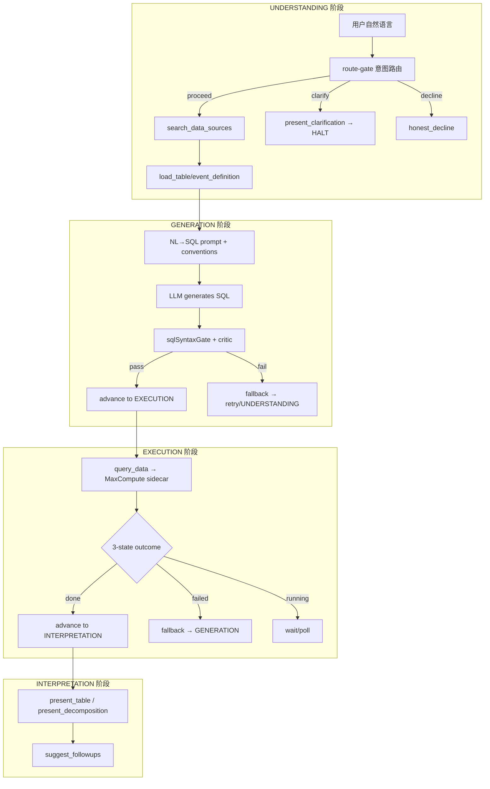
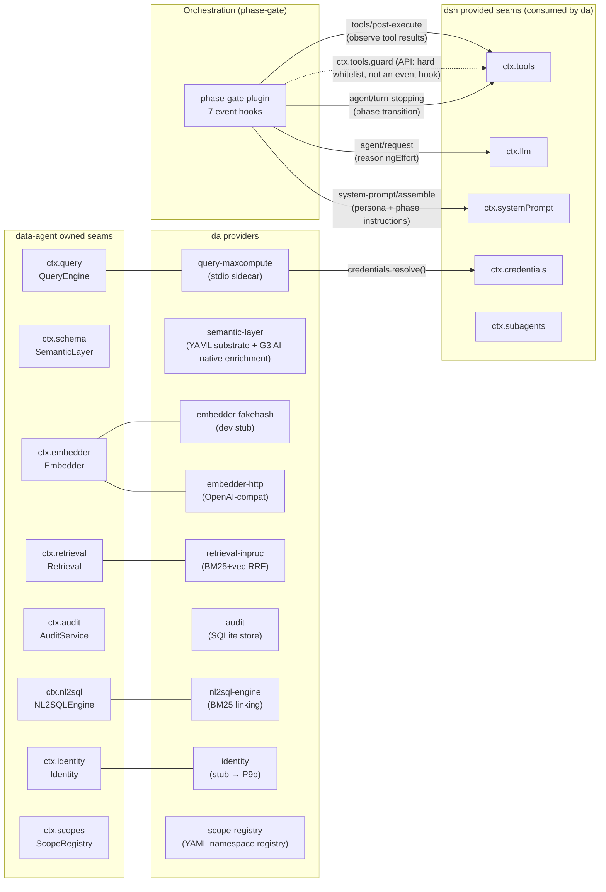
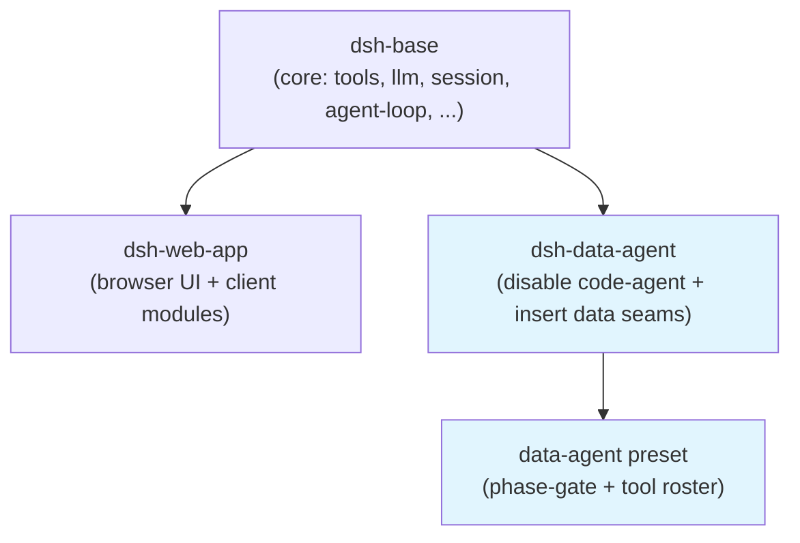

# dsh-data-agent Architecture

## 数据管道全景



## Capability Seam 拓扑



## Bundle 组合层次



## da 包与 dsh 的边界

```
packages/
├── core/           ← dsh (不动)
├── llm/
│   ├── llm/        ← dsh (不动)
│   ├── llm-deepseek/ ← dsh (不动)
│   └── llm-dashscope/ ← DA [data-agent]
├── shell/          ← dsh (不动)
├── subagent/
│   ├── subagent/   ← dsh (不动)
│   └── subagent-qoder/ ← DA [data-agent]
├── credentials/
│   ├── credentials/     ← dsh (不动)
│   ├── credentials-local/ ← dsh (不动)
│   ├── credentials-keychain/ ← DA [data-agent]
│   └── credentials-keychain-host/ ← DA [data-agent]
├── data/           ← DA (全部 da-owned: phase-gate, semantic-layer, audit, nl2sql-engine, scope-registry, tool-discover-relations, preset-autojoin, tool-*)
├── query/          ← DA (全部 da-owned)
├── embedder/       ← DA (全部 da-owned)
├── retrieval/      ← DA (全部 da-owned)
├── eval/           ← DA (全部 da-owned)
├── identity/       ← DA (全部 da-owned)
└── bundle/
    ├── base/       ← dsh (不动)
    ├── web-app/    ← dsh (不动)
    └── data-agent/ ← DA
```

## 更新规则

- 新增/删除 seam → 更新 "Capability Seam 拓扑" 图
- Pipeline 阶段变更 → 更新 "数据管道全景" 图
- 新增 da 包 → 更新 "da 包与 dsh 的边界" 树
- 本文与 `docs/capability-seams.md`（auto-generated）互补，不重复
