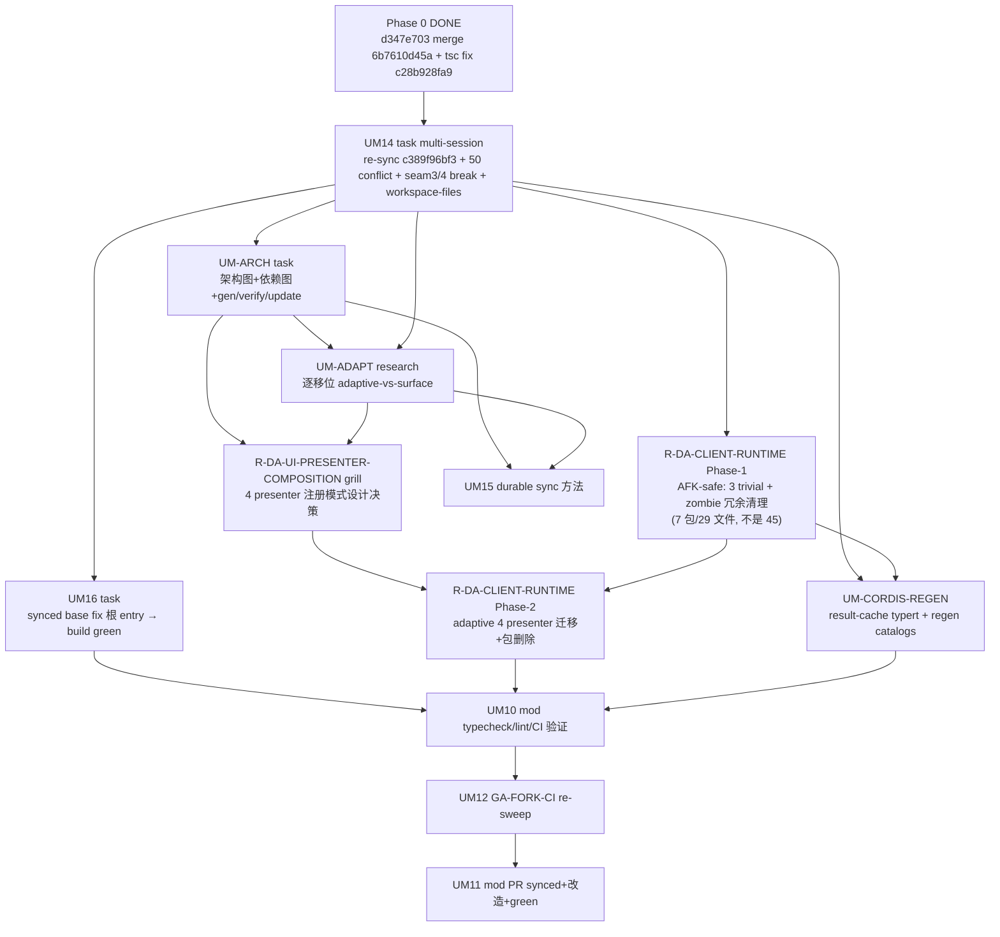
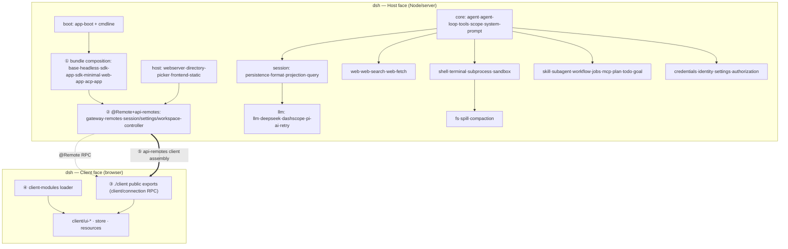
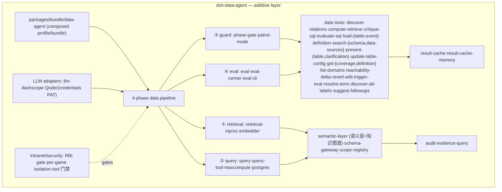

# UM flow 2026-09-08 — upstream-sync + data-agent 改造 + durable 方法 全流程

> 承接 UM13 research（re-sync 可行性 + 449 impact 核验完成）。本 doc 规划整个 flow + 票 + blocking + 工程机制。

## Destination（项目层，来自 `map.md`）

把 `deepseek-harness-da` fork 改造成 `deepseek-harness-data-agent`（data agent）。本 flow 是其中的 **upstream-sync 维度**：同步最新 + 全解冲突 + data-agent 按最新逻辑改造 + durable 方法。**不是**整个 data-agent transformation（多月 additive 数据能力叠加是 map 里别的工作）。

## 核心 3 需求

1. 同步 upstream dsh 最新代码。
2. 全解冲突 + data-agent 按 dsh 最新逻辑做**适配性改造**（不是小修补——见 adaptive 守门 UM-ADAPT）。
3. 一套工程方法：后续 upstream 每次更新快速定位"哪里要变"+ 生成新票。

## Flow（phases + tickets + blocking）

## Phase 叙述

- **Phase A（re-sync）** — UM14：re-merge `c389f96bf3` + 50 conflict + seam 3/4 break 迁移 + workspace-files 采纳。交付 synced 分支（build 仍破，根 entry upstream-shared）。
- **Phase B（data-agent 改造 + build 绿）** — 分**清障线**（Phase-B-clear）和**适配性改造主线**（Phase-B-adapt），并行推进：
  - **Phase-B-clear**（AFK-safe，可并行）：UM-ARCH regen-from-synced（synced base 8112743d69 上重生成权威 dsh 图）+ **R-DA-CLIENT-RUNTIME-DECOMMISSION Phase-1**（3 trivial 包迁移 + 删 zombie 冗余 root 声明 + 删死 apiproxy ref；7 包/29 文件不是 45——见票 2026-09-09 update）+ UM-CORDIS-REGEN（result-cache typert + regen catalogs）+ UM16（synced base 修 build:official 根 entry）。**这些是清障，不是适配性改造**——为主线扫清起点。
  - **Phase-B-adapt**（适配性改造主线，序列化）：UM-ADAPT（逐移位 adaptive 判定，UM-ARCH+UM14 后跑；每移位识别 why → 判架构冲突 → 判据 5 条）→ **R-DA-UI-PRESENTER-COMPOSITION grill**（view-registry seam 上的设计决策：A 走 `ConversationViewRegistry` vs B keep-standalone；这是 4 presenter 包适配性改造的**设计闸门**）→ **R-DA-CLIENT-RUNTIME-DECOMMISSION Phase-2**（4 presenter 按选定模式真迁移 + boot wiring 重分布 + zombie 包本体删除）+ cordis regen 第二轮（如需）。**这条线才是 UM-flow 核心需求②的实体**——防糊弄、真适配。
  交付 synced+改造+build 绿+data-agent 对齐 latest 逻辑。
- **Phase C（验证+PR+durable 方法）** — UM10（验证）→ UM12（GA-FORK-CI）→ UM11（PR）。UM15（durable 方法）并行，UM-ARCH+UM-ADAPT 后。

## 工程机制（demand ③，跨 UM-ARCH + UM15 + UM-ADAPT）

- **架构图 + 依赖图**（UM-ARCH）：dsh + data-agent Mermaid + data-agent→upstream 依赖（含 violation）+ gen/verify/update-on-change。= impact analyzer 的输入模型 + adaptive 守门的对齐参考。
- **impact analyzer**（UM15）：upstream 更新 → diff 旧 dsh 图 vs 新 → 架构移位 → 交叉依赖图 → data-agent 哪些受影响 → adaptive vs surface（自动 UM-ADAPT）→ ticket 候选。
- **adaptive 守门**（UM-ADAPT）：每移位 ①why ②data-agent 当前 ③冲突 ④adaptive 改造。防"小修补糊弄"。
- **staleness + cadence + merge 纪律**（UM15）：N-behind 告警 + sync 频率 + 94-conflict-resolution 形式化。

## 原 UM 修改/退休

| 票 | 处置 |
|---|---|
| UM1-9 | DONE（d347e703 merge 94 冲突解决，closed）。不退休——是历史 + UM14 re-sync 的 base；UM4 @Remote re-home、UM7 zombie 保留在 UM14 时 re-validate。 |
| UM10 | **修改**——补 tsc 已修（`c28b928fa9`）+ tsdown 根 entry upstream-shared + re-sync 修不了；验证 pivot 到 post-re-sync（Phase C）。 |
| UM11 | **修改/重构**——从"PR d347e703 merge"改为"PR synced+改造+build-green 分支"。 |
| UM12 | **保留**——defer 到 post-re-sync。 |
| UM13 | **DONE**——research 完成，UM14/UM15/UM-ARCH/UM-ADAPT 的 basis。 |

## v1 草图（手画，UM-ARCH gen 脚本生成后替换）

**图 1 — dsh（upstream）架构**（v1，wiring 需 gen 脚本核实）：

**图 2 — dsh-data-agent 架构**（v1）：

**依赖图（data-agent → upstream，对齐参考）**：

| data-agent 组件 | upstream seam/包 | 契约 | 对齐状态 |
|---|---|---|---|
| bundle/data-agent | ① bundle composition | public (cordis.patch.yml) | 对齐 |
| bundle/data-agent | ② @Remote/api-remotes | public (UM4 re-home) | 对齐（re-sync re-validate：32↑） |
| data tools/pipeline | ② @Remote results-RPC | public (result-cache/remote.ts) | 对齐（UM4-B） |
| LLM 适配 | llm seam (deepseek/dashscope/pi-ai) | public | 对齐 |
| 内网安全 | host webserver + credentials | public | 对齐 |
| client-modules 用法 | ④ client-modules loader | public | 对齐（re-validate：DshClientManifest rename） |
| client/connection 用法 | ③ client/connection | public | 对齐（re-validate：ConnectionRecoveryConfig rename） |
| **client/runtime（zombie）** | **③ ./client public exports** | **⚠ VIOLATION（zombie 内部）** | **R-DA-CLIENT-RUNTIME-DECOMMISSION**（**7 包/29 文件**，非 45——2026-09-09 subagent survey 修正）；Phase-1 AFK-safe 迁 3 trivial + 清 zombie 冗余；Phase-2 blocked by R-DA-UI-PRESENTER-COMPOSITION 设计闸门，做 4 presenter 真迁移 + 包删除 |
| workspace-files（NEW） | ② api/workspace-files @Remote | 新 seam | **待采纳（UM14）** |

> v1 草图的诚实边界：包名准确（来自 tsconfig.host.json refs），wiring 是推断；UM-ARCH 的 gen 脚本从跨包 import 生成权威图后替换本节。

---

## 2026-09-09 session update（Phase-B-clear done + grill Plan B + Q3 + 3 后续票）

**Phase-B-clear 全 done + 主 session 铁律重验**：
- **UM-ARCH regen-from-synced** ✓（commit `038d8b51ce`，`verify-architecture-graph` green，workspace-files authoritative；worktree `dsh-arch-regen`；PR deferred Phase-C）。
- **UM-CORDIS-REGEN subtasks 1+2** ✓（commits `cc6d9e714e`+`193b018827`，typert surface fix + gen-cordis-api regen；worktree `dsh-cordis`；subtask 3 deferred——blocked by RootOwnerProps homing）。
- **R-DA-CLIENT-RUNTIME-DECOMMISSION Phase-1** ✓（5 `[R-DA-P1]` commits，3 trivial 包迁出 zombie + 删 root-slot/apiproxy ref；worktree `dsh-rda-p1`）。
- **UM16 root-entry** ✓（3 `[UM16]` commits，`build:lib:host` green on node 24；worktree `dsh-um16`；`build:official` 未绿——325 apiproxy-removal errors 独立 workstream）。

**Phase-B-adapt grill done → Plan B**：R-DA-UI-PRESENTER-COMPOSITION = **Plan B**（keep `tool.call.toolview` + repoint imports + re-home helpers + isLatestTurn gap；非 Plan A——architecturally misplaced）。**ADR-0002** 双语记录翻转。Phase-2（4 presenter 迁移）+ Round 2（isLatestTurn gap）deferred 后续 session。

**Q3 apiproxy-fallout research → mixed verdict**：UM-APIPROXY-REMOVAL-CLIENT-TYPE-ANALYSIS resolved（~68 surface + ~122 adaptive；types REPLACED not moved）。Spawn 3 后续票：`UM-CLIENT-CONFIG-CLEANUP`（surface D+E）、`UM-CONNECTION-FIXTURE-DEAD-APICLIENT`（adaptive A）、`R-DA-TYPERT-REMOTE-REGISTRATION`（adaptive B+C+G sprint，18 包）。

**UM1-9 triage（2026-09-09）**：UM1/UM3/UM5/UM7/UM8/UM9 archived（done/resolved-by-upstream via re-sync `8112743d69`/superseded）；UM2 folded→UM12；UM4+UM6 leave-open（R-DA/Phase-2 + blocked-on-R-DA）。详 `.tmp/next-5-triage.md`。

**UM-ADAPT per-shift**：seam-4（diverged→Plan B）、workspace-files（not-applicable）、invariant-cleanup（needs-adaptive-but-mechanical→UM16）。Session A seam-3/4 admin slice landed（commit `9ba8638eac`，R-DA-admin，push deferred Phase-C）。

**Deferred（非本 session）**：Phase-C pushes（UM-ARCH PR + R-DA-admin，node 24，分支集成后）、Phase-2 grill Round 2（isLatestTurn gap）、3 后续票执行、Typert Remote sprint（多 session）。

---

## 2026-09-10 session update（Phase C 线 A：UM10 + UM16 resolved；UM12 成 frontier）

**线 A 实跑结论**（票据详情在 [UM10](UM10-verify-typecheck-lint-ci-gates.md) Resolution，此处只索引）：

| gate | 结果 |
|---|---|
| `tsc -b tsconfig.client.json --force` | **1 → 0**。Phase-2 记的「144→0」少算一个，`git blame` 证该错出自 `eb9e4cf05c` 自身 |
| `pnpm run build:official` | **GREEN** → **UM16 resolved**，原记 325 apiproxy-removal errors 已全清 |
| full `lint`（typeAware） | **93 errors**（判 pre-existing：oxlint 解不出 Cordis service handle，tsc = 0 反证）→ 毕业 2 票 |
| `check:ci:static` | **19/26 → 23 passed/22 failed**，无新增失败 |

**Phase 状态更新**：

- **Phase A / B 全部 resolved**：UM13 ✓、UM14 ✓、UM-ARCH ✓、UM-CORDIS-REGEN ✓(partial，子任务 3 deferred)、UM16 ✓、R-DA Phase-1+2 ✓、R-DA-UI-PRESENTER-COMPOSITION ✓。**UM-ADAPT 仍开**（per-shift 收尾）。
- **Phase C 进度**：UM10 ✓ → **UM12 = 当前 frontier**（unblocked）→ UM11 仍 blocked。UM15 并行可做。
- **flow 图的 blocking 需订正**：票据 header 里 UM12 写 `Blocked by: UM11`，与 UM11 的 `Blocked by: UM10 + UM12` **互锁成环**。以本 doc mermaid 的 `UM10 → UM12 → UM11` 为准，两票 header 已订正。

**新毕业 2 票**（均 unblocked，可并行 AFK）：
- [UM-DATA-SRC-DTS-POLLUTION](UM-DATA-SRC-DTS-POLLUTION.md) — 84 个生成物写进 `packages/data/*/src/`，把 lint 从 93 抬到 1980；需定位产出者而非只加 gitignore。**blocks 下一票**。
- [UM-LINT-TYPEAWARE-CORDIS](UM-LINT-TYPEAWARE-CORDIS-false-positives.md) — 93 条 `error`-typed 假阳性怎么算过 gate（A 修解析 / B 作用域 disable / C 关规则或记 known-red）。

**重评解除的 blocking**（2026-09-10）：
- **UM4 unblocked**（UM1/UM3 archived + R-DA 完成）。且 UM10 发现 UM4 的 results-RPC re-home 留尾：bundle 缺 `@deepseek-ai/dsh-result-cache` 依赖声明 + `tsconfig.base.json` 缺 `/src/*` 映射 → `verify-cordis-config` 红。
- **UM6** 仅剩 UM4 一个前置。
- **A23（worktree/branch 收尾）unblocked**——原阻塞的 9 个并行 session worktree 实测现存 **0**。清理清单已落 [UM11](UM11-pr-merge-post-cleanup.md)。

**喂给 UM15 的方法论教训**：`verify-architecture-graph` **不在** `check:ci:static` 组内，所以 static sweep 抓不到架构图 stale——而删包必然让它 stale。UM15 的 durable 方法须把「包增删 → 触发 regen 清单」形式化，且把组外 gate 纳入 sweep。
