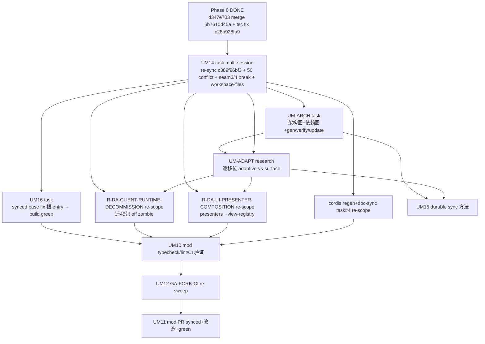
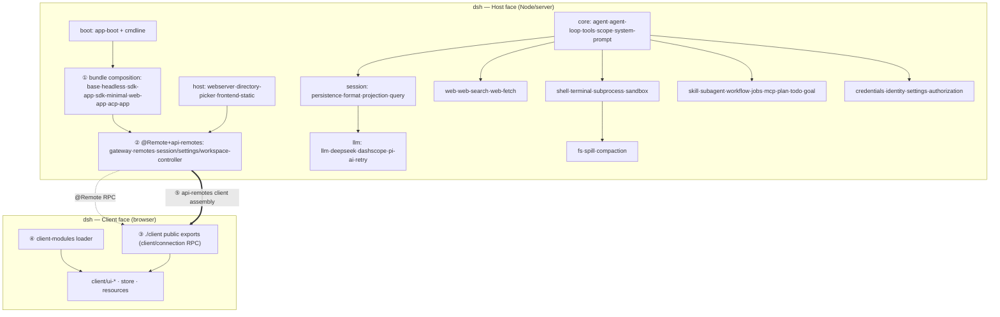
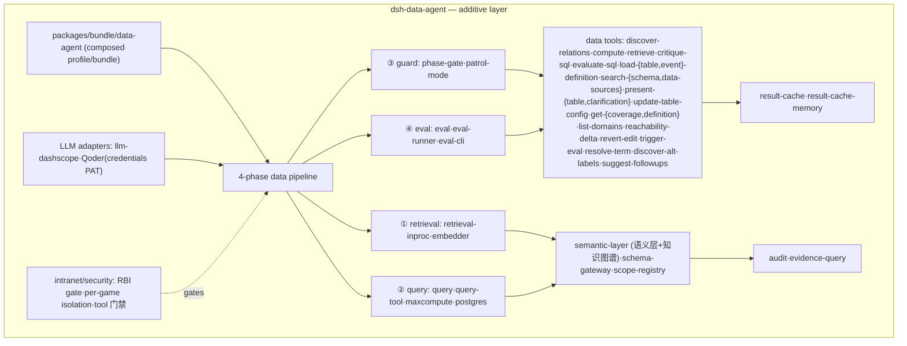

# UM flow 2026-09-08 — upstream-sync + data-agent 改造 + durable 方法 全流程

> 承接 UM13 research（re-sync 可行性 + 449 impact 核验完成）。本 doc 规划整个 flow + 票 + blocking + 工程机制。

## Destination（项目层，来自 `map.md`）

把 `deepseek-harness-da` fork 改造成 `deepseek-harness-data-agent`（data agent）。本 flow 是其中的 **upstream-sync 维度**：同步最新 + 全解冲突 + data-agent 按最新逻辑改造 + durable 方法。**不是**整个 data-agent transformation（多月 additive 数据能力叠加是 map 里别的工作）。

## 核心 3 需求

1. 同步 upstream dsh 最新代码。
2. 全解冲突 + data-agent 按 dsh 最新逻辑做**适配性改造**（不是小修补——见 adaptive 守门 UM-ADAPT）。
3. 一套工程方法：后续 upstream 每次更新快速定位"哪里要变"+ 生成新票。

## Flow（phases + tickets + blocking）

## Phase 叙述

- **Phase A（re-sync）** — UM14：re-merge `c389f96bf3` + 50 conflict + seam 3/4 break 迁移 + workspace-files 采纳。交付 synced 分支（build 仍破，根 entry upstream-shared）。
- **Phase B（data-agent 改造 + build 绿）** — UM-ARCH（架构图+依赖图，UM14 后权威）→ UM-ADAPT（逐移位 adaptive 判定，UM-ARCH+UM14 后）→ UM16（build 绿）+ R-DA-*（zombie decommission + presenter composition，UM-ADAPT 判 adaptive）+ cordis regen。交付 synced+改造+build 绿+data-agent 对齐 latest 逻辑。
- **Phase C（验证+PR+durable 方法）** — UM10（验证）→ UM12（GA-FORK-CI）→ UM11（PR）。UM15（durable 方法）并行，UM-ARCH+UM-ADAPT 后。

## 工程机制（demand ③，跨 UM-ARCH + UM15 + UM-ADAPT）

- **架构图 + 依赖图**（UM-ARCH）：dsh + data-agent Mermaid + data-agent→upstream 依赖（含 violation）+ gen/verify/update-on-change。= impact analyzer 的输入模型 + adaptive 守门的对齐参考。
- **impact analyzer**（UM15）：upstream 更新 → diff 旧 dsh 图 vs 新 → 架构移位 → 交叉依赖图 → data-agent 哪些受影响 → adaptive vs surface（自动 UM-ADAPT）→ ticket 候选。
- **adaptive 守门**（UM-ADAPT）：每移位 ①why ②data-agent 当前 ③冲突 ④adaptive 改造。防"小修补糊弄"。
- **staleness + cadence + merge 纪律**（UM15）：N-behind 告警 + sync 频率 + 94-conflict-resolution 形式化。

## 原 UM 修改/退休

| 票 | 处置 |
|---|---|
| UM1-9 | DONE（d347e703 merge 94 冲突解决，closed）。不退休——是历史 + UM14 re-sync 的 base；UM4 @Remote re-home、UM7 zombie 保留在 UM14 时 re-validate。 |
| UM10 | **修改**——补 tsc 已修（`c28b928fa9`）+ tsdown 根 entry upstream-shared + re-sync 修不了；验证 pivot 到 post-re-sync（Phase C）。 |
| UM11 | **修改/重构**——从"PR d347e703 merge"改为"PR synced+改造+build-green 分支"。 |
| UM12 | **保留**——defer 到 post-re-sync。 |
| UM13 | **DONE**——research 完成，UM14/UM15/UM-ARCH/UM-ADAPT 的 basis。 |

## v1 草图（手画，UM-ARCH gen 脚本生成后替换）

**图 1 — dsh（upstream）架构**（v1，wiring 需 gen 脚本核实）：

**图 2 — dsh-data-agent 架构**（v1）：

**依赖图（data-agent → upstream，对齐参考）**：

| data-agent 组件 | upstream seam/包 | 契约 | 对齐状态 |
|---|---|---|---|
| bundle/data-agent | ① bundle composition | public (cordis.patch.yml) | 对齐 |
| bundle/data-agent | ② @Remote/api-remotes | public (UM4 re-home) | 对齐（re-sync re-validate：32↑） |
| data tools/pipeline | ② @Remote results-RPC | public (result-cache/remote.ts) | 对齐（UM4-B） |
| LLM 适配 | llm seam (deepseek/dashscope/pi-ai) | public | 对齐 |
| 内网安全 | host webserver + credentials | public | 对齐 |
| client-modules 用法 | ④ client-modules loader | public | 对齐（re-validate：DshClientManifest rename） |
| client/connection 用法 | ③ client/connection | public | 对齐（re-validate：ConnectionRecoveryConfig rename） |
| **client/runtime（zombie）** | **③ ./client public exports** | **⚠ VIOLATION（zombie 内部）** | **R-DA-CLIENT-RUNTIME-DECOMMISSION（45 包）** |
| workspace-files（NEW） | ② api/workspace-files @Remote | 新 seam | **待采纳（UM14）** |

> v1 草图的诚实边界：包名准确（来自 tsconfig.host.json refs），wiring 是推断；UM-ARCH 的 gen 脚本从跨包 import 生成权威图后替换本节。
