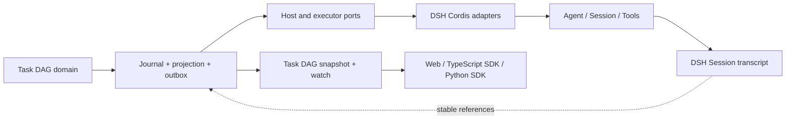

# wayfinder:map — task-orchestration-dag

> Local Markdown tracker. Tickets live in `tickets/`; research notes live in `research/`. This map indexes decisions and does not restate their detail.

## Destination

An implementation-ready specification for a standalone-capable Task DAG core plus a community-installable DSH Cordis adapter suite for data-agent. The Task DAG owns a writable Plan DAG, execution attempts, verification, Holds, budgets, recovery, an append-only journal, current projections, and a transactional outbox. The LLM can create and revise tasks and dependencies; an outer-loop policy advances ready work through Host adapters; and Web or SDK clients show current, subsequent, blocked, failed, and completed work.

The core domain, store, projection, and execution ports must not import DSH or Cordis types. The DSH adapter suite mounts beside upstream packages, maps generic Host Bindings and executor ports to documented DSH services, events, Remotes, bundle composition, and UI slots, and requires no upstream source modification or replacement of `agent-loop`. The map is complete when the independent domain and persistence protocol, Host integration, attempts and correlation, loop policy, tools and presets, executor adapters, UI, renderer, community package topology, compatibility policy, and first-release evaluation are specified for implementation, and every deliberately deferred full-version capability has a named follow-up ticket.

## Notes

- **Domain**: Host-neutral writable task planning, bounded outer-loop control, append-only Task DAG persistence, projections, transactional delivery, executor ports, DSH Cordis adapters, and graph presentation.
- **Skills**: `/dsh-plugin-development`, `/domain-modeling`, `/grilling`, `/prototype`, and `/research`.
- **Planning only**: this map resolves decisions and produces implementation specifications; it does not implement product packages.
- **Grilling cadence**: discuss one genuine decision per round; eliminate dominated or constraint-violating options before presenting choices, and ask for human approval only when viable alternatives have material trade-offs or the choice sets a system architecture.
- **Discussion language and examples**: conduct decision rounds in Chinese and explain trade-offs with concrete data-agent scenarios such as natural-language analytics, data engineering, verification, and recovery.
- **Terminology explanations**: when a specialized term first appears in a decision round, define it in plain Chinese and show its role in one concrete data-agent flow before asking for approval.
- **Option quality**: present only independently viable strategies. Evaluate them by user benefit, implementation and maintenance cost, runtime and model overhead, feasibility in current DSH extension points, adoption breadth, and long-term dsh-data-agent value; never manufacture a preferred hybrid by combining labelled options.
- **Decision diagrams**: every architecture or process decision includes a Mermaid flow, sequence, state, or ownership diagram showing the relevant actors, transitions, decision points, and failure paths.
- **Deferred work is named**: every capability deferred from the current ticket must be linked to an explicit follow-up ticket with its trigger, dependencies, decision question, and scope boundary; accumulated evidence never silently enables deferred behavior.
- **ROI gate**: every proposed architecture states user benefit, implementation and maintenance cost, runtime/token/cost overhead, adoption breadth, evidence strength, opportunity cost, and the smallest useful release; unclear marginal ROI defaults to deferral.
- **Architecture-first release strategy**: use the long-term dsh-data-agent direction to choose stable domain ownership, identities, authority, durability, and extension seams; the first release implements the highest-ROI useful slice of that architecture rather than a cheaper design that must later be replaced.
- **Optimization follow-ups**: cost, latency, deduplication, adaptive routing, scheduling, caching, and other optimizations do not enlarge the initial core unless required for correctness. Record them as named follow-ups with evidence triggers and revisit them only when measured user or operating value justifies their complexity.
- **Alternative discipline**: compare complete independently viable strategies rather than manufacturing an `A + B = C` compromise; if one strategy dominates after evidence and ROI analysis, record it directly without an artificial approval choice.
- **Cumulative scope audit**: before the current outer-loop ticket resolves, re-review every accepted decision together, cut or defer low-ROI machinery, check total implementation and model-cost budgets, and attach each deferral to a named follow-up.
- **Upstream baseline**: `upstream/master@c291e7961a515f6d7af9304e7fd1d257929aef26` and `dsh-v0.1.5-rc.2@fb2c4b9e698e30edb738bca4cf0618587db7d203`, dated 2026-09-10.
- **Writable Plan DAG is required**: the feature is not a read-only graph. It owns Plan Runs, tasks, hard dependencies, revisions, readiness, task state, replanning, attempts, verification, budgets, holds, stop records, and explicit execution correlations.
- **Executor ownership remains separate**: workflow, subagent, skill, tool, phase, Goal, and trace capabilities retain their internal lifecycles. Adapters link them to task attempts without copying their state machines.
- **Independent core and Cordis adapters**: Task DAG domain, journal, projection, commands, and ports import no DSH or Cordis types. DSH integration uses reversible effects and public Agent, Session, Tools, Remote, bundle, preset, and UI APIs; it makes no upstream source change, imports no `agent-loop` implementation file, and retains no fork UI/core patch solely for this feature.
- **One outer-loop owner**: a Plan-DAG-enabled profile disables upstream `goal-round-driver` and mounts the Task DAG driver as the sole cross-turn continuation owner; phase and other inner policies operate only inside an admitted Attempt. Ordinary DSH profiles retain upstream Goal behavior.
- **Authority and Host binding**: the Task DAG journal owns validation, replay, verification, budgets, Holds, deliveries, and projections. Generic Host Bindings attach a Run to DSH or another Host without making native conversation ids domain identities.
- **Dual durable records**: Task DAG storage owns plan and execution-control facts; a DSH Session records the exact messages, model responses, and tool events that occur in DSH. Adapters correlate the two stores with stable identities and digests and never infer one authority from the other.
- **Host/Client ownership**: Task DAG services produce renderer-neutral current values through their own snapshot/watch transport. React owns only presentation state and renderer lifecycle; it does not replay either Task DAG journal records or DSH Session events.
- **Concurrency is preserved without first-release speculation**: independent Tasks may run concurrently without a plugin-wide subagent or workflow cap. The domain retains explicit same-Task Attempt Groups, but first-release runtime admission rejects them visibly; group execution, winner/quorum policy, loser cancellation, and group recovery belong to the advanced-routing follow-up.
- **Commitment policy**: a Plan may cover the full objective; each admission cycle selects a conflict-free set of independent ready Tasks, with at most one active Attempt per Task in the first release. Local retry or affected-subgraph repair precedes global replanning; same-Task groups are deferred.
- **Completion requires evidence**: model self-report is a completion proposal. Completion assurance distinguishes `verified` from `attested`; hard dependencies require `verified` by default.
- **Community distribution**: the independent core and storage providers can ship without DSH; DSH adapter packages depend only on published contracts and install through the normal bundle/profile workflow. Experimental upstream capabilities remain behind optional adapters.
- **No forgotten full version**: a minimal first-release decision names the fuller capability it defers and links a follow-up ticket. Follow-ups cover advanced verification, multi-agent scheduling, recovery, routing and parallelism, phase and Goal integration, capability extraction, history inspection, typed dataflow ports, richer plan relations, risk-gated human-input auto-routing, extensible Task Graph authorization, and measured renderer scaling or replacement.
- **Retained UX**: compact progress near the conversation input, an on-demand graph, node detail, dependency highlighting, clear active/blocked/completed states, and reduced-motion behavior.

## Architecture

[G14 Durable events, projection, and Host/Client boundary](tickets/G14-task-graph-projection-boundary.md) owns the persistence and Host-integration detail. At map resolution, the Task DAG core is portable and DSH is one adapter target:



The Task DAG journal owns Plan and execution-control state. DSH records the exact model and tool transcript produced through its adapter. Host Bindings, delivery identities, native references, and digests correlate the stores without making either reconstruct the other's authority.

## Ticket frontier

```text
[✓] R6 Agent orchestration and loop-engineering research ─┐
[✓] R7 DSH Cordis plugin adaptation ─────────────────────┼──▶ [✓] G12 Plan DAG ownership boundary
                                                        └──▶ [✓] G13 ExecutionAttempt and correlation protocol
                                                               └──▶ [✓] G19 Cordis outer-loop driver
                                                                      ├──▶ [✓] G14 Durable storage and Host boundary ──▶ [✓] G15 Current client placement ──▶ [✓] R5 Renderer adapter stability ─┬──▶ G4 Animation and edge design
                                                                      │                                                                └──▶ G11 DAG view simplification
                                                                      ├──▶ G16 Model tools and preset composition
                                                                      ├──▶ G17 Executor adapters
                                                                      └──▶ G7 writeScopes conflict semantics
```

**Frontier:** [G4 Animation and edge design](tickets/G4-animation-and-edge-design.md), [G11 DAG view simplification strategies](tickets/G11-dag-view-simplification-strategies.md), [G16 Model tools and preset composition](tickets/G16-todo-coexistence-and-preset-composition.md), [G17 Executor adapters](tickets/G17-native-source-adapters.md), and [G7 writeScopes conflict semantics](tickets/G7-writescopes-conflict-detection.md) are open, unblocked, and unclaimed.

**Current checkpoint:** [R5 G6 renderer adapter stability](tickets/R5-g6-renderer-adapter-stability.md) is resolved. The next session should take [G4 Animation and edge design](tickets/G4-animation-and-edge-design.md) unless another frontier ticket is named.

**Next session rule:** resolve one frontier ticket per session unless the user explicitly requests an exception.

## Decisions so far

- [R1 Agent Teams maturity audit](research/R1-agent-team-maturity-audit.md): Agent Teams supplied strong task-DAG prior art; its published experimental API is an optional adapter candidate, not the Plan DAG's permanent public contract.
- [R2 G6 dagre layout feasibility](research/R2-g6-dagre-layout-feasibility.md): G6 5.1.1 can render expected graph sizes; renderer-specific APIs still require an adapter.
- [R3 Subagent and workflow event surface](research/R3-subagent-workflow-event-surface.md): task-to-executor causality remains a gap, while current upstream subagent catalogs and workflow records own more lifecycle facts than the original research observed.
- [G1 DAG data model decision](tickets/G1-dag-data-model-decision.md): stable Task identities and explicit relations remain useful; terminal-state projection, `dag/*` Session events, client replay, Todo replacement, and heuristic correlation are superseded by the independent Task DAG core.
- [G2 DAG panel placement and interaction](tickets/G2-dag-panel-placement-and-interaction.md): the accepted interaction goals and prototype evidence remain; current right-sidebar and global-panel contracts replace the original container decision.
- [G3 Preset universality strategy](tickets/G3-preset-universality-strategy.md): independent opt-in composition remains plausible; host-level `tools.restrict()` cannot implement task-tool replacement.
- [G5 Dynamic node insertion and real-time DAG updates](tickets/G5-dynamic-node-insertion-design.md): execution-infrastructure intent, batching, stable layout, and view filtering remain inputs; the journal-backed core projection replaces direct Client or Session-event state.
- [G6 Infrastructure contracts for dynamic workflows](tickets/G6-infra-contracts-for-dynamic-workflows.md): explicit stable APIs remain necessary; the current contracts are Host-neutral commands, journal records, projections, outbox deliveries, and Host Bindings rather than `dag/*` Session events or a per-Session service.
- [R4 Upstream 0.1.5 architecture rebaseline](research/R4-upstream-0.1.5-architecture-rebaseline.md): current DSH Agent, Session, Remote, executor, and UI capabilities remain adapter inputs; Task DAG persistence and projection remain independent rather than adopting SessionProjection authority.
- [R6 Agent orchestration and loop-engineering research](research/R6-agent-orchestration-and-loop-engineering.md): the Host-neutral core requires writable plans, separate Attempts, evidence-based completion, bounded continuation, and local repair before global replanning.
- [R7 DSH Cordis plugin adaptation](research/R7-dsh-cordis-plugin-adaptation.md): public Cordis extension points support additive DSH adapters without changing `agent-loop`; the independent core/store/projection and DSH Host, executor, tool, Client, and bundle roles remain separate.
- [G12 Plan DAG ownership boundary](tickets/G12-task-graph-authority.md): the Task Graph owns Plan Runs, Tasks, Attempts, verification, execution references, Holds, budgets, and stop records while the Plan DAG remains the structural revision subset and executor internals remain separate.
- [G13 ExecutionAttempt and correlation protocol](tickets/G13-task-work-correlation.md): one causal Binding owner, journaled intents, command receipts, outbox delivery, Host Bindings, fenced commands, separate output/evidence, and immutable cancellation or late-result settlement define Task-to-executor correlation.
- [G19 Cordis outer-loop driver, verification, and budgets](tickets/G19-cordis-outer-loop-driver.md): one Host-neutral Task DAG service owns continuation policy; its DSH Cordis adapter supplies inbox, pre-step, tool, and checkpoint integration while semantic grounding, evidence, budgets, Holds, and bounded replan remain domain-owned.
- [G14 Durable events, projection, and Host/Client boundary](tickets/G14-task-graph-projection-boundary.md): an independent SQLite journal, complete-value commits, projections, outbox, Host Bindings, dual-store correlation, and Task DAG snapshot/watch provide durability without upstream DSH changes; Cordis adapters own all DSH-specific delivery and native references.
- [G15 Current client placement](tickets/G15-current-client-placement.md): one shared current-value source feeds a compact composer summary and one per-Session right-Sidebar tab; built-in fullscreen supplies large inspection while history and global aggregate views remain additive follow-ups.
- [R5 G6 renderer adapter stability](research/R5-g6-renderer-adapter-stability.md): one private G6 adapter accepts complete renderer-neutral scenes, separates topology renders from style draws, owns cancellable direct animations, and guards hidden, reduced-motion, remount, and upgrade lifecycles.

## Not yet specified

None. The currently visible first-release exclusions have been promoted to follow-up tickets; new fog discovered by later decisions returns here until its question becomes precise.

## Out of scope

- Modifying upstream DSH package source or replacing the default agent loop.
- Persisting authoritative Task DAG state in DSH Session events or treating `sessionProjections` as the Task Graph authority.
- Rewriting workflow as a declarative DAG engine.
- Owning workflow, subagent, skill, tool, phase, Goal, or trace internal lifecycles.
- Treating every tool call as a task node.
- Requiring cross-session scheduling, unrestricted multi-agent work stealing, a complete trace explorer, or a global progress-wavefront effect before the first useful release. These remain follow-up work, not discarded capabilities.
