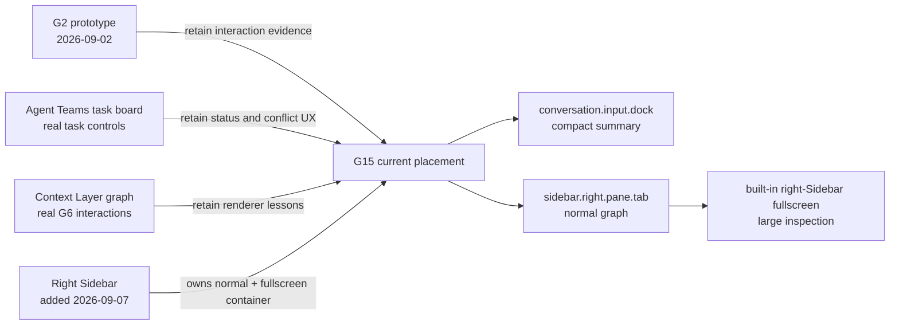
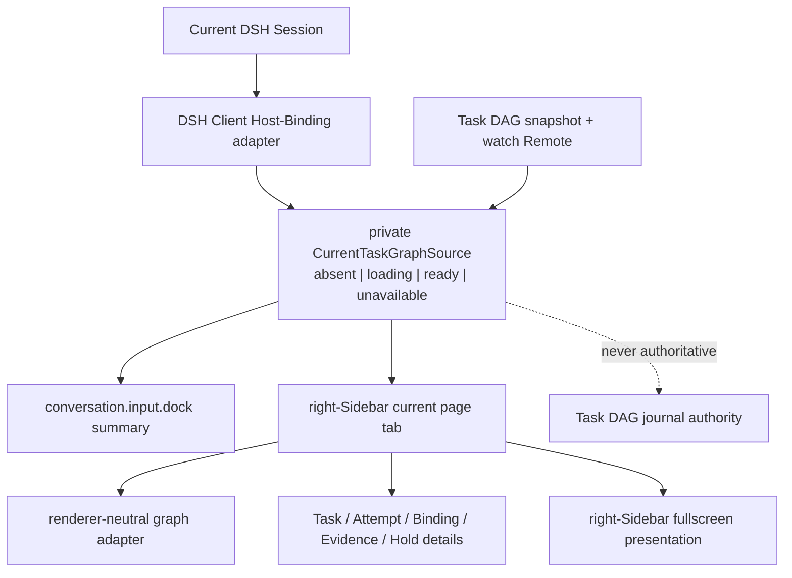

# G15 existing Task DAG UI prior art

**Research date**: 2026-09-16
**Question**: Which existing DSH Task DAG designs and implementations should constrain the current client-placement prototype?

## Finding

The repository contains one Task DAG placement prototype, one shipped experimental task-board implementation, and one shipped graph implementation with reusable interaction patterns. It does not contain a standalone Task DAG Client that already implements the G12–G14 domain decisions.

The highest-ROI G15 prototype should therefore rebase the accepted G2 interaction goals onto the current right-Sidebar APIs. It should reuse the current composer summary position, right-Sidebar Session ownership, fullscreen transition, and established graph interaction patterns without copying the old placement assumptions or treating Agent Teams state as the new Task DAG authority.

## Existing G2 placement prototype

[G2 DAG panel placement and interaction design](../tickets/G2-dag-panel-placement-and-interaction.md) and its [throwaway prototype](../prototype/README.md) tested four placements against a simulated three-column DSH frame. The user accepted its D variant on 2026-09-02. Commits `512b5e104b` and `1b427c32f5` contain the prototype and recorded decision.

Reusable evidence:

- A compact composer-adjacent summary makes active work and aggregate progress visible without opening the graph.
- A normal-width graph should support node selection, fit-to-view, readable status distinctions, and a contained detail region.
- A large view is necessary for dependency inspection on both dense and narrow layouts.
- Naming the active task is more useful than showing counts alone.
- Highlighting ancestors and descendants helps users answer why a task is ready or blocked.
- The graph must remain usable when motion is disabled; animation is explanatory enhancement, not state authority.

Superseded assumptions:

- The old left-Sidebar section has no matching public content slot in the current Client. [`sidebar.panellist`](../../../packages/client/ui-sidebar/src/client/contract/slots.ts) registers root-scoped navigation rows for global `main` panels; it is not a Session-owned content area.
- The prototype's custom `shell.overlay` window predates the current right Sidebar. The right-Sidebar tab and fullscreen system was added on 2026-09-07 in commit `b67e0a838c`, five days after the G2 resolution, and now owns panel geometry, narrow-layout behavior, fullscreen, floating panels, focusable tabs, and per-Session presentation state.
- The sample graph mixes Tasks, subagents, workflow runs, and workflow agents as peer node kinds. G12–G14 instead make Tasks the Plan DAG structure and keep Attempts, Host Bindings, Holds, verification, Outputs, and Evidence as distinct current-state records.
- The prototype describes the compact summary as a Todo successor. G16 still owns Todo coexistence and preset composition, so G15 must prove an additive summary rather than assume replacement.

## Current compact composer surfaces

[`conversation.input.dock`](../../../packages/client/ui-conversation/src/client/contract/slots.ts) is the current Session-scoped list slot for full-width entries above the composer card. [`TodoDock`](../../../packages/client/ui-conversation/src/client/skeleton/TodoPanel.tsx) and [`QueueDock`](../../../packages/client/ui-conversation/src/client/queue/QueueDock.tsx) already use it for collapsible, keyboard-operable summaries.

`conversation.composer.dock` is a different slot for ambient entries below the composer card. The earlier G15 discussion incorrectly described `conversation.input.dock` as an obsolete name. The current source declares and renders both slots; the Task DAG summary belongs in `conversation.input.dock` because it is a full-width operational summary above the composer.

The list-slot ownership means Task DAG, Todo, and Queue entries can coexist mechanically. Their product composition remains a G16 decision.

## Current right-Sidebar implementation

The [right-Sidebar subsystem](../../../docs/subsystems/sidebar-right.md) is the current per-Session docking surface. A task-graph tab can follow the same public registration path as the [document preview implementation](../../../packages/client/ui-sidebar-documentpreview/src/client/index.ts):

1. register a Task DAG tab type through `ctx.sidebarRightTabs`;
2. register its body under keyed `sidebar.right.pane.tab`;
3. optionally register a live title under `sidebar.right.pane.tab.title`;
4. open or focus it through `ctx.sidebarRight.openTab()`.

The right Sidebar already supplies the container behavior G15 needs:

- one store per Session;
- state retained while switching Sessions or collapsing the panel;
- opening an existing content identity focuses it rather than duplicating it;
- normal docked, fullscreen, split, and floating presentation;
- automatic fullscreen when the normal panel cannot preserve its minimum width;
- tab-local navigation and abort signals;
- plugin-provided bodies without changes to `AppFrame`.

Its presentation state is memory-only: a full page reload returns Sessions to the collapsed default. This is compatible with G14 because the Task DAG Remote owns recoverable current state; reopening the tab obtains a fresh snapshot and resumes `watch` rather than reconstructing domain state from React.

The first G15 slice needs only docked and fullscreen presentation. Split and float are existing platform capabilities but do not add enough Task DAG user value to become first-release requirements.

## Experimental Agent Teams task board

[`@deepseek-ai/dsh-experimental-client-ui-agent-team`](../../../packages/experimental/client-ui-agent-team/README.md) is a real Task DAG control surface introduced on 2026-08-14 in commit `806642b064`. It mounts a Session-scoped action in `conversation.session.header.actions` and opens a 560 px popover.

Its task cards already expose useful domain language and failure behavior:

- stable task identity and revision;
- pending, in-progress, completed, ready, and blocked presentation;
- blocker identities;
- owner assignment;
- advisory write scopes and overlap warnings;
- explicit compare-and-set conflict handling;
- create, edit, assign, complete, reopen, and delete actions.

These patterns are useful for Task details and later human commands, but the component is not the G15 graph implementation:

- it renders a linear card list rather than dependencies;
- it refreshes a complete snapshot on open, refresh, and mutation instead of consuming `snapshot + watch`;
- it has no Attempt, primary Binding, Output, Evidence, verification, Hold, cancellation, late-result, or RunStopRecord presentation;
- its header popover is too transient for continuous orchestration awareness;
- its authority is the Agent Teams service, not the independent Task DAG journal.

G15 should reuse its concise task metadata and explicit stale-state/error presentation, not its container or state source.

## Existing graph implementation

[`@deepseek-ai/dsh-client-ui-context-layer`](../../../packages/client/ui-context-layer/README.md) is a shipped G6 v5 graph surface. Its [`ContextLayerGraph`](../../../packages/client/ui-context-layer/src/client/ContextLayerGraph.tsx), [`ContextLayerView`](../../../packages/client/ui-context-layer/src/client/ContextLayerView.tsx), and [animation helpers](../../../packages/client/ui-context-layer/src/client/graph-animations.ts) demonstrate:

- Graph mount, resize, redraw, and destruction;
- node click and double-click handling;
- fit and focus navigation;
- search and filtering;
- semantic zoom and label-detail changes;
- minimap and detail-panel composition;
- cancellable node and edge animation;
- explicit `graph.draw()` after G6 data updates.

Its fullscreen container is a package-owned `shell.overlay` entry. G15 should not copy that container because the newer right Sidebar now supplies fullscreen and Session ownership. R5 should decide whether graph mechanics are extracted or reimplemented behind a renderer-neutral adapter; G15 should treat the graph body as a replaceable placeholder.

## Negative result

Current-tree searches and reachable-history searches for `DagPanel`, `TaskGraphPanel`, `TaskDag`, and production `dag_task_*` UI registrations found no standalone Task DAG Client package. The only production task-DAG UI is the Agent Teams task board, whose domain and lifecycle are narrower than G12–G14. The existing G2 files are the only Task DAG graph-placement prototype and screenshot set found in repository history.

## Consequences for the G15 prototype

The prototype should validate one current architecture rather than repeat obsolete alternatives:

1. Render an additive compact status entry in `conversation.input.dock`.
2. Open one stable Task DAG content identity in `sidebar.right.pane.tab` for the active Session.
3. Use the right Sidebar's fullscreen mode for large inspection; do not create a Task DAG window manager.
4. Demonstrate two Sessions to prove that graph data and presentation do not leak across Sessions.
5. Demonstrate reload/reconnect by discarding React presentation state, showing unavailable status, then recovering the authoritative Task DAG snapshot.
6. Keep Tasks as graph nodes. Show Attempts, Bindings, Outputs, Evidence, verification, Holds, cancellation, and late results in task details until G4 decides their renderer-neutral graph treatment.
7. Reuse the G2 active-task summary and dependency highlighting, Agent Teams' explicit ready/blocked metadata, and Context Layer's graph interaction vocabulary.
8. Leave history navigation, trace exploration, large-graph optimization, split panes, floating tabs, and continuous animation outside this first placement prototype.

## Architecture optimality audit

The current architecture is the strongest base under the accepted Task DAG and DSH constraints. Its advantage comes from aligned ownership rather than from a preferred visual arrangement.

| Criterion | Assessment | Consequence |
|---|---|---|
| User context | Strong | The current Session's composer summary and Task DAG tab remain adjacent to the transcript and tool results they explain. |
| Domain ownership | Strong | The Client reads the active `PlanRunId` through the Host Binding adapter and reads Task state from the Task DAG Remote; no Client slot becomes an authority. |
| DSH feasibility | Strong | Every container is a published DSH extension point. No `AppFrame`, agent-loop, Session-event catalog, or root overlay modification is required. |
| Runtime cost | Strong | One lazy Session/Plan Run source can feed both summary and tab; the graph renderer can stop while the tab is hidden. |
| Failure safety | Strong | `absent`, `loading`, `ready`, and `unavailable` remain explicit. Reload and sequence-gap repair replace the complete current value instead of preserving a misleading stale graph. |
| Mobile and narrow layout | Strong | The right Sidebar already chooses fullscreen when a normal column cannot retain its minimum width. The feature does not own a second responsive system. |
| Upgrade surface | Strong | DSH layout changes affect the right-Sidebar adapter; renderer upgrades affect the R5 adapter; Task DAG domain and persistence remain unchanged. |
| First-release ROI | Strong | The smallest useful release adds one summary and one tab body while reusing navigation, fullscreen, resizing, accessibility, and Session lifetime. |
| Future history | Strong | The current page tab keeps one stable identity per Session. G28 can add `PlanRunId`-addressed history resources without changing the current tab. |
| Future cross-Session control | Strong | G22 can add a root-scoped global `main` panel as an aggregate view while preserving the per-Session tab for local diagnosis. |

The current page tab must be a parameterless page type with one content identity per Session. Its body resolves the Session's active `PlanRunId`; a Plan Run change updates that page rather than opening another current-state tab. If a selected Task does not exist in the new view, presentation selection clears.

The UI implementation should contain one private Client data module keyed by Session and active Plan Run. It owns Host Binding resolution, one `snapshot + watch` subscription, sequence-gap recovery, cancellation, and the explicit availability state. The compact summary and right-Sidebar body consume selectors over the same observable value. This module is a cache and lifecycle adapter, not a Task DAG authority; deleting it must not lose recoverable state.

Presentation state stays separate:

- the right Sidebar owns collapsed, docked, fullscreen, split, and float layout;
- the Task DAG tab owns selection, focus, filter, and viewport state only;
- the renderer adapter owns graph instances and animation cancellation;
- the Task DAG Remote value owns Tasks, Attempts, verification, Holds, budgets, and RunStopRecord data.

The first release does not need a persistent graph viewport. On browser reload, the right Sidebar may return collapsed and Task selection may reset; reopening the tab must recover the same domain state through a fresh snapshot. Persisting presentation would add storage and migration cost without improving Task correctness.

Keyboard ownership follows the same rule. The compact summary is a native button; the shipped dock kit owns WAI-ARIA tab-strip navigation; the graph body owns roving Task focus and selection. Fullscreen shortcuts remain a right-Sidebar concern so one feature cannot intercept global keys differently from every other tab. The prototype supports `Escape` to evaluate the interaction, but G15 does not require a Task DAG-specific global handler.

### Rejected placements

The root-scoped left navigation and global `main` panel are not alternative homes for the current graph. They do not carry Session ownership and would either duplicate Session selection logic or let a global view masquerade as the current conversation's plan. They remain suitable only for future cross-Session aggregate views.

`details.aux` is not a Task DAG home. It coexists with tool-call details but does not provide the independent navigation, width, fullscreen, or lifetime required for graph inspection.

A Task DAG-owned `shell.overlay` window is not justified. It would duplicate the current right Sidebar's resizing, focus, z-index, narrow-layout, Session-store, and fullscreen behavior. `shell.overlay` remains appropriate for short-lived feature overlays, not for a second window system.

### Known risks and owners

- [G16 Model tools and cross-preset composition](../tickets/G16-todo-coexistence-and-preset-composition.md) decides native planning-tool coexistence for Sessions using the preset-orthogonal Task DAG capability. Placement remains valid for every business preset.
- [R5 G6 renderer adapter stability](../tickets/R5-g6-renderer-adapter-stability.md) owns graph lifecycle, visibility suspension, resizing, reduced motion, and renderer upgrades.
- [G11 DAG view simplification strategies](../tickets/G11-dag-view-simplification-strategies.md) owns large current graphs and omitted-count explanations.
- [G4 Animation and edge design](../tickets/G4-animation-and-edge-design.md) owns renderer-neutral state vocabulary and motion.
- [G28 History, trace, and plan inspection](../tickets/G28-history-trace-and-plan-inspection.md) owns Plan Run-addressed history tabs and executor-trace navigation.
- [G22 Cross-session and multi-agent scheduling](../tickets/G22-cross-session-multi-agent-scheduling.md) owns any root-scoped aggregate control panel.

None of these follow-ups requires replacing the current summary or current per-Session tab.
