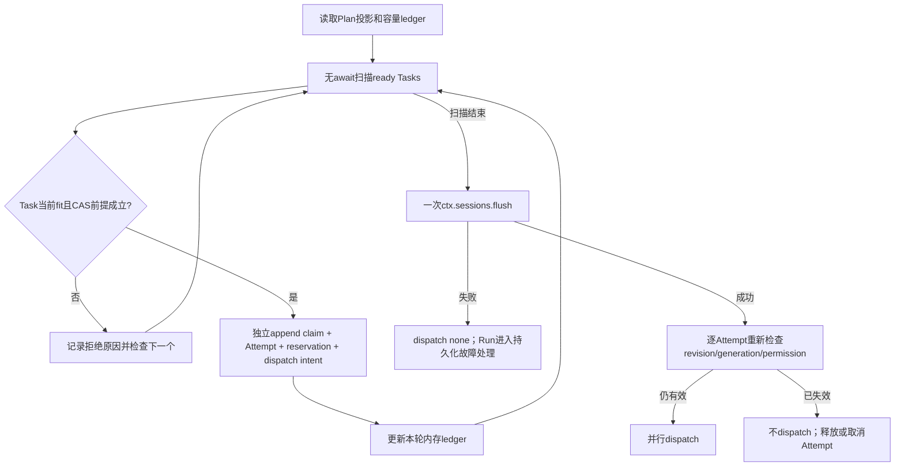
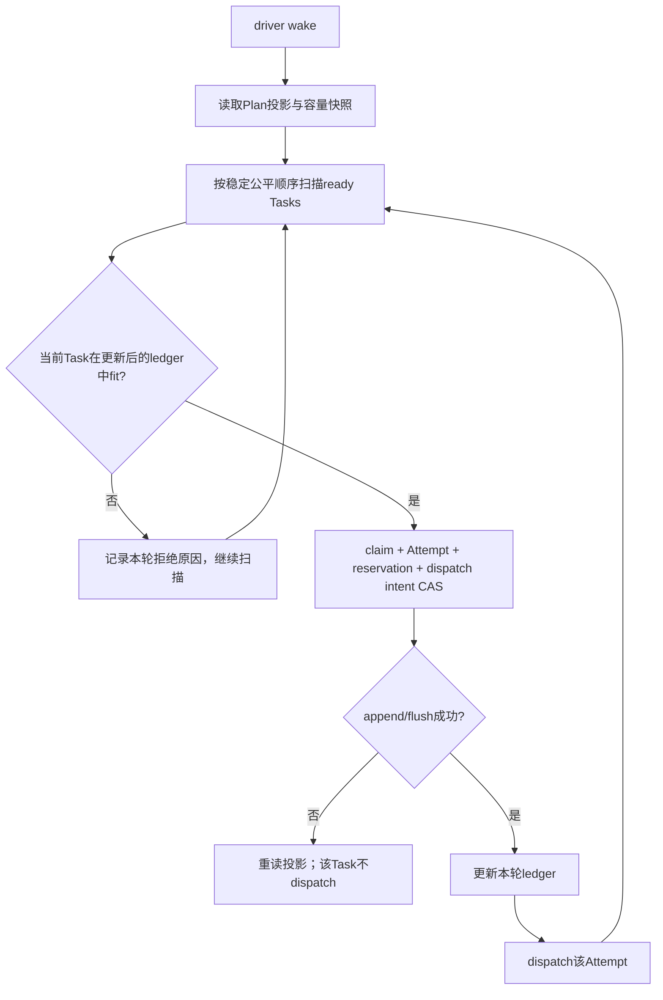
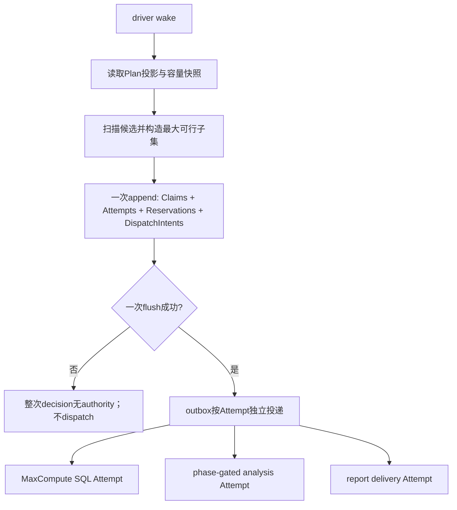
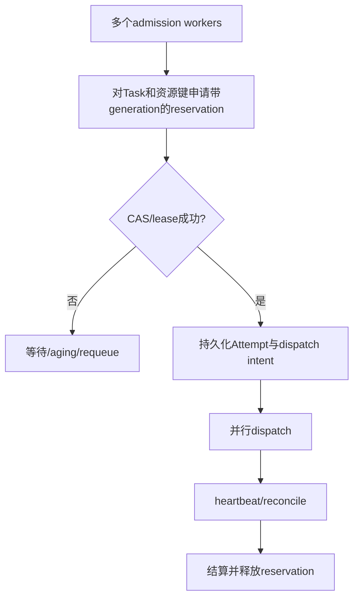

# G19 — 多个独立 ready Task 的 durable admission 前沿调研

**调研日期：2026-09-14**

## 结论摘要

成熟的 durable scheduler 普遍把“逻辑上已经 ready”与“此刻可以消耗容量并开始执行的 admissible”分开。Airflow 先找到依赖已满足的 `SCHEDULED` TaskInstance，再在数据库临界区内按 pool、DAG、Task、executor 和全局并发约束挑出可运行子集；Kubernetes 先把对象放入调度队列，再逐个经历 Filter/Score/Reserve/Permit/Bind；Kueue 则在 Job 之上增加持久 Workload admission，只有配额、ResourceFlavor 和 admission checks 满足后才允许底层 Job 启动。对 data-agent 而言，“收入 SQL、投放 SQL、汇率查询都没有未完成依赖”只说明三者 ready；MaxCompute 并发槽、同表写入冲突、Run 预算、审批和 executor 可用性仍决定谁 admissible。[A1][A2][K1][Q1][Q2]

对“多个独立 ready Task 但当前只能容纳一部分”的主流答案不是把全部候选做成 all-or-none 事务。Airflow 在一个受锁保护的循环中跳过不满足 pool 或并发限制的 TaskInstance并选出可运行子集；Kueue 基于同一缓存快照逐个处理 Workload，前面接纳的 Workload 会占用快照配额，后面的 Workload可能因不再 fit 而留在队列；Dagster 也扫描持久队列、过滤被并发池或 tag 限制阻塞的 Run，保留可启动子集后逐个或多线程 launch。它们保留的是每个 Task/Workload/Run 的 durable identity，而不是一个必须共同成败的“调度波次”。[A2][Q3][Q4][D1]

当前前沿可概括为“**一个串行化或乐观并发受控的 admission 决策面，多个独立的 durable admission 结果，随后并行 dispatch**”。串行化可以是 Airflow 对 pool 行加锁形成的数据库临界区、Kueue 的 leader-elected scheduler 加单轮缓存快照，或 Kubernetes 对一个 scheduling entity 的单次 scheduling cycle；也可以像 Argo 那样通过 Kubernetes `resourceVersion` 冲突检测和持续 reconciliation 保证最终收敛。共享决策快照防止 MaxCompute 还剩 2 个槽时同时接纳 3 个 SQL Attempt；独立 admission 结果则保证“汇率查询不合法”不会回滚已经合法的收入查询和投放查询。[A1][Q3][K2][R1]

“dispatch only after durable commit”是适合 DSH 的强规则，但不是所有成熟系统都以同一种形式实现。Temporal 最接近严格的 durable command/outbox：Workflow Task 产生的一组 Commands 先被服务器转成持久 Event History 和内部任务，持久化成功后再让副作用任务进入后续处理；Kueue把 quota reservation/admission 写入 Workload status 后，Job controller才解除挂起并创建 Pod。Airflow 3.3.1 的关键路径则在同一数据库事务中先把多个 TaskInstance 更新为 `QUEUED`，随后调用 executor `queue_workload()`，外层再 commit；Argo 可能先创建独立的 Kubernetes Pod 对象，再在本轮末尾持久化 Workflow status，并依赖幂等对象名、UID/resourceVersion 与 reconciliation 恢复。因此，行业事实支持“先建立 durable intent/identity再执行”的方向，却不证明所有系统都要求一个包含整批独立 Task 的单次原子提交。[T1][T2][Q4][A3][R1]

显式 all-or-none group 与普通独立 Task 应采用不同语义。Ray Placement Group 明确把多个 resource bundles 作为一个 gang 原子预留：任一 bundle 当前无法放置时，初始创建不预留任何资源；Kueue 的一个 Workload通常是一个 admission unit，默认以整体资源请求等待，而 Partial Admission 只在 Job/Workload明确给出可缩减的最小规模时才降低 PodSet count；Kubernetes v1.37 的 Workload/PodGroup 调度也把 group identity 和最小成员数放在显式对象中。它们都没有把“本轮碰巧同时 ready 的独立任务”自动升级为 gang。[Y1][Q1][Q5][K3]

因此，上一轮方案 C——“独立校验、有效子集统一提交、提交后并行进场”——只得到**部分支持**。证据支持“从共享快照构造有效子集”“flush/持久化失败前不得 dispatch”“显式 gang 使用 all-or-none”；但不支持“所有独立 Task 必须在一个 batch transaction 中共同提交”或“必须把 admission cycle/wave 持久化为业务实体”。更接近前沿的第一版是：单个 driver 运行一次 admission cycle，基于同一投影和容量账本挑选可行子集；随后按稳定顺序为每个 Task执行独立的 claim+Attempt CAS/append+flush；每个 commit 成功后才允许对应 adapter dispatch，失败的 Task 不阻塞同轮其他 Task，余下容量在下一次 reconciliation重新计算。若 Session append API 已天然支持安全的多事件原子批次，可另选“有效子集 + durable outbox 一次提交”，但应把它视为性能与恢复模型的架构选择，而不是并发正确性的必要条件。

## 1. 术语与 data-agent 场景

### 1.1 Ready 与 admissible

**观察事实。** Airflow 的调度查询只考虑已经进入 `SCHEDULED` 的 TaskInstance，但随后还检查 pool、DAG/Task 并发、executor 槽位等条件；Kubernetes Scheduling Framework 把 QueueSort、Filter、Score、Reserve、Permit 和 Bind 分成不同 extension points；Kueue 的 Workload 只有在 quota reservation、ResourceFlavor assignment 和必要 admission checks 满足后才成为 admitted。[A2][K1][Q1][Q2]

**对 DSH 的推论。** `ready` 应只由 Plan DAG 的持久事实推导：硬依赖 assurance 满足、Task 未终止、没有 Hold、没有当前有效 claim。`admissible` 则是一次调度时刻的判断：MaxCompute/query provider 容量足够、Task/Run 预算可预留、`writeScopes`不与正在运行的数据工程写入冲突、目标 adapter 可用、审批和 revision fencing 有效。

例如，Plan 中有三个独立 Task：`T1` 查询销售事实表、`T2` 查询广告消耗表、`T3` 回填 `ads_daily_report`。三者都可能 ready，但如果 MaxCompute 只剩两个查询槽且 `T3` 与另一个正在运行的回填 Attempt 同时写 `ads_daily_report`，本轮 admissible set 应是 `T1 + T2`，`T3`保持 ready/等待资源，而不是被标成依赖 blocked。

### 1.2 Admission、reservation 与 dispatch

**观察事实。** Kubernetes 的 Reserve phase 是在 bind 前更新 scheduler runtime state，失败时调用 Unreserve；Kueue 的 quota reservation 持久化在 Workload status，并由 cache snapshot 先行记账；Ray Placement Group 把 bundle 的资源预留本身作为显式对象；Temporal 则把 Workflow Task 生成的 command-derived history/events 和后续 server tasks 绑定到持久 workflow transaction。[K1][K2][Q3][Y1][T1]

**对 DSH 的推论。** Admission 不是“调用 executor”的同义词。它至少应完成 claim、ExecutionAttempt、预算预留、executor kind、相关 revisions、generation 和 dispatch intent 的持久记录；dispatch 是 commit/flush 之后的独立动作。MaxCompute adapter 收到 Attempt envelope 后才提交查询；phase-gated analysis Attempt 只有在 durable admission 成功后才创建或恢复 Phase Run。

## 2. Apache Airflow 3.3.1

### 2.1 观察事实

Airflow 官方文档允许多个 scheduler 同时运行以获得高可用和吞吐；`SchedulerJobRunner._critical_section_enqueue_task_instances()` 的源码说明，多个 scheduler 通过 `SELECT ... FROM pool FOR UPDATE` 串行化“选取并排队 TaskInstance”的临界区，支持 NOWAIT 的数据库在拿不到锁时跳过该临界区继续做其他工作。[A1][A3]

在临界区中，Airflow 读取并锁定 pool 行，计算全局空闲 pool slots，把每轮最大候选数限制为可用槽位，并按 `priority_weight`、DagRun logical date、map index排序候选。它逐个检查 pool slots、DAG/Task/DagRun concurrency 和 executor slots；不满足约束的 TaskInstance 被跳过，满足的加入 `executable_tis`，并立即从本轮内存 pool/executor 余额中扣减，以免同轮后续候选超配。[A2]

被选中的 TaskInstance 通过一条更新语句设置为 `QUEUED`，并记录 `queued_dttm`、`queued_by_job_id`；支持预分配 external executor ID 的 executor 还会在同一次数据库更新中获得该 ID，以便 scheduler crash 后保留 correlation。之后 scheduler 对这些 TaskInstance调用 executor `queue_workload()`；外层 scheduler loop 在临界区调用返回后提交数据库事务。[A2][A3]

Airflow 因而使用“共享锁定快照 + 有效子集”的 admission 方式，而不是候选列表 all-or-none。它可以一次把多个独立 TaskInstance 更新为 `QUEUED`，但源码路径不是严格通用的“数据库 commit 后才调用 executor”；恢复依赖持久 TaskInstance 状态、executor correlation和后续 scheduler/executor reconciliation。[A2][A3]

公平性主要来自显式 `priority_weight` 加时间顺序，并受 pool、DAG 和 Task并发上限影响；源码没有为一次临界区选出的集合写入 durable wave/admission-cycle ID。可持久审计的是每个 TaskInstance 的状态、排队时间、scheduler job和可选 external executor ID。[A2]

### 2.2 data-agent 映射

Airflow 的 pool 类似 data-agent 的 MaxCompute 并发配额：本轮可以从 ready SQL Task 中选取最多 `N`个，但一个申请 2 个槽的重查询可能因剩余槽不足被跳过，让后面的轻量查询进入可行子集。值得复用的是“在同一受控临界区内边选择边扣账”；不应照搬的是把 executor 调用放在 durable commit 之前。

## 3. Kubernetes Scheduler Framework 与 Kubernetes v1.37 Workload Scheduling

### 3.1 观察事实：普通 Pod/实体调度

Kubernetes Scheduling Framework 把一次调度拆为 scheduling cycle 和 binding cycle。v1.37 源码的 `ScheduleOne()` 明确一次处理一个 scheduling entity（Pod 或 PodGroup）；成功完成 scheduling cycle 后，scheduler先在缓存中 assume/reserve，再异步执行 binding cycle，因此 scheduling cycles串行而 binding cycles 可以并发。[K1][K2]

Reserve plugin 用于在 bind 前更新运行时状态，任何后续阶段失败都应执行 Unreserve；Permit plugin 可以批准、拒绝或让实体等待，适合实现 gang/co-scheduling 协调。scheduler cache 的 assume 是乐观预留：它先把 Pod 当作已占用节点资源，bind 失败时再 Forget/Unreserve并把工作重新入队。最终权威状态是 API server 中的 Pod binding，而不是单次内存 scheduling cycle。[K1][K2]

默认调度对象是单个 entity，不存在“把本轮所有可行独立 Pod 一次原子提交”的协议。高可用通常通过 kube-scheduler leader election保持一个主动 scheduler；对象更新和 bind 仍使用 Kubernetes API 的 UID/resourceVersion/前置条件语义防止陈旧写入。[K1][K2]

### 3.2 观察事实：显式 group/gang

Kubernetes v1.37 把 Workload-aware Scheduling 升为 Beta：PodGroup/Workload API 为一组 Pod提供显式 group identity，只有满足组的最小规模且能找到整体 placement 时才进入后续 binding；普通 Pod 仍走独立调度。这个能力说明 gang 是建模出来的对象，而不是由“同一轮同时 ready”推断出来。[K3]

### 3.3 data-agent 映射

对 data-agent，当前主 Agent lane 类似只能一次调度一个 entity；subagent、workflow 和 MaxCompute adapter 的执行可以在 admission 后并发。Kubernetes 的 assume/reserve提醒我们：容量账本可以先做本轮临时预留，但只有 Session 事件/投影写入成功后才能授予 DSH Attempt authority。显式的同 Task Attempt Group 才类似 PodGroup；收入 SQL 和投放 SQL只是两个独立 Task，不应自动形成 gang。

## 4. Kueue 0.19.4

### 4.1 观察事实：ready、quota admission 与单写者

Kueue 把 Job 转为一个持久 Workload，并通常在 admission 前保持底层 Job suspended。Workload admission记录目标 ClusterQueue 和每个 PodSet 的 ResourceFlavor/资源分配；quota reservation 与 admission checks决定 Job何时可以真正开始。[Q1][Q2]

Kueue scheduler实现 `NeedLeaderElection() == true`，即 admission loop只有 leader运行。每轮从多个 LocalQueue/ClusterQueue 取得 queue heads，创建 cache snapshot，计算 flavor assignment/borrowing/preemption，再按公平性或经典顺序迭代 entry。每接纳一个 entry 都立即把其 usage 加入本轮 snapshot；后续 entry若因前面已用容量而不再 fit，会被跳过或重新排队。[Q3]

源码明确一次 `processEntry()` 处理一个 Workload。符合条件时先在 scheduler cache 中 assume并记账，再异步 patch该 Workload 的 admission status；patch冲突或失败时删除 assumed cache entry并 requeue。也就是说，同一 scheduling cycle 可形成一个部分可行集合，但 durable admission 是逐 Workload写入 Kubernetes API，不是整轮原子事务。[Q3][Q4]

### 4.2 观察事实：公平、饥饿与容量

Kueue 支持 priority/FIFO、cohort borrowing、preemption 和 Admission Fair Sharing。公平共享模式按历史/当前资源使用调节同 cohort 中 ClusterQueue 的 admission顺序；源码还会在同轮发现 assignment 因其他 Workload处理而失效时重新计算，避免后处理 queue长期因陈旧 placement反复失败。[Q3][Q6]

Kueue的 capacity reservation是 durable Workload status + controller cache的组合，而不是长期 lease token。leader故障后新 leader根据 API对象重建 cache并继续 reconciliation；对正在等待 preemption 或 admission checks 的 Workload，状态仍由 Workload conditions表达。[Q1][Q3][Q4]

### 4.3 观察事实：all-or-none 与 partial admission

一个 Kueue Workload本身是 admission unit，适合表示必须共同获得资源的分布式 Job。默认 Job申请完整 PodSet数量；启用 Partial Admission且 workload/job明确提供 `minCount` 后，scheduler才可以搜索一个不低于最小值的缩小规模。它不是让 scheduler任意拆散没有声明弹性的 gang。[Q5]

### 4.4 data-agent 映射

Kueue最贴近 data-agent 的容量问题：本轮 snapshot 可能显示 MaxCompute 还剩 4 个槽，scheduler先接纳占 3 槽的销售宽表构建 Attempt，随后发现占 2 槽的用户标签回填不再 fit，于是保留后者等待；另一个占 1 槽的汇率查询仍可进入本轮可行子集。关键是每次接纳都更新同一账本，而不是只在最后一次性检查总数。

对 overlapping write scopes，Kueue的 flavor/usage snapshot可类比为 DSH 的资源账本：`table:ads_daily_report` 或 `partition:dt=2026-09-13`可以作为独占/共享 reservation key。冲突 Task保持 ready-but-not-admitted，并在对应 Attempt结算后重新入队。

## 5. Temporal durable Workflow

### 5.1 观察事实

Temporal Workflow Task向 Workflow代码提供 Event History；Workflow代码运行后返回 Commands，服务器把这些 Commands转换为新的历史 Events和内部 tasks。Workflow恢复依赖重放 Event History；Worker故障或进程重启不会要求重新推断已经持久化的 Workflow决定。[T1][T2]

Temporal服务器处理 `RespondWorkflowTaskCompleted` 时，先把 WorkflowTaskCompleted event加入 mutable state，再统一处理本次请求中的 commands；随后调用 `UpdateWorkflowExecutionAsActive`持久化 mutable state，持久化失败时取消 pending effects，成功后才应用 effects。源码还明确 speculative Workflow Task要在 mutable state持久化后创建。[T3]

因此，一个 Workflow Task可以一次产生多个独立 Activity scheduling commands，并由同一 Workflow history transaction固定这次决定。这是所调研系统中最接近“有效子集 + durable batch/outbox”的模式，但其 batch成员来自同一个 Workflow确定性决策，不是在共享全局资源池中随机挑出的独立 DAG Task；Activity真正何时被 Worker领取仍由 Task Queue和服务端调度决定。[T1][T2][T3]

Temporal没有把一次 Workflow Task称为长期 admission wave，但 `WorkflowTaskCompleted` event及其相邻 command-derived events提供了稳定的历史分界。这个分界用于 replay/causality，而不是要求所有 Activity共同成功或共同回滚。[T1][T3]

### 5.2 data-agent 映射

若 Task DAG driver在一个 Agent turn中决定同时启动销售 SQL、投放 SQL和汇率查询，Temporal表明可以把三条 `AttemptAdmitted + DispatchIntent`当成同一次 durable decision持久化；但后续三个 Attempt仍各自完成、失败或重试。它支持“同一提交记录一组独立命令”，不支持把三个数据 Task的业务成败捆成事务。

## 6. Argo Workflows（main@`9ca56c7d`，2026-09-14）

### 6.1 观察事实

Argo controller持续 reconcile Workflow CRD、其 `status.nodes` 和实际 Pod。源码的 `operate()`在一轮中评估当前 Workflow状态，遇到 workflow/template parallelism上限时把该情况当作正常 transient backpressure并等待后续 requeue；ready DAG node可在同轮继续创建 Pod，直到 active Pod计数触及限制。[R1][R2]

每个 Pod是独立、持久的 Kubernetes对象。`operate()`结束时 `persistUpdates()`更新 Workflow status；若 `resourceVersion`冲突，controller重新读取当前 Workflow、检查 UID 和已完成 node不被倒退，再重放 merge patch并重试。它依赖 Kubernetes对象幂等性和持续 reconciliation，而不是把本轮新建的所有 Pod和 Workflow status放进一个跨对象事务。[R1]

Argo支持 workflow/template/controller/namespace parallelism和 semaphore/mutex synchronization；database-backed synchronization locks带有 heartbeat/leaseDuration以在 controller故障后回收锁。Workflow priority影响受 controller parallelism限制的排队顺序，但一次 reconcile创建的 node集合没有独立 durable wave ID。[R2][R3][R4]

### 6.2 data-agent 映射

Argo更像“每个 SQL Attempt都有独立外部 Job对象，driver反复 reconcile”。例如 report delivery Task创建邮件/文件 delivery job后，即使 Task Graph status写回发生冲突，恢复过程也应先按稳定 native execution reference查询外部 job，而不是盲目重新发送报告。它支持 DSH 使用独立 Attempt correlation + 幂等 adapter，不支持把所有 ready Task强制进一个事务。

## 7. Dagster（master@`249fbedf`，2026-09-11）

### 7.1 观察事实

Dagster queued run coordinator把 Run先写成持久 `QUEUED`状态，daemon再根据 `max_concurrent_runs`、tag concurrency limits和op concurrency pools挑选可启动 Run。daemon分页读取 queued runs，按显式 priority稳定排序，因此同 priority保持 FIFO；扫描时对已选 Run更新本轮内存 counters，后面的 Run若超限则被过滤，未超限的形成 `runs_to_dequeue`子集。[D1][D2]

选出的 Run不是一个原子 batch。daemon可以顺序或用线程池逐个 `_dequeue_run`，每个 Run在 launch前再次确认仍处于 queued状态，记录 launch-started event，再调用 run launcher。某个 Run launch失败不会回滚其他已经启动的 Run。[D1]

Dagster concurrency pools为 step/op提供持久 slot管理，等待中的 steps按优先级分配；run queue还可以预先阻止会被 op pool完全堵住的 Run。官方文档同时指出仅靠 run-level concurrency不等同于step-level资源控制，两层应分开配置。[D2][D3]

### 7.2 data-agent 映射

Dagster对应“先把所有 data-agent Tasks持久标为 ready/queued，再由独立 daemon填充容量”。如果两个 phase-gated分析 Attempt都需要同一个稀缺 critic模型槽，run-level主 Agent lane和phase/tool-level pool不能混成一个数字；调度时应分别检查 executor lane与具体资源池。

## 8. Ray 2.58.0 Placement Groups

### 8.1 观察事实

Ray Placement Group由多个 resource bundles组成，初始创建时原子预留全部 bundles，这就是显式 gang scheduling。任一 bundle当前无法放置时，Ray不为该 Placement Group预留任何资源，group保持 pending；创建完成后，Task/Actor通过 PlacementGroupSchedulingStrategy使用这些已保留资源。[Y1]

Placement Group拥有稳定 identity、lifetime和状态；可以绑定到创建它的 job/actor，也可以声明 detached。节点故障后，Ray会尝试在其他节点恢复丢失 bundle；官方文档明确初始创建是原子的，但故障恢复期间可能暂时形成 partial placement group，存活 bundle上的 Task/Actor继续运行。[Y1]

### 8.2 data-agent 映射

Ray支持把“同一个 Task的三路并行 SQL候选必须同时拿到资源，否则都不启动”建模为显式 Attempt Group；它不支持把销售 SQL、投放 SQL、汇率查询这三个独立 Task仅因同轮 ready就自动变成 gang。all-or-none应是 Task/Attempt Group声明的 policy，不是 admission cycle的默认属性。

## 9. 横向问题

### 9.1 Per-task admission 还是 batch admission

**观察事实。** Kubernetes默认逐实体，Kueue逐 Workload durable patch，Dagster逐 Run launch，Argo逐 Kubernetes对象 reconcile；Airflow可在一个数据库事务中更新一批有效 TaskInstance，但候选筛选仍逐项且非 all-or-none；Temporal可把一个 Workflow Task产生的多个 Commands放进同一持久 workflow transaction。[K1][Q3][D1][R1][A2][T3]

**推论。** durable batch是可行优化和更强审计模型，不是正确并发的普遍前提。DSH若逐 Attempt commit，必须在同一 admission cycle中维护临时 reservation ledger，并在每次 commit失败后重读 projection；若一次提交有效子集，则必须使用 durable dispatch intents/outbox，不能在 flush前调用 adapter。

### 9.2 Single-writer、锁与 optimistic concurrency

**观察事实。** Airflow允许多个 scheduler但用数据库行锁串行化关键 admission临界区；Kueue scheduler依赖 leader election；Kubernetes默认 scheduler通常由 leader election保持单 active scheduler，并对单 entity运行串行 scheduling cycle；Argo依赖 workqueue keyed reconciliation和 `resourceVersion`冲突重试；Dagster daemon从持久队列取 Run并在 launch前重新确认状态。[A1][A3][Q3][K1][R1][D1]

**推论。** DSH第一版不需要分布式多 writer。一个 Agent/Plan Run只允许一个 Task DAG driver执行 admission cycle，Task Graph Service仍对 `planRevision + taskRevision + claimGeneration`做 CAS式校验。这样既避免两个 continuation plugin同时消费容量，也为以后多进程driver保留fencing点。

### 9.3 Crash recovery 与 reconciliation

**观察事实。** Temporal从 Event History replay；Kueue从 Workload/API状态重建 cache，失败 patch会撤销 assumption并 requeue；Argo从 Workflow CRD和Pod重建状态并处理资源版本冲突；Kubernetes从API对象重新观察未绑定/已绑定状态；Dagster从run/event storage恢复queue与monitoring；Airflow从TaskInstance/executor状态继续调度。[T1][Q4][R1][K2][D1][A2]

**推论。** DSH恢复不应依赖“上次 admission cycle选了哪些候选”的内存列表。它应从 durable Attempt状态寻找：`admitted但无dispatch确认`的 Attempt重放幂等 dispatch；`dispatching/running但无新心跳`的 Attempt先reconcile native reference；只有仍为 ready且没有有效 claim的 Task才重新参加下一轮 admission。

### 9.4 Fairness 与 starvation

**观察事实。** Airflow以priority weight后接logical date排序，Dagster以priority后保持FIFO，Kueue提供priority/FIFO与可选 Admission Fair Sharing，Kubernetes QueueSort由插件定义且默认优先级/队列顺序会影响选择；Ray placement group主要保证group资源原子性而非全局业务公平。[A2][D1][Q6][K1][Y1]

**推论。** DSH若只按固定 priority + creation sequence，持续涌入高优先级SQL可能饿死低优先级报表交付。第一版至少应持久记录 `readySince`和每次 `admissionRejectedReason`，并采用稳定 priority后按ready age排序；更复杂的weighted fair sharing只有在出现多租户Plan Run或共享provider配额时再引入。

### 9.5 是否保存 admission cycle / wave identity

**观察事实。** Kueue源码有进程内 `schedulingCycle`计数用于日志、指标和算法输入，但 durable authority仍是每个 Workload；Airflow、Dagster和Argo不为每次选出的独立集合创建业务级 wave对象；Kubernetes普通调度以单 entity cycle为单位。Temporal的 `WorkflowTaskCompleted`历史事件形成durable decision边界，Ray/Kubernetes/Kueue的 gang则通过显式group/workload对象保存组identity。[Q3][A2][D1][R1][T3][Y1][K3]

**推论。** DSH无需把普通 admission cycle升级成会影响Task语义的 durable实体。可以记录可选 `admissionCycleId`用于审计、性能和解释“为什么本轮只选T1/T2”，但 crash recovery与权限判断不能依赖它。需要共同资源和共同启动承诺时，应使用已有的显式 Attempt Group，而不是复用 wave ID。

## 10. 比较矩阵

| 系统 | Ready 与 admissible | 独立工作 admission 粒度 | 容量/配额预留 | 部分可行子集 | Dispatch 与 durable commit | 恢复/并发控制 | 公平/饥饿 | 显式 gang | durable wave identity |
|---|---|---|---|---|---|---|---|---|---|
| Airflow 3.3.1 | `SCHEDULED` 后再查 pool/DAG/task/executor限制 | 临界区内选多个TI并批量置 `QUEUED` | Pool行锁 + 本轮扣减 | 是，跳过starved候选 | executor queue调用发生在外层commit前；非严格commit-first | 多scheduler + DB临界区 + TaskInstance/executor reconciliation | priority weight + logical date；可能受高优先级持续流影响 | 无通用gang | 无 |
| Kubernetes Scheduler | queue entity 后经Filter/Score/Reserve/Permit/Bind | 默认单Pod/单entity cycle | scheduler cache assume + Reserve；bind写API | 跨cycle自然形成；每cycle一个entity | bind是API权威提交；assume先于bind | leader election + optimistic assume/unreserve + API对象 | QueueSort/priority/preemption；无默认严格公平 | v1.37 PodGroup/Workload显式支持 | 普通Pod无；group有identity |
| Kueue 0.19.4 | Workload pending，quota/flavor/checks满足才admitted | 每Workload独立patch | snapshot usage + durable quota reservation | 是，同轮逐项更新snapshot | admission status持久后Job controller启动 | leader election + assume/cache + conflict retry/requeue | priority/FIFO、cohort、Admission Fair Sharing | Workload为组；Partial Admission需显式最小规模 | cycle仅日志/指标；Workload有identity |
| Temporal | Workflow代码可运行不等于Activity已调度 | 一个Workflow Task可提交多Commands；Activity独立结算 | history mutable state + server tasks | Workflow决定可提交任意命令子集 | 最接近严格persist-then-effects/outbox | Event History replay + workflow transaction conflict处理 | Task Queue由服务策略处理，不是DAG级公平模型 | 可由workflow显式实现，不是默认 | `WorkflowTaskCompleted`是durable决策边界但非gang |
| Argo Workflows | DAG node依赖满足后仍受parallelism/sync限制 | 每Pod/node独立Kubernetes对象 | activePods计数、parallelism、mutex/semaphore | 是，reconcile直到上限 | Pod与Workflow status非跨对象事务；依赖幂等/reconcile | UID/resourceVersion、reapply update、CRD/Pod重建 | priority + controller/namespace限制 | 可通过同步/底层集群机制组合 | 无普通wave |
| Dagster | Run `QUEUED` 后受run/tag/op pool限制 | 逐Run dequeue/launch，step slot独立 | 持久concurrency slots + 本轮counter | 是，过滤blocked Run | 每Run独立launch；非batch commit | run/event storage + launch前recheck + daemon monitoring | priority + stable FIFO | 无通用gang | 无 |
| Ray 2.58.0 | Placement Group pending直到所有bundle可放置 | group作为一个资源admission单位 | 原子bundle reservation | 对独立group由scheduler逐个处理；group内部初始不partial | reservation ready后Task/Actor使用资源 | GCS状态 + group恢复；节点故障后可暂时partial | 主要是placement策略，不提供DAG公平保证 | 原生all-or-none placement group | Placement Group本身就是durable-ish group identity |

## 11. 对 DSH Task DAG 的设计启示

1. **持久模型明确分开 `ready` 与 `admitted/running`。** Ready是DAG投影；admission rejection应保存结构化原因，如 `query_capacity`、`write_scope_conflict`、`budget`、`executor_unavailable`、`approval`，但不把资源等待伪装成依赖blocked。
2. **一个 driver拥有每个 Agent/Plan Run的 admission cycle。** Task Graph Service仍校验revisions和generation；不需要第一版引入多writer分布式共识。
3. **每轮使用一致的容量/冲突快照，并边选择边预留。** 选择销售SQL后立即从本轮MaxCompute ledger扣除其槽位；选择回填Task后立即占用对应table/partition write scope；后续候选基于更新后的账本判断。
4. **独立 Task不形成业务事务。** 一个Task校验失败、CAS冲突或adapter不可用，不应取消同轮其他独立Task；只有显式Attempt Group声明 `all-or-none`时才要求整组准入。
5. **权限必须先durable，再dispatch。** 每个ExecutionAttempt至少持久化claim、generation、相关revisions、预算reservation、executor kind和dispatch intent；flush失败则该Attempt没有authority，adapter不得启动。
6. **dispatch与settlement逐Attempt独立。** 同一轮可以并行dispatch多个commit成功的Attempt；一个MaxCompute提交失败不回滚另一个已提交查询，report delivery失败也不撤销已验证的数据抽取。
7. **恢复靠Attempt状态和native reference，不靠wave。** `admitted`且无dispatch ack的Attempt走幂等重投；`running`但失联的Attempt先查询MaxCompute job/subagent/workflow状态；结果未知时进入`unknown`/Hold而非盲重试。
8. **Phase Run是Attempt内部策略。** phase-gated分析的UNDERSTANDING/GENERATION/EXECUTION/INTERPRETATION不参与跨Task容量选择；它只上报phase-local消耗、证据和completion proposal。若phase要占critic/query资源，通过adapter暴露独立reservation需求。
9. **公平先做可解释的稳定规则。** 建议 `explicitPriority DESC, readySince ASC, taskId ASC`，记录每次资源拒绝；以后出现多租户/共享队列再增加aging或weighted fair sharing。
10. **Admission cycle ID只用于观测。** 可记录“cycle C42从候选T1/T2/T3接纳T1/T2，T3因write scope等待”，但不能成为claim、权限或恢复的必要外键。

### 11.1 当前 DSH Session 实现对方案的约束

本地源码复核进一步缩小了可行设计：

1. `Session.append()` 是同步的单事件接受与发布边界。它先验证并深拷贝一个事件，再立即追加到内存日志并同步发布 `session/event`；没有公开的多事件 transaction、rollback 或“暂存后统一可见”API（`packages/core/session/src/index.ts`）。因此，“把多个独立 Attempt 一次原子 append”不是现有能力，除非 Task Graph 把整次决定编码成一个批量事件，或新增上游 Session transaction；后者违反零上游修改约束。
2. `sessionProjections` 在 `session/event` 发布时立即 fold，而不是等持久化成功后才更新（`packages/session/session-projection/src/index.ts`）。所以 live projection 表示“本进程已接受”，不等于“已经 durable”；driver 必须把成功的 `ctx.sessions.flush(session)` 作为 dispatch authority 的独立条件。
3. Session persistence 对一个 Session 保持单 write handle，live events 进入有序 buffer；backend 可以把连续事件合并成一次物理 batch。`ctx.sessions.flush(session)` 会立即 drain 并等待 durability，失败时保留原顺序供后续重试，并把错误显式抛给调用者（`packages/session/session-persistence/src/index.ts`、`packages/session/session-persistence-jsonl/src/storage.ts`、`packages/session/session-persistence/tests/live-write-contract.ts`）。这意味着“一个 admission cycle 追加多个独立 Attempt 事件，然后只做一次 flush”无需新增 Session API。
4. 多次 `append()` 之间没有 rollback：若前两个 Attempt 已追加、第三个事件构造失败，前两个仍留在 live log。Task Graph Service必须在写入前完成整轮候选和事件payload验证，且其事件构造不能依赖会在 append 之间失败的外部I/O。业务上仍把每个成功追加的Attempt视为独立，不承诺整轮all-or-none。
5. `flush` 是异步等待点。等待期间可能出现用户Plan patch、Hold或取消，所以“flush成功”仍不足以直接dispatch；driver必须在flush后重新检查 `planRevision + taskRevision + claimGeneration + actor permission`。失效的Attempt不得dispatch，并需通过后续持久mutation释放claim、预算reservation或记录取消。上游 `goal-round-driver` 已采用“flush后重新检查”的同类模式。
6. crash recovery不能依赖未持久的内存projection。恢复后只读取durable Session前缀：已持久化但未dispatch的prepared Attempt可以安全进入幂等dispatch；没有进入durable前缀的Attempt视为从未获得authority；持久前缀只包含本轮一部分Attempt也合法，因为它们是独立工作。
7. 因此，最贴合当前DSH的第一版不是“每个Attempt都单独flush”，也不是“新增原子batch transaction”，而是：**单driver在一个无await的 admission cycle 中按稳定顺序独立验证并append多个Attempt admission事件；随后对本轮已追加事件执行一次共享flush；flush成功后逐Attempt重新校验并并行dispatch。** 每个Attempt保持独立identity与恢复语义，cycle只作为观测元数据。

## 12. 对上一轮 A/B/C 假设的证据判断

### 方案 A：整个并行集合全有或全无

**被证据否定为普通独立Task的默认。** Airflow、Kueue、Dagster、Argo和Kubernetes普通调度都会允许部分候选继续；一个不fit对象不会要求回滚所有其他独立对象。[A2][Q3][D1][R1][K1]

**被证据支持为显式group policy。** Ray Placement Group、Kueue Workload完整PodSet和Kubernetes PodGroup/Workload都要求调用者显式声明共同调度单位。[Y1][Q5][K3]

### 方案 B：逐Task独立准入并立即dispatch

**部分支持。** Kubernetes、Kueue、Dagster和Argo都以单对象reconciliation/commit为核心，独立失败隔离和恢复简单。[K1][Q4][D1][R1]

**需要修正。** 不能每次都从陈旧全局状态独立判断，也不能在durable authority前dispatch。应在一个串行admission cycle中使用共享ledger；每次commit后更新projection/ledger，CAS失败则重读；adapter只消费已提交dispatch intent。

### 方案 C：独立校验、有效子集统一提交、提交后并行dispatch

**支持的部分。** Airflow证明可以在一个受锁临界区中选取有效子集并批量更新状态；Temporal证明一次durable decision可产生多个独立后续命令；二者都支持“有效子集而非全有或全无业务语义”。[A2][T3]

**未被普遍支持的部分。** Kueue、Kubernetes、Dagster和Argo没有要求把同轮所有独立对象放入一个原子batch；它们依靠单对象持久状态和reconciliation。统一提交会降低flush次数并产生清晰decision boundary，但会把一次Session事务大小、失败域和恢复路径扩大，应作为明确架构选择而非默认常识。[Q4][K1][D1][R1]

## 13. 三个真正可行的架构方案

### 方案 1：共享快照、逐 Attempt durable admission（前沿主流）

**优点。** 符合Kueue/Kubernetes/Dagster的独立对象恢复模型；一个Attempt持久化失败不扩大到整批；Session事件较小；容易逐步重放和reconcile；不要求新增batch API。

**缺点。** 多次flush；本轮后面的Task看到的是前面commit后的状态，严格说不是同一不可变快照；若dispatch紧跟每次commit，前面Task可能已经开始而后面Task还未完成admission；需要driver保证单写者并维护本轮reservation ledger。

**适用。** 第一版data-agent：MaxCompute查询、subagent分析、workflow、report delivery彼此独立，重视失败隔离和恢复简单性。

### 方案 2：有效子集 + 原子 durable outbox batch（最强decision boundary）

**优点。** dispatch前整个可行子集都有durable authority；一次flush；容易审计“本轮为何接纳这些Task”；crash发生在flush后时可从outbox完整恢复；最接近Temporal command batch，也保留独立settlement。

**缺点。** 需要Session/Task Graph支持多Attempt原子命令和durable outbox；一次CAS冲突可能要求重算整个子集；事务和事件体积更大；batch persistence failure会暂时阻止所有成员，即使它们业务独立；wave/decision boundary可能被误用为业务group。

**适用。** 若DSH现有Session append天然支持一个命令产生多事件并原子flush，且adapter dispatch已有统一outbox consumer，这个方案很有吸引力。

### 方案 3：持久 reservation ledger + 并行 admission workers（面向未来多writer）

**优点。** 可扩展到多个Agent、跨Session共享MaxCompute配额、多租户fair sharing；资源reservation成为可观察的一等对象；吞吐高。

**缺点。** 必须设计lease、fencing、过期回收、跨资源死锁、公平性和部分预留回滚；第一版单Agent Plan Run没有足够收益；与G13已经推迟的高级接管/recovery问题耦合。

**适用。** 后续全局调度服务，而非当前社区Cordis插件第一版。

## 14. 建议与下一轮 Grilling 问题

### 研究建议

当前证据使方案1和方案2都成为非稻草人选项：方案1更符合多数成熟调度器的独立对象reconciliation，方案2更接近Temporal式durable decision/outbox并可减少flush。选择取决于DSH Session/Task Graph的实际原子append能力、一次flush成本、adapter是否能统一消费dispatch intent，以及我们是否需要把“一轮选择”作为可重放的完整决定。

不建议第一版采用方案3；也不建议普通独立Task采用all-or-none gang。显式Attempt Group继续拥有单独的 `all-or-none` admission policy。

### 推荐的下一轮 Grilling 问题

> **DSH第一版的普通独立Task admission，应采用“方案1：共享ledger下逐Attempt append+flush，成功一个dispatch一个”，还是“方案2：先构造有效子集，再把全部Attempt与dispatch intents一次原子append+flush，由outbox逐个dispatch”？**

下一轮应先核实当前 DSH `Session.append()`、`ctx.sessions.flush()`、projection可见性和失败语义，并分别画出以下崩溃点的时序图：flush前崩溃、flush后dispatch前崩溃、部分dispatch后崩溃、单adapter拒绝、Plan revision在本轮中变化。只有这些本地事实确认后，才应该做架构审批。

## 参考资料

**A1.** Apache Airflow 3.3.1，官方文档：[Scheduler — Running More Than One Scheduler](https://airflow.apache.org/docs/apache-airflow/stable/administration-and-deployment/scheduler.html#running-more-than-one-scheduler)。

**A2.** Apache Airflow 3.3.1 source，`airflow-core/src/airflow/jobs/scheduler_job_runner.py`，commit [`3adbbe1c58e4532df1964cb7794805e763816ee8`](https://github.com/apache/airflow/blob/3adbbe1c58e4532df1964cb7794805e763816ee8/airflow-core/src/airflow/jobs/scheduler_job_runner.py#L527-L1053)：pool行锁、候选排序、约束过滤、本轮槽位扣减和批量`QUEUED`更新。

**A3.** Apache Airflow 3.3.1 source，同文件 [`_critical_section_enqueue_task_instances`](https://github.com/apache/airflow/blob/3adbbe1c58e4532df1964cb7794805e763816ee8/airflow-core/src/airflow/jobs/scheduler_job_runner.py#L1110-L1182) 与 [scheduler loop commit](https://github.com/apache/airflow/blob/3adbbe1c58e4532df1964cb7794805e763816ee8/airflow-core/src/airflow/jobs/scheduler_job_runner.py#L1918-L1952)。

**K1.** Kubernetes v1.37，[Scheduling Framework](https://kubernetes.io/docs/concepts/scheduling-eviction/scheduling-framework/)：QueueSort、Filter、Score、Reserve、Permit、PreBind、Bind 和 PostBind extension points。

**K2.** Kubernetes v1.37.0 source，`pkg/scheduler/schedule_one.go`，commit [`f54c212e3a2f75d674b717a9b29052b20b60aefc`](https://github.com/kubernetes/kubernetes/blob/f54c212e3a2f75d674b717a9b29052b20b60aefc/pkg/scheduler/schedule_one.go#L65-L239)：单entity scheduling cycle、异步binding cycle、assume/reserve/permit；另见 [Unreserve/Forget与Bind](https://github.com/kubernetes/kubernetes/blob/f54c212e3a2f75d674b717a9b29052b20b60aefc/pkg/scheduler/schedule_one.go#L314-L495)。

**K3.** Kubernetes v1.37 release information，[Kubernetes v1.37: Workload-aware Scheduling](https://kubernetes.io/blog/2026/08/26/kubernetes-v1-37-release/)；相关API与调度实现见v1.37.0 source中的 [`ScheduleOne` entity comment](https://github.com/kubernetes/kubernetes/blob/f54c212e3a2f75d674b717a9b29052b20b60aefc/pkg/scheduler/schedule_one.go#L65-L67)。

**Q1.** Kueue 0.19，[Workload concept](https://kueue.sigs.k8s.io/docs/concepts/workload/)：Workload、PodSets、admission和conditions。

**Q2.** Kueue 0.19，[ClusterQueue concept](https://kueue.sigs.k8s.io/docs/concepts/cluster_queue/)：nominal quota、borrowing/lending、ResourceFlavor和admission checks。

**Q3.** Kueue v0.19.4 source，`pkg/scheduler/scheduler.go`，commit [`5d738f203bd0d301d4966282b144f01d5bb32437`](https://github.com/kubernetes-sigs/kueue/blob/5d738f203bd0d301d4966282b144f01d5bb32437/pkg/scheduler/scheduler.go#L307-L383)：queue heads、snapshot、nomination和cycle；另见 [`processEntry`](https://github.com/kubernetes-sigs/kueue/blob/5d738f203bd0d301d4966282b144f01d5bb32437/pkg/scheduler/scheduler.go#L406-L543) 的本轮snapshot usage、fit重检和跳过逻辑。

**Q4.** Kueue v0.19.4 source，同文件 [`admit`/`assumeWorkload`](https://github.com/kubernetes-sigs/kueue/blob/5d738f203bd0d301d4966282b144f01d5bb32437/pkg/scheduler/scheduler.go#L994-L1074)：cache assumption、异步API patch、冲突失败后的cache删除和requeue。

**Q5.** Kueue 0.19，[Run Plain Jobs — Partial Admission](https://kueue.sigs.k8s.io/docs/tasks/run/plain_jobs/#partial-admission) 与 v0.19.4 source [`getInitialAssignments`](https://github.com/kubernetes-sigs/kueue/blob/5d738f203bd0d301d4966282b144f01d5bb32437/pkg/scheduler/scheduler.go#L876-L928)：只有feature和Workload声明允许时才搜索缩小PodSet count。

**Q6.** Kueue 0.19，[Admission Fair Sharing](https://kueue.sigs.k8s.io/docs/concepts/admission_fair_sharing/)。

**T1.** Temporal official documentation，[Workflow Execution Event History](https://docs.temporal.io/workflow-execution/event) 与 [Workflow Task](https://docs.temporal.io/workflow-execution/workflow-task)：Events、Commands、Workflow Task和replay关系。

**T2.** Temporal official documentation，[Activity Execution](https://docs.temporal.io/activity-execution)：Activity scheduling、Task Queue、Activity Task和retry语义。

**T3.** Temporal server source，`service/history/api/respondworkflowtaskcompleted/api.go`，main commit [`9ab3a9f770da20df7d94bcc0030f28eec7b0b947`](https://github.com/temporalio/temporal/blob/9ab3a9f770da20df7d94bcc0030f28eec7b0b947/service/history/api/respondworkflowtaskcompleted/api.go#L112-L760)：command处理、mutable state持久化、失败时effect cancel、成功后effect apply以及persist后创建speculative task。

**R1.** Argo Workflows source，`workflow/controller/operator.go`，main commit [`9ca56c7db59706e4e6e07cc814cc421e607a5669`](https://github.com/argoproj/argo-workflows/blob/9ca56c7db59706e4e6e07cc814cc421e607a5669/workflow/controller/operator.go#L201-L425)：reconciliation与parallelism backpressure；另见 [`persistUpdates`/`reapplyUpdate`](https://github.com/argoproj/argo-workflows/blob/9ca56c7db59706e4e6e07cc814cc421e607a5669/workflow/controller/operator.go#L777-L1013)。

**R2.** Argo Workflows official documentation，[Limiting parallelism](https://argo-workflows.readthedocs.io/en/latest/parallelism/) 与 [`checkParallelism` source](https://github.com/argoproj/argo-workflows/blob/9ca56c7db59706e4e6e07cc814cc421e607a5669/workflow/controller/operator.go#L3333-L3408)。

**R3.** Argo Workflows official documentation，[Synchronization](https://argo-workflows.readthedocs.io/en/latest/synchronization/)：mutex、semaphore、database locks、heartbeat和lease duration。

**R4.** Argo Workflows official documentation，[Workflow priorities](https://argo-workflows.readthedocs.io/en/latest/priority/)。

**D1.** Dagster source，`python_modules/dagster/dagster/_daemon/run_coordinator/queued_run_coordinator_daemon.py`，master commit [`249fbedf4d81541bf83b8e2727ae2fb6332a243d`](https://github.com/dagster-io/dagster/blob/249fbedf4d81541bf83b8e2727ae2fb6332a243d/python_modules/dagster/dagster/_daemon/run_coordinator/queued_run_coordinator_daemon.py#L44-L470)：队列扫描、priority/FIFO、并发过滤、逐Run dequeue和threaded launch。

**D2.** Dagster official documentation，[Run queue configuration](https://docs.dagster.io/deployment/execution/run-coordinators) 与 [Managing concurrency](https://docs.dagster.io/guides/operate/managing-concurrency)。

**D3.** Dagster official documentation，[Limiting concurrency in data pipelines](https://docs.dagster.io/guides/operate/managing-concurrency#limit-opasset-concurrency-with-pools)：run-level与op/asset pool-level限制。

**Y1.** Ray 2.58.0 official documentation source，`doc/source/ray-core/scheduling/placement-group.rst`，commit [`01b49e4fa77b30bc28c69ed702dfe523fd6421d8`](https://github.com/ray-project/ray/blob/01b49e4fa77b30bc28c69ed702dfe523fd6421d8/doc/source/ray-core/scheduling/placement-group.rst#L1-L180)：placement group、bundle和初始原子预留；另见 [lifetime与故障恢复](https://github.com/ray-project/ray/blob/01b49e4fa77b30bc28c69ed702dfe523fd6421d8/doc/source/ray-core/scheduling/placement-group.rst#L670-L730)。
