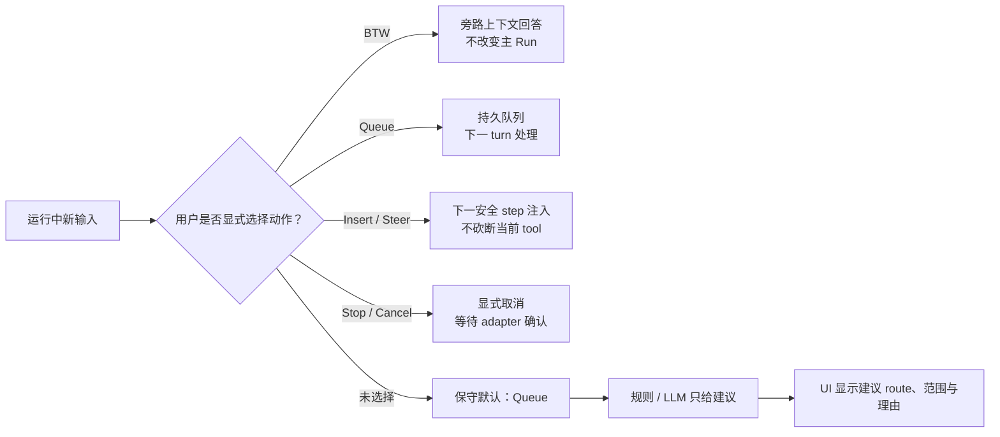
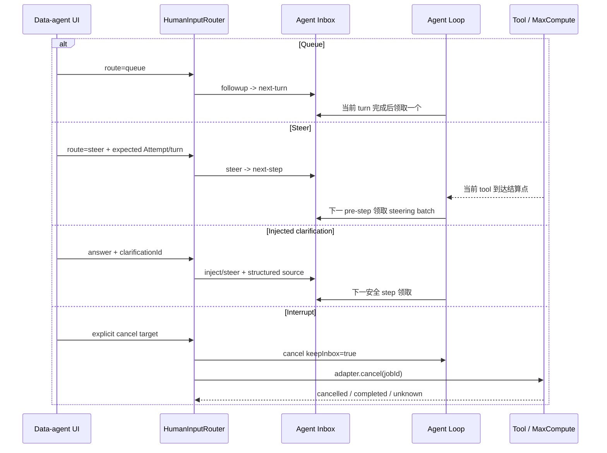
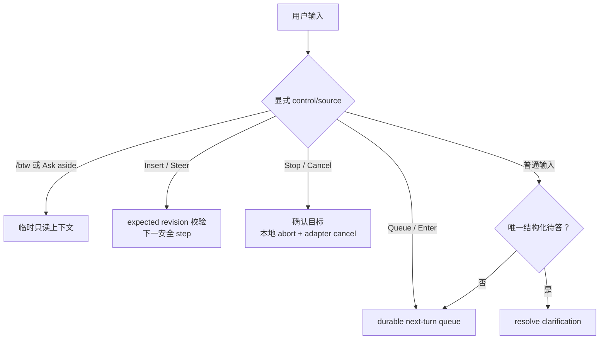
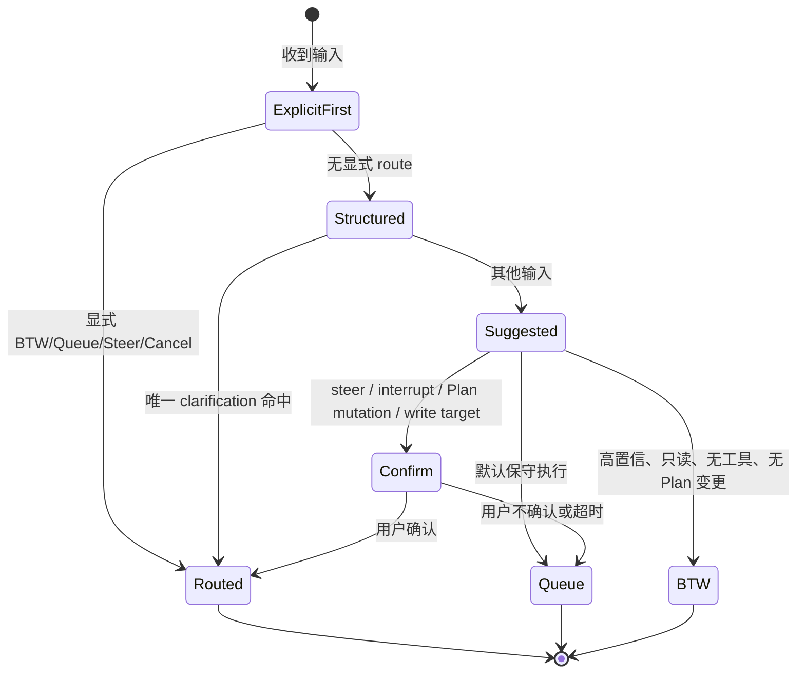

# G19 调研：运行中 Agent 的人类输入路由前沿

> 调研截点：2026-09-14。仅采用官方产品文档、官方协议规范、第一方更新日志和第一方源码。产品未公开说明的行为标为“未验证”，不根据界面观感或二手文章补全。

## 结论摘要

1. 当前成熟产品没有把“意图分类器自动决定是否打断”作为唯一入口。更常见的产品设计是同时提供明确的 **旁路问答、排队、下一安全点 steering、显式 interrupt/cancel**，让用户直接表达高风险意图；模型分类最多用于解释或优化低风险输入。
2. Claude Code 的 `/btw` 是最清晰的旁路机制：独立回答、不打断主 turn、不进入主会话历史、无工具访问，而且看不到主 Agent 正在生成的未完成回复。它证明“问一下 ROI 是什么”不必污染或改变正在执行的取数流程。[官方文档](https://code.claude.com/docs/en/interactive-mode#side-questions-with-btw)
3. Cursor 当前公开了最完整的显式控制：普通 Enter 排队，队列可见且可重排；“Send now”在下一次 tool call 的安全点 steering；CLI 再按一次 Enter 才中断。这说明“安全点插入”和“硬中断”应是两个动作，而不是同一个模糊的“立即发送”。[官方文档](https://cursor.com/docs/agent/overview#queued-messages) [官方文档](https://cursor.com/docs/agent/overview#steer-a-running-agent)
4. OpenAI Codex 当前第一方协议和源码也把 `turn/steer`、`turn/interrupt` 与 durable thread queue 分开；队列可增删改序并在冷恢复后继续，steer 必须携带期望的 active turn id。这支持“显式来源 + revision/turn fencing”，不支持由文本分类结果直接取得中断权限。[协议源码](https://github.com/openai/codex/blob/5b1d6560181680f95cde95c14ed042acc02248ed/codex-rs/app-server-protocol/schema/typescript/v2/TurnSteerParams.ts) [队列测试](https://github.com/openai/codex/blob/5b1d6560181680f95cde95c14ed042acc02248ed/codex-rs/app-server/tests/suite/v2/thread_queue.rs)
5. Gemini CLI 的实验性 Model Steering 确实使用一个小模型先生成确认，并给主 Agent 注入“重新评估计划、分类更新、最小化修改”的内部指令；但它只把输入送到“下一 turn”，没有公开证明分类器会在旁路、排队、取消和改写之间取得自治路由权。[官方文档](https://github.com/google-gemini/gemini-cli/blob/main/docs/cli/model-steering.md)
6. 对 data-agent 而言，错误成本高度不对称：**误排队通常只是延迟澄清，误 steering 可能浪费查询，误 interrupt/cancel 可能留下结果未知的 MaxCompute 作业或部分完成的分区写入。** 因而不能以普通 top-1 intent accuracy 决定是否上线自治路由，必须使用风险加权损失，并让 destructive route 需要显式操作或确认。
7. 推荐分阶段实现：第一版先提供显式四路控制和结构化 clarification correlation；第二版让规则/LLM 只做建议与 shadow evaluation；只有达到按风险分层的误路由门槛后，才自动执行低风险的 BTW 或 queue。**模型不得仅凭分类结果自动 interrupt、cancel、改变日期范围或改变写入表/分区。**

## 要回答的问题

当 data-agent 正在执行一个 Session，例如：

- 查询最近 30 天收入；
- 查询同期广告消耗；
- 回填 `ads_channel_mapping` 的目标分区；
- phase-gate 正在等待“自然月还是滚动 30 天”的澄清；

此时新用户输入应进入哪条路径：

1. **BTW / side inquiry**：在临时或 forked context 中回答，不改变当前 Run；
2. **interrupt / replacement**：停止当前 Agent turn 或原生作业，并用新输入替换方向；
3. **queue**：等待当前 turn 完成后作为下一轮输入；
4. **steer / insert**：不砍断当前原子动作，在下一个安全 step 把输入加入活跃工作。

核心不是“能否做文本分类”，而是分类准确性是否足以承担不同错误的后果。

## 产品与协议比较

| 产品或协议 | 已确认的显式控制 | 活跃工作期间的语义 | 背景工作 | 是否确认用语义分类器自治选路 | 对 data-agent 的启示 |
|---|---|---|---|---|---|
| Claude Code | `/btw`；运行时追加消息；`Ctrl+C` interrupt；后台 Bash / subagent 控制 | `/btw` 独立运行、不打断主 turn、不进入主历史、无工具，并且看不到仍在生成的回复；官方更新日志也明确支持工作中实时 steering 与 Enter 排队。[文档](https://code.claude.com/docs/en/interactive-mode#side-questions-with-btw) [固定版本更新日志](https://github.com/anthropics/claude-code/blob/18be13be81538c38efa5cb157fb2fc8da7469855/CHANGELOG.md) | 后台 Bash 异步运行并返回 task id，主会话可继续接受提示；后台 subagent 有单独停止控制。[文档](https://code.claude.com/docs/en/interactive-mode#background-bash-commands) | 否；公开资料显示的是用户显式选 `/btw`、queue、steer 或 interrupt | “ROI 是什么”适合 `/btw`；“改 7 天”不应被自动误判成 BTW |
| Cursor Agent / CLI | queue；Send now；CLI safe-boundary steering；再次 Enter interrupt | 普通 Enter 进入可见、可重排、顺序消费的队列；Send now 在下一 tool call 交付而不中断当前动作；CLI 第一次 Enter steering，第二次 Enter 才 interrupt。[文档](https://cursor.com/docs/agent/overview#queued-messages) [文档](https://cursor.com/docs/agent/overview#steer-a-running-agent) | Cloud Agents 可继续工作并接受 follow-up；团队 follow-up 由管理员控制。[文档](https://cursor.com/docs/cloud-agent) | 否；公开界面把动作交给用户选择 | 最接近 data-agent：默认 queue，显式 insert，第二个更强动作才 interrupt |
| OpenAI Codex app / CLI | `turn/steer`；`turn/interrupt`；thread queue 的 add/list/update/delete/reorder/start | `turn/steer` 要求 `expectedTurnId`，不匹配活跃 turn 时失败；durable queue 与 steer 是不同协议面。官方测试确认队列可冷恢复、活跃 turn 时手动 start 返回 busy 且不丢队列、interrupt 后队列仍保留。[steer schema](https://github.com/openai/codex/blob/5b1d6560181680f95cde95c14ed042acc02248ed/codex-rs/app-server-protocol/schema/typescript/v2/TurnSteerParams.ts) [queue processor](https://github.com/openai/codex/blob/5b1d6560181680f95cde95c14ed042acc02248ed/codex-rs/app-server/src/request_processors/thread_queue_processor.rs) [queue tests](https://github.com/openai/codex/blob/5b1d6560181680f95cde95c14ed042acc02248ed/codex-rs/app-server/tests/suite/v2/thread_queue.rs) | Codex app 支持并行 task；源码中的 queue 是 thread-scoped durable work，而 TUI 另有 queued messages 与 pending steers 状态。[官方介绍](https://openai.com/index/introducing-the-codex-app/) [TUI queue source](https://github.com/openai/codex/blob/5b1d6560181680f95cde95c14ed042acc02248ed/codex-rs/tui/src/chatwidget/input_queue.rs) | 未确认；当前源码确认不同操作和设置存在，但没有官方依据证明文本分类器自治选择它们 | 对每条输入持久记录确定的 route 与目标 turn，不能只记录原始文本后重分类 |
| GitHub Copilot coding agent | Issue/PR comment 可在工作中 steering；Stop agent | 新 comment 在当前工具调用完成后的机会点交付，不砍断正在执行的 tool；idle 后的 comment 则开始新 session/turn。[官方文档](https://docs.github.com/en/copilot/how-tos/use-copilot-agents/coding-agent/track-copilots-progress) | coding agent 本身在 GitHub Actions 环境异步工作 | 未确认 | “先完成当前 SQL 提交，再改报告口径”比 mid-tool abort 更安全 |
| GitHub Copilot SDK | `session.send(..., mode: "immediate")` 与 `mode: "enqueue"` | immediate steering 注入当前处理；enqueue 等当前 response 完成后再处理。接口让调用方明确指定模式。[官方文档](https://docs.github.com/copilot/how-tos/copilot-sdk/use-copilot-sdk/steering-and-queueing) | SDK 会话可由宿主维护 | 否；模式是调用参数 | DSH 应把 route 作为 typed command，而不是让消息文本隐式决定权限 |
| Gemini CLI | 实验性 Model Steering | 工作中输入经 Enter 提交；小模型生成一句确认，主 Agent 在下一 turn 收到带“重评计划、分类更新、最小修改”要求的 hint。功能默认关闭且仍在开发。[官方文档](https://github.com/google-gemini/gemini-cli/blob/main/docs/cli/model-steering.md) | 文档称适用于长任务和 subagent execution，但没有给出持久 queue 或 BTW 的同等契约 | **部分确认**：确认用小模型辅助理解 hint；未确认它自治选择 interrupt、queue 或 side inquiry | 分类器适合解释“改最近 7 天”影响哪些 Task，不适合直接授予取消权 |
| ACP v2 | `session/prompt`；`session/cancel`；`state_update` | prompt 可“开始或贡献于”foreground work；cancel 要求尽快停止模型请求和 tool invocation，并最终报告 `idle/cancelled`。规范没有定义 BTW、queue、steer 的不同 mode，也没有替宿主规定活跃时多 prompt 的排序策略。[规范](https://agentclientprotocol.com/protocol/v2/prompt-lifecycle) | idle 时仍允许 background activity 发 update | 否 | ACP 可承载通用 prompt/cancel，但 DSH 插件仍需自定义 route、目标 Attempt 和安全点语义 |
| MCP | request cancellation；elicitation | cancellation 只适用于在途协议 request，并明确不是撤销已经发生的副作用；MCP 没有 Agent Session 的 human-input queue/steer 模型。[规范](https://modelcontextprotocol.io/specification/2026-06-18/basic/utilities/cancellation) [elicitation](https://modelcontextprotocol.io/specification/2026-06-18/client/elicitation) | 不定义 Agent 后台任务调度 | 否 | 不能用 MCP cancellation 代替 MaxCompute 作业的领域取消和结果确认 |

## 已确认模式与未验证部分

### 已确认的共同方向



外部产品共同支持的不是“一个聪明输入框”，而是把不同执行语义做成不同控制面：Claude Code 区分 `/btw` 与主历史输入，Cursor 区分 queue、safe-boundary steer 与 interrupt，Codex 协议区分 steer、interrupt 与 durable queue，GitHub Copilot SDK 让调用方显式选 immediate/enqueue。[Claude Code](https://code.claude.com/docs/en/interactive-mode#side-questions-with-btw) [Cursor](https://cursor.com/docs/agent/overview#queued-messages) [Codex](https://github.com/openai/codex/blob/5b1d6560181680f95cde95c14ed042acc02248ed/codex-rs/app-server-protocol/schema/typescript/v2/TurnSteerParams.ts) [Copilot SDK](https://docs.github.com/copilot/how-tos/copilot-sdk/use-copilot-sdk/steering-and-queueing)

### 未验证，不应作为设计前提

- 未找到 Claude Code 官方依据证明 `/btw` 由普通自然语言自动识别；确认的是显式 `/btw`。
- 未找到 OpenAI Codex 官方依据证明 app/CLI 用 LLM 自动选择 steer、queue 或 interrupt；确认的是协议与源码分别表达这些操作。
- 未找到 Cursor 官方依据证明输入框自动语义分类；确认的是用户按键和按钮决定路线。
- 未找到 GitHub Copilot coding agent 官方依据证明 comment 会被分类成 cancel 或 side inquiry；确认的是 comment steering 与显式 stop。
- Gemini CLI 确认有小模型辅助处理 steering hint，但没有确认该模型可以自治执行 cancel、改变外部写入目标或旁路主历史。[官方文档](https://github.com/google-gemini/gemini-cli/blob/main/docs/cli/model-steering.md)

## data-agent 场景下四条路径的语义

| 用户输入 | 默认建议 | 原因 | 不能偷偷做什么 |
|---|---|---|---|
| “ROI 是什么意思？” | BTW | 只需当前上下文知识，不改变查询和 Plan | 不应写入主 Task 输入，不应暂停收入/广告消耗查询 |
| “顺便解释一下 `gmv_net` 和 `gmv_gross` 的区别” | BTW；若需查 schema 则显式 fork/read-only subagent | 旁路问题可能需要新读取，纯 BTW 无工具时应说明限制 | 不能假装查过表结构 |
| “把最近 30 天改成最近 7 天” | Steer 到下一安全点，再提交 Plan patch | 会改变收入、投放和下游报告 Task revision；当前原子 SQL 提交可先结束 | 不应仅改 prompt 而不 fence 旧 Attempt；不应默认取消已提交查询 |
| phase-gate 正在问“自然月还是滚动 30 天？”，用户答“自然月” | 结构化 clarification response | 有唯一待答问题和 correlation id，不需要通用分类器 | 不应进入普通 queue 后让系统继续卡在 Hold |
| “取消正在跑的收入 MaxCompute 查询” | 显式 cancel，目标为 query job / Attempt | 取消对象和意图明确，但仍要由 adapter 回报 cancelled/unknown | 不应把 `agent.cancel()`等同于远端查询已取消 |
| “目标改写到 `ads_roi_daily/dt=20260914`” | 高风险 Plan patch + 确认；必要时 Hold | 改变写入范围，旧 Attempt 可能已经产生部分效果 | 不应自动 steer 后继续执行；不得仅靠文本分类授予写权限 |
| “先不要继续生成报告” | Task/subgraph Hold | 目标是阻止下游 admission，不一定要取消已付费查询 | 不应扩大成全 Run cancel |
| “解释一下上海今天的天气” | BTW 或独立 fork；默认 queue 也安全 | 与当前分析无关，误 queue 只是延迟 | 不应污染当前数据分析 Task 或触发外部取消 |

## 本地 DSH 原生语义

### 当前能力

本地 [`Agent`](../../../packages/core/agent/src/runtime-types.ts) 已有三种不同输入 API：

- `followup(message)`：写入 `next-turn`并唤醒 driver；每条普通 follow-up 独占自己的 turn。
- `steer(message)`：写入 `next-step`并唤醒；running 时在最近的后续 step 领取，idle 时会开启 turn；若 `agent/pre-step` 拒绝，本条 steering 留在 inbox。
- `inject(message)`：写入 `next-step`但不唤醒；running 时在后续 step 领取，idle 时等待其他 follow-up/steer 唤醒；已经完成 claim 的 request 可能错过本次注入。
- `cancel(cause, { keepInbox })`：中止 active turn；默认清空 `next-step`再清空 `next-turn`，`keepInbox: true`才保留待处理输入。

[`ReactLoopInbox`](../../../packages/core/agent-loop/src/inbox.ts) 用 Session 事件持久记录 splice，并分别维护 `next-turn`与`next-step`。step claim 会先取走全部 `next-step`，而 turn boundary 再取一个 `next-turn`。[`ReactLoopAgent`](../../../packages/core/agent-loop/src/agent.ts) 在取消已经发生后收到新的 waking input 时，会把它强制改投 `next-turn`，避免新输入加入已经 abort 的 activity。

`MessageSourceMap` 是可扩展 tagged union，目前核心能区分 `user`、`plugin`、`model`和`tool`来源，但**来源只说明谁产生消息，不等于 BTW/queue/steer/cancel 的用户意图**。[本地源码](../../../packages/llm/llm/src/message.ts)



### 与产品前沿相比的缺口

| 缺口 | 当前 DSH 状态 | 需要的 DA-owned 插件能力 |
|---|---|---|
| BTW | 无正式旁路问答 API | 临时 Session 或 forked read-only context；不把问答追加到父 Session 的 model-visible history |
| 用户可见 queue | 有 durable `next-turn`，但没有 data-agent 的队列条目、路由原因、目标 Run/Task 和可重排 UI | `HumanInputEnvelope`投影、队列 UI、update/delete/reorder 命令 |
| safe-boundary steering | `steer()`已有最近 step 语义 | 增加 `expectedRunRevision`、`expectedTaskRevision`、`expectedAttemptGeneration`，拒绝过期 steering |
| structured clarification | phase-gate 目前可注入消息，但没有通用 clarification id 到 Task Hold 的 durable correlation | `ClarificationRequestId`与 resolve command；唯一待答时规则直达 |
| interrupt 与远端取消 | `agent.cancel()`只保证本地 turn abort | executor adapter 独立 cancel；结果必须是 `cancelled/completed/unknown`，不能推断外部副作用已回滚 |
| route 审计 | source.kind 不表达处理意图 | 持久记录 `route`, `chosenBy`, `confidence`, `target`, `reason`, `supersedes` |
| classifier 安全门 | 无 | 规则优先、LLM 建议、风险阈值、确认与 correction 记录 |

## 复杂度、准确率与错误成本模型

### 不能只看分类准确率

令输入真实意图为 `i`，系统选路为 `a`。上线指标应是风险加权期望损失，而不是普通 accuracy：

```text
ExpectedLoss(a | x)
  = P(a ≠ i | x) × Harm(a, i, activeEffects)
  + LatencyCost(a)
  + ComputeCost(a)
  + StateComplexityCost(a)
```

其中 `activeEffects`至少包含：

- 是否已有运行中的 MaxCompute query；
- 是否正在提交或写入表/分区；
- 是否存在不可幂等工具调用；
- 是否只在做只读解释；
- 用户输入是否命中一个结构化 clarification；
- 受影响 Task 的 revision 与 writeScopes。

### 典型误路由成本

| 真意图 | 错误路由 | data-agent 后果 | 相对成本 |
|---|---|---|---:|
| BTW：“ROI 是什么？” | Queue | 稍后回答，主查询继续 | 1 |
| BTW | Steer | 主 Agent 分心，可能改变分析叙事 | 3 |
| Clarification answer | Queue | phase-gate 多等待一个 turn | 2 |
| 改日期范围 | Queue | 旧 30 天查询继续，多花费用和时间，但可被 revision fence 拒绝 | 5 |
| 改日期范围 | BTW | 用户以为已改，实际 Plan 未改 | 7 |
| 普通说明 | Interrupt | 已运行查询被中止或进入 unknown，重跑昂贵 | 9 |
| 改写入分区 | 自动 Steer 且无确认 | 可能把数据写到错误表/分区 | 10 |
| Cancel query | Queue | 取消延迟，继续消耗资源 | 6 |
| Cancel query | BTW | 完全未取消且用户可能误以为成功 | 10 |

这组数值是设计用的序数量表，不是已发表测量结果。实现前应以真实 Session replay 和人工标注校准。

### 路由方式比较

| 方法 | 实现复杂度 | 可解释性 | 预期准确性 | 对高风险误路由的控制 |
|---|---:|---:|---:|---:|
| 四个显式按钮/命令 | 中 | 很高 | 用户明确时最高 | 很强 |
| 结构化状态规则 | 中 | 很高 | clarification、显式 cancel 等场景很高 | 很强 |
| 关键词规则 | 低 | 高 | 对自然语言、省略和多意图较差 | 一般 |
| 单次 LLM 分类 | 中 | 中 | 语义覆盖好，但受上下文、提示和模型漂移影响 | 弱，除非只做建议 |
| 规则 + LLM + confidence threshold | 高 | 中高 | 可改善长尾 | 中强 |
| 全自治 classifier + 在线学习 | 很高 | 低 | 无本产品 eval 前未知 | 弱；错误会直接变成副作用 |

目前检索到的官方资料没有给出可直接迁移的“人类输入四路分类准确率”公开评测。Gemini CLI 只确认用小模型帮助理解 steering hint，不能据此推断它已解决 BTW/queue/interrupt 的自治路由问题。[官方文档](https://github.com/google-gemini/gemini-cli/blob/main/docs/cli/model-steering.md)

## 推荐的分阶段架构

### 阶段 1：显式控制优先，不做 destructive auto-routing



第一版规则：

- 默认普通 Enter = **queue**，因为误 queue 的损失通常低于误 interrupt。
- BTW、Insert/Steer、Stop/Cancel 都有明确 UI 动作和 typed message source。
- phase-gate clarification 带 `ClarificationRequestId`；只有唯一、未过期、内容类型匹配时才确定性直达。
- 改日期范围、口径、表或分区不是普通消息动作，而是主 Agent 解析后提交 Plan patch；Host 验证并提升 revisions。
- Cancel 必须指定目标：主 Agent turn、某个 Attempt、某个 MaxCompute job 或整个 Run。外部 adapter 未确认时记 `unknown`，不宣称已取消。

### 阶段 2：分类器只建议，并以 shadow mode 建立 eval

分类器输出固定结构：

```ts
interface HumanInputRouteProposal {
  route: 'btw' | 'queue' | 'steer' | 'interrupt'
  scope: 'conversation' | 'run' | 'task' | 'attempt' | 'executor-job'
  targetId?: string
  confidence: number
  mutatesPlan: boolean
  mayAffectExternalSideEffects: boolean
  reasonCode: string
}
```

但 UI 仍使用确定性默认值；分类器只显示“建议作为 BTW”“建议插入当前分析”，并记录用户是否接受或改选。评测按场景、成本和 route 分层：

- confusion matrix；
- risk-weighted expected loss；
- destructive false-positive rate；
- clarification direct-hit rate；
- 用户改选率；
- route 后撤销/修正率；
- 因误 queue 增加的平均延迟；
- 因误 steer/cancel 浪费的查询费用与 unknown jobs。

### 阶段 3：只自动执行低风险路线

满足离线 replay、在线 shadow 和版本稳定性门槛后，可允许：

- 高置信度、非变更型、无需新工具的输入自动走 BTW；
- 其余普通输入自动 queue；
- 唯一结构化 clarification 自动 resolve。

仍然禁止仅凭 LLM 分类自动：

- interrupt/cancel；
- 修改 Plan、日期范围或统计口径；
- 改变 table/partition write target；
- 降低 verification assurance；
- 提高预算；
- 重新执行结果未知或非幂等的工作。



## 推荐结论

采用 **显式控制优先、意图识别辅助、风险分层自治**，而不是“所有普通输入先由 LLM 四分类再直接执行”：

1. 产品层显式提供 BTW、Queue、Insert/Steer、Stop/Cancel；默认 Queue。
2. 结构化 clarification 不经过通用分类器，按 id 和期望 Task revision 直达。
3. LLM 分类器第一阶段只做建议和 shadow logging；它可分析影响范围，但不直接授予执行权限。
4. 只有低风险 BTW/Queue 在评测达标后允许自动选路。
5. interrupt、远端 cancel、Plan mutation 和 write-target mutation 始终需要显式操作或确认。
6. route 选择、来源、置信度、目标、修正和最终结果都写入 durable Session event，后续才能从用户纠正中评估规则；“学习”先表现为可审计的 per-user preference/rule，不做不可解释的在线模型自更新。

这比纯手动四按钮多出一层便利，又避免把昂贵或不可逆副作用押在分类器的单次判断上。

## 下一轮唯一 Grilling 问题

**第一版交互默认值应定为哪一种：普通 Enter 一律 Queue，并由用户显式选择 BTW/Insert/Cancel；还是允许系统在“高置信、只读、无需工具、无 Plan 变更”时自动转为 BTW？**

这个问题决定第一版是否立即承担一个低风险自治分类面。无论答案如何，Steer、Interrupt、Cancel、Plan patch 和表/分区写入变更都不会由分类器自动执行。
