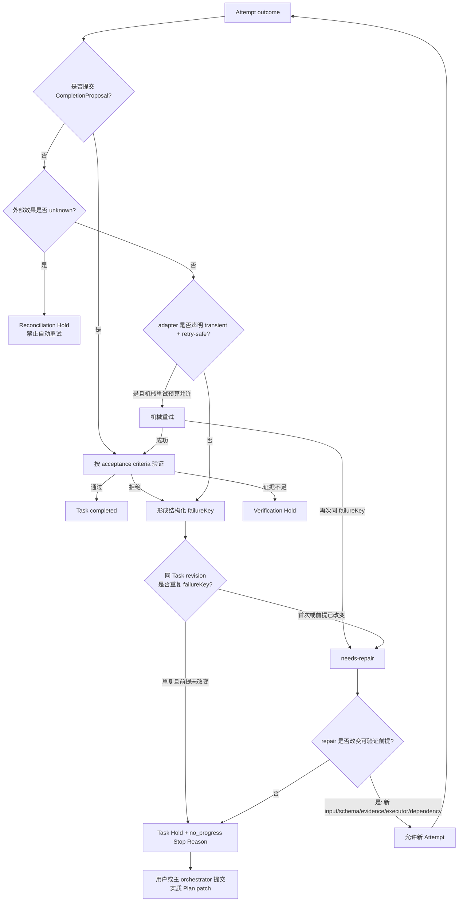

# G19 — Agent 无进展检测、循环恢复与人工升级前沿调研

**调研日期：2026-09-14**

## 结论摘要

截至 2026 年 9 月 14 日，成熟 Agent 的生产实现没有形成一个通用、可靠、低成本的“进展分数”。共同做法更朴素：用硬上限阻止无限运行，用工具超时和有限网络重试处理基础设施故障，用最近事件中的重复动作或重复输出捕获明显循环，用持久状态和人工操作处理长任务；只有 Gemini CLI 和 OpenHands 暴露了较完整的通用 stuck detector，而前者的语义检测需要额外模型调用，后者主要依靠相等性和短窗口模式匹配。[CC1][CX1][GH1][OC1][GM1][OH1][SW1]

2026 年下半年的原始研究进一步说明，不能把“模型认为自己有进展”当作可信的停止依据。Progress Mirage 的控制实验中，Agent 在 54 个 cycle 中全部声称改进，但 56% 的真实测量变化不大于零；读取完整文本、diff 和历史 verdict 的强 in-band judge 仍接受了 44% 的真实回退，并拒绝了 38% 的真实改进。只有当成功条件能够从 artifact 本身验证时，这种差距才消失。对 data-agent，这意味着“我修改了 SQL”“我换了一种分析思路”都不是进展；MaxCompute 结果、数据范围、行数、质量检查和下游验收才可能是进展证据。[P1]

第一版不应实现此前设想的通用 `ProgressVector`、跨 Task 语义等价、周期发现和常驻 LLM progress judge。它们需要新的事件模型、摘要策略、模型调用、阈值校准和误停评测，实施与长期维护成本高，而对当前 DSH 已有的 timeout、exact-repeat reminder、Goal round limit、phase budgets 和结构化 verification 的边际收益不足。

**当前 DSH 最小且高 ROI 的方案是“结构化失败键驱动的有界升级”，而不是 A+B 式混合评分器：**

1. 每个 Attempt 都有硬预算和明确 outcome；`unknown` 外部效果永不自动重试。
2. executor/adapter 在失败时提交 Host 可验证的 `failureKey`：Task revision、executor kind、规范化失败代码、输入或 SQL digest、目标数据范围、外部 effect identity。
3. 仅对 adapter 声明为 transient 且 retry-safe 的失败做预算内机械重试。
4. 同一 Task revision 再次出现相同 `failureKey` 时，不再自动重试；进入 `needs-repair`。repair 必须产生可验证的前提变化，例如新 schema evidence、不同 SQL digest、不同 executor、不同输入或依赖。
5. repair 后相同 `failureKey` 再现，或 Task 的 Attempt/repair 预算耗尽时，记录结构化 `no_progress` Stop Reason，并建立 Task Hold，请求人类或主 orchestrator 提交实质 Plan patch。
6. Run 层不计算抽象“进展分数”；当没有可准入 Task，且剩余分支均处于 failed、unknown、approval 或 clarification Hold 时，Run 停在可解释状态。
7. 继续复用现有 `repeat-tool-reminder` 作为 turn 内建议，不把它升级为 Task 终止器；继续复用 tool timeout 和 phase-gate 的局部预算，但由 Attempt adapter 把终态映射到 Task outcome。

该设计不需要新的 LLM judge，不在每轮增加 token 开销，不需要识别所有可能的“进展”，只要求重复失败后若要继续，必须证明执行前提已经变化。它直接覆盖 data-agent 最常见的浪费模式：同一 SQL 反复报 `TABLE_NOT_FOUND`、同一分区写入结果未知却自动重试、同一 schema 错误只改自然语言说明、同一 verifier rejection 未产生新证据便再次提交。

## 1. 调研范围与证据标准

本调研仅采用以下原始来源：

- 官方产品文档与第一方 changelog；
- 官方 GitHub 仓库在 2026-09-14 前后的源码和测试；
- 协议或官方运行时实现；
- 2026 年下半年公开的原始论文与评测。

对闭源产品，只记录官方文档或 changelog 明确承诺的行为，不从界面表现推断内部算法。对开源实现，固定到本次检查的 commit。对源码中没有发现的机制，只表述为“本次检索范围内未发现”，不证明产品内部绝不存在。

本调研区分六类机制：

1. **硬上限**：turn、iteration、时间、费用、调用次数；
2. **重复动作检测**：相同工具、参数、输出或周期模式；
3. **结果/证据进展**：外部结果或验收信号是否改善；
4. **模型判断**：额外 LLM 判断是否陷入循环或目标是否完成；
5. **repair/replan 升级**：改变当前执行方法或任务计划；
6. **人工介入**：暂停、停止、补充信息、审查或重新下达任务。

## 2. 前沿实现对比

| 系统 | 硬上限 | 重复检测 | 结果/证据进展 | 模型 judge | repair/replan | 人工介入 |
|---|---|---|---|---|---|---|
| Claude Code | subagent `maxTurns`；hook timeout；Goal/Loop 运行限制 | 官方公开材料未暴露通用 detector | Stop hook 可接外部检查；Goal 可由 judge 继续 | Goal/Stop hook 可用模型判断 | 反馈后继续；错误时退避或暂停 | Stop、pause、后续消息、hook block |
| OpenAI Codex | 请求/stream retry 上限；命令与后台任务 timeout | 本次官方源码检索未发现通用 detector | tests、diff 与用户审查属于工作流证据，但无统一 progress gate | 本次检索未发现常驻 progress judge | 模型可更新 plan；失败通常交回当前 turn 或用户 | steer、interrupt、approval、queue |
| Cursor Agent | 官方文档称 Task 内 tool call 数不设上限 | 官方文档未声明通用 detector | checkpoint 支持回退，不是完成判据 | 未公开 | 模型自行调整，用户可 steer | Queue、safe-boundary steer、立即消息、pause、checkpoint restore |
| Gemini CLI | session/subagent max turns、timeout、网络 retry | 5 次工具周期、10 次内容 chanting | 通用 detector 不读取领域 ground truth | 30 turns 后周期性 LLM 检查，必要时强模型 double-check | 首次检测注入反思提示并再运行一轮 | 二次检测停止；可禁用 detector；AfterAgent hook 可 retry/halt |
| GitHub Copilot cloud agent | 单 session 59 分钟硬上限 | 官方文档未声明 | tests/linters、commits、logs、PR review | 未公开 | 用户可在 session/PR 中迭代 | 用户审查、评论、取消；超时停止 |
| GitHub Copilot CLI | shell/tool timeout、请求 retry、session idle timeout | changelog 未证明通用 detector | task progress 与 tool output 可见 | 未公开 | custom tool call self-correction；API 错误后不再无限 autopilot | abort、queued messages、background agent status |
| OpenHands SDK | `max_iterations=500` 默认 | action-observation、action-error、monologue、交替周期 | Goal controller 主要读取 transcript/events | Goal 每轮由 LLM judge；stuck detector 本身确定性 | 相同错误先 nudge，继续重复后 `STUCK` | `PAUSED`、`AWAITING_USER_INPUT`、`STUCK` 状态 |
| SWE-agent | 单命令、累计执行时间、连续 timeout、attempt、费用上限 | 未见通用语义循环检测 | reviewer 对独立 submission 打分/选择 | 可配置 reviewer/chooser | 多次独立 attempt 后选最好结果 | 超限即退出；另有 HITL shell 模式 |

## 3. 各系统实现

### 3.1 Claude Code：硬限制、可编程 Stop hook 与人类接管

Claude Code 官方仓库不包含完整闭源运行时，因此可验证证据来自官方文档、插件 hook 规范和第一方 changelog。

- Subagent 支持 `maxTurns`；达到上限时，官方 changelog 明确说明结果会标为 partial，并提示通过 `SendMessage` 继续，而不是伪装成完成。[CC1][CC3]
- Stop 与 SubagentStop hook 可以返回 block 使 Agent 继续；输入包含 `stop_hook_active`，官方文档要求 hook 检查该字段，避免 Stop hook 自己造成无限循环。[CC2]
- hook 有明确 timeout；不同事件采用 fail-open 或 fail-closed 语义，说明 timeout 被当作生命周期安全机制，而非“无进展”语义判断。[CC2]
- 2026 年 9 月 changelog 表明 `/goal` 在 API 错误、网络断开和 token 限制后会退避重试，无法继续时暂停并解释原因；它也修复了后台任务等待时的 busy loop 和 Goal run silent stall。[CC1]
- `/usage` 增加按 loop 的运行次数与 token 统计，用于暴露 runaway/chatty loop，但这是观测和人工诊断，不是自动 progress judge。[CC1]

**data-agent 启示**：长 SQL 或回填任务的网络故障应进入 retry/pause 路径；“报告是否真的正确”应交给 domain verifier 或 Stop hook 类外部检查，不应由 outer-loop 自述。

### 3.2 OpenAI Codex：基础设施重试与显式控制，不承担通用语义停滞判断

Codex 官方源码在本次检查的 commit 中明确实现：

- sampling stream 有 `stream_max_retries`；超过上限后可从 WebSocket 切换到 HTTPS，再耗尽才返回错误。重试状态向 UI 发出 `Reconnecting... n/max`，避免长时间无反馈。[OC1]
- 某些 connection failure 可进入有上限退避或受 feature 控制的持续连接重试；这是连接恢复，不是重复行动检测。[OC1]
- tool orchestrator 对 sandbox/权限失败可以在明确条件下重新执行，但没有把任意失败解释成可重试。[OC2]
- 协议与 core 中有 interrupt、steer、queue、approval 和 `TurnAborted` 等清晰生命周期；用户控制与权限审查是首要安全边界。[OC3]
- 在 `codex-rs/core`、protocol、exec 与 app-server 的本次源码检索范围内，没有发现一个按重复工具参数、结果变化或全局 progress score 自动终止普通 coding turn 的通用 detector。

**data-agent 启示**：基础设施重试和任务无进展必须分开。MaxCompute SSE 断开可以安全重连；同一 SQL 被服务端接受但结果未知不能按网络 retry 处理。

### 3.3 Cursor Agent：无限工具调用配合显式 Queue/Steer/Checkpoint

Cursor 官方 Agent 文档明确说明单个 Task 的工具调用次数没有上限。它公开的主要保护不是自动 no-progress detector，而是人类可见控制：

- 普通输入可以排队，当前 Task 完成后顺序处理；
- 用户可在下一个工具调用的安全边界 steer，而不切断进行中的动作；
- immediate message 用于紧急重定向；
- checkpoint 在显著文件修改前保存，可由用户恢复；
- Agent 等待 clarification 时仍可继续读文件、编辑或运行命令。[CX1]

**data-agent 启示**：没有通用硬 step cap 也可以依靠强交互控制工作，但这适合前台 pair-agent，不足以单独保护 AFK 的数据回填、昂贵查询和正式报表任务。

### 3.4 Gemini CLI：当前最完整的通用 loop detector

Gemini CLI 是本次调研中公开实现最完整的通用循环检测器：

- `TOOL_CALL_LOOP_THRESHOLD = 5`：对最近工具调用建立 name+arguments key，可检测长度 1–5 的周期，要求周期重复 5 次；
- `CONTENT_LOOP_THRESHOLD = 10`：对流式文本片段做 hash、原文复核和距离检查，捕获 chanting；
- 单 prompt 运行到 30 turns 后启用 LLM loop check；检查间隔根据 confidence 在 5–15 turns 之间调整；
- 快模型 confidence 达到 0.9 后再由更强的 `loop-detection-double-check` 模型确认；
- 第一次检测不会立即永久停止，而是注入“退一步、检查是否有前进、改变方法”的系统反馈，并递归再给一次恢复机会；
- 第二次检测终止执行；session 可由用户选择禁用 loop detection；
- Agent session 和 subagent 另有 `maxTurns`，subagent 默认 30 turns、默认 10 分钟；AfterAgent hook 可验证最终响应并请求 retry 或 halt。[GM1][GM2][GM3]

该实现能避免“只看相邻两次工具”的低召回，但代价明显：维护工具周期、文本片段统计、有限历史、遥测、两个模型 alias、confidence calibration、恢复轮次和用户禁用状态。30 turns 后的常驻模型检查还会增加 latency 和 token 成本。

**data-agent 误停风险**：连续查询多个日期分区、逐表执行相同质量检查、对多张表运行相同 `DESCRIBE` 都可能呈现周期；Gemini 通过比较完整参数和结果、并在 prompt 中列出“跨文件批处理不是循环”等反例降低误报，但 data-agent 仍需理解分区、数据范围和 job outcome 才能准确区分批处理与停滞。

### 3.5 GitHub Copilot cloud agent：固定时间盒、可观测后台执行与人类审查

官方文档公开的强停止机制是：每个 cloud-agent session 最长 59 分钟，该上限不可延长或绕过；复杂任务应拆小，也可以在环境配置中设置更短 timeout。Agent 在 GitHub Actions 环境中研究、计划、修改并运行 tests/linters；用户通过 session、commit、log 和 PR review 查看进展并继续迭代。[GH1]

官方文档没有公开通用重复动作 detector、progress score 或自动 replan 算法。因此可验证结论是：产品以硬时间盒、透明日志、可审查提交和人类迭代限制失败半径，而不是承诺自动识别所有无进展状态。

### 3.6 GitHub Copilot CLI：可靠性修复与可见进度

Copilot CLI 官方仓库主要发布二进制和 changelog。可验证条目包括：

- Autopilot 在 API 错误后停止继续，修复此前可能无限循环的问题；
- retry exhaustion 后显示 request ID；
- rate limit 会暂停 queued messages 并自动重试；
- background agent 的当前 intent 和已完成工具调用会出现在读取状态和 task timeout 响应中；
- shell 默认 timeout 被降低，prompt 不再暗示 timeout 等于失败；
- infinite session 依赖 compaction checkpoints 管理上下文，而不是取消运行上限和失败处理。[CP1]

这些证据支持“超时、错误与停滞要分开建模”和“长任务需要可见 progress”，但没有证据支持把 CLI 当作已有的通用 no-progress oracle。

### 3.7 OpenHands：确定性重复模式、一次 nudge、然后硬 STUCK

OpenHands 的官方 Software Agent SDK 暴露了明确实现：

- Conversation 默认 `max_iterations=500`，并默认启用 `stuck_detection`；
- detector 只扫描最近 20 个事件，并从最后一条用户消息之后开始；
- 检查同 action+observation、同 action+error、连续 agent monologue、交替 action-observation；context-window error loop 的入口仍为 TODO；
- 默认 threshold 为 4；对于相同 action-error，第 3 次先注入一次包含工具名、参数和错误的 nudge，第 4 次仍重复才进入 `STUCK`；测试明确覆盖“3 次提醒、4 次停止”；
- `STUCK`是正式 conversation execution status，和 `PAUSED`、`WAITING_FOR_CONFIRMATION` 分开；
- OpenHands 的 `/goal` controller 是另一个机制：每轮结束由 LLM judge 检查目标，默认最多 10 轮，结果区分 `complete`与 `capped`。[OH1][OH2][OH3][OH4]

OpenHands 的收益是零额外模型成本的高精度明显循环捕获。限制是它主要比较事件相等性：SQL 只改空格、别名或无关谓词即可逃避；反过来，合法的轮询或重复数据质量检查需要 exclusion 或更精确语义。

### 3.8 SWE-agent：时间、费用和独立 Attempt 数量控制

SWE-agent 官方实现主要用硬预算而非通用停滞检测：

- 单命令 `execution_timeout` 默认 30 秒；全部命令累计 `total_execution_timeout` 默认 1800 秒；达到 3 次连续执行 timeout 时退出；
- LLM API 使用有限 retries 与指数等待；
- RetryAgent 可以启动多个独立 solving attempts，由 chooser 或 reviewer 选取结果；retry loop 同时受 `max_attempts`、总 cost limit、下一 Attempt 最小剩余预算和可选 accepted-count 限制。[SW1][SW2][SW3]

这是一种完整策略：用独立样本提高成功率，用成本和次数上限终止；它不试图判断一次 trajectory 中每一步是否“有进展”。对 data-agent，它适合低成本只读分析候选，不适合未知写入结果或每次查询都昂贵的任务。

## 4. 2026 年下半年研究证据

### 4.1 Progress Mirage：不要让执行者或 transcript judge定义真实进展

Progress Mirage 固定 Agent 和工具面，只改变 gate evaluator 能看到的信息。结果显示 self-report 基本是 accept-all；强 in-band judge 即使看到 artifact、diff 和 verdict history，仍无法可靠判断真实世界输出。只有 success signal 位于 artifact 内部、能够直接验证的边界任务，judge 才表现可靠。[P1]

对 data-agent：

```text
“SQL 更合理了”                 不是可靠进展
“查询成功且日期范围正确”       是外部可验证进展
“报告措辞更谨慎了”             未必修复口径错误
“重新计算后通过同口径校验”     是外部可验证进展
```

因此，第一版不应投入一个读取 transcript 的通用 semantic progress judge。若 Task 的成功信号在 MaxCompute、数据质量系统或发布目标中，应由相应 verifier读取该系统。

### 4.2 LAST-CQ：恢复收益主要来自检测和路由，不一定来自昂贵反馈

LAST-CQ 对 2,471 个 Text-to-Cypher 查询做组件消融。论文结论是，执行驱动恢复的主要价值来自**检测失败并把它路由到 retry**；把丰富反馈替换成原始数据库错误，恢复率变化很小但 token 成本降低。论文也指出执行成功不等于语义正确，结果级 judge 对人工标签存在乐观偏差。[P2]

对 data-agent：先把 `TABLE_NOT_FOUND`、字段错误、语法错误、权限错误、空结果和 provider transient error 可靠分类，通常比先构建复杂的 progress narrative 更有价值。

### 4.3 Elastic Horizon：更多步骤存在收益平台期，预算应随可观测成功轨迹调整

Elastic Horizon 在 AppWorld 和 BFCL 上观察到交互 horizon 的饱和区间：超过 effective interaction frontier 后，成功率不再系统提高，而 trajectory 成本继续线性增长；其自适应控制在实验中最多节省约 25% 的每步 trajectory token。[P3]

该论文研究的是训练期 horizon controller，不应直接复制为生产 Task DAG 算法。它支持的工程结论是：硬上限不是粗糙的临时措施，而是防止长 horizon 边际收益为零的合理基础；动态 per-task horizon 属于后续优化。

### 4.4 Validation Evidence：通过不等于证明目标已经修复

该研究分析 643 个 coding-agent rollout 中 3,730 次 validation event：46.0% 的正向可比较事件没有 bug-discriminating 信息，23.8% 的 baseline rollout 在全部正向证据都不区分原 bug 的情况下关闭任务。把测试在 buggy baseline 上重放并返回对照结果，可减少 7.8 个百分点的 evidence-inadequate closure，并增加 7.4 个百分点的 bug-discriminating evidence，但效应低于预注册的 10 点实际意义阈值。[P4]

对 data-agent：

- “SQL 执行成功”只能证明可运行，不能证明指标口径正确；
- “结果非空”不能证明日期、游戏、币种和维度一致；
- verification 必须对应 acceptance criterion，而不是把任意绿色信号当作进展；
- 即使更好的反馈有帮助，也要衡量其运行成本和实际效应，不应默认增加 judge。

## 5. 完整策略的独立 ROI 评估

下面不是 A、B 再拼成 C，而是五种各自能够独立部署的控制策略。评分为本调研基于源码结构和运行路径的工程评估：1 最低，5 最高。

| 完整策略 | 实现复杂度 | 运行/token 开销 | 用户收益 | 误停风险 | 维护成本 | 适用位置 |
|---|---:|---:|---:|---:|---:|---|
| **硬时间/次数/费用盒** | 1 | 1 | 4 | 3 | 1 | 所有 Agent 的最后防线 |
| **确定性重复轨迹 detector** | 2 | 1 | 3 | 2–3 | 2 | coding/CLI 的明显重复循环 |
| **领域结果 gate** | 3 | 1–3 | 5 | 1–2 | 3 | SQL、数据质量、写入、正式交付 |
| **常驻 LLM semantic loop judge** | 4 | 4 | 2–4 | 3 | 5 | 超长开放式任务，需充分评测 |
| **多独立 Attempt + reviewer 选优** | 3 | 5 | 3 | 2 | 3 | 可并行、低副作用、候选可比较任务 |

### 5.1 硬时间/次数/费用盒

这是最高 ROI 的基础策略：实现简单、零模型成本、维护稳定，但只回答“不能再继续花资源”，不回答“是否已经有效完成”。错误停止可由用户加预算或重启 repair 消除。

### 5.2 确定性重复轨迹 detector

适合捕获完全相同或短周期调用。收益来自及早截断明显浪费；一旦扩展到“语义相同 SQL”“等价 Task”“相似自然语言”，复杂度会迅速上升，并产生 data batch 的误报。OpenHands 和 Gemini 的实现证明窄 detector 有价值，也证明它需要大量边界测试。

### 5.3 领域结果 gate

对 data-agent 的用户收益最高。SQL job 状态、目标表/分区、日期范围、结果 schema、质量指标和 artifact digest 可以直接验证。它不需要回答抽象的“Agent 是否有进展”，而是回答“这条验收标准是否取得新证据”。缺点是每种 Task kind 都要有 verifier，但这本来就是可靠数据产品所需工作。

### 5.4 常驻 LLM semantic loop judge

Gemini CLI 证明它可实现，但运行时要持续发送历史，维护 prompt、模型 alias、double-check、confidence 和 recovery policy。Progress Mirage 又说明 transcript-grounded judge 在真实世界 success signal 上可能高置信地犯错。第一版 ROI 低。

### 5.5 多独立 Attempt + reviewer 选优

SWE-agent 证明该策略在 coding benchmark 中可行，但成本近似按 Attempt 数成倍增加。对生成报告标题、候选分析或只读 SQL 候选可能有价值；对 MaxCompute 大扫描、分区写入或 unknown effect 不合适。

## 6. 当前 DSH 已有能力

### 6.1 `goal-round-driver`：硬 round ceiling 与竞态围栏

`goal-round-driver`在 Agent idle 后检查 active+armed Goal，达到 `maxGoalRounds` 时以 `round-limit` block；否则生成带 Goal ID、revision 和 round 的 followup。它在 flush 和 `agent/pre-step` 周围重新检查 lifecycle 与 revision，处理人工消息竞争、pause、cancel 和 stale continuation。它提供可靠的 continuation plumbing，但不判断每轮是否真的改善目标。[D1][D2]

### 6.2 `goal-eval-policy`：基于外部 eval delta 的 no-progress

该插件每 K 个 admitted Goal rounds 触发一次 eval，默认 K=3；相邻 eval run 中 `improved === 0` 就累计一次 no-improvement，默认连续 N=3 后以 `no-progress` block Goal。它的价值来自 `evidenceQuery.beforeAfterDelta()`，而不是模型自述。当前状态保存在进程内 `Map`，eval 是 fire-and-forget；默认配置需要先有 baseline，再经过三次无改善 delta，即默认约 12 rounds 才停止。[D3][D4]

这套机制适合有稳定 case 集的自校准任务，不适合作为任意 Task 的通用 progress detector。收入 SQL、分区回填和一次性报告通常没有可重复跑的统一 eval corpus。

### 6.3 `phase-gate`：领域局部预算和 stall watchdog

当前 phase-gate 已经拥有：

- UNDERSTANDING/GENERATION/EXECUTION/INTERPRETATION 的 `max_attempts`；
- `max_fallbacks=2`；
- 每 turn 最多 8 次 query execution；
- 每 turn 最多 60 次 LLM call；
- 每 kick 最多 20 turns；
- 默认 300 秒无事件 stall watchdog；
- budget 或 gate 耗尽后的 honest decline；
- stall 时 best-effort `agent.cancel()`。[D5][D6]

这些是 phase-local 保护。Task DAG 第一版应把它们映射为 Attempt outcome 与 usage，不应另造一个跨层 progress evaluator 来重复判断。

### 6.4 `repeat-tool-reminder`：精确重复提醒，不终止

基础 Bundle 已启用该插件，默认在第 3、5、8 次连续相同 tool+canonical arguments 后注入提醒。它在 `tools/post-execute`观察，包括被拒绝的调用；用户新消息会重置 chain。它是 advisory，不 veto、不重写结果，因此合法轮询不会被强制停止。[D7][D8]

现有 keyless snapshot 证明提醒会作为 plugin message 进入 Session，并在后续 request 中对模型可见。[D9]

### 6.5 Tool timeout 与 Agent loop stop reasons

`timeout-policy`只包装声明了 `timeoutMs` 的工具，使用 cooperative abort；只有自己的 deadline 获胜时才把结果替换为结构化 `TOOL_TIMEOUT`。它等待工具在 abort 后达到 quiescence，不把 timeout 等同于业务失败。[D10]

Agent loop 目前记录 `completed`、`aborted`、`blocked`、`error`、`max-tokens`和恢复修复使用的 `interrupted` turn-end reasons；README 明确说明没有内建 turn budget，失控 turn 需要插件从既有 lifecycle extension point 取消。[D11][D12]

## 7. 对 Task DAG 第一版的最小高 ROI 设计

### 7.1 设计名称：结构化失败键驱动的有界升级

这个设计不试图建立统一“进展理论”。它只处理可证明的重复失败和资源上限。



### 7.2 最小数据

```ts
interface AttemptFailureObservation {
  attemptId: ExecutionAttemptId
  taskId: TaskId
  taskRevision: number
  executorKind: ExecutorKind
  failureClass: string
  retrySafety: 'safe' | 'idempotent' | 'unsafe' | 'unknown'
  inputDigest: string
  targetDigest?: string
  externalEffectId?: ExternalEffectId
  evidenceRefs: EvidenceRefId[]
}
```

`failureKey`由 Host 从这些字段计算；模型不能直接提供或覆盖 hash。第一版不需要：

- 对自然语言 thought 做 embedding；
- 判断两个任意 Plan patch 是否“语义相同”；
- 全 Run progress vector；
- 周期长度 2–5 的跨工具图匹配；
- LLM confidence；
- 每 N turns 常驻 judge。

### 7.3 什么算实质 repair

必须至少改变一个与失败有关、可由 Host 观察的前提：

- 新增 schema/data-definition EvidenceRef；
- SQL 或结构化输入 digest 改变；
- executor kind 或 provider binding 改变；
- scope、日期、币种、目标表/分区经过批准后改变；
- 新依赖完成并提供 OutputRef；
- unknown effect 被 reconciliation 解析；
- verifier 指定的缺失证据已经补齐。

只改变下面内容不算 repair：

- Task 描述换一种措辞；
- 新建目标和输入相同的等价 Task；
- 模型声称“这次采用不同方法”；
- 重复提交同一 SQL，仅改空白或注释；
- 把 `verified`降为 `attested`；
- 清零 retry counter。

SQL digest 可使用 parser 规范化；第一版若没有可靠 parser，则只做字节规范化和 adapter 提供的 query identity，不为了捕获所有等价 SQL 引入 SQL 语义 canonicalizer。

### 7.4 data-agent 例子

#### 表名错误

```text
Attempt 1:
  SQL digest = X
  failureClass = TABLE_NOT_FOUND
  target = dws_revenue_daily

Repair:
  load_table_definition 得到新 EvidenceRef
  SQL digest = Y
  target = ads_revenue_daily

Attempt 2:
  允许，因为失败前提实质改变
```

#### 只改解释，没有改查询

```text
Attempt 1: FIELD_NOT_FOUND + SQL digest X
Repair proposal: “重新认真分析字段”
Attempt 2: FIELD_NOT_FOUND + SQL digest X
```

第二次失败进入 `no_progress` Hold，不再调用 semantic judge。

#### MaxCompute 回填结果未知

```text
backfill_partition 已发出
网络断开
provider 无法确认 job 是否创建
```

outcome 为 `unknown`，直接进入 reconciliation Hold。即使 retry budget 未耗尽，也不能自动重发。

#### 报告结论被 verifier 拒绝

```text
rejection: 收入是自然月，广告消耗是滚动 30 天
```

只有统一日期范围并生成新 OutputRefs 才允许重新验证；只把“增长 20%”改成“明显增长”不算修复。

### 7.5 成本和收益

| 项目 | 第一版增量 |
|---|---|
| 新模型调用 | 0 |
| 每 Attempt 持久数据 | 一个小型 failure observation；成功路径无需 failureKey |
| 热路径计算 | 少量字符串规范化与 digest |
| 新 UI | 显示 retry/needs-repair/no-progress/reconciliation reason |
| 测试重点 | 相同失败停止、实质 repair 后允许、unknown 不重试、预算耗尽、resume 不清零 |
| 用户收益 | 明显减少重复 SQL、重复费用和无法解释的自动循环 |
| 误停恢复 | 用户或 orchestrator 提交实质 patch 后恢复；历史不删除 |

## 8. 第一版不应包含的高级机制与 follow-up 建议

以下能力有潜在价值，但当前 ROI 不足，应建立明确 follow-up 后再决定，不能作为 G19 第一版隐含范围：

1. **Semantic loop judge and calibration**：Gemini 风格的周期性 LLM 判断、double-check、confidence calibration、shadow evaluation 与模型版本回归。
2. **Outcome-delta progress providers**：为可重复评测的 Task 接入 Goal Eval 类外部 delta evaluator，例如固定数据质量 case 集或报表 benchmark。
3. **Semantic SQL/Task equivalence detection**：识别换别名、换空白、重排谓词后的等价查询，以及复制出的等价 Task。
4. **Adaptive interaction horizon**：按任务难度、成功轨迹和成本动态调整 Attempt/turn 上限，而非固定预算。
5. **Cross-Task cycle detection**：发现 A repair B、B 又恢复 A 的 Plan-level 循环。
6. **Multi-Attempt selection and quorum**：SWE-agent 式多候选与 reviewer、hedging、first-success、quorum。
7. **Learned retry/replan policy**：利用生产轨迹学习何时 retry、换 executor、增加 discovery Task 或请求人类。
8. **External reward brain framework**：为成功信号在真实世界的长期 Goal 建立隔离、不可伪造的 out-of-band evaluator。

每个 follow-up 都应单独证明：相对“硬预算 + failureKey + domain verification”，它能减少多少失败或人工介入，以及增加多少 token、延迟、误停和维护成本。

## 9. 对 G19 后续 Grilling 的约束

后续讨论 no-progress 时，不再把“固定计数 A”“语义判断 B”“二者混合 C”作为默认选项结构。应先提出一个完整、最小的可交付策略，再从以下维度判断是否值得增加机制：

1. 用户是否能观察到明确收益；
2. 是否减少实际查询费用、等待时间或错误交付；
3. 是否复用当前 DSH 机制；
4. 是否需要每轮额外模型调用；
5. false-stop 与 false-continue 哪个风险更高；
6. 新工具、新 executor 和新 phase policy 的维护成本；
7. 是否能在第一版评测中证明收益；
8. 若删除该机制，系统是否仍然安全、可解释、可恢复。

G19 完成前还必须按 map 的累计 scope audit，重新检查此前已经接受的并发 admission、上下文分层、Plan mutation authority、工具影响分级、verification 和预算设计，删除或延期边际收益不足的部分。

## 10. 来源

### 官方 Agent 实现与文档

- [CC1] Anthropic, [`claude-code` feed/changelog，commit `18be13be`](https://github.com/anthropics/claude-code/blob/18be13be81538c38efa5cb157fb2fc8da7469855/feed.xml).
- [CC2] Anthropic, [Claude Code hooks reference](https://code.claude.com/docs/en/hooks).
- [CC3] Anthropic, [Claude Code subagents reference](https://code.claude.com/docs/en/sub-agents).
- [OC1] OpenAI Codex, [`responses_retry.rs`，commit `d7610977`](https://github.com/openai/codex/blob/d76109773497850ed2699f2816e3f7b1867d0c14/codex-rs/core/src/responses_retry.rs).
- [OC2] OpenAI Codex, [`tools/orchestrator.rs`，commit `d7610977`](https://github.com/openai/codex/blob/d76109773497850ed2699f2816e3f7b1867d0c14/codex-rs/core/src/tools/orchestrator.rs).
- [OC3] OpenAI Codex, [`protocol`与 turn lifecycle，commit `d7610977`](https://github.com/openai/codex/tree/d76109773497850ed2699f2816e3f7b1867d0c14/codex-rs/protocol/src).
- [CX1] Cursor, [Cursor Agent official documentation](https://cursor.com/docs/agent/overview).
- [GM1] Gemini CLI, [`loopDetectionService.ts`，commit `9c1b0a61`](https://github.com/google-gemini/gemini-cli/blob/9c1b0a610534d6f8120964cf2672c07807d8fc90/packages/core/src/services/loopDetectionService.ts).
- [GM2] Gemini CLI, [`client.ts` loop recovery，commit `9c1b0a61`](https://github.com/google-gemini/gemini-cli/blob/9c1b0a610534d6f8120964cf2672c07807d8fc90/packages/core/src/core/client.ts).
- [GM3] Gemini CLI, [subagent、hook 与 configuration official docs](https://github.com/google-gemini/gemini-cli/tree/9c1b0a610534d6f8120964cf2672c07807d8fc90/docs).
- [GH1] GitHub, [About GitHub Copilot cloud agent](https://docs.github.com/en/copilot/concepts/agents/cloud-agent/about-cloud-agent).
- [CP1] GitHub, [`copilot-cli` changelog，commit `b49df25c`](https://github.com/github/copilot-cli/blob/b49df25cafe802d2012876c8703332064237c7e3/changelog.md).
- [OH1] OpenHands, [`stuck_detector.py`，commit `b5c8ab95`](https://github.com/OpenHands/software-agent-sdk/blob/b5c8ab950401996f171b29c076900fa22fc80e21/openhands-sdk/openhands/sdk/conversation/stuck_detector.py).
- [OH2] OpenHands, [`StuckDetectionThresholds`，commit `b5c8ab95`](https://github.com/OpenHands/software-agent-sdk/blob/b5c8ab950401996f171b29c076900fa22fc80e21/openhands-sdk/openhands/sdk/conversation/types.py).
- [OH3] OpenHands, [`local_conversation.py`，commit `b5c8ab95`](https://github.com/OpenHands/software-agent-sdk/blob/b5c8ab950401996f171b29c076900fa22fc80e21/openhands-sdk/openhands/sdk/conversation/impl/local_conversation.py).
- [OH4] OpenHands, [`goal/controller.py`，commit `b5c8ab95`](https://github.com/OpenHands/software-agent-sdk/blob/b5c8ab950401996f171b29c076900fa22fc80e21/openhands-sdk/openhands/sdk/conversation/goal/controller.py).
- [SW1] SWE-agent, [`tools.py` timeout budgets，commit `3ea751c0`](https://github.com/SWE-agent/SWE-agent/blob/3ea751c087f32b16e039a2233dd6eefecef325d5/sweagent/tools/tools.py).
- [SW2] SWE-agent, [`agents.py` timeout handling，commit `3ea751c0`](https://github.com/SWE-agent/SWE-agent/blob/3ea751c087f32b16e039a2233dd6eefecef325d5/sweagent/agent/agents.py).
- [SW3] SWE-agent, [`reviewer.py` retry budgets，commit `3ea751c0`](https://github.com/SWE-agent/SWE-agent/blob/3ea751c087f32b16e039a2233dd6eefecef325d5/sweagent/agent/reviewer.py).

### 2026 年下半年原始论文

- [P1] Park and Choi, [When Do Agent Loops Mistake Stagnation for Progress?](https://arxiv.org/abs/2607.25152), 2026-07-27.
- [P2] [What Drives Recovery in Agentic Text-to-Cypher? LAST-CQ](https://arxiv.org/abs/2609.12746), 2026-09-11.
- [P3] [Elastic Horizon: Discovering the Effective Interaction Frontier in Agentic Reinforcement Learning](https://arxiv.org/abs/2609.07247), 2026-09-07.
- [P4] Xu and Wu, [Validation Evidence in LLM Repair Agents](https://arxiv.org/abs/2607.28871), 2026-07-30.

### 本仓库 DSH 证据

- [D1] [`goal-round-driver/src/index.ts`](../../../packages/goal/goal-round-driver/src/index.ts)
- [D2] [`goal-round-driver/tests/goal-round-driver.spec.ts`](../../../packages/goal/goal-round-driver/tests/goal-round-driver.spec.ts)
- [D3] [`goal-eval-policy/src/index.ts`](../../../packages/goal/goal-eval-policy/src/index.ts)
- [D4] [`goal-eval-policy/tests/integration.spec.ts`](../../../packages/goal/goal-eval-policy/tests/integration.spec.ts)
- [D5] [`phase-gate/src/domain.ts`](../../../packages/data/phase-gate/src/domain.ts)
- [D6] [`phase-gate/src/phase-gate.ts`](../../../packages/data/phase-gate/src/phase-gate.ts)
- [D7] [`repeat-tool-reminder/src/index.ts`](../../../packages/guard/repeat-tool-reminder/src/index.ts)
- [D8] [`repeat-tool-reminder/tests/repeat-tool-reminder.spec.ts`](../../../packages/guard/repeat-tool-reminder/tests/repeat-tool-reminder.spec.ts)
- [D9] [`repeat-tool-reminder` keyless snapshot](../../../snapshots/session/repeat-tool-reminder/session.v2.jsonl)
- [D10] [`timeout-policy/src/index.ts`](../../../packages/guard/timeout-policy/src/index.ts)
- [D11] [`session/src/types.ts`](../../../packages/core/session/src/types.ts)
- [D12] [`agent-loop/README.md`](../../../packages/core/agent-loop/README.md)
