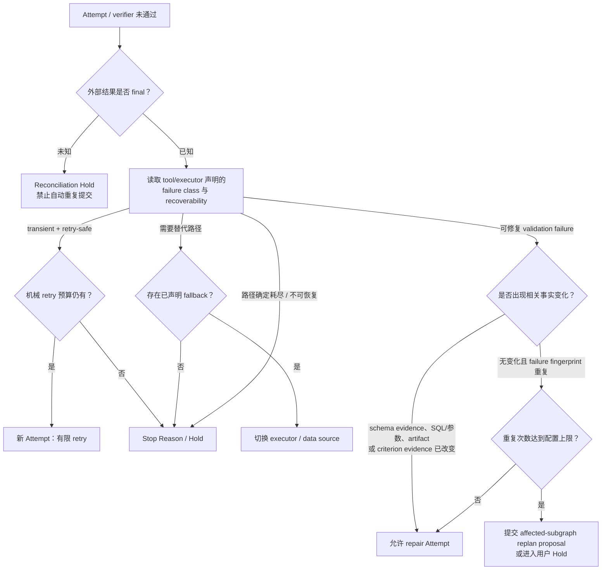
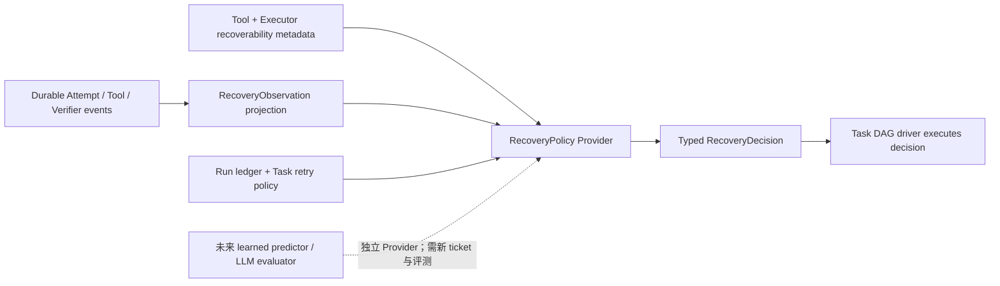

# 2026 年下半年 LLM Agent 无进展、恢复与停止研究

日期：2026-09-14

## 研究问题与范围

本笔记调研 2026-07-01 至 2026-09-14 首次公开的一手研究，关注 LLM agent 与 agentic software engineering 中的无进展识别、重复循环、无效重试、停止、预算分配、恢复、重规划和轨迹评估。来源限定为 arXiv/OpenReview/正式论文页面及作者公开的官方代码或数据；表中日期均按 arXiv 首次提交时间核验，而不是最新修订时间。没有纳入 2026-09-14 之后首次公开的论文。

研究停止在能够直接回答 G19 第一版设计的高相关文献，不继续扩展一般 agent 规划、自我进化或 benchmark 文献。部分论文研究的是评测提前终止、临床诊断或 GUI/coding agent，而不是生产 data-agent；这些结论只在相同机制成立时转译，不直接宣称跨领域普适。

## 结论先行

截至 2026-09-14，没有被核验的论文证明一个通用的“无进展分数”能够在不同模型、工具、任务和运行环境中可靠区分“再试一次会恢复”与“继续只会浪费计算”。最强的直接证据支持较窄的机制：依据可观察失败类型选择 retry、switch 或 abstain；把失败反馈绑定到当前状态并提供可执行替代项；识别完全相同的动作与结果重复；为重试设置硬预算；保护已经验证的正确状态；对外部结果未知的操作先 reconciliation，而不是按普通失败重试。

第一版 DSH 的最高 ROI 不是新建一个每轮调用 LLM 的通用 progress evaluator，也不是实现复杂的全局 Progress Vector。更合适的是一个确定性的 `RecoveryPolicy`：使用现有 Task、Attempt、tool result、verifier verdict、OutputRef/EvidenceRef、revision 和预算事件，计算失败指纹与“相关事实是否改变”，再按工具声明的 recoverability 选择有限 retry、切换已声明 fallback、提交 repair/replan proposal，或进入 Hold。该机制无需额外模型调用，能直接覆盖重复 `TABLE_NOT_FOUND`、未改变 SQL 的 verifier rejection、MaxCompute transient/unknown outcome 和报告只改措辞不改证据等高频场景。

论文也明确警告两个对称错误。过晚停止会浪费 token、查询次数和 wall time；过早停止会截断可恢复路径，或把尚未 final 的外部作业误判为失败。第一版应把“停止自动重试”与“把 Task 判定为最终失败”分开：前者可以由保守机械规则触发，后者需要可验证终态、明确 exhausted alternatives，或用户/策略决定。

## 论文表

| 论文 | 首次公开时间（UTC） | 实验对象与规模 | 与无进展的直接关系 | 额外推理成本 | 本笔记判断 |
|---|---|---|---|---|---|
| [Structured Feedback Improves Repair in an LLM Agent Loop, arXiv:2607.14167v1](https://arxiv.org/abs/2607.14167v1) | 2026-07-15 06:14:45 | 50 个 TextWorld 游戏、两个量化模型、四次调用上限；另有 15 个 HumanEval 小样本检查 | 外部 validator 拒绝后，包含失败位置、观察值和可接受替代项的反馈显著提高有限预算内 repair；仅返回原始错误或只给位置与观察值不足 | 没有独立 evaluator 调用；使用同一 generation call budget | **高相关，高 ROI**；支持结构化 failure facts 与 admissible alternatives |
| [Looping Is Not Reliability, arXiv:2607.24604v1](https://arxiv.org/abs/2607.24604v1) | 2026-07-27 16:05:23 | 30 个 HumanEval repair、5 seeds、900 条三次 revision 轨迹；两个 common-state 研究共 2,430 branches；24 个 repository bugs | 强迫继续 revision 会破坏已正确状态；stale trace 会显著提高 correct-start regression；要求 evidence 与准确代码状态绑定并保护已验证 checkpoint | 主要是已有 verifier/revision 成本；严格 admission 会损失部分可修复案例 | **高相关，高 ROI**；支持“已验证状态是吸收点”和 state-bound evidence |
| [Try Again, Don't Look Back, arXiv:2607.26117v1](https://arxiv.org/abs/2607.26117v1) | 2026-07-28 16:58:27 | MBPP+、1.5B/3B/7B 小型代码模型、matched-budget placebo 对照 | 把失败输出再次喂给模型可能产生 anchoring；相同或近同输出是 futility 信号，但“有反馈”不自动优于一次新采样 | self-repair 消耗 blind resampling 的 2.5–5.5 倍 token | **高相关但领域受限**；支持比较“重试本身”与“反馈价值” |
| [Rethinking Inference-Time Scaling in Local Computer-Use Agents, arXiv:2607.28573v1](https://arxiv.org/abs/2607.28573v1) | 2026-07-30 17:36:36 | OSWorld 361 个任务，4 个本地视觉模型，多种 context/step/parallel 配置 | 增加历史可减少重复 loop 和 max-step stall，但继续增加上下文或步骤会饱和，并把失败转移为 premature false success | 更长 history、更多 step 和并行 plan 都增加 token；并行收益次线性 | **高相关**；支持有限预算和 failure-mode accounting，不支持“给更多步就会恢复” |
| [TRAJDEBUG, arXiv:2608.06346v1](https://arxiv.org/abs/2608.06346v1)；[官方代码](https://github.com/THU-KEG/TrajDebug) | 2026-08-06 17:51:20 | TrajErrBench 486 条人工标注失败轨迹；跨 7 个数据子集评估；另做 repair 应用实验 | 追踪错误是否已被解决及其 terminal impact，比只看局部错误更接近“失败前提是否仍存在”；诊断可改善后续 repair | 完整方法约为 direct prompting 的 40 倍 token；精确关键步定位整体仅 41.8% micro accuracy | **方法上相关，第一版低 ROI**；不宜作为自动停止 authority |
| [Retry, Switch, or Abstain?, arXiv:2608.11977v1](https://arxiv.org/abs/2608.11977v1) | 2026-08-12 12:08:39 | 7 个模型、4 个模型家族、两个多轮 benchmark 家族；402 个 held-out Retail tasks；9 类工具故障 | 将失败按“retry 可恢复、必须 switch、路径耗尽应 abstain”显式建模；无差别 persistence 会把环境运气误当恢复能力 | 恢复策略把 injected-failure token 从约 67–70K 提高到 108–123K | **最高相关**；直接支持 failure-class recovery policy 与 exhausted-path stop |
| [When Is an Agent Evaluation Over?, arXiv:2608.14940v3](https://arxiv.org/abs/2608.14940v3) | v1：2026-08-14 23:39:47；本笔记读取 v3：2026-08-27 12:26:05 | 形式化 outcome finality、pending effects 与 cross-unit separation；不是 agent recovery benchmark | Agent 停止输出不等于外部 effect 已定案；未知 MaxCompute/写入结果不能被当作普通失败后自动重试 | 不引入 LLM 调用；要求额外终态与清理证据 | **必要安全约束**；支持 `unknown → reconciliation Hold` |
| [Same Model, Different Harness, arXiv:2608.26218v1](https://arxiv.org/abs/2608.26218v1)；[官方代码](https://github.com/sydches/yuj) | 2026-08-26 11:55:44 | 3 个 coding benchmarks；tight-window Verified 为 169 tasks、20,480-token window、480 秒 endpoint；4 种模型设计 | 固定规则检测重复失败命令、相同错误和重复读取无编辑，并注入“换一种动作”的提示；显示 harness 能改变恢复结果 | detector 本身无模型调用；完整 treatment 同时包含 context shortening 和 command safeguards | **高相关但有混杂**；支持便宜机械 detector，不能量化 detector 单独贡献 |
| [EarlyEval, arXiv:2609.02783v1](https://arxiv.org/abs/2609.02783v1)；[官方代码](https://github.com/inphotoo/earlyeval) | 2026-09-02 16:15:18 | SWE-bench Verified、TerminalBench、Toolathlon；leave-one-agent-out | 从部分轨迹预测最终成功或失败，直接测量早停准确率、覆盖和节省量 | 每 step 为 LightGBM，论文称开销可忽略；但需要历史完整轨迹训练与校准 | **中相关，后续候选**；是 evaluation early stop，不是生产任务终止证明 |
| [DAREBench, arXiv:2609.06059v1](https://arxiv.org/abs/2609.06059v1)；[官方代码](https://github.com/SeerRay-Lab/DAREBench) | 2026-09-05 12:36:59 | 313 个任务、35 个模型、7,587 个 task-model evaluations；轨迹、artifact 与多类 scorer | 将 deadlock loop、失败的路径规划/协议遵守、伪工具调用和 timeout-with-credit 作为可观察失败模式；说明 final answer 不能替代过程证据 | LLM judge/hybrid 仍需 meta-judge；deterministic pre-filter 可先降低审计范围 | **相关于观测与评测**；不提供在线 stopping policy |
| [Safe to Stop?, arXiv:2609.09678v1](https://arxiv.org/abs/2609.09678v1) | 2026-09-09 03:46:53 | 1,834 个 MIMIC-derived 顺序诊断 episodes；state-wise ranker 与有限样本 risk/coverage tests | 最直接研究 false-stop 与 wasted-compute 权衡；显示继续执行并不单调改善结果 | ranker 是额外模型/特征层，但不是每步调用生成式 LLM；需要标注 calibration split | **方法学强、迁移性弱**；适合作为未来校准方法，不宜直接移植临床阈值 |
| [VRL-Bench, arXiv:2609.12404v1](https://arxiv.org/abs/2609.12404v1) | 2026-09-11 03:54:02 | 3 个模型，MiniWoB 与 WebShop，最多 6 个完整 trials | 失败记忆并非总能提升 recovery；相同完整 action sequence 的 retry 在观察中 0 次恢复；VEX² 用模型分配剩余 trial budget | VEX² 在每个 eligible failure 后增加 scheduler LLM call；资源账本显示不同策略 token 差异显著 | **高相关但 VEX² 第一版低 ROI**；支持记录变化与 finite-trial baseline |
| [ParaRecover, arXiv:2609.12345v1](https://arxiv.org/abs/2609.12345v1)；[官方代码](https://github.com/gbw206/ParaRecover) | 2026-09-11 02:09:33 | 10,626 instances、14 种错误、两级难度、十余个模型 | 高 Pass@1 可与较低的结构完整性、诊断和恢复效率并存；并行 DAG 需要单独检查依赖、失败定位和 recovery closure | SDE rubric 使用 LLM-as-judge；执行上限 40 rounds 来自 preliminary observation | **相关于评测 schema**；不应把 40 rounds 当 DSH 通用阈值 |
| [What Drives Recovery in Agentic Text-to-Cypher?, arXiv:2609.12746v1](https://arxiv.org/abs/2609.12746v1) | 2026-09-11 11:47:42 | 2,471 live-database queries、6 个 backbones、13,563 个执行结果 | 最贴近 data-agent：execution-grounded failure detection 和 bounded retry 是主要收益来源；复杂反馈生成与并行采样未显示相称收益 | 首次成功仍只需一次 LLM call；parser/execution 为零 LLM；LLM 合成反馈相对 raw DB error 的边际收益很小 | **最高相关、最高 ROI**；支持先实现确定性 detector/router |

## 最强实证发现

### 1. 重试是否值得，取决于失败是否可恢复，而不是取决于“已经失败过”

`Retry, Switch, or Abstain?` 将环境人为控制为三类：原路径经过有限重试可恢复、原路径永久失效但存在替代工具、所有路径耗尽。7 个模型在 10 个模型—数据子集组合中的 69/70 个组合都因工具故障下降；在 402 个 held-out Retail tasks 上，结构化 recovery context 将 4B 模型的 injected pass rate 从 20.1% 提高到 36.9%（无替代工具）以及从 31.9% 提高到 43.6%（有替代工具）。但恢复增加了 token：完整表中 injected 条件从 base 的约 67–70K 增至 BTM/RL+BTM 的 108–123K。论文对 correct abstention 的 reward 与 held-out impossible-task metric 仍不完整，因此它强力支持“区分 retry/switch/exhausted”，但没有证明一个成熟的自动停止器。

对 data-agent 的直接含义是：MaxCompute `503`、短暂连接失败和 executor busy 可以进入 bounded retry；`TABLE_NOT_FOUND` 在 schema 未刷新时不应盲重试，而应先 schema discovery 或切换已声明数据源；权限永久缺失且没有替代 provider 时应 Hold/abstain。失败类和可用 fallback 应来自 tool/executor contribution，而不是由通用 driver 猜测。

### 2. 对结构化查询，检测与路由的 ROI 高于额外“聪明反馈”或平行采样

LAST-CQ 在 2,471 个 live-database Text-to-Cypher 查询和 6 个 backbones 上，对 single-pass failures 的每模型平均恢复率为 91.7%，pooled recovery 为 1,799/1,917，即 93.8%。更重要的是反事实：把 schema-grounded、LLM 生成的 correction hint 换成 raw Neo4j error，exact match 为 20.9% 对 19.9%，端到端差异小于 0.2%，在 214 个保留 payload 的 paired subset 上只能证明 ±0.075 set-F1 内等价；用相同调用预算做 Best-of-3 则比单次生成下降 10.8% 和 11.4%。论文因此把主要收益定位到 failure detection、routing 和 bounded correction，而不是昂贵反馈生成。

`Structured Feedback Improves Repair` 并不与此矛盾。它在 TextWorld 中发现，validator 若已知失败位置、观察值和 admissible alternatives，把这些事实交给下一次调用能将四-call terminal success 从 14/50 提升到 36/50，以及从 8/50 提升到 29/50；仅提供位置与观察值仍接近 raw diagnostic。两篇论文共同支持的不是“总要调用 LLM 写反馈”，而是：**Host 已经拥有可执行替代项时应结构化暴露；数据库错误本身已足够具体时，不要再花一次模型调用润色错误。**

对 data-agent，`TABLE_NOT_FOUND` 的高 ROI 反馈应是当前 project、实际 schema lookup 结果、失败表名和候选表，而不是长篇反思。`FIELD_NOT_FOUND` 应给出真实字段候选。若 schema discovery 没有得到新事实、SQL digest 未变且错误类别相同，再跑一次不构成 progress。

### 3. 更多步骤、更多上下文或更多 revision 不保证恢复，可能只改变失败形式

本地 computer-use agent 研究在 361 个 OSWorld 任务上发现，history 从 0 增至 1 时平均准确率约从 18% 增至 25% 以上，Qwen3-VL-30B-A3B 在 `H=4` 达到观察到的最佳 28.56%，但 `H=8` 降至 27.16%；把最大步骤从 15 增至 100，max-step stalls 减少，却没有显著提升任务成功，失败转向 premature false success，并持续增加 steps 与 prompt tokens。该研究说明“没撞到 step limit”不等于有进展。

`Looping Is Not Reliability` 更直接展示 forced revision 的风险：900 条 HumanEval 三-revision 轨迹中，current correctness 从第一次 revision 后的 0.820 降至第二次后的 0.673，尽管 ever-correct 上升到 0.847；在预注册的 14B common-state replication 中，stale traces 对 135 个 correct starts 造成 34 次伤害，而 current traces 仅 4 次，增加 22.2 个百分点。一个 prospective policy 消除了观察到的 correct-start harm，却减少了 wrong-start repair，并未通过联合标准。这支持把“已验证正确状态”视为需保护的 checkpoint，而不是为了消耗剩余预算继续修改。

`Try Again, Don't Look Back` 在小型代码模型上进一步表明，看到自己的失败尝试会导致 33%–68% 的近重复代码，而 blind resampling 只有 2%–14%；blind resampling 在 1.5B/3B 最强，在 7B 与最佳方法统计持平，同时少用 2.5–5.5 倍 token。该结论不应直接外推到 SQL，但它证明“附带上一轮完整失败内容”本身可能制造 anchoring，所以 DSH 不应把完整旧轨迹默认注入每个 repair Attempt。

### 4. “动作或证据有没有变化”比“模型是否说自己换了方法”更可靠

VRL-Bench 在 matched finite-trial budgets 下发现，既有 verbal-memory 方法没有一种在 6 个模型—环境设置中都优于 memory-free retry；同一方法会随模型改变方向。对 AlfWorld 与 HotPotQA 的 replay 分析中，完全相同的 normalized task-action sequence 分别在 0/304 和 0/157 个 episodes 中恢复；改变 sequence 是所有观察到恢复的必要条件，但不是充分条件，改变后的恢复率仍只有 19.5% 和 6.0%。VEX² 的 LLM scheduler 在 6 个设置中都得到正的 retry-relative point estimate，但每个 eligible failure 都需要额外 scheduler call，而且部分置信区间跨零。

这直接支持一个便宜的 V1 事实：**相同输入、相同关键 action、相同 executor、相同结果类别的重复，不应被“新措辞”或新的 Attempt 编号伪装成进展。** 但也不能把“动作改变”直接视为有进展；它只说明不再是完全重复。data-agent 应要求新增 schema evidence、改变 SQL/参数 digest、切换 provider、解除 blocker、产生新的 accepted OutputRef，或满足新的 criterion，才能重置 no-progress 计数。

### 5. 语义 evaluator 能改善诊断，但当前证据不支持把它设为第一版自动停止 authority

TRAJDEBUG 通过多粒度压缩、错误状态追踪和 terminal impact attribution，在 failed trajectories 上优于直接整体 prompting，并使 downstream repair 成功率在 Airline、Retail、SWE-Bench 子集分别从初始 78.00/84.21/72.00 提升到 90.00/95.61/81.00；在更现实的 failure-memory transfer 中也有增益。但其精确关键步定位总体只有 41.8% micro accuracy，ground-truth trigger 有 58% 未进入候选集，完整方法平均约 1.38M token/trajectory，是 direct prompting 的约 40 倍。它说明语义诊断可能有用，也说明漏掉真正 failure trigger 是主要风险。

Safe to Stop? 给出了更严格的 false-stop/coverage 方法：在 1,834 个顺序诊断 episodes 上，full ranker 的 state-error AUROC 为 0.853，高于 maximum class probability 的 0.715 和 backbone native stop score 的 0.552；在已被查看过的 367-episode evaluation split 上，CROS-Mix 的 selective error 为 16.9%、coverage 78.8%、cost 5.57、tests 0.68，对比 native stopping 的 30.8%、100%、8.14、1.53。但 forced continuation 的错误率从仅 HPI 时的 28.3% 上升到完整检查后的 34.3%，而 joint criterion 在 20 个 development resplits 中只 nominally 通过 6 次；作者明确把结果限定为 exploratory feasibility，不是安全证书。

EarlyEval 使用两套 LightGBM success/failure classifier，在三个 agent benchmarks 上节省 13%–26% steps、最多 44.1% input tokens 和 29.4% output tokens，预测准确率 89%–97%，平均 resolve-rate 偏移约 1–2 个百分点。它证明有标注历史时，便宜的非 LLM early predictor 可以产生可观 savings；但它预测的是 benchmark 最终标签，并依赖同 benchmark 的历史完整 trajectories、calibrated thresholds 和 leave-one-agent-out 训练，不证明能安全终止生产数据任务。

因此，第一版新增一个通用 LLM progress evaluator 的 ROI 很低：它增加独立推理调用、需要新的 evaluator registry/dispatch/persistence/failure path，还没有跨 data-agent 任务的 calibrated false-stop 证据。若未来积累足够 Task/Attempt 轨迹，优先研究轻量监督 predictor，而不是先部署每轮 LLM judge。

### 6. pending 或不可观察的 effect 不能被当作无进展

Outcome Finality 区分“agent 已停止产生动作”和“相关 outcome 已经 final”。MaxCompute submission 超时可能对应两种无法从本地状态区分的现实：作业根本未被接收，或作业已运行但 receipt 尚未持久化。此时自动重试可能重复消费，数据写入则可能重复产生副作用。正确状态是 `unknown` 或 `reconciling`，不是普通 `failed/no_progress`。

Interface-Induced Trajectory Censoring 进一步说明，serving template/parser 可能让合法 tool call 在 scorer 可见轨迹中消失。虽然该论文不是停止研究，但它对 detector 有直接约束：失败指纹必须区分 raw model emission、parsed action、dispatch、provider acknowledgement 和 returned observation。仅看到“没有 tool result”不能推出模型没有尝试或执行没有发生。

### 7. final success 不能替代过程效率和恢复质量

ParaRecover 构建 10,626 个并行工具使用实例和 14 类错误。主流模型在其两级任务上的 Pass@1 多为约 89%–95%，但 Structural Integrity、Diagnostic Reasoning 和 Evolutionary Strategy 的平均分明显更低，例如 GPT-4o-mini 在 LEVEL-2 的平均 SDE 为 36.90，而 Pass@1 为 88.84；DeepSeek-V4-flash 在 LEVEL-2 为 66.36 对 93.17。论文还将实际执行 round 相对 ground-truth round 的偏离作为效率指标。它使用 40 rounds 上限，因为 preliminary experiments 观察到超过 40 rounds 常对应理解偏差或无限循环，但没有发表 false-stop/false-continue 曲线，因此不能把 40 直接采用为 DSH 阈值。

DAREBench 同样把 deadlock loop、路径规划/协议遵守失败、伪工具调用和 timeout-with-credit 放入轨迹审计，并指出只看最终文字会高估执行完成。两者支持 DSH 同时记录 terminal outcome 和 process facts，但不支持在第一版构建复杂的统一“progress 分数”。

## 对 DSH 第一版的 ROI 评估

### 值得第一版实现：确定性的 failure-class RecoveryPolicy

这是一个独立可行的策略，不依赖语义 evaluator。它只消费已有或本次规划本就需要的 durable facts：

- `TaskId`、`taskRevision`、`ExecutionAttemptId`和 `claimGeneration`；
- tool/executor kind 与请求 digest；
- parsed action、dispatch acknowledgement、native job ID 和 observation；
- failure class 与 retry safety；
- SQL、参数、输入、OutputRef、EvidenceRef 和 artifact digest；
- verifier criterion 与 verdict；
- retry、repair、replan 和查询预算。



该方案的用户收益直接：减少相同 SQL 和相同 verifier rejection 的重复成本；避免把 transient 503 与永久 schema mismatch 混为一类；不会为每次失败增加一个 LLM judge；用户仍可在 Hold 后决定继续、换源、加预算或终止。

实现成本可控：它要求 typed failure classification、canonical request/result digest、retry-safety metadata 和少量状态投影，不要求训练数据、在线模型校准、跨 Task 全局评分或新的通用优化器。这些字段也能被以后更高级的 evaluator 复用，因此不是一次性建设。

### 可作为 V1 安全兜底：固定硬上限

固定 `maxAttempts`、`maxMechanicalRetries`、`maxRepairs`和 `maxReplans`仍应存在，但只作为预算与 liveness 保险丝，不负责判断是否正在进展。论文一致表明相同次数对不同模型、任务和失败类型的含义不同；因此阈值应是可配置 policy，而不是 Task DAG 内的硬编码常量。

### 暂缓：通用 Semantic Progress Evaluator

收益可能存在，尤其是“报告结论是否真正回应 verifier rejection”这类开放语义问题；但 TRAJDEBUG 的诊断准确率、候选漏检和约 40 倍 token 成本显示它还不适合成为自动 stop/continue authority。第一版可让 verifier 返回结构化 rejection code 和 evidence gaps，由 orchestrator 在正常 repair/replan turn 中处理，不新增每次失败必调的 evaluator。

### 暂缓：学习式 Early Stop Predictor

EarlyEval 展示了 13%–26% step savings 的潜力，且在线开销低；但是训练和校准需要 DSH 自己的历史轨迹、稳定标签、模型/版本分层与风险加权 false-stop 评估。第一版应先记录足够的 route、failure fingerprint、最终结果和 wasted-compute 数据。达到样本与稳定性门槛后，再开独立 ticket 评估是否部署 predictor；数据积累不得自动启用。

### 暂缓：LLM 驱动的 trial-budget scheduler

VEX² 是可行的研究方向，但每个 eligible failure 增加 scheduler LLM call，且收益依赖模型和环境；对 DSH 第一版，它会引入新的模型角色、prompt、持久 verdict、失败恢复和预算维度。先用明确 failure class 和 fallback graph 获得大部分低成本收益，再以真实 data-agent replay 对比 scheduler 是否值得。

### 暂缓：训练时 adaptive rollout 与 RL recovery

PivoARL、IGRPO 以及 `Retry, Switch, or Abstain?` 的 RL 部分主要改变训练或 rollout collection。它们证明局部 rollback、信息增益分配和策略学习可能减少完整重跑，但 DSH Task DAG 第一版是运行时 orchestration，不应为此引入训练基础设施。可以保留数据字段，使未来训练能读取 pivotal step、failure class、recovery path 和 consumed budget。

### 暂缓：持久化全局 Progress Vector

论文支持记录多种过程信号，却没有验证一组跨领域加权后的统一向量能够稳定决定停止。第一版若增加 `completedTasks`、`readyTasks`、`acceptedOutputs`、`repeatedFailureCount`等全局向量，还需要定义权重、重置规则、跨并行分支聚合和 false-stop 评测，实施成本高且用户收益不明确。当前只需保留可审计原子事实和 scoped counters；未来 predictor 可以从事件重建特征。

## 第一版建议的具体判定

以下是从论文证据推导出的 DSH 设计建议；它们是工程推论，不是任一论文直接证明的完整算法。

| data-agent 场景 | 算作进展 | 不算进展 | 第一版动作 |
|---|---|---|---|
| 重复 `TABLE_NOT_FOUND` | schema discovery 返回新表或确认不同 project；SQL 引用表发生变化 | 同 project、同 SQL digest、同错误再次出现；只改自然语言解释 | 首次进入 schema repair；相同 fingerprint 达到配置上限后停止自动 retry，提交 replan/clarification Hold |
| MaxCompute transient failure | provider 明确返回 retryable class；新 attempt 获得提交 receipt 或 job ID | 在无新 provider observation 下重复提交 | 按 adapter 声明有限机械 retry；每次已接受提交计入预算 |
| MaxCompute submission outcome unknown | reconciliation 得到 job existence、terminal status 或可验证 cancellation | 本地超时后直接把它当 failed 并重试 | `unknown → Reconciliation Hold`；结果定案前禁止自动重复写入或昂贵查询 |
| verifier 拒绝 SQL | SQL/参数 digest 改变；新增 schema/lineage evidence；修复被拒 criterion | SQL 未变；只更换解释文字；再次提交同一 OutputRef | 新事实允许 repair；等价 fingerprint 递增 no-progress counter |
| 数据质量检查 | 新增 rule result、row-count comparison、freshness/uniqueness evidence | 重跑相同检查得到同一 failure 且上游数据版本未变 | 若上游数据未变，停止重复检查并定位生产者 Task 或请求人工处理 |
| 报告 repair | 引用数据、统计口径、artifact digest 或被拒段落的事实基础发生变化 | 只把“提升 20%”改成“明显提升”，仍引用同一冲突口径 | 不认可 completion；提交 targeted repair 或 affected-subgraph replan |
| 已 verified 产物 | 依赖或 acceptance criterion 发生实质 revision，要求重新验证 | 为使用剩余预算而继续润色或重算 | 默认保护 checkpoint；无相关 revision 不再自动修改 |

## 第一版建议记录的最小事实

```ts
interface RecoveryObservation {
  taskId: TaskId
  taskRevision: number
  attemptId: ExecutionAttemptId
  executorKind: ExecutorKind
  operationKind: string
  requestDigest: string
  outcomeClass: string
  resultDigest?: string
  externalBindingId?: string
  finality: 'final' | 'pending' | 'unknown'
  retrySafety: 'safe' | 'idempotent' | 'unsafe' | 'unknown'
  evidenceRefsAdded: EvidenceRefId[]
  outputRefsAdded: OutputRefId[]
}
```

```ts
interface RecoveryDecision {
  action: 'retry' | 'switch' | 'repair' | 'replan-proposal' | 'hold'
  reasonCode: string
  matchedPriorFingerprint?: string
  remainingBudget: BudgetVector
  policyVersion: number
}
```

不建议第一版增加自由文本 `progressScore`。若需要 UI 展示，可由确定性事实派生“重复失败”“发现新 schema”“已切换数据源”“等待外部结果”等状态。

## 需要本地评测而不能从论文继承的参数

论文没有给出适用于 DSH data-agent 的统一重复阈值、retry 次数或 stop confidence。以下参数必须通过本仓 keyless recorded-session snapshots 和后续真实回放确定：

- 同一 failure fingerprint 允许出现几次；
- `503`、timeout、rate limit 的 backoff 与最大重试；
- schema discovery 后允许几次 SQL repair；
- verifier rejection 后何种 evidence delta 足以重新尝试；
- 何时从 Task-local repair 升级为 affected-subgraph replan；
- 何时从 replan proposal 升级为用户 Hold；
- query、token、wall-time 与 verifier cost 的风险权重；
- false-stop 与 wasted-compute 的产品权重。

评测至少分别报告：可恢复案例被提前停止的比例、不可恢复案例浪费的额外查询/模型调用、最终 Task success、总 token、query submissions、wall time、unknown external effects、用户解除 Hold 的比例。总体 accuracy 不能替代这些风险分层指标。

## 被拒绝或仅作背景的论文方向

- [Information Gain-based Rollout Policy Optimization, arXiv:2607.06223v1](https://arxiv.org/abs/2607.06223v1) 与 [Agent Reinforcement Learning via Pivotal-Aware Self-Feedback Retry, arXiv:2607.03702v1](https://arxiv.org/abs/2607.03702v1) 主要优化训练时 rollout 或训练后的策略；它们与“把预算放在有信息的分支”“从关键错误点局部重试”概念相关，但不提供可直接部署到 DSH runtime 的 calibrated stop detector，因此不作为第一版设计依据。
- [Predicting Task Difficulty Without Rollouts, arXiv:2608.05797v1](https://arxiv.org/abs/2608.05797v1) 预测执行前难度而不是执行中的无进展；其 held-out-benchmark rank correlation 仍有限，不能替代运行时失败事实。
- [Guardrailed Meta-Agent Loops, arXiv:2609.12216v1](https://arxiv.org/abs/2609.12216v1) 在单一确定性 simulator 中验证预算、policy pinning 和 crash recovery；240 次 crash injection 都恢复目标 outcome，但其中 30 次 pre-commit crash 重复 planner call。它支持“outcome recovery 不等于 exactly-once”，但不测真实 agent 的 progress 判定，因此只作为 crash/retry guardrail。
- HarnessDev、AgentCompass、Harbor Adapters 和 Evaluation Context Protocol 说明 harness、adapter、trace 与预算是正式评测对象，但不提供“何时继续当前 Task”的实证 stopping rule，不纳入核心证据表。
- 纯 final-answer benchmark、只报告平均 Pass@k 而不比较 matched retry budget、没有失败过程或成本数据的论文被排除；它们无法区分恢复能力、额外抽样和运气。

## 对 G19 的建议

G19 不应在第一版建设通用 semantic no-progress evaluator。应定义一个小而明确的 `RecoveryPolicy` seam，策略输入是 durable failure observations 与 tool/executor metadata，输出是 `retry | switch | repair | replan-proposal | hold`。默认 provider 可以是确定性规则；未来学习式 predictor 或 LLM evaluator 若有本地证据，再作为可替换 Provider 接入，而不是修改 Task DAG driver。



该 seam 不需要第一版定义通用 progress scalar。它只需要让新增工具和 executor 声明失败类别、retry safety、fallback、reconciliation 和可观察 finality；新增 data-agent 模式可以提供自己的 criterion-specific repair policy，但不能成为第二个 outer-loop owner。

## 来源与版本核验

- [Structured Feedback Improves Repair in an LLM Agent Loop v1](https://arxiv.org/abs/2607.14167v1)
- [Looping Is Not Reliability v1](https://arxiv.org/abs/2607.24604v1)
- [Try Again, Don't Look Back v1](https://arxiv.org/abs/2607.26117v1)
- [Rethinking Inference-Time Scaling in Local Computer-Use Agents v1](https://arxiv.org/abs/2607.28573v1)
- [TRAJDEBUG v1](https://arxiv.org/abs/2608.06346v1)
- [Retry, Switch, or Abstain? v1](https://arxiv.org/abs/2608.11977v1)
- [Outcome Finality v3](https://arxiv.org/abs/2608.14940v3)
- [Same Model, Different Harness v1](https://arxiv.org/abs/2608.26218v1)
- [EarlyEval v1](https://arxiv.org/abs/2609.02783v1)
- [Interface-Induced Trajectory Censoring v1](https://arxiv.org/abs/2609.03966v1)
- [DAREBench v1](https://arxiv.org/abs/2609.06059v1)
- [Safe to Stop? v1](https://arxiv.org/abs/2609.09678v1)
- [ParaRecover v1](https://arxiv.org/abs/2609.12345v1)
- [VRL-Bench v1](https://arxiv.org/abs/2609.12404v1)
- [What Drives Recovery in Agentic Text-to-Cypher? v1](https://arxiv.org/abs/2609.12746v1)
