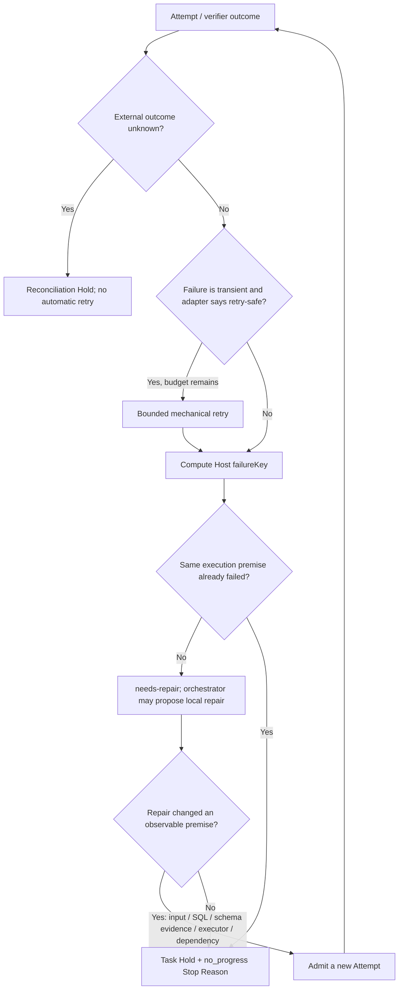

# G19 — No-progress detection ROI synthesis

**Decision cutoff:** 2026-09-14

## Evidence base

This synthesis combines:

- [2026 H2 no-progress, recovery, and stopping papers](G19-no-progress-papers-2026h2.md)
- [Frontier Agent implementations and current DSH mechanisms](G19-no-progress-agent-frontier.md)

The research found no production-ready, domain-general progress scalar or semantic judge that reliably separates recoverable work from futile continuation across models, tools, and environments. The strongest data-agent evidence favors narrow failure classification, bounded retry, structured validator feedback, state-bound evidence, and explicit handling of unknown external outcomes.

## ROI criteria

Each candidate is judged against:

1. user-visible reduction in wasted queries, tokens, and latency;
2. false-stop risk on recoverable analysis;
3. implementation and test surface;
4. runtime/model-call overhead;
5. maintenance and model-version calibration burden;
6. reuse of existing DSH events, guards, budgets, and verifier facts;
7. value across SQL analysis, data engineering, report generation, and other executors.

## Independent candidate assessment

| Strategy | User benefit | False-stop risk | Implementation / maintenance | Runtime cost | Evidence strength | V1 ROI |
|---|---|---|---|---|---|---|
| Hard ceilings only | Prevents infinite work but stops both improving and futile runs at the same limit | Medium | Low | Zero extra model calls | Strong as a liveness guard, weak as progress detection | Useful baseline, insufficient alone |
| Structured failure-key bounded escalation | Stops repeated equivalent failures, routes retry-safe faults, and requires observable premise change before further repair | Low when matching stays conservative | Low–medium | Zero extra model calls | Strongest direct support for data/query workloads and current Agent practice | **Highest** |
| Per-failure semantic LLM progress judge | Can inspect open-ended trajectories and prose repairs | High unless independently calibrated | High: prompt, model route, durable verdict, recovery, eval | One or more extra model calls per eligible failure | Mixed; current work reports substantial cost and important misclassification | Low for V1 |
| Learned early-stop predictor | Potentially saves steps after local training | Unknown until DSH-specific data and labels exist | High: dataset, training/calibration, versioning, monitoring | Low online after training | Promising but non-transferable without local history | Deferred |
| Persistent global Progress Vector | Offers one cross-Task score for UI/policy | High because weights and resets are unvalidated | High event/projection and parallel aggregation complexity | Low compute, high design burden | No validated universal weighting found | Deferred |

The selected strategy is not an `A + B = C` compromise. **Structured failure-key bounded escalation** is a complete first-release policy. Existing hard budgets remain independent safety invariants already required by the Run budget decision; they are not a second progress detector mixed into this policy.

## First-release policy

### Minimal facts

Adapters and verifiers submit structured failure observations:

```ts
interface AttemptFailureObservation {
  attemptId: ExecutionAttemptId
  taskId: TaskId
  taskRevision: number
  executorKind: ExecutorKind
  failureClass: string
  retrySafety: 'safe' | 'idempotent' | 'unsafe' | 'unknown'
  inputDigest: string
  targetDigest?: string
  externalEffectId?: ExternalEffectId
  evidenceRefs: EvidenceRefId[]
}
```

The Host computes a `failureKey` from execution-relevant facts such as executor, normalized failure class, canonical input/SQL digest, target scope, and external-effect identity. Cosmetic Task prose or a newly minted Attempt id does not change the key. `taskRevision` remains an authority fence but is not by itself proof that the failed premise changed.

### Recovery rules



1. `unknown` is reconciliation, never ordinary no-progress or automatic retry.
2. Only an adapter-declared transient, retry-safe failure may use the mechanical retry budget.
3. A non-retryable first failure moves the Task to `needs-repair` rather than launching a semantic judge.
4. Repair must change an observable execution premise: canonical input/SQL digest, target, executor, relevant schema/evidence, dependency output, approval, or reconciled external state.
5. Repeating an already failed execution premise stops automatic continuation and records a Task-scoped `no_progress` Hold.
6. The main orchestrator may submit a substantive Task or affected-subgraph Plan patch under the already accepted risk-tiered mutation policy. Merely changing prose, Attempt identity, or revision does not reset the failure key.
7. `repeat-tool-reminder` remains advisory inside a turn; phase-gate keeps its local budgets; neither becomes a second Task completion or stop authority.

### No new public seam in V1

The research papers suggest a replaceable `RecoveryPolicy`, but the repository's deep-module rule says one adapter is a hypothetical seam. The first release therefore keeps the policy as a pure, typed internal module behind the outer-loop driver's existing interface:

```ts
resolveRecovery(observation, priorFacts, budget): RecoveryDecision
```

Its interface is the test surface and returns a closed decision such as `mechanical-retry`, `needs-repair`, `reconciliation-hold`, or `no-progress-hold`. Extraction into a public Service Definition / Provider / Consumer seam waits until a second independently evolving policy exists.

## Expected ROI

| Cost / benefit | V1 effect |
|---|---|
| Extra LLM calls | 0 |
| New training/calibration | 0 |
| New public capability seam | 0 |
| New durable facts | Structured failure observation, repeated-premise counter, recovery decision, Stop Reason |
| Adapter work | Normalize failure class, retry safety, target/input digest, unknown finality |
| Main user benefit | Stops repeated equivalent SQL/tool/verifier failures before further query/token spend |
| Main residual risk | Semantically equivalent but syntactically different SQL may evade detection |
| Risk response | Prefer false negatives over false positives; do not add semantic equivalence in V1 |

The policy is intentionally conservative: it catches provable repeated failure and leaves harder semantic equivalence to later evidence. This keeps current implementation and runtime cost proportional to expected savings.

## Deferred mechanisms and owners

- General semantic progress judge, model-based cycle diagnosis, dynamic trial-budget allocation, learned early stopping, cross-Task cycle detection, semantic SQL/Task equivalence, and multi-Attempt selection belong to [Advanced routing, parallelism, and optimization](../tickets/G24-advanced-routing-and-parallelism.md). Their trigger is replay evidence that deterministic failure keys leave material wasted compute or false stops.
- A persistent cross-Run Progress Vector or reusable recovery-policy provider family belongs to [Run Controller extraction threshold](../tickets/G31-run-controller-extraction.md), and requires a second consumer or independently evolving provider.
- Automatic recovery of unknown external effects remains in [Automatic recovery and external-effect reconciliation](../tickets/G23-recovery-and-external-effect-reconciliation.md).

Data accumulation never enables these mechanisms automatically; each requires a new decision and implementation review.

## Acceptance evidence for the first release

The first-release evaluation should report, by failure class and Task kind:

- repeated equivalent failures prevented;
- additional query/model calls after the first failure;
- recoverable Tasks stopped prematurely;
- final Task success;
- query submissions, tokens, wall time, and verifier runs;
- unknown external outcomes and time to reconciliation;
- Holds resolved by user repair, Plan patch, cancellation, or terminal failure.

Thresholds and retry counts are deployment policy, not constants inferred from papers. They require keyless recorded-session cases and data-agent replay evidence.
