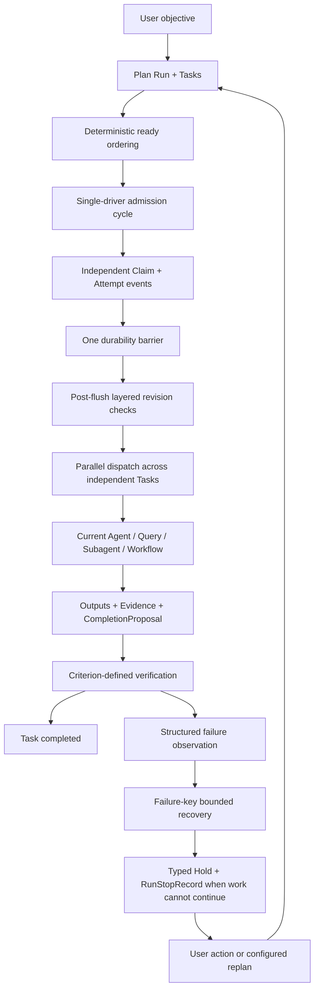

# G19 — Outer-loop cumulative scope and ROI audit

**Audit date:** 2026-09-14

## Purpose

This audit reviews the outer-loop decisions together before the ticket resolves. It tests whether the combined design still proves the product destination at reasonable implementation, maintenance, runtime, token, and evaluation cost. It distinguishes required first-release behavior from optional polish and advanced mechanisms, and links every deferral to an existing follow-up.

## First-release value proposition

The first release needs to prove three user-visible claims:

1. a writable Plan DAG prevents dependency and stale-work errors;
2. independent data tasks run concurrently without losing authority, budget, or evidence attribution;
3. failures stop or request action before wasting repeated model/query work.

A mechanism that does not materially strengthen one of these claims is not part of the minimum proof unless it reuses existing DSH behavior at very low incremental cost.

## Cumulative execution flow after accepted decisions

## Decision-by-decision ROI review

| Decision | User value | Implementation / maintenance | Runtime / token cost | Audit disposition |
|---|---|---|---|---|
| Task DAG driver is the sole cross-turn owner in Plan profiles | Removes duplicate authority over continuation, budgets, Holds, and inbox | Low–medium; one driver and profile override | No extra model calls | **Keep** |
| Concurrent independent Tasks | Direct latency benefit for income, ads, FX, and quality queries | Medium: capacity ledger and adapters | Uses only work already requested | **Keep** |
| Same-Task Attempt Groups | Speculation/voting/hedging benefit is unproven and duplicates model/query cost | High lifecycle, verifier, cancellation, recovery, UI | Potentially multiplies cost | **Deferred to G24** |
| Stable priority/ready-age ordering | Predictable capacity allocation without a scheduler model call | Low | Zero model cost | **Keep** |
| Independent admissions, one shared flush, post-flush recheck | Prevents unauthorized dispatch and reduces flush count | Medium but central to durable execution | No model cost | **Keep** |
| Layered Task/claim/run-control revisions | Prevents unrelated Plan edits from cancelling expensive work | Medium and test-heavy | Reduces wasted execution | **Keep** |
| Role-layered Attempt context | Keeps workers focused while preserving orchestrator awareness | Medium context builder | Reduces repeated Plan tokens | **Keep** |
| Risk-tiered Plan mutation | Enables low-risk repair while protecting budgets, assurance, scope, and writes | Medium if limited to a closed host allowlist | No separate model role | **Keep, reduce policy surface** |
| L0–L3 tool effects | Prevents Task-causal queries and writes from bypassing Attempt authority | Medium; many first-release tools benefit | No model cost | **Keep** |
| Tool-policy contribution registry | Multiple existing and future tools need scoped classification without upstream changes | Medium but reused broadly | No runtime model cost | **Keep** |
| Executor adapter registry | Current Agent, query, subagent, workflow, skill, and manual work already vary | Medium but required by multiple adapters | No model cost | **Keep** |
| Public Attempt-policy registry | Only phase-gate is a concrete inner policy in the current release path | Adds public seam, versioning, package and compatibility work | No direct model cost, high maintenance | **Defer until a second mode/policy** |
| Criterion-level verified/attested assurance | Prevents self-report from completing hard dependencies while controlling verifier cost | Medium | Only criteria requiring semantic verification add model calls | **Keep** |
| Run ledger + Task retry policy + Attempt reservation | Required to make concurrent admission budget-safe | Medium–high | Prevents overspend; no new model calls | **Keep, enforce portable counters only** |
| Provider token/currency/scan metrics | Useful when reported, inconsistent across providers | Generic money/telemetry enforcement adds surface | Reporting itself is cheap | **Observe only in V1; hard enforcement deferred** |
| Failure-key no-progress | Stops repeated SQL/tool/verifier failures with no judge calls | Low–medium | Zero extra model calls | **Keep** |
| Configurable `hold` or `replan`, default `hold` | Supports supervised and AFK Runs with one existing replan path | Low–medium when Run-scoped only | Replan calls occur only when selected | **Keep, Run-level only** |
| Typed Holds with release conditions | Eliminates redundant Resume interactions and preserves safety | Medium | No model cost | **Keep** |
| RunStopRecord history | Explains why automation stopped without duplicating Hold authority | Low–medium event/projection work | No model cost | **Keep current stop; history UI deferred** |
| Queue/Steer/Cancel human routing | DSH already implements these semantics | Low adaptation cost | No additional model calls | **Reuse, keep** |
| Explicit BTW | Valuable for side questions while long data work runs | Medium if built as a new side-session subsystem | One model call only when user asks | **Keep only by reusing one-shot fork with empty tool scope** |
| Online shadow intent classifier | Produces future auto-routing data but calls another model and adds version/eval plumbing | Medium–high | Extra call for busy-session input | **Remove from V1; log explicit choices and evaluate offline in G32** |
| Durable phase runtime/events/UI | Valuable eventually, but current phase-gate is one inner policy and full integration is a separate effort | High | Additional events/context, no direct V1 DAG proof | **Use minimal opaque phase adapter; full integration deferred to G25** |
| Semantic progress judge / global Progress Vector | Possible future optimization, weak current evidence | High | Extra model calls and calibration | **Deferred to G24/G31** |

## Required reductions before implementation planning

### 1. No online shadow classifier in the first release

The first release records explicit BTW/Queue/Steer/Cancel choices, related Task/Attempt ids, corrections, and outcomes. Classifier development and shadow evaluation belong entirely to [Risk-gated human input auto-routing](../tickets/G32-risk-gated-human-input-auto-routing.md). Offline replay can bootstrap the evaluator without adding one model call to production routing.

### 2. Reuse DSH for explicit BTW

Do not build a new side-session capability. Implement explicit BTW through the existing one-shot fork/subagent path:

- seed only the parent's completed-turn prefix;
- empty tool scope;
- no Plan mutation or Attempt authority;
- return one answer to the UI;
- do not append it to the parent model history;
- dispose the child after settlement.

If that existing path cannot satisfy the UX without new generic infrastructure, defer BTW rather than creating a second Session runtime in the first release.

### 3. Do not publish an Attempt-policy registry yet

The phase adapter can implement its inner policy behind the executor adapter interface. A public Attempt-policy registry becomes real only when a second independently evolving mode/policy exists. Keep the descriptor vocabulary internal so G25 can promote it later without modifying the outer-loop driver.

### 4. Keep mutation risk policy small and monotonic

First-release Host classification is a closed allowlist:

- additive read-only Task and conservative dependency additions may commit automatically;
- unknown mutations and any budget, assurance, access, write-target, completed-result, active-Attempt, or unknown-effect changes require Approval Hold.

Do not implement a generic risk-rule DSL or model-classified risk engine.

### 5. Enforce only portable budget dimensions

Hard limits cover Attempts, active Attempts, query submissions, model requests, verifier runs, repairs, replans, and external-effect count. Tokens, currency, scan bytes, and provider time are recorded when available but are not claimed as enforced unless the selected provider declares reliable support.

### 6. Keep UI scope current-state only

The first release exposes current Tasks, Attempts, Holds, budgets, verification, and current Stop Record. Full stop/replan/Attempt history navigation remains in [History, trace, and plan inspection](../tickets/G28-history-trace-and-plan-inspection.md); the Session log still retains the underlying facts.

### 7. Keep phase integration opaque

For the first release, a phase-gated current-Agent executor settles one Task Attempt with final outputs/evidence. The Task graph does not render phase nodes or own phase counters. Durable phase events, resume, UI, clarification mapping, and phase-specific completion semantics remain in [Data-agent phase-gate integration](../tickets/G25-phase-gate-integration.md).

## First-release package/interface implication

This audit does not decide package names—that belongs to G18—but it constrains the public interface count:

- one Task Graph capability owning state and commands;
- one outer-loop driver;
- one model-tool consumer;
- one verifier registry/consumer surface;
- one executor adapter registry with concrete adapters;
- one Client projection consumer;
- one installable Bundle/Profile layer.

It explicitly rejects new first-release public seams for recovery, Attempt policy, human-input classification, global Run control, or BTW sessions.

## Runtime and model-cost budget

| Hot path | Additional model calls introduced by orchestration |
|---|---:|
| Ready selection and admission | 0 |
| Revision fencing and protected tools | 0 |
| Failure-key no-progress | 0 |
| Hold release and StopRecord | 0 |
| Mechanical verification | 0 |
| Semantic verification | Only criteria explicitly requiring it |
| Auto replan | Only when the Run policy is explicitly `replan` |
| Explicit BTW | One call initiated by the user |
| Human-input classification | 0 in V1 |

## Deferred owners

- Attempt Groups, critical-path/model routing, semantic progress, learned stopping, and advanced fairness: [G24](../tickets/G24-advanced-routing-and-parallelism.md)
- Full phase runtime integration: [G25](../tickets/G25-phase-gate-integration.md)
- Goal/Plan lifecycle integration: [G26](../tickets/G26-goal-plan-dag-relationship.md)
- Execution ledger extraction: [G27](../tickets/G27-execution-ledger-extraction.md)
- Historical inspection UI: [G28](../tickets/G28-history-trace-and-plan-inspection.md)
- Reusable Run Controller / RecoveryPolicy: [G31](../tickets/G31-run-controller-extraction.md)
- Risk-gated human-input auto-routing: [G32](../tickets/G32-risk-gated-human-input-auto-routing.md)
- Automatic external-effect reconciliation: [G23](../tickets/G23-recovery-and-external-effect-reconciliation.md)

## Audit conclusion

After the reductions above, the first release still proves the core product value while avoiding speculative optimizer, classifier, phase-runtime, group-execution, and history-explorer work. The largest remaining implementation surfaces—Task Graph state/events, adapters, Client projection, and verification—are directly required by the destination rather than optional automation polish.
