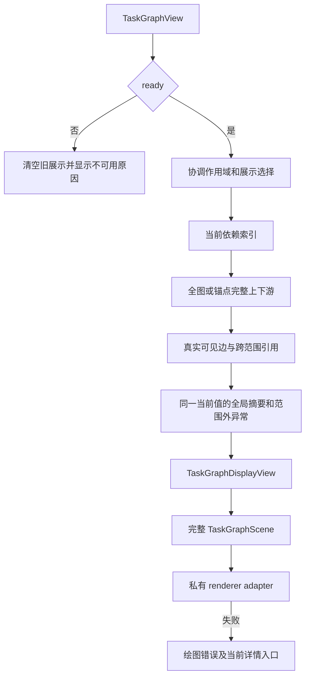
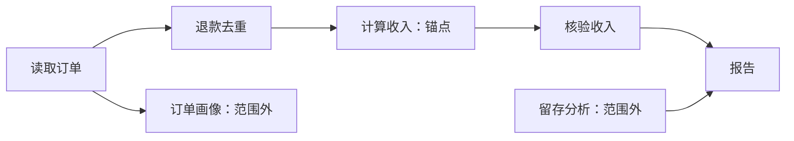

# G11 — DAG view simplification strategies

**Type**: grilling
**Status**: resolved 2026-09-22
**Claimed by**: QoderWork session `mucgklyvt1ol4u5j`
**Blocked by**: [G14 Durable events, projection, and Host/Client boundary](G14-task-graph-projection-boundary.md), [R5 G6 renderer adapter stability](R5-g6-renderer-adapter-stability.md)
**Blocks**: [G20 First-release scope, compatibility, and evaluation](G20-v1-scope-and-evaluation.md), [G38 Structural aggregation and terminal summaries](G38-structural-aggregation-and-terminal-summaries.md), [G36 Extended focus and filtering](G36-extended-focus-and-filtering.md)

## Question

Which renderer-neutral view transformations belong in the first release, and in what order are they composed?

Consider structural aggregation, active/focus filtering, terminal-subgraph summaries, domain filtering, and visible-node fallback. Define `TaskGraphView → TaskGraphDisplayView`, stable identities, explainable omitted counts, and selection survival independently of G6.

## Inputs from the G14 resolution

Simplification begins from the ready variant of the journal-backed `TaskGraphView` and produces a separate display-only view. It preserves Task, relation, Attempt, Hold, assurance, and omitted-count identities, never mutates the Task DAG projection, and treats unavailable views as non-transformable.

## Inputs from the R5 resolution

[R5 G6 renderer adapter stability](R5-g6-renderer-adapter-stability.md) gives the renderer a complete immutable `TaskGraphScene` and keeps G6-specific diffing private. This ticket therefore decides pure `TaskGraphView → TaskGraphDisplayView` transformations before scene mapping, not renderer deltas. The first-release target is legibility through 30 Tasks; a 100-Task browser case records evidence for simplification or the later renderer-scaling ticket rather than silently changing domain semantics.

## Comments

### Grilling checkpoint: first-release simplification slice

The user selected manual Task focus as the first-release simplification interaction, retaining the complete Task graph as the default. Existing-group collapse is not the first-release priority. Hidden-attention visibility, selection continuity, omitted counts, large-view handling, named follow-ups, and acceptance criteria remain unresolved; this checkpoint does not close the ticket.

### Grilling checkpoint: focus membership

The user selected the focused Task plus all its transitive dependency ancestors and descendants. Traversal follows dependency relations, not containment, execution Bindings, or tool calls. A separate branch that shares a descendant is not recursively included merely because it also feeds that descendant. This scope explains prerequisites and impact without promising that every focus produces a smaller graph; boundary dependencies still require explicit disclosure.

### Grilling checkpoint: out-of-focus attention

The user selected a persistent out-of-focus attention summary outside the graph rather than injecting unrelated attention Tasks into the focused topology. The summary deduplicates by Task identity and opens current Task details; changing the focus requires an explicit user action. Whole-plan progress remains whole-plan progress. Cross-boundary dependencies are disclosed separately, and displayed edges never recompute readiness or assurance.

### Shared-understanding confirmation

用户逐轮确认手动任务聚焦、完整上下游、图外异常摘要，并确认下述首版范围、失败处理和具名后续票据；授权记录规格、验证并提交 commit 与 PR。本票只解决设计，不实现产品包。

## Answer

首版保留默认完整任务图，只增加用户显式触发的单任务依赖聚焦。聚焦图展示锚点及其完整上游、下游，范围外异常使用图外常驻摘要；聚焦不改变真实任务、依赖、状态、执行或全局进度。此处是已确认的实现规格，不代表产品已具备这些行为。决策理由与替代方案由 [Manual Task DAG focus before aggregation](../../../.agents/notes/proposed/feature/2026-09-22-task-dag-manual-focus.md) 记录。

### 术语与职责

聚焦锚点是用户明确指定、用来检查依赖的 Task；详情选择是用户正在阅读的 Task，两者独立。范围外任务是同一 Run 的当前来源中存在、但未进入本次聚焦集合的 Task；不是被删除、未执行或不存在的任务。跨范围依赖是一端可见、另一端在范围外的真实依赖，不是新的 Plan relation。

`TaskGraphView` 是 [G14](G14-task-graph-projection-boundary.md#projection-remote-transport-and-client-ownership) 定义的权威当前值；`TaskGraphDisplayView` 是纯函数从该值和展示选择产生的完整、只读展示值；`TaskGraphScene` 是交给 [R5 私有绘图库适配器](../research/R5-g6-renderer-adapter-stability.md#renderer-neutral-scene) 的完整绘图值。展示转换不写 journal，不调用模型，不查执行器，不携带 G6 类型，不改变 wire schema；React 仍只拥有展示状态。

### 输入、输出与转换顺序

输入必须是同一 Run 的一个 `ready TaskGraphView` 和展示选择：`all` 或 `focus(anchorTaskId)`，以及独立的 `selectedTaskId`。Task 身份用 `PlanRunId + TaskId` 判定，不以名称、数组位置、Attempt 编号或 Plan revision 代替。会话是展示状态的拥有者，不成为领域身份。

输出保留来源的 view version、`PlanRunId`、journal sequence 与 Plan revision，包含可见 Task 标识、可见依赖标识、逐可见任务的跨范围依赖引用、展示省略量、范围外待处理任务标识及其当前原因引用、Run 级摘要引用和独立选择。Task、relation、Attempt、Hold、verdict、替代项与其他详情仍从同一个不可变来源读取；展示层不制造这些实体的新身份或第二份状态。

转换顺序固定为：检查来源是否可用；协调当前作用域和锚点／选择；从来源建立当前依赖索引；计算可见任务集合；选择两端均可见的真实依赖并提取跨范围引用；计算展示省略量与范围外异常；映射完整 scene。无聚合、业务过滤、active-only 或数量截断步骤。样式和动画在 scene 之后，由 G4 与 R5 负责。

### 精确聚焦集合与关系

令 `T` 为当前来源中属于所选 Run、可供当前图展示的全部 Task，包含来源保留的 superseded Task；`E` 为该 Run 当前生效的有向依赖，方向是前置任务指向依赖它的任务。`all` 的可见集合为 `T`。锚点 `a` 的聚焦集合为 `S = {a} ∪ ancestors_E(a) ∪ descendants_E(a)`，分别只逆向和只正向遍历，再取并集。不得从新增成员继续双向扩张为整个连通分量。去重与输出顺序沿用来源的确定顺序。

可见依赖是 `E` 中两端都在 `S` 的关系，完整保留 relation id、方向、前置验收要求与当前满足状态。遍历不沿包含、声明顺序、替代项、执行 Binding 或工具调用；非依赖信息只保留其原义的注释与详情入口，不合成依赖边。已失效关系不参与当前可达性，superseded Task 的原因和替代项入口按 [G4](G4-animation-and-edge-design.md#replan-and-spatial-continuity) 保留。

例如 `读取订单 → 退款去重 → 计算收入 → 核验收入 → 报告`，另有 `留存分析 → 报告`。聚焦计算收入时显示收入链，留存分析不因共同流入报告而入图；同理，订单另一个无关后继分支也不被拉入。聚焦报告则收入与留存都属于它的上游，必须显示。

跨范围依赖按可见端点提供明确的“范围外前置／后继”数量及可展开的真实关系条目，保留两端 TaskId、relation id、方向和权威状态。条目可打开对应任务详情，并可显式改为聚焦该任务或返回全图。范围外节点不送入 scene，不能画悬空边、连到虚构摘要节点，或跨过隐藏任务补捷径。图内未画某条前置不等于该前置满足；readiness、assurance 与依赖满足状态完全使用来源值。

### 省略量与图外异常

展示计数为 `totalTaskCount = |T|`、`visibleTaskCount = |S|`、`hiddenTaskCount = |T ∖ S|`。全部当前依赖按“两端可见、恰一端可见、两端不可见”互斥分区，三类之和必须等于 `|E|`；跨范围关系按 relation id 去重，不能混用关系数和不同 Task 数。空图只能表示 `ready` 且 `T` 为空；有效锚点即使孤立也显示一个任务。

G14 的省略历史数是来源按保留策略未携带的历史记录数，必须原样保留并独立命名，不能与 `hiddenTaskCount` 相加。完成／就绪／阻塞等全局摘要仍来自整个 Run；过滤后不重算百分比分母。UI 展示精确计数，不用省略号替代数值，不把来源未提供的历史当成可由“显示全部”恢复的 Task。

范围外待处理集合从 `T ∖ S` 选择当前 `failed` Task、当前 `rejected` 或 `inconclusive` assurance、有关联的 active Hold、尚未解决的 unknown external effect，以及来源明确仍需恢复的 interruption。按 TaskId 去重，但保留同一 Task 的全部当前原因引用。已恢复成功的历史失败 Attempt 不单独产生异常；旧 Attempt 遗留的尚未解决外部效果仍必须显示，不因已有更新 Attempt 而消失。普通等待前置、运行中、已验证完成、正常取消或 superseded 本身不等于待处理异常。

摘要在有范围外待处理任务时持续可见，显示精确任务数与可展开的任务／原因列表。打开列表或详情不改变锚点；只有显式“聚焦此任务”才切换。运行中任务等全局摘要保留返回全图入口，不自动增加 active-only 筛选。Run 级 Hold、预算和最新 StopRecord 不受任务过滤；最新停止记录仍按来源的当前恢复状态解释，不把已经解除的停止原因当作新屏障，也不把 Run Hold 伪造成某个 Task 的异常。

### 选择保持、重规划与更新

同一会话及 Run 内，重试、状态更新、重新排序和 Plan revision 不改变锚点或详情选择的真实身份。每个新 `ready` 值重新求同一锚点的完整上下游，不冻结过期拓扑。任务被替代而仍在来源中时保留选择和原因，并允许查看替代项；不自动转移到替代任务。已选择任务暂时不在聚焦集合中时，详情仍读取当前来源，scene 不向绘图库传递一个不可见节点的 selected id。

若新来源中确实不存在锚点，明确说明并回到全图，不保留陈旧子图、不随机选择另一任务；详情选择也只在完整当前来源中缺失时清除。来源引用不完整或协议不兼容属于数据不可用，不允许删掉坏边后继续展示为完整图。

会话或 active Run 切换重置聚焦和视口，重新取得该作用域的来源；详情选择仅在新来源仍包含同一 `PlanRunId + TaskId` 时保留。重连及 unavailable 期间隐藏旧图、旧摘要和旧详情；恢复后仅凭新 `ready` 来源验证仍适用的展示选择。浏览器刷新可重置展示状态，不增加持久化或跨刷新恢复协议。

一次显示的图、计数、异常和详情必须来自同一已接受的来源快照；各事实自身的历史序号无需相同。相同 journal sequence 下改变聚焦仍是新的展示 generation，必须使旧异步绘制失效；不得以 journal sequence 相同为由跳过更新。纯筛选造成的出现／消失不算 Task 创建、完成或重规划，不触发这些语义动效。重连、remount、隐藏恢复不补播历史变化；键盘和指针均可选择、进入聚焦、查看范围外引用、退出聚焦，保持明确可见的焦点。

### 规模与失败处理

首版不设置可见 Task 硬上限，不从“30 个任务目标”推导第 31 个任务应被隐藏。全图、完整上下游、全屏、平移和缩放共同构成当前检查路径；聚焦中心汇总任务可能仍显示整个计划，必须如实表现。30-Task 用例的可读性和正常交互仍是首版验收，100-Task 浏览器用例记录布局、绘制、交互和内存证据，不宣称已测通过或以此自动启用优化。

renderer 失败时显示明确绘图错误，停止展示残留画布；若来源仍为 `ready`，保留全局摘要、异常、跨范围说明及基于当前 Task 的文本详情入口，并允许显式重试。它不是数据不可用、空图或第二套 renderer，也不会停止真实任务执行。来源变为 `unavailable` 时则遵守 G14/G15 清空所有旧值并显示结构化原因，不将缓存摘要冒充当前状态。性能、worker layout、增量传输或换绘图库由 [G34 Renderer scaling and replacement threshold](G34-renderer-scaling-and-replacement-threshold.md) 依据测量决定。

### 具名后续与首版 ROI

[G38 Structural aggregation and terminal summaries](G38-structural-aggregation-and-terminal-summaries.md) 接收已有分组折叠、结构聚合及已完成／已替代分支摘要。[G36 Extended focus and filtering](G36-extended-focus-and-filtering.md) 接收业务筛选、active-only、自动跟随、多锚点和逐层展开，两票都明确触发证据与范围，并等待 [G20 First-release scope, compatibility, and evaluation](G20-v1-scope-and-evaluation.md)。跨刷新检查与历史浏览继续归 [G28](G28-history-trace-and-plan-inspection.md)，连续进度动效继续归 [G8](G8-z-enhancement-global-progress-wavefront.md)。上述能力不隐式进入首版。

首版只增加一套纯展示选择、真实跨范围说明和异常导航，复用完整当前值、详情与现有 renderer；不增加数据库、网络订阅、执行 API 或模型 token。其直接收益是回答问数和数据工程的“为什么卡住、影响哪些交付、还有哪里需处理”，不依赖良好的业务分组。建索引和双向分别遍历为 `O(|T| + |E|)`，这是算法工作量，不是浏览器延迟承诺。机会成本是暂不自动压缩长图；证据强度来自既有接口和本次明确决策，实际用户阅读收益与规模表现仍待实现后的验收。

### 验收要求

纯转换用例覆盖空图、孤立任务、链、分叉、汇合和共享下游；断言完整祖先／后代集合、祖先旁支和下游其他输入不误入、稳定顺序、两端可见才画边、跨范围方向与状态保真、关系三分区和 Task 计数守恒。以错误的整个连通分量、捷径边、历史省略数混加和过滤分母作为反例，确保这些错误不能通过断言。

状态用例覆盖成功重试后的旧失败、旧 Attempt 尚未解决的 unknown effect、多个原因按 Task 去重、Hold 解除、Run Hold、已恢复后的 StopRecord、范围外失败以及非异常的运行／等待任务。核对图外摘要和详情与完整来源同一快照，不因 scene 过滤失去证据、替代项或精确身份。

浏览器用例覆盖开详情不换聚焦、显式换锚点、返回全图、键盘操作、隐藏选择、重规划、superseded、锚点不存在、会话／Run 切换、同序号过滤竞态、reduced motion、隐藏恢复、remount、绘制失败与数据 unavailable 的区别。验证展示变化不补造执行动效，并记录 1、30、100 Task 的相应证据。

实现时更新已有问数成功、Hold／Resume、重规划和 unavailable 的 keyless Session 场景，证明领域／SDK 的原始 TaskGraphView 不因 Client 聚焦而改变；纯展示与 ARIA 预期按 [snapshot ownership](../../../snapshots/AGENTS.md) 放在对应 Client 测试旁，不伪装成新的持久化 Session generation。本规划提交只运行文档与规格检查，不把这些待实现行为测试记为通过。
