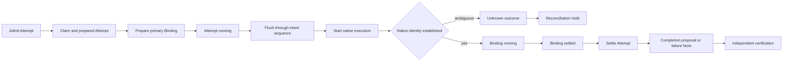

# G13 — ExecutionAttempt and correlation protocol

**Type**: grilling
**Status**: resolved 2026-09-15
**Blocked by**: [G12 Plan DAG ownership boundary](G12-task-graph-authority.md) ✅
**Blocks**: [G14 Durable events, projection, and Host/Client boundary](G14-task-graph-projection-boundary.md), [G17 Executor adapters](G17-native-source-adapters.md), [G19 Cordis outer-loop driver](G19-cordis-outer-loop-driver.md)

## Question

How does one Task ExecutionAttempt bind durably to the current Agent, tool calls, skills, subagent runs, workflow runs, output references, verification evidence, and external effects?

Under G12, admission atomically creates a claim and Attempt; Task, Attempt, and Plan revisions are layered; a Task defaults to one active Attempt but may declare an Attempt Group. Define branded identities, admission and settlement commit points, concrete executor binding, actor authority, parent/child Attempts, group membership, retry numbering, output and evidence references, cancellation, interruption, unknown external outcomes, and the difference between causal correlation and observational inference.

Native subagent lineage and workflow membership do not prove Task causality. A heuristic may enrich display only when marked non-authoritative; it must never authorize execution or completion.

## Resolution

The Plan DAG uses Host-issued execution context, explicit causal Bindings, idempotent typed commands, and durable intent barriers to correlate each Task Attempt with DSH executors without owning their native lifecycles.

### Identities and ownership

Task Graph entities use distinct branded identifiers: `PlanRunId`, `TaskId`, `ExecutionAttemptId`, `AttemptGroupId`, `ExecutionBindingId`, `OutputRefId`, `EvidenceRecordId`, `ExternalEffectId`, and `TaskGraphCommandId`. Plan and Task revisions, Claim generation, Task-scoped `attemptNo`, and Binding-scoped `nativeAttemptOrdinal` use non-interchangeable branded numbers.

An `ExecutionAttempt` owns the task-level execution commitment, selected executor, admission revisions, Claim generation, retry relation, lifecycle, and settlement. An `ExecutionBinding` owns one authoritative causal relation between that Attempt and a native execution. The Plan DAG owns both records but does not copy the Agent, tool, subagent, workflow, skill, trace, or external system lifecycle.

Each ordinary Attempt has one `primaryBindingId`. Nested tool, subagent, workflow, and external-effect executions use `parentBindingId`; parentage does not grant authority or imply cancellation or completion propagation. Skill use is immutable method metadata rather than a native Binding. First-release admission rejects Attempt Groups while preserving `AttemptGroupId` for the follow-up protocol.

### Native execution references

`ExecutionBinding` has fixed common fields and a merge-extensible discriminated reference map. The first release supports these authoritative references:

| Binding kind | Required native reference |
| --- | --- |
| `agent-turn` | `SessionId`, admission `MessageId`, and turn number |
| `tool-call` | `SessionId`, `ToolCallId`, and `rootCallId` |
| `subagent-run` | provider name, `SubagentRunId`, and child `SessionId` |
| `workflow-run` | `WorkflowRunId` |
| `external-effect` | `ExternalEffectId`; provider operation identity remains on the effect entity |

`ExecutionBindingId` is allocated before dispatch and also identifies the durable provisioning intent; the protocol adds no separate Claim, dispatch nonce, or dispatch-intent identifier. Trace, native lineage, and time proximity create only `ExecutionObservation` records. An observation gains no execution, cancellation, budget, output, evidence, settlement, or completion authority; only an adapter that validates a persisted dispatch intent may establish a Binding.

### Execution context and actor commands

The Host constructs an immutable `ExecutionTicket` from committed state. It carries `PlanRunId`, `TaskId`, `ExecutionAttemptId`, the current `ExecutionBindingId`, Claim generation, and Plan and Task revisions. The current Agent receives it through the dedicated `task-attempt` message source, tools inherit it from the execution pipeline, and trusted adapters serialize it when crossing a process boundary. It is a routing and fencing envelope, not a credential; model-generated or echoed identifiers never authorize work.

The closed first-release actor set is `user`, `orchestrator`, `worker`, `executor-adapter`, `verifier`, and `driver`. Roles are established per command context. Workers and adapters submit progress, outputs, evidence, external-effect facts, failure observations, and completion or replan proposals; only the Task Graph Service validates commands and commits state. Unknown roles, commands, stale revisions, stale Claim generations, and mismatched ownership fail closed.

Every retryable or cross-process command carries a `TaskGraphCommandId`. Repeating the same identifier and payload returns the original committed result; reusing the identifier with a different payload is a protocol error.

### Admission, dispatch, and durability

`AdmitAttempt` atomically rechecks the active committed Plan revision, Task revision, dependencies, Holds, approval, budget, capacity, and active-Attempt rules, then creates the Claim and a `prepared` Attempt in one required Session event. A Task-level semantic retry creates a new Attempt with a monotonic `attemptNo` and optional `retryOfAttemptId`. Executor-internal retry retains the Attempt and increments only the Binding's `nativeAttemptOrdinal`; an unknown external outcome is never replayed automatically.

The primary `PrepareBinding` operation atomically records `primaryBindingId` and changes the Attempt to `running`. Binding phase is `dispatching | running | settled`. A Binding whose native identity is already known may enter `running`; otherwise it enters `dispatching`, is flushed, starts the native executor, and receives its typed native reference through an adapter command. A crash while `dispatching` requires adapter reconciliation or produces `unknown` rather than an assumed safe retry.

Every model request, native execution, or external side effect begins only after a successful flush covers its admission, Binding, or effect intent. The invariant is `durableThroughSeq >= intentSeq`; the public protocol does not require one flush per operation and therefore permits later batching that preserves the invariant.

### Outputs, evidence, and settlement

`OutputRef` records a named result's producing Attempt and Binding, adapter-owned locator, availability, and late-result status without copying large database, file, workflow, or subagent content. `EvidenceRecord` identifies the acceptance criterion it addresses, its producer, and its supporting output or observation. Model-visible content remains reconstructable from the Session log.

Native success, tool completion, subagent or workflow settlement, and model self-report cannot complete a Task. `SettleAttempt` rechecks the primary and required child Bindings, cancellation, external-effect certainty, outputs, evidence, Claim generation, and revisions. One required event atomically records the Attempt outcome, releases its Claim, freezes ordinary writes to the Attempt, and creates either a `CompletionProposal` or failure and reconciliation facts. A verifier verdict remains a separate commit, and only the Task Graph Service changes Task lifecycle.

### Cancellation, interruption, and late results

A committed `CancelAttempt` freezes new Bindings and completion proposals, then the Host asks every active causal Binding's adapter to cancel and reach quiescence. Host commit order resolves races: a settled Attempt rejects a later cancellation as already settled; once cancellation commits first, that Attempt cannot settle as `succeeded`.

Bindings still record their actual native outcomes. Confirmed safe cancellation settles the Attempt as `cancelled`; local loss with no uncertain external effect settles as `interrupted`; an outcome that may include an external effect settles as `unknown` and creates a reconciliation Hold. A result that arrives after cancellation or settlement remains an authoritative late result only when it matches the exact persisted Binding. It may be retained for explicit reuse but cannot reopen the Attempt or Task, create a completion proposal, satisfy verification, or release dependencies. Unverified correlation remains an `ExecutionObservation`.

`ExternalEffectId` is stable across Attempts only while target, canonical request digest, write scope, approval scope, and provider idempotency scope remain unchanged. Effect certainty is `pending | confirmed | rejected | unknown`. It may continue to converge after Attempt settlement because it describes external reality, but releasing its Hold requires a complete state recheck and never reopens a terminal Task automatically.

### Consequences

- [Durable events, projection, and Host/Client boundary](G14-task-graph-projection-boundary.md) owns event names, complete post-change payloads, replay, state versions, projection indexes, and SDK transport.
- [Executor adapters](G17-native-source-adapters.md) maps each executor to typed references, dispatch, cancellation, reconciliation, native outcomes, outputs, and evidence.
- [Cordis outer-loop driver, verification, and budgets](G19-cordis-outer-loop-driver.md) owns admission selection, command timing, verifier dispatch, recovery policy, Holds, budgets, and continuation.
- [Advanced routing, parallelism, and optimization](G24-advanced-routing-and-parallelism.md) owns Attempt Group execution, shared native work, multi-Attempt turns, and cost-aware routing.
- [Recovery and external-effect reconciliation](G23-recovery-and-external-effect-reconciliation.md) owns automated lookup, idempotent replay, compensation, and cross-process recovery.
- [Execution Ledger extraction threshold](G27-execution-ledger-extraction.md) owns any later extraction from Plan DAG storage after an independent consumer or scale requirement exists.

## Comments

- 2026-09-15：用户确认采用“执行上下文强制”。普通用户轮次可以执行明确的非 Plan 工作，但其结果不得推进、举证、验证或结算 Task；进入携带有效 `task-attempt` 上下文的 Attempt 后，工具必须在执行前绑定，subagent/workflow 必须经 Plan executor adapter 派发，未建立权威关联的旁路调用由 Host guard 拒绝。

- 2026-09-15：用户确认采用“Host 代理提交”。worker 不直接写 Task Graph，也不持有持久委托凭证；executor adapter 通过 Host 命令接口提交进度、输出、证据、失败观察和完成或 replan 提案，Host 每次按 Attempt、Claim generation、相关修订和 actor role 重新鉴权。跨主机长期委托留给后续跨 Session、多 Agent 调度协议。

- 2026-09-15：用户确认采用独立 `ExecutionBinding` 实体。`ExecutionAttempt` 仅保存任务级执行承诺和生命周期；Agent turn、工具调用、subagent、workflow 与外部 effect 分别以带品牌的 Binding 记录，skill 使用随后收敛为不创建 Binding 的方法引用。Binding 仍由 Task Graph 拥有，以完整实体值写入 required Session 事件和 Host projection，不抽取独立 Execution Ledger。

- 2026-09-15：用户确认采用“单一因果所有权”。一个 native execution 最多由一个 Attempt 的 causal Binding 权威拥有；其他 Task 通过 `OutputRefId` 和依赖复用产物，或添加不授予取消、预算、结算与完成权限的 observational link。跨 Attempt 共享执行与自动去重仅在后续评估证明重复成本显著时进入高级路由决策。

- 2026-09-15：用户确认采用一等 `OutputRef` 与 `EvidenceRecord`。Task Graph 统一拥有输出身份、生产来源、可用性和接受标准证据关系，但不复制大型数据内容，也不接管数据库、文件、workflow artifact 或 subagent 输出的原生生命周期；模型实际看到的内容仍由 Session 日志重建。

- 2026-09-15：用户确认采用正交生命周期模型。Attempt phase/outcome、Binding phase/outcome、控制请求、验证状态和 external effect certainty 分别记录；首版实现必要闭合枚举、取消请求与确认分离、验证前后分离、`unknown` effect 的 reconciliation Hold 及危险重试阻断。自动核对、补偿和跨进程恢复留给外部效果恢复 Follow-up。

- 2026-09-15：用户确认采用“准入后语义固定的 Attempt”。每次任务级重新准入或语义重试创建新的 `ExecutionAttemptId` 和 Task 内单调 `attemptNo`，并用 `retryOfAttemptId` 记录关系；同一有效 Claim 内的多轮 Agent step、工具调用、局部修正及同请求、同幂等身份的 executor 内部重试保留在原 Attempt，内部重试仅递增 Binding 的 `nativeAttemptOrdinal`。未知外部结果禁止自动重放。

- 2026-09-15：用户确认采用正交的类型化关系，不发布通用 `parentAttemptId`。Task scheduling 使用 DAG dependency，语义重试使用 `retryOfAttemptId`，动态建图来源记录为 Plan mutation provenance，同 Task 并发保留 `AttemptGroupId`，executor 嵌套使用 `parentBindingId`；任何关系都不隐含权限、取消或完成传播。第一版保留 Attempt Group 身份但显式拒绝实际 group admission。

- 2026-09-15：用户确认对权威与观察关联实行类型级隔离。`ExecutionBinding` 仅表示经 Host/adapter 验证的 causal relation，可参与执行、取消、预算、输出、证据与结算；`ExecutionObservation` 仅承载 trace、原生 lineage、时间邻近等诊断线索，不得自动提权。只有重新验证已持久化 dispatch intent 的 adapter 才能创建或完成正式 Binding。

- 2026-09-15：用户确认采用“语义耐久性屏障”。任何模型请求、原生执行或外部副作用开始前，其 admission、Binding 或 effect intent 必须已被成功 flush 覆盖；首版可逐操作 flush，公共协议不固定 flush 次数，后续可在保持 `durableThroughSeq >= intentSeq` 不变量下安全批处理。Settlement 也必须在对外宣布完成或解除下游依赖前持久化。

- 2026-09-15：用户确认一个当前 Agent turn 只绑定一个 Attempt。Task DAG driver 使用专有 `task-attempt` MessageSource 和 MessageId 建立唯一 AgentTurnBinding；该 turn 内工具、subagent 与 workflow 建立子 Binding 并继承同一 Attempt 上下文，skill 仅记录为方法引用。系统级并发由其他 executor lane 提供，多 Attempt batch turn 仅在实测 token/延迟收益成立时进入高级路由 Follow-up。

- 2026-09-15：用户确认采用闭合的核心角色—命令矩阵。`user`、`orchestrator`、`worker`、`executor-adapter`、`verifier` 和 `driver` 只能提交各自允许的 typed commands，Task Graph Service 是唯一状态提交者；角色按命令上下文授予，不是 Agent 的永久属性，也不是 bearer credential。未知角色、未知命令和越权调用 fail closed。

- 2026-09-15：用户确认采用一等 `ExternalEffect`。外部语义操作拥有跨 Attempt 稳定的 `ExternalEffectId`，每次具体派发仍由单一 Attempt 的 `ExecutionBinding` 拥有；相同 target、canonical request digest、write scope、approval scope 与 provider idempotency scope 才能复用 effect identity，参数变化创建新 effect。首版记录 `pending | confirmed | rejected | unknown` 并在 unknown 时阻止重试，自动核对与补偿留给恢复 Follow-up。

- 2026-09-15：用户确认采用 Host 注入执行上下文。`ExecutionTicket` 由 Host 从已提交的 Attempt、Claim 和 revisions 构造；当前 Agent 通过 `task-attempt` MessageSource 绑定，工具从执行管线上下文继承，跨进程请求由可信 adapter 显式序列化。模型只提交业务参数，模型生成或回显的 Attempt/Claim ID 不构成授权。

- 2026-09-15：用户确认每个 Attempt 采用唯一根执行器。admission 确定 `executorKind`，dispatch 创建唯一 `primaryBindingId`；工具、subagent、workflow 和 external effect 通过 `parentBindingId` 成为明确子执行，skill 仅作为方法引用。子 Binding 不单独结算 Attempt，多根并行只由未来 Attempt Group 协议承载。

- 2026-09-15：用户确认采用类型化、可扩展的执行引用映射。Task Graph 固定 `ExecutionBinding` 公共字段，并以 merge-extensible discriminated reference map 表达 Agent turn、tool call、subagent run、workflow run 与 external effect 的原生引用；Task Graph 自有实体身份和跨命令身份使用独立品牌，revision、claim generation 与 attempt ordinal 使用不可混用的品牌数字。`ExecutionBindingId` 在 dispatch 前分配并同时充当 durable provisioning identity，不另设 `ClaimId`、`DispatchNonce` 或 `DispatchIntentId`；skill 仅作为执行方法引用，不创建独立 native Binding。

- 2026-09-15：用户确认取消与晚到结果采用 Host 提交顺序裁决和终态不重开。`CancelAttempt` 持久提交后冻结新 Binding 与完成提案，Host 按 Attempt 的 causal ownership 请求所有活跃 Binding 取消；原生结果先结算则后到取消返回已结算，取消先提交则 Attempt 不再成功。Binding 仍记录真实 native outcome，精确匹配的晚到结果作为权威 late result 保留但不得重开 Attempt/Task、自动验证或解除依赖；无法验证归属时仅形成 `ExecutionObservation`。安全停止结算为 `cancelled`，本地中断且无不确定外部效果为 `interrupted`，外部结果不确定为 `unknown` 并创建 reconciliation Hold；终态后仅 `ExternalEffect` certainty 可继续收敛，且必须完整复查后才能解除 Hold。

- 2026-09-15：用户确认 admission 与 settlement 采用幂等 typed commands、单事件原子状态转移和副作用前 flush。`AdmitAttempt` 原子提交 claim 与 `prepared` Attempt；根 `PrepareBinding` 同事件设置 `primaryBindingId` 并将 Attempt 转为 `running`。Binding 仅使用 `dispatching | running | settled`：已知 native identity 可直接进入 `running`，未知 identity 先以预分配 `ExecutionBindingId` 持久化 `dispatching` intent，flush 后才启动，随后由 adapter 附加 native ref。跨进程命令以 `TaskGraphCommandId` 幂等，重复同 payload 返回原结果、同 id 不同 payload fail closed。`SettleAttempt` 在重新检查 Binding、取消、外部效果、输出、证据和 revisions 后，以单个 required event 原子提交 Attempt outcome、释放 claim，并创建 CompletionProposal 或 failure/reconciliation facts；Task completion 始终由后续独立 verdict 决定。
