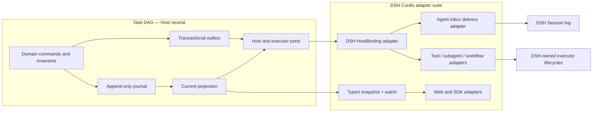
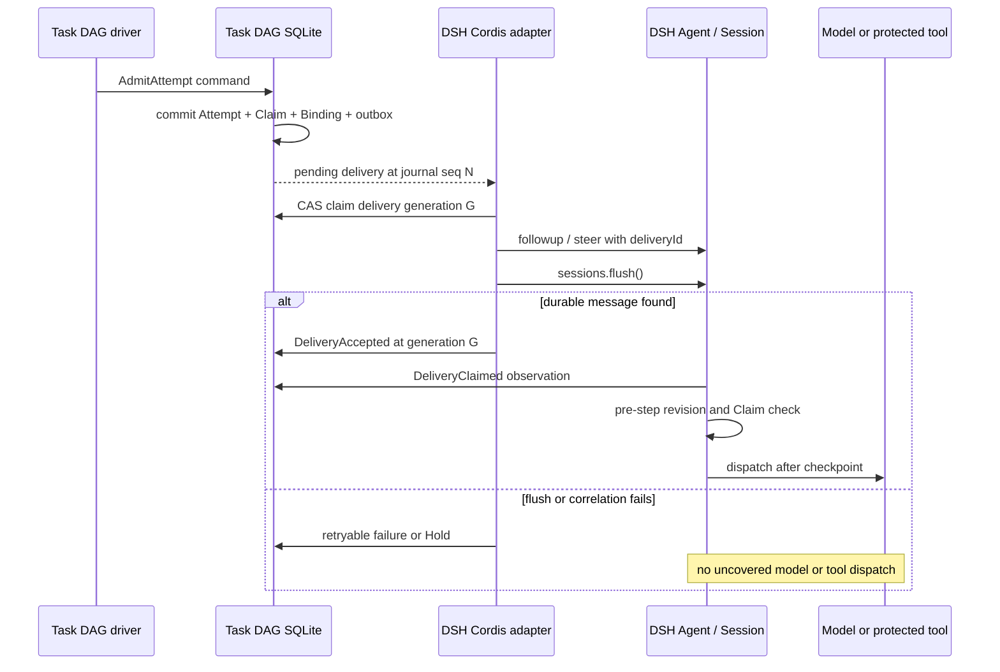

# G14 — Durable events, projection, and Host/Client boundary

**Type**: grilling
**Status**: resolved 2026-09-16
**Blocked by**: [G13 ExecutionAttempt and correlation protocol](G13-task-work-correlation.md) ✅, [G19 Cordis outer-loop driver](G19-cordis-outer-loop-driver.md) ✅
**Blocks**: [G15 Current client placement](G15-current-client-placement.md), [R5 G6 renderer adapter stability](R5-g6-renderer-adapter-stability.md), [G11 DAG view simplification strategies](G11-dag-view-simplification-strategies.md), [G18 Community package and bundle topology](G18-community-package-and-bundle-topology.md)

## Question

What required session events and Host projection preserve the Plan DAG without client-side replay or duplicate authorities?

Define event granularity, complete post-change values, schemas, projection key and `stateVersion`, mutation serialization, append-and-flush commit, and replay for Plan Runs, proposed and committed revisions, Tasks, Attempts and groups, layered revisions, holds, budgets, Stop Reasons, completion proposals, assurance verdicts, output references, and interrupted attempts. Also define bounded history, renderer-neutral wire values, SDK projection, and snapshot coverage.

React reads the normal projection and owns only selection, zoom, filters, disclosure, and renderer lifecycle. Authoritative events are required-on-read.

Holds remain the authoritative admission barriers and carry release condition, release authority, and automatic/explicit resume mode. The driver records each transition from runnable to quiescent as an append-only `RunStopRecord` with one core stop code plus references to every contributing Hold, Task, or Attempt; it does not create a second active blocker state. Resume appends a record linked to the stop record after all current blockers and revisions are rechecked. Define the minimal closed first-release stop-code taxonomy, projection of the current stop and history, client localization, and replay behavior without allowing plugin-specific opaque codes to bypass compatibility.

## Inputs from the G13 resolution

[G13 ExecutionAttempt and correlation protocol](G13-task-work-correlation.md) requires the projection to keep `ExecutionAttempt`, authoritative `ExecutionBinding`, non-authoritative `ExecutionObservation`, `OutputRef`, `EvidenceRecord`, control requests, late results, and `ExternalEffect` as distinguishable values. Each ordinary Attempt has one primary Binding; Binding phase is `dispatching | running | settled`, while Attempt phase and outcome remain separate. The projection preserves branded identities, Task-level `attemptNo`, `retryOfAttemptId`, Claim generation, Plan mutation provenance, reserved Attempt Group identity, Binding parentage, typed native references, command idempotency, and durability watermarks. Attempt settlement atomically releases the Claim and creates completion or failure facts; observations and late results cannot authorize settlement, and external-effect certainty may converge after settlement without reopening terminal Task state.

## Inputs from the G19 resolution

The event and projection design must distinguish executor-owned semantic grounding from Task Graph authority. For a data-agent Attempt it records the selected data scope and stable metric/concept definition references or content digests that affected model input, plus a correlated clarification request when multiple valid meanings remain; it does not copy the semantic layer or Ontology graph. It also persists `onNoProgress`, replan-budget reservation and consumption, the Run-scoped context reference for an automatic affected-subgraph replan, and the resulting Hold or Plan revision.

## Resolution

The Task DAG is an independent domain, persistence, projection, and execution-coordination system. DSH is its first Host integration through public Cordis services and adapters; Task DAG authority does not live in DSH Session events or `sessionProjections`, and the feature requires no upstream DSH source change.

### Domain and Host boundary

`Plan DAG` names one committed Plan revision's Tasks, hard dependencies, declared order, inputs, outputs, and required terminal Tasks. `Task Graph` names the complete runtime authority: the Plan DAG plus Claims, Attempts, Bindings, observations, control requests, outputs, evidence, external effects, Holds, budgets, proposals, verdicts, stop records, resume records, and Host deliveries.

The Task DAG domain and store interfaces import no Cordis, DSH Session, Agent, tool, subagent, workflow, Typert, or renderer types. They expose commands, immutable records, current projections, watch cursors, executor ports, model-input deliveries, and generic Host Bindings. DSH-specific packages implement those ports and may declaration-merge DSH types only inside the adapter packages.

A `PlanRunId` is independent of every Host conversation identity. A generic `HostBinding` records a branded `HostBindingId`, Host kind, opaque native reference, role, phase, and generation. The DSH adapter maps one active primary Host Binding to a Session and Agent. One Plan Run has at most one active primary binding in the first release; one DSH Session may retain links to historical Runs but drives at most one active Run. Subagent, workflow, skill, and tool executions remain Attempt executor Bindings rather than primary Host Bindings.

Closing or losing a DSH Session does not delete a Plan Run. The adapter records an unavailable Host Binding and creates a `HostUnavailable` Hold. A Session fork does not clone or co-own an active Run; an explicit future clone operation creates a new `PlanRunId` and provenance.

### Task Graph journal and complete-value commits

Every successful mutating command appends exactly one `TaskGraphCommit` to the Task DAG journal. The first domain payload generation is version 1 and records a branded commit identity, the idempotent command identity, actor and causation provenance, `PlanRunId`, accepted Plan/Task/Attempt revisions and Claim generations, resulting revision watermarks, payload digest, and an ordered closed union of changes.

Each change carries the complete post-change value of its record. The union covers Plan Runs, revision proposals, committed Plan revisions, Tasks and dependency records, Claims, Attempts, reserved Attempt Groups, executor Bindings, non-authoritative observations, control requests, OutputRefs, EvidenceRecords, ExternalEffects, completion proposals, assurance verdicts, Holds, budgets, RunStopRecords, RunResumeRecords, Host Bindings, model-input deliveries, delivery receipts, and late results. Persisted identities are never deleted or reused; records become released, settled, rejected, superseded, cancelled, failed, detached, or otherwise terminal with provenance.

Plan, Task, Attempt, Binding, Hold, budget, delivery, and Claim revisions remain distinct branded values. A commit records every revision it validated and advanced. The store validates all changes against a transaction-local draft and publishes the new projection only after the complete commit succeeds, so admission, settlement, replan, Hold transitions, budgets, command receipts, and outbox entries cannot partially commit.

Unknown record versions, unknown change kinds, invalid complete values, stale or discontinuous revisions, illegal transitions, reused identities, and broken references fail closed. Domain payload versions change only with record fields or semantics; projection versions change with fold semantics; SQLite `SCHEMA_VERSION` changes with physical tables or constraints.

### SQLite provider, projection, and outbox

The first provider owns one configured SQLite database and exposes the Host-neutral `TaskGraphStore` interface. The authoritative `journal` table stores ordered complete-value commits. `command_receipts` stores command payload digests and prior results for idempotency. `outbox` stores durable Host and executor deliveries. `projection_checkpoints` accelerates reads and may be discarded and rebuilt from the journal.

One SQLite transaction reads the current projection, authenticates the actor, validates every relevant revision and invariant, inserts the journal commit and command receipt, inserts or changes outbox rows, updates the checkpoint, and commits. Repeating one command id with the same payload returns its prior result; reusing it with different content fails closed. The service serializes commands per Run and relies on SQLite transaction isolation and revision checks across Runs.

The journal retains every first-release commit. The Host projection keeps the complete active Run and compact identity or idempotency indexes required for safe commands. Client values include the active Run within its configured execution and replan budgets, bounded recent Stop/Resume history, bounded completed-Run summaries, omitted counts, and the oldest retained journal sequence. Full history navigation and physical compaction remain in [G28 History, trace, and plan inspection](G28-history-trace-and-plan-inspection.md).

### Transactional outbox and DSH delivery

A transactional outbox is a durable table of work that must be delivered after the Task DAG transaction commits. It is not an external message broker. Admission of a current-Agent Attempt creates one `ModelInputDelivery` in the same SQLite transaction as the Attempt, Claim, Binding, and budget changes. The delivery stores a stable `deliveryId`, Host Binding, delivery mode, exact Host-neutral model input, content digest, Plan/Task/Attempt identities, revisions, Claim generation, and phase.

A DSH adapter worker claims a pending delivery with compare-and-set, a worker owner, and a monotonically increasing generation. Only the current generation may send or acknowledge it. The first release has one Task DAG service process; the generation fences concurrent asynchronous handlers and stale work after restart, not active-active multi-process ownership. Deliveries for one live DSH Session are serialized; unrelated Host Bindings and non-Agent executors may progress concurrently.

Before enqueue, the adapter materializes one DSH `UserMessage` and uses a merge-extensible `task-attempt` MessageSource carrying the source-owned `deliveryId`, Run, Task, Attempt, revision, Claim, and digest correlation. `deliveryId`, not DSH `MessageId`, is the idempotency identity; a native MessageId is retained only as an observed reference because DSH rejects duplicates only while they are simultaneously pending. `Agent.followup()` and `Agent.steer()` return `void`, so synchronous inbox submission is never treated as durable acknowledgement.

The adapter enqueues the message into a live Session, calls `ctx.sessions.flush(session)`, requires that at least one persistence listener participated, and then checks the live or persisted Session for the same `deliveryId` in pending `agent/inbox/spliced` state or `user/message` history. It then appends `DeliveryAccepted` to the Task DAG journal with the Session, observed MessageId, and known Session sequence references. A crash after Session flush but before acknowledgement is repaired by scanning for the durable source identity and writing the missing receipt; absence permits a retry under the same delivery generation rules. A cold or detached Session is read-only until an explicit DSH adapter path resumes an Agent; the first slice instead creates a `HostUnavailable` Hold.

`agent/inbox/claimed` is a reconciliation hint, not acknowledgement: the claim removes the message before `agent/pre-step`, and DSH does not restore it if the step is rejected. Idempotent Task DAG commands may observe claim before or after `DeliveryAccepted`, but stale or rejected input receives an explicit delivery outcome and any retry creates a new delivery generation. `agent/pre-step` revalidates the active Plan revision, Task revision, Claim generation, Attempt, Host Binding generation, and cancellation state while preserving unrelated claimed messages in its returned decision. The shipped Session checkpoint policy supplies an additional durability barrier before the model adapter and top-level tool body.

Cancellation or replan invalidates unclaimed deliveries by advancing the relevant revision or Claim generation. The adapter removes a still-pending native message when possible and flushes that removal; a claimed delivery relies on pre-step fencing and normal cancellation. Late acknowledgements, messages, executor outcomes, and tool results retain their original identities and cannot authorize the current Attempt.

### Dual durable records without duplicate authority

The Task DAG journal stores planning, scheduling, verification, recovery, the canonical `ModelInputDelivery`, and its digest. The DSH Session log stores the exact message that reached the model plus DSH-owned responses, tool calls, results, and lifecycle events. The adapter links them with Host Binding, delivery, Message, Attempt, Binding, Session sequence, ToolCall, output, evidence, and digest references.

The Task DAG does not copy the complete DSH transcript or infer native lifecycles from text. DSH does not reconstruct Tasks, Holds, budgets, or completion from Session history. If the Task DAG store is missing or corrupt, the Session transcript cannot recreate authority; if the bound Session is missing, corrupt, or inconsistent, the Run enters an unavailable or reconciliation Hold. Neither side overwrites the other based on recency.

This split preserves the repository rule that every model-visible input is logged: the DSH Session contains the exact content sent to the model, while the independent Task DAG journal remains the execution authority.

### Projection, Remote transport, and Client ownership

The Task DAG projection is a synchronous, deterministic fold of its own journal. It does not consult DSH state, clocks, configuration, installed adapters, or Client state during replay. Checkpoints accelerate replay but are never authority; an unusable checkpoint rebuilds from the journal.

`TaskGraphView` is renderer-neutral JSON with a view version. Its ready variant carries the Run identity, journal sequence, active Plan revision, current and retained Run summaries, and deterministically ordered arrays for Tasks, relations, Attempts, safe executor and Host Binding summaries, delivery status summaries, Holds, budgets, Outputs, Evidence, ExternalEffects, proposals, verdicts, StopRecords, and ResumeRecords. The projection computes readiness, assurance, blocking references, current Attempt references, omitted-history counts, and current stop. It never exposes outbox payloads, credentials, secret-bearing native references, or adapter-private receipts. It carries no G6 types, layout coordinates, colors, selection, zoom, filters, disclosure, or renderer lifecycle.

The unavailable variant carries one stable cause such as `incompatible-version`, `invalid-record`, `invalid-transition`, `incomplete-journal`, `host-unavailable`, or `correlation-mismatch`, plus the failing journal sequence and supported or encountered versions when applicable. Task DAG commands and automatic execution stop while unavailable. Raw exception text remains in Host logs.

A Task DAG transport service exposes Host Binding resolution, `snapshot(PlanRunId)`, and `watch(PlanRunId, afterJournalSeq?)`. The DSH Web package ships and self-mounts its generated strict Typert Remote contribution; the gateway reconnects the carrier but Task DAG owns the opening baseline, journal replay, gap detection, watcher fan-out, and slow-consumer policy. The stock DSH SDK JSON-RPC server is closed, so G18 must package a separate Task-DAG SDK protocol/server profile and TypeScript/Python companion clients if those clients ship in the first release. All transports share the same JSON schema. A sequence gap, reconnect, or incompatible view version discards the local value and obtains a new snapshot. Whole-value delivery is the first-release correctness path; measured large-graph pressure may justify deltas later.

React owns only selection, zoom, filters, disclosure, and renderer lifecycle. A DSH conversation slot resolves the active Plan Run through the Host Binding adapter and then subscribes to the Task DAG Remote. The adapter authorizes that lookup from the current Session and client context; `PlanRunId`, `HostBindingId`, and native references are routing identities rather than credentials. If the plugin is absent, its Remote and UI contribution are absent; no empty graph is fabricated and its database is not deleted.

### Proposals, verification, Holds, and stops

`PlanRevisionProposal`, `CompletionProposal`, and `AssuranceVerdict` are immutable records. A proposal never changes Plan or Task state directly. The Task DAG service validates a Plan proposal before committing a structural revision and validates a verdict before changing Task lifecycle. Native success or model self-report may create a completion proposal but cannot complete a Task.

OutputRefs, EvidenceRecords, ExternalEffects, ExecutionObservations, control requests, and late results remain distinct. Observations and late results cannot authorize execution, consume the current budget, settle another Attempt, release a current Claim, or reopen terminal state. The journal records selected data scope and stable semantic-definition references or digests that shaped model input without copying the semantic layer or Ontology graph.

Holds are the only admission barriers. Every Hold records its typed reason, release condition, release authority, and automatic or explicit resume mode. Each transition from runnable to quiescent appends one immutable `RunStopRecord` with exactly one core code: `completed`, `held`, `budget-exhausted`, `recovery-required`, `failed`, or `cancelled`. It references all contributing Holds, Tasks, Attempts, budgets, Host Bindings, or failure facts. Resume rechecks current revisions, Holds, budgets, Claims, Attempts, deliveries, Host Binding generation, and external effects, then appends a linked `RunResumeRecord`.

Replay never infers that a non-terminal Attempt succeeded, failed, disappeared, or is safe to retry. Host or executor reconciliation appends new observations and commands. Proven non-start permits policy-controlled retry; proven completion settles normally; unknown external effects create a Reconciliation Hold. Attempt Group identities remain reserved, while first-release admission rejects group execution.

### Versioning and compatibility

The Domain Protocol version, SQLite `SCHEMA_VERSION`, TaskGraphView version, and Host Adapter compatibility are independent. Domain records and journal storage contain no DSH package version or DSH type. A Host adapter declares the Task DAG protocol range it supports, the DSH services and methods it requires, and startup capability probes. An incompatible adapter disables its Host Binding without rewriting the Run.

Domain record evolution uses explicit adjacent decoding or migration. Unknown required record versions make the affected store or Run unavailable. SQLite schema migrations advance monotonically, preserve the original database on failure, and never open an older writer against a newer schema. View incompatibility requires a compatible Web or SDK adapter rather than Client-side guessing. A DSH API change that preserves the Task DAG ports changes only the Cordis adapter and its contract tests.

### Concurrency and recovery

The first release runs one Task DAG service process, but correctness does not depend on callback order. SQLite transactions, command idempotency, per-Run serialization, outbox compare-and-set, worker generation fencing, per-Session delivery serialization, and pre-step revision checks cover concurrent asynchronous work. DSH supplies no multi-process SQLite ownership mechanism; active-active workers, lease expiry, busy handling across processes, cross-Session work stealing, and PostgreSQL coordination remain deferred.

Recovery compares durable evidence instead of time or process memory. A pending outbox with no Session message is retried; a durable matching Session message without Task DAG acknowledgement repairs the receipt; claim-before-ack and ack-before-claim converge; a stale revision invalidates delivery; an unknown external result creates a Hold; a mismatched digest or missing store stops automatic execution.

### Verification evidence

The first-release release gate covers: SQLite crash before and after commit; outbox recovery before adapter pickup; Inbox append before Session flush; Session flush before Task DAG acknowledgement; duplicate workers and stale generations; claim and acknowledgement reordering; cancellation or Plan revision racing delivery; late results; unknown external writes; Remote reconnect and sequence gaps; version incompatibility; and missing, corrupt, or mismatched Task DAG and Session records.

Evidence includes pure domain and journal fixtures, SQLite hard-crash subprocess tests, keyless DSH Session snapshots for exact model-visible input and correlation, Web/TypeScript/Python expected TaskGraphView outputs, and focused real-provider tests only for adapter capabilities that claim real recovery. Performance benchmarks, large-graph deltas, flush batching, and active-active coordination do not block the first useful slice.

### ROI and first implementation slice

- **User benefit**: data-agent users receive durable planning, evidence-based completion, actionable Holds, and safe crash recovery without unrecorded or duplicated queries and writes.
- **Implementation and maintenance cost**: the independent core adds one SQLite journal/outbox and projection service, while every DSH-specific dependency stays in adapters instead of leaking through the domain.
- **Runtime and model overhead**: each command writes one complete-value journal commit; each model delivery writes one Task DAG outbox record and the ordinary DSH message events. Task DAG bookkeeping adds no model tokens beyond the exact task context deliberately delivered.
- **Adoption breadth**: the same core can run under DSH, another Agent Host, or a standalone service; executor and UI integrations depend on stable ports and views.
- **Evidence strength**: current DSH provides merge-extensible MessageSource values, durable Inbox events, Session flush barriers, pre-step interception, tool guards, self-mounted Typert Remote contributions, reversible Cordis effects, and Agent Teams' source-identity delivery precedent.
- **Opportunity cost**: the first slice excludes active-active schedulers, PostgreSQL, work stealing, Attempt Groups, complete history navigation, large-graph deltas, batching, and predictive scheduling.
- **Highest-ROI slice**: one semantically grounded data-agent Task commits to SQLite, durably delivers one current-Agent message through DSH, executes a query after both durability barriers, records Output and Evidence, applies a verifier verdict, exposes one TaskGraphView to Web and SDK, and ends completed or in one actionable Hold.

### Consequences and supersessions

- [G12 Plan DAG ownership boundary](G12-task-graph-authority.md) remains authoritative for domain ownership, identities, layered revisions, Task lifecycle, Holds, budgets, and verification; its Session-scoping language is interpreted through Host Bindings rather than Session-owned persistence.
- [G13 ExecutionAttempt and correlation protocol](G13-task-work-correlation.md) remains authoritative for Attempts, Claims, Bindings, execution tickets, outputs, evidence, cancellation, and late results; references to a required Session event now mean one atomic TaskGraph journal commit, while DSH Session flush applies only to model/tool delivery.
- [G19 Cordis outer-loop driver, verification, and budgets](G19-cordis-outer-loop-driver.md) remains authoritative for scheduling and continuation policy; the driver reads and mutates the independent Task DAG service, and its DSH adapter supplies inbox, pre-step, tool, and checkpoint integration.
- [R7 DSH Cordis plugin adaptation](R7-dsh-cordis-plugin-adaptation.md) remains authoritative for public Cordis integration but is superseded where it placed Task Graph authority in Session events or ordinary Session projections.
- [G15 Current client placement](G15-current-client-placement.md) consumes Host Binding resolution and Task DAG Remote values rather than `useProjection('taskGraph')`.
- [R5 G6 renderer adapter stability](R5-g6-renderer-adapter-stability.md) and [G11 DAG view simplification strategies](G11-dag-view-simplification-strategies.md) consume renderer-neutral TaskGraphView values.
- [G18 Community package and bundle topology](G18-community-package-and-bundle-topology.md) fixes the independent core/store packages, DSH adapter packages, SQLite path and retention defaults, Remote/SDK packaging, compatibility probes, migration, backup, and installation policy.
- [G20 First-release scope, compatibility, and evaluation](G20-v1-scope-and-evaluation.md) evaluates the dual-store crash matrix, concurrency fencing, false completion, duplicate-effect prevention, current-state usability, and adapter isolation.
- [G22 Cross-session and multi-agent scheduling](G22-cross-session-multi-agent-scheduling.md), [G23 Recovery and external-effect reconciliation](G23-recovery-and-external-effect-reconciliation.md), [G24 Advanced routing, parallelism, and optimization](G24-advanced-routing-and-parallelism.md), [G27 Execution Ledger extraction threshold](G27-execution-ledger-extraction.md), and [G28 History, trace, and plan inspection](G28-history-trace-and-plan-inspection.md) retain multi-process, advanced recovery, optimization, extraction, and history work.

## Comments

- 2026-09-15：用户确认以单个 required-on-read `task-graph/commit` 作为一次成功 Task Graph 命令的原子持久化单元。事件记录 schema/commit identity、actor 与命令来源、提交前后 revision，以及事务涉及实体的完整变更后值，不使用字段 delta，也不把 Claim、Attempt、Binding、预算等同一状态迁移拆成多个 Session events。Session 级 mutation queue 串行完成 read-check-append；只有 `ctx.sessions.flush()` 成功后，调用方才能报告成功或触发 SQL、数据工程作业等外部执行。

- 2026-09-15：用户确认首版注册 `taskGraph` projection（初始 `stateVersion: 1`）。Host fold 保留命令校验、恢复与继续调度所需的全部当前权威状态；Client wire view 提供当前 active Plan Run、当前 Tasks、预算范围内的 Attempts、Bindings、Outputs、Evidence、Holds、当前 StopRecord 与有限的近期 Stop/Resume 记录。已结束 Plan Run 仅保留轻量 summary，完整提交历史仍由 Session log 持有。历史上限在 Plan Run 创建时作为持久化 limits 固化，保证配置变化后 replay 仍确定；React 只拥有选择、缩放、过滤、展开与 renderer lifecycle。

- 2026-09-15：用户确认首版 `RunStopRecord` 采用闭合 core taxonomy：`completed | held | budget-exhausted | recovery-required | failed | cancelled`。具体原因通过 typed Hold、Task、Attempt、Budget 或 failure classification 引用表达，executor/plugin 不得增加 opaque stop code。Hold 仍是唯一 admission barrier；每次 runnable → quiescent 追加不可变 StopRecord，恢复前重检 revisions 与 blockers，再追加关联原 StopRecord 的 `RunResumeRecord`，不修改历史记录或建立第二套 blocker 状态。

- 2026-09-15：用户按推荐确认首版为 TypeScript/Python SDK 提供只读 `TaskGraphView` snapshot + watch。Web 与 SDK 共享 renderer-neutral JSON schema；SDK transport 从 Host projection registry 输出带 `asOfSeq` 与 `stateVersion` 的完整值更新，不通过重放 `task-graph/commit` 计算 readiness、Hold 或 completion。SDK mutation、完整历史查询及具体社区 package/profile wiring 不在本票决定。

- 2026-09-15：用户按推荐确认 `PlanRevisionProposal`、`CompletionProposal` 与 `AssuranceVerdict` 都是 append-only 独立记录。Proposal 不直接修改 Plan/Task；Task Graph Service 验证后产生 committed PlanRevision，只有 committed revision 改变调度前提。CompletionProposal 引用 Outputs/Evidence，verifier 追加 verdict，只有通过服务校验的 verdict 才能在同一 commit 中更新 Task 的权威完成状态。拒绝或过期记录保留用于审计，但不影响 readiness。

- 2026-09-15：用户按推荐确认 projection replay 只恢复最后耐久状态，不根据当前进程环境推断未终结 Attempt 的结果。Plan Run 激活后由 adapter reconciliation 产生新 commit：能证明已完成则 settle，能证明从未开始则记录 interruption 并允许策略创建新 Attempt；执行消失或外部结果未知时创建 `ReconciliationHold` 与 `recovery-required` StopRecord。外部副作用确定前不得自动重试，也不得改写 replay 历史或重新打开已终结 Task。

- 2026-09-15：用户按推荐确认 `task-graph/commit` payload 使用闭合 `version: 1` schema 与完整值 change union。未知 payload version/change kind、非法迁移或不连续 revision 使 `taskGraph` projection fail closed，服务拒绝读取、调度与 mutation，required event 不得部分跳过。payload 语义变化递增 event payload version；fold/checkpoint 结构变化独立递增 projection `stateVersion`。普通 required event vocabulary 扩展不升级全局 `SESSION_FORMAT_VERSION`，除非 Session envelope 等结构机制改变。

- 2026-09-15：用户按推荐确认 `TaskGraphView` 使用 renderer-neutral 规范化 JSON：Runs、Tasks、Relations、Attempts、Bindings、Holds、Outputs、Evidence 与 StopRecords 分别为稳定 branded ID 数组，并采用协议规定的确定顺序。Host 提供只读 readiness、assurance、阻塞与 current Attempt 等派生值；executor 仅贡献 typed native references。wire 不携带 G6、坐标、颜色、折叠状态或 executor 内部 lifecycle，renderer adapter 只从 view 派生展示值。

- 2026-09-16：用户确认首版发布门槛包含六类 keyless Session snapshots：问数成功闭环、语义澄清 Hold/Resume、Plan revision 与 stale-base 拒绝、flush/dispatch 崩溃恢复、取消后的 late result 隔离，以及未知 schema/非法 revision 的 fail-closed 兼容性拒绝。每类同时验证 Host projection、Web wire view、TypeScript SDK 与 Python SDK 输出；unit tests 另覆盖 change schemas、确定排序、history limits、CAS/idempotency 和 Stop/Resume 引用。性能、超大 DAG 与 flush batching benchmark 不阻塞首个切片。

- 2026-09-16：用户在 data-agent 问数与覆盖写入场景说明后确认 live projection 可先显示当前进程已接受的状态，但外部执行必须等待 flush barrier。projection 暴露 `acceptedThroughSeq`；mutation 仅在 `ctx.sessions.flush()` 成功后返回 `durableThroughSeq`。driver/adapter 只派发 commit seq 不高于 durable watermark 的 Binding，Client projection 不构成 dispatch authorization；冷启动 durable prefix 的 accepted watermark 同时是恢复时 durable watermark。flush 失败沿用原 idempotent command/commit 重试，不创建第二 Attempt 或触发外部操作。

- 2026-09-16：用户确认术语边界：`Plan DAG` 仅指某个 committed Plan revision 的 Tasks、hard dependencies、计划顺序与任务定义；`Task Graph` 指包含 Plan DAG 以及 Claims、Attempts、Bindings、Outputs、Evidence、Holds、Budgets、StopRecords 与 assurance 的完整运行时权威。服务、事件与 projection 使用 `taskGraph` 命名；UI 可称“执行计划”或 Plan DAG，但不把运行状态混入 Plan revision。

- 2026-09-16：用户确认 `TaskGraphView` 顶层显式区分 `ready` 与 `unavailable`。replay 遇到 incompatible version、invalid event、invalid transition 或 incomplete history 时，Host 停止调度与 mutation；Web 清除可能误导的旧 DAG 并显示本地化恢复建议；SDK 返回结构化 unavailable 状态。失败 event seq 与版本信息进入 wire，原始异常仅留 Host 日志；不得把 replay failure 表示为空图。

- 2026-09-16：源码核验重新打开 required-event 前提。`KNOWN_SESSION_EVENT_TYPES` 由 `scripts/gen-persistence-catalog.ts` 仅从当前仓库的 `SessionEventMap` 声明静态生成；`packages/core/session/src/known-event-types.ts` 明确说明 out-of-repo plugin events 不在目录中，且当前没有运行时 event-name registration。持久化读取只接受目录内事件，或带 `ignorable: true` 的未知外部事件。Task Graph 事件会改变恢复、调度与模型输入，不能诚实标为 ignorable；因此当前发布版 DSH 无法同时满足“社区插件、required `task-graph/commit`、无上游前置能力”三项约束。

- 2026-09-16：用户拒绝任何 Task DAG 所需的上游 DSH 源码改动。Task DAG 必须先形成独立的领域、持久化、projection 与执行协议，再通过 Cordis adapter 使用当前公开 DSH 能力；DSH 后续变化只应影响 adapter，Task DAG 核心应可独立运行或迁移到其他 Host。该决定重新打开先前“required `task-graph/commit` 写入 Session log”和“通过普通 `sessionProjections` 承载权威 Client view”的假设。

- 2026-09-16：用户确认采用独立 Task DAG 内核加 Cordis Host adapters。Task DAG domain、append-only journal、projection、commands 和执行协议不依赖 DSH；DSH 首版通过插件自有 SQLite store、transactional outbox、Agent/Session/executor adapters、Typert Remote 和 Client/SDK adapters 接入。Task DAG journal 是 Plan/Task/Attempt/Hold/Budget/StopRecord 权威；DSH Session log 仅记录实际进入模型的内容与 DSH 自有事件。未来独立部署或 DSH API 变化只替换 Host adapter，不重写领域和持久化核心。

- 2026-09-16：用户确认 DSH bridge 使用可恢复 outbox handshake。Task DAG SQLite 原子提交 delivery；worker 以 compare-and-set、owner lease 与递增 generation 抢占，同一 DSH Session 串行投递。delivery 保存稳定 identity、完整模型输入、digest 与 Plan/Task/Claim revisions；adapter 通过带 correlation 的 MessageSource 投递，flush Session 后双向检查 Inbox/`user/message` 再记 acknowledgement。`agent/inbox/claimed` 与 acknowledgement 可乱序幂等合并，`agent/pre-step` 再做 revision fencing；取消、重复 worker、flush 后崩溃、迟到结果与外部效果未知均通过 identity、generation 和 reconciliation fail closed。

- 2026-09-16：用户确认 Task DAG 以通用 Host Binding 关联 DSH。`PlanRunId` 与 DSH `SessionId` 独立；Task DAG core 仅持有 `HostBindingId`、Host kind、opaque native reference、用途、状态和 generation，DSH adapter 解释 Session/Agent 引用。首版每个 Plan Run 同时只有一个 active primary Host Binding；Session 可先后关联多个历史 Runs，但只驱动一个 active Run。Session 不可用时保留 Plan Run 并创建 HostUnavailable Hold；fork 不自动复制 active Run，显式 clone 才创建新 `PlanRunId`。

- 2026-09-16：用户确认独立存储采用 append-only journal、可重建 projection/checkpoint 与 transactional outbox。首版插件自有 SQLite 在同一事务中提交完整 `TaskGraphCommit`、command receipt、outbox records 和 projection checkpoint；journal 是权威，projection/checkpoint 可重建。journal payload version、projection version 与单调 SQLite `SCHEMA_VERSION` 分离。Task DAG domain 仅依赖 `TaskGraphStore` 接口，后续可增加独立 PostgreSQL 等 provider 而不改领域协议。

- 2026-09-16：用户确认 Task DAG 自有 projection 通过 Typert Remote `snapshot + watch` 服务 Web 与 TypeScript/Python SDK，不使用 DSH `sessionProjections` 作为 Task Graph transport。Remote 以 `PlanRunId` 和 Task DAG `journalSeq` 定位，watch 发送完整 baseline 后按 commit 发布完整值；Client 遇到序号缺口、重连或 view version 不兼容时重新 snapshot。DSH Session slot 仅通过 Host Binding 解析 active PlanRun；React 只保留 presentation state。超大图增量压缩在测量后优化。

- 2026-09-16：用户确认 Task DAG journal 与 DSH Session log 分工。Task DAG journal 保存计划、执行控制、delivery 规范输入/digest、Attempts、Holds、预算与验收；DSH Session log 保存实际进入模型的完整消息、模型响应、工具调用和 DSH 生命周期。adapter 以 HostBinding、delivery/message identities、Session seq、ToolCallId、Outputs/Evidence refs 与 digests 关联两侧，不复制完整 transcript，也不从任一侧猜测重建另一侧权威。任一存储缺失、损坏或关联不一致时进入 unavailable/reconciliation 并停止自动执行。

- 2026-09-16：用户确认版本分层：Task DAG Domain Protocol、SQLite `SCHEMA_VERSION`、`TaskGraphView` version 与 Host Adapter compatibility 独立。journal/domain 不记录或导入 DSH 版本；adapter 声明支持的 Task DAG protocol、DSH capability 范围并在启动时 probe。DSH API 变化只更新 adapter；领域 record 变化走相邻 decoder/migration；SQLite schema 单调迁移且失败保留原库、拒绝写入；view 或 adapter 不兼容时 fail closed，不重写 Plan Run。

- 2026-09-16：用户确认首版发布门槛覆盖 Task DAG/DSH 双存储崩溃矩阵与竞态：SQLite commit 前后、outbox 读取、Inbox append/flush、acknowledgement、重复 worker CAS/generation、claim/ack 乱序、Plan revision/取消竞争、late result、unknown external effect、Remote seq gap、版本不兼容和任一存储/correlation 损坏。证据分为纯 domain/journal fixtures、SQLite hard-crash 子进程、keyless DSH Session snapshots、Web/TS/Python view outputs 与少量 provider adapter e2e；吞吐和大图优化后置。

- 2026-09-16：用户确认首个实现切片保持长期独立架构，但只证明单 data-agent Task 闭环：DSH-neutral domain、SQLite journal/outbox/projection、一个 primary DSH Session/current-Agent lane、问数执行、Outputs/Evidence/verdict、Holds/StopRecord、Web/SDK watch 与并发/崩溃测试。首版为单 Task DAG service 进程，仍实现同进程 CAS、generation fencing、Session 串行 delivery 和安全 executor 并发；active-active 多进程、PostgreSQL、跨 Session 调度、Attempt Groups、batching、大图增量与历史浏览进入既有 Follow-up。

- 2026-09-16：用户确认 G14 的共同理解以独立 Task DAG 架构为准，并明确要求同步更新 map、并行审计已结束票据的矛盾。早期 required Session event 与 `sessionProjections` 假设由后续独立 journal、Host Binding、outbox、Task DAG Remote 和双存储 correlation 决策取代。

- 2026-09-16：三个并行 subagent 完成一致性与可行性审计。已结束票据的当前状态已统一标明：保留 Task/Attempt、verification、Holds、scheduling、UI interaction 等 Host-neutral 决策；明确废止 Session-owned Run、required external Session events、`sessionProjections` 权威、Session flush 作为 Task DAG durability，以及 DSH-native identities 进入 core。可行性审计还把 delivery idempotency 收窄为 source-owned `deliveryId`，将 `agent/inbox/claimed` 降为 reconciliation hint，限制首版为单 Task DAG service 进程，并要求 Web 自挂 Typert Remote、SDK 使用独立 companion protocol/profile。
