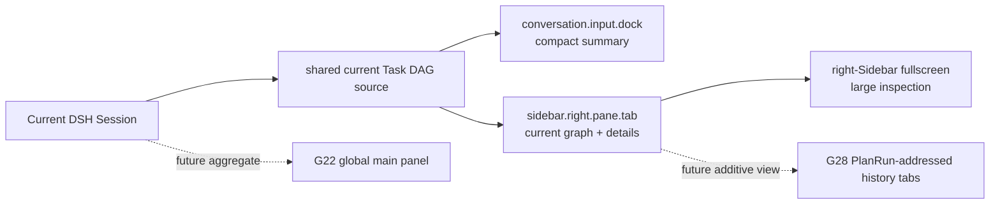

# G15 — Current client placement for task orchestration

**Type**: prototype
**Status**: resolved 2026-09-16
**Assignee**: Codex · 2026-09-16
**Blocked by**: [G14 Durable events, projection, and Host/Client boundary](G14-task-graph-projection-boundary.md)
**Blocks**: [R5 G6 renderer adapter stability](R5-g6-renderer-adapter-stability.md), [G4 Animation and edge design](G4-animation-and-edge-design.md), [G20 First-release scope, compatibility, and evaluation](G20-v1-scope-and-evaluation.md)

## Question

Which public DSH client slots should host the compact summary, normal graph, and larger inspection view?

Prototype `conversation.input.dock` with a session-owned right-sidebar tab/fullscreen view, a global sidebar/main panel, and a deliberate hybrid. Retain G2 interaction goals without patching upstream layout or using a root overlay as a window system. Verify session ownership, focus, keyboard behavior, narrow layouts, remount recovery, and explanation of ready, blocked, attempts, verification, and replan states.

The first release is current-state only: current Tasks, Attempts, Holds, portable budgets, verification, and the latest RunStopRecord. It does not build Plan/replan/stop history navigation or a trace explorer; those remain in G28 even though the Task DAG journal retains the facts. Human controls reuse existing Queue/Steer/Cancel UI, and explicit BTW may ship only by reusing an existing one-shot fork with empty tool authority rather than adding a new Session subsystem.

## Research

- [Existing Task DAG UI prior art](../research/G15-existing-task-dag-ui-prior-art.md)
- [Current DSH client-placement prototype](../prototype-g15-current-client/README.md)

## Inputs from the G13 resolution

[G13 ExecutionAttempt and correlation protocol](G13-task-work-correlation.md) requires the Client to distinguish authoritative execution from observation: show one primary Binding per Attempt with expandable child Bindings, present OutputRefs separately from EvidenceRecords, expose Binding dispatch state, cancellation progress, late-result status, external-effect certainty, and reconciliation Holds, and render observational links with a visibly non-authoritative treatment. Client state must not promote an Observation, infer completion, or collapse cancellation requests, executor outcomes, verification, and Task lifecycle into one status. A late result may be offered for explicit reuse but never appears as automatic Task progress.

## Inputs from the G14 resolution

The Client resolves the active `PlanRunId` from the current DSH Session through the Host Binding adapter, then consumes the Task DAG package's own `snapshot + watch` Remote. It does not use `useProjection('taskGraph')`, replay Session events, or receive outbox payloads and secret-bearing native references. The view exposes safe renderer-neutral current values and an explicit unavailable state; React owns presentation state only.

## Resolution

**Resolved 2026-09-16: use one Session-owned current-state surface with three presentation depths.** The user accepted the prototype and delegated the final architecture judgment after reviewing the normal and fullscreen flows. The [prior-art and architecture audit](../research/G15-existing-task-dag-ui-prior-art.md) found this to be the architecture-optimal base under current DSH constraints, not a temporary placement compromise.

### Placement

1. **Compact summary:** register one additive, Session-scoped row in `conversation.input.dock`. It names the active or held Task and shows completed, ready, and blocked counts. It renders nothing when the Session has no active Task DAG binding; a known binding with failed loading renders an explicit unavailable state rather than an empty graph.
2. **Normal graph:** register one parameterless right-Sidebar page type and body in `sidebar.right.pane.tab`. `ctx.sidebarRight.openTab(kind)` opens or focuses one stable current-state tab per Session. The page follows the Session's active `PlanRunId`; it does not use `PlanRunId` as current-tab identity.
3. **Large inspection:** use the right Sidebar's built-in fullscreen presentation. Do not register a Task DAG-owned `shell.overlay`, modify `AppFrame`, or build another window manager. Narrow layouts use the right Sidebar's existing automatic fullscreen behavior.

`details.aux`, the root left navigation, and a global `main` panel do not host the current graph. Their ownership and navigation models do not match one current Session and active Plan Run.

### Client ownership

A private Client adapter keyed by Session and active Plan Run owns Host Binding resolution, one lazy `snapshot + watch` subscription, cancellation, sequence-gap recovery, and `absent | loading | ready | unavailable` state. The summary and tab consume selectors over the same observable value, avoiding duplicate Remote streams. This adapter caches and transports recoverable values; the Task DAG journal remains authoritative.

The right Sidebar owns panel layout. The Task DAG tab owns only selection, filters, focus, and graph viewport. On Session or active-Run change, selection survives only when its Task identity still exists. Browser reload may collapse the panel and reset presentation state; reopening obtains a fresh authoritative snapshot. A Remote gap, incompatible view, damaged correlation, or unavailable Host clears potentially misleading graph data and shows the structured unavailable reason.

The summary is a semantic button activated by Enter or Space. The right Sidebar retains its WAI-ARIA tab-strip navigation; the graph body supplies a roving tab stop for Tasks, arrow-key movement, Enter or Space for selection, and a visible focus indicator. Fullscreen remains controlled by the right-Sidebar chrome. The Task DAG plugin must not install a global Escape handler or reimplement panel focus rules; any such shortcut belongs to the right-Sidebar subsystem for every tab type.

### Information hierarchy

Tasks are the first-release graph nodes. Attempts, the primary and child Bindings, dispatch and cancellation state, OutputRefs, EvidenceRecords, verification, Holds, budgets, external-effect certainty, late results, and the latest RunStopRecord appear in current Task details without being collapsed into one status. Observations remain visibly non-authoritative. A late result never appears as automatic Task progress.

The first release reuses existing Queue, Steer, Cancel, and one-shot child controls. It does not add Task editing, Plan history, trace navigation, split-pane requirements, floating-window requirements, persistent viewport state, or continuous animation requirements.

### Evolution

[G28 History, trace, and plan inspection](G28-history-trace-and-plan-inspection.md) may add resource-addressed tabs whose content identity includes `PlanRunId`; it must not overload the one-per-Session current page. [G22 Cross-session and multi-agent scheduling](G22-cross-session-multi-agent-scheduling.md) may add a root-scoped global panel as an aggregate view without moving the current graph. [G16 Model tools and preset composition](G16-todo-coexistence-and-preset-composition.md) decides Todo coexistence, while R5, G11, and G4 own the renderer, simplification, and motion layers.

The [current placement prototype](../prototype-g15-current-client/README.md) verifies the normal and fullscreen views, two-Session isolation, Hold explanation, Attempt/Binding/Evidence separation, narrow-layout fullscreen, watched updates, and recovery after presentation-state loss. It deliberately keeps the renderer replaceable.
