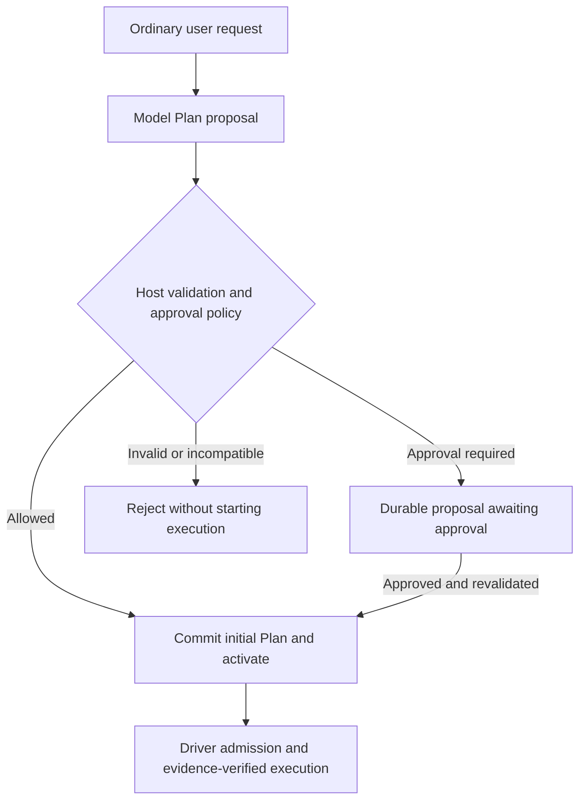
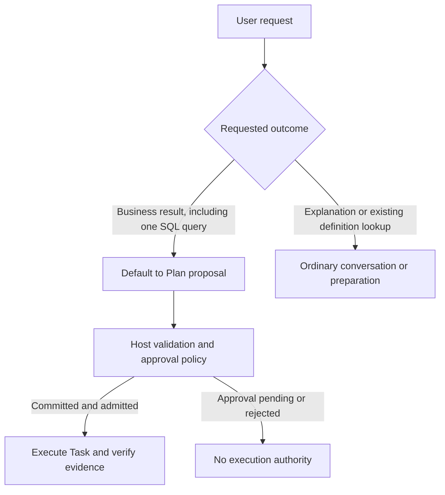
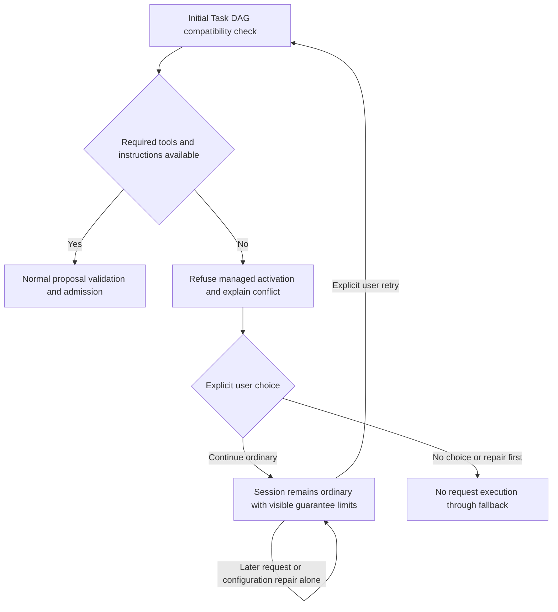
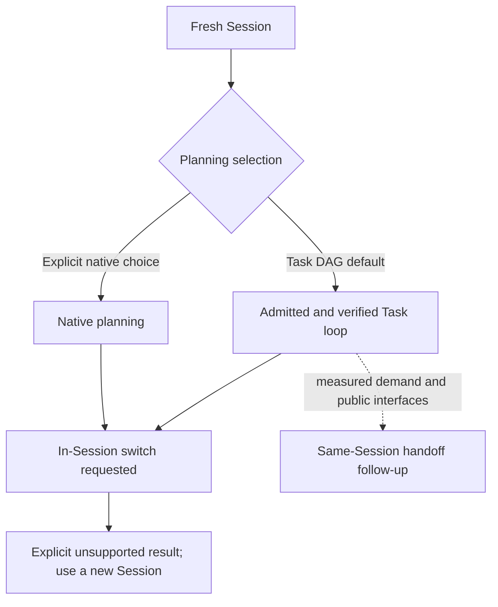
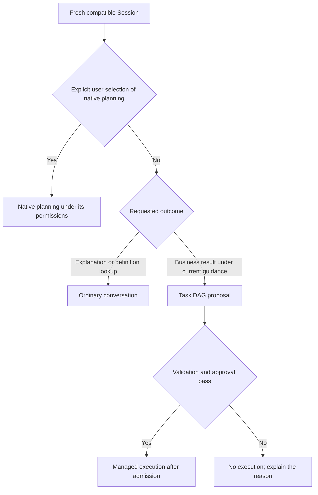
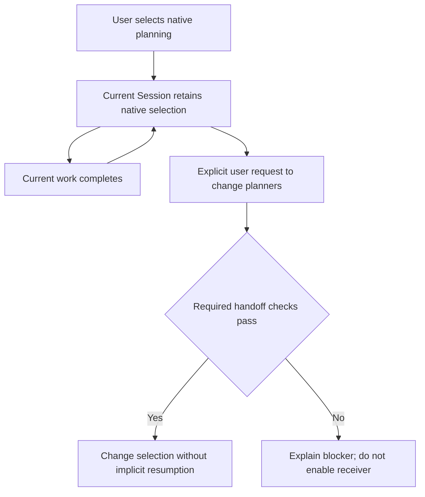
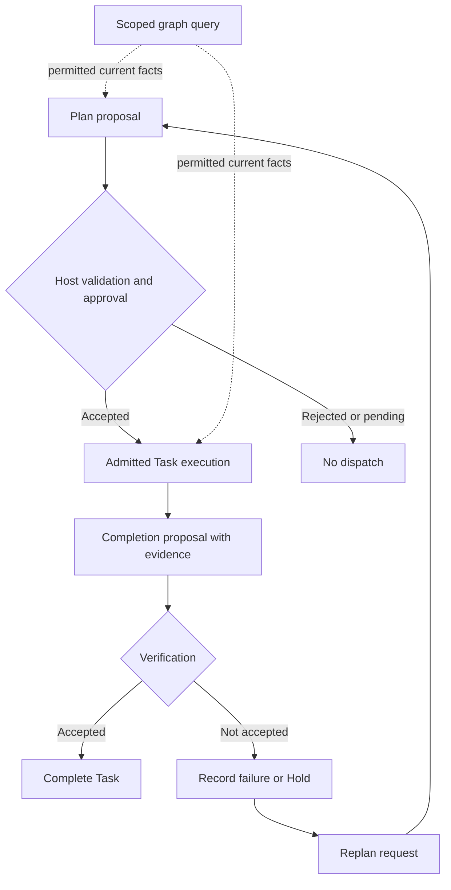
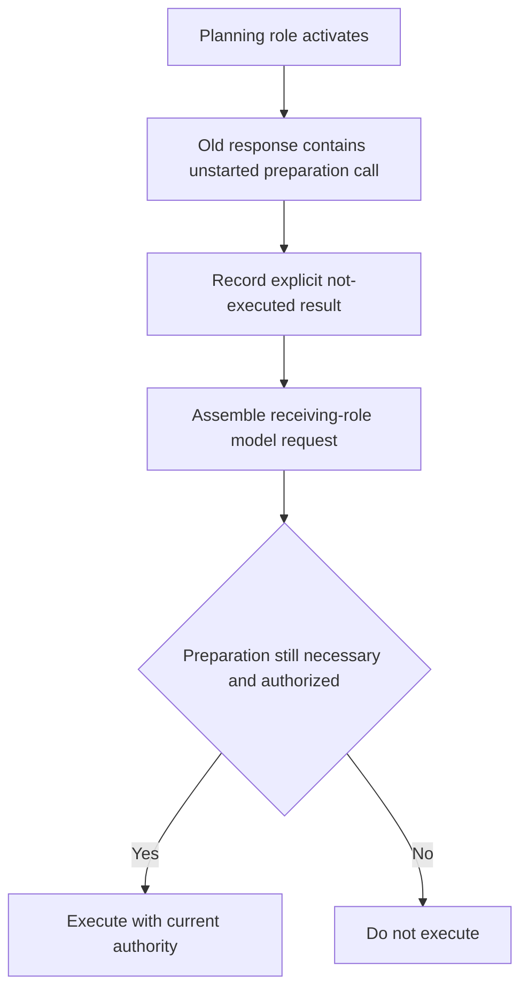
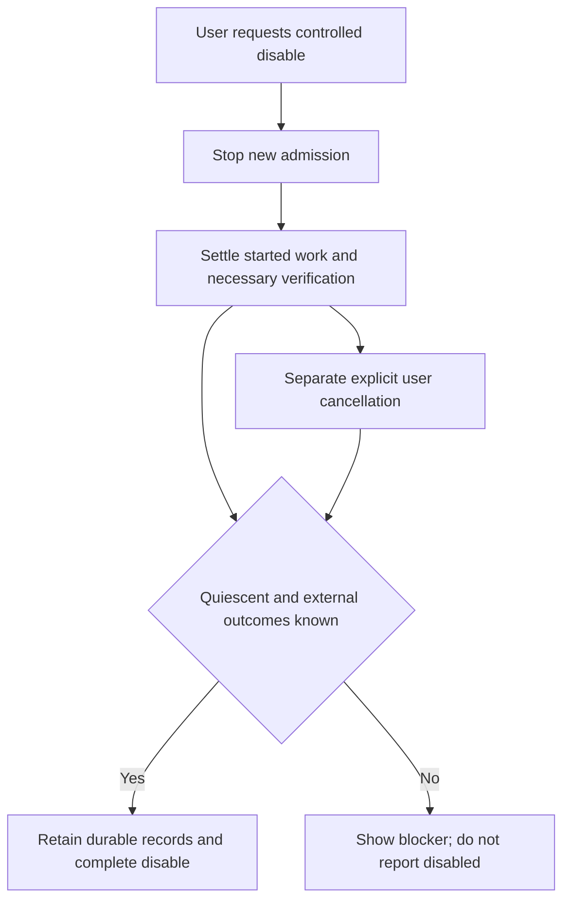
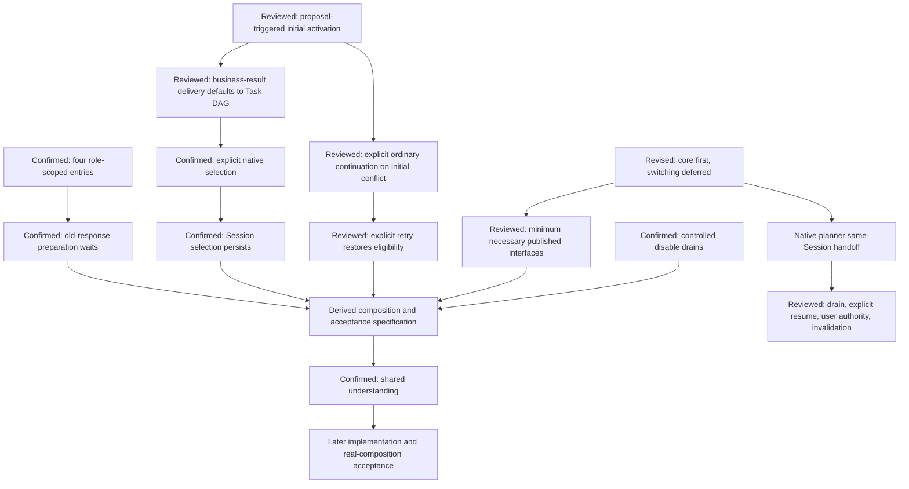

# G16 — Model tools and cross-preset composition

**Type**: grilling
**Status**: resolved 2026-09-23
**Assignee**: QwenWork continuation explicitly requested by the user on 2026-09-23; shared understanding confirmed after the ordered review.
**Current standing**: four role-scoped model intents, durable Session planner selection, core-first managed execution, cross-preset composition, and explicit acceptance obligations are specified. Full same-Session native-planner transfer belongs to [Native planner same-Session handoff](G40-native-planner-session-handoff.md). This is a planning resolution, not a product implementation or a passing integration test; [Executor adapters](G17-native-source-adapters.md) remains unresolved.
**Blocked by**: [G19 Cordis outer-loop driver](G19-cordis-outer-loop-driver.md) ✅, [G7 writeScopes conflict semantics](G7-writescopes-conflict-detection.md) ✅, [G25 Data-agent inner orchestration after Task DAG](G25-phase-gate-integration.md) ✅
**Blocks**: [G18 Community package and bundle topology](G18-community-package-and-bundle-topology.md), [G20 First-release scope, compatibility, and evaluation](G20-v1-scope-and-evaluation.md)

## Question

What model-facing tools and Cordis composition let the generic Task DAG capability add writable planning to any DSH Agent without becoming a preset, patching preset files, or creating ambiguous overlap with Goal, Todo, Plan Mode, and preset-owned execution policies?

Decide Task DAG activation, proposal and approval, query, completion-proposal and replan operations, service-owned transitions, actor views, cross-preset tool visibility, prompt guidance, and native planning-tool coexistence.

Define the DSH-native tool-policy contribution contract without changing upstream `ToolDefinition`. Ordinary tools remain registered on `ctx.tools`; optional Task DAG companion contributions classify L0–L2 effects and resolve resources, costs, read/write scopes, external-effect safety, retry behavior, cancellation/reconciliation coverage, and output/evidence mapping. Host policy may only tighten the result, and an unclassified tool fails loud only when used through a Plan-DAG Attempt.

## Inputs from prior decisions

The duplicated assumptions and phase-gate evidence gap are recorded in [G16 cross-preset and phase-gate consistency audit](../research/G16-preset-phase-gate-consistency-audit.md).

[G3 Preset-orthogonal Task DAG distribution](G3-preset-universality-strategy.md) fixes distribution: an independent Bundle installs one generic capability across presets, with no Task DAG preset and no preset patch.

[G13 ExecutionAttempt and correlation protocol](G13-task-work-correlation.md) fixes the model-facing authority boundary: Task objectives and acceptance criteria may be visible, but `ExecutionTicket`, Claim generation, revision fences, Binding identity, and cancellation authority are Host-injected. A `task-attempt` turn binds to exactly one Attempt, while ordinary turns may perform non-Plan work.

[G19 Cordis outer-loop driver](G19-cordis-outer-loop-driver.md) makes Task DAG the only cross-turn continuation owner while a Plan is active. Semantic grounding precedes clarification; automatic replan budgets remain Host-owned. Existing executor-local policies may run inside an Attempt but do not own the next Task.

[G25 Data-agent inner orchestration after Task DAG](G25-phase-gate-integration.md) excludes the complete phase state machine from the target architecture. Data-agent grounding, query admission, SQL validation, and evidence checks remain private execution contributions around the ordinary Agent loop. They may filter execution tools inside an Attempt but cannot control Task DAG orchestration-tool visibility; an opaque v1 phase-gate executor follows the same rule.

[G14 Durable events, projection, and Host/Client boundary](G14-task-graph-projection-boundary.md) makes the Bundle-owned Task DAG core, store, projection, outbox, Host adapters, Remotes, and Client adapters independent of preset files. Model tools translate business inputs into Host-neutral commands and never expose journal or outbox internals.

[G15 Current client placement](G15-current-client-placement.md) fixes one Session-scoped dock summary and one right-Sidebar tab with built-in fullscreen. Task DAG UI reads its own projection and never mirrors Todo.

[G7 writeScopes conflict semantics](G7-writescopes-conflict-detection.md) requires every Plan-path tool call to resolve `read-only`, `scoped-write`, or `unbounded-write` intent before admission and to reject targets outside the immutable `ExecutionTicket` before an external effect.

## Reviewed decision outline

The individual reviews and the derived composition specification were accepted in the final shared-understanding confirmation. No product package is implemented by this planning ticket. Q5's original first-release handoff requirement is superseded by the core-first scope, and Q7–Q10 are inputs to the separate handoff follow-up.

1. **Preset-orthogonal capability**: installing the Bundle makes Task DAG available to `standard`, `data-agent`, `semantic-layer-management`, and other presets through the same Cordis capability. A Session still selects one business preset. Task DAG does not become another preset or require a second Agent.
2. **Single planning authority when active**: a Session with an active Task DAG Plan does not expose `todo_write`, Goal mutation tools, or Plan Mode as a second writable planning system. Deployments without the Bundle retain existing behavior. No Todo mirror or bidirectional synchronization ships.
3. **Four model intents**: `task_plan_propose`, `task_graph_get`, `task_completion_propose`, and `task_replan_request` are the first-release model tools. Approval, Attempt lifecycle, cancellation, verdicts, revision fencing, Hold release, and administrative control remain Host, user, driver, adapter, verifier, or Service commands.
4. **Role-scoped visibility**: ordinary and orchestrator turns see plan proposal and query; Attempt-bound workers see query, completion proposal, and replan request; terminal read-only turns see query. Visibility never grants authority, and Task DAG Service validates every command. Preset-owned inner policies may filter their execution tools but do not own Task DAG orchestration-tool visibility.
5. **Durable approval**: low-risk additive read-only proposals may commit under the closed Host policy. Risky or unknown changes create a durable Proposal and Approval Hold; Client, Remote, or human commands approve or reject against the exact Plan revision after revalidation. Model calls never wait on an ephemeral in-turn approval promise.
6. **Create once, patch thereafter**: an initial Plan supplies the complete Task and dependency set. Later proposals use atomic `add-task`, `update-task`, `supersede-task`, `add-dependency`, or `remove-dependency` operations. Host injects `baseRevision`; stale patches fail closed; Tasks are never physically deleted.
7. **Evidence-mapped completion**: a completion proposal maps every acceptance criterion to current-Attempt named outputs. Host resolves names to authoritative `OutputRef` and `EvidenceRecord` values; model prose is a claim, not evidence. Only verifiers and Task DAG Service can commit completion.
8. **Role working views**: `task_graph_get` derives a bounded view from the complete `TaskGraphView`. Orchestrators receive the current Plan structure; workers receive their Task, direct inputs, Attempt summary, budget, and related Holds; verifiers receive criteria, proposal, and evidence; terminal readers receive the final summary. Models do not author revision fences or receive journal history and native executor references.
9. **Per-call tool policy**: a versioned companion registry resolves `ToolExecutionSpec` from parsed arguments and Host-injected Attempt context before effects. It declares actual L0–L2 class, reservations, read/write intent, scopes, retry/cancellation/reconciliation behavior, and output/evidence mapping. Host overlays only tighten. Scoped shadow tools require matching scoped policy; missing policy fails Plan-path execution without changing ordinary non-Plan behavior.

### Confirmed activation trigger

An eligible ordinary turn in a compatible Session with no existing Plan, explicit native selection, or unfinished native work may propose a Plan without a separate user command to enable managed execution. The Host validates the proposal and applies the existing approval policy; a committed initial Plan may activate managed execution without a second activation confirmation. A pending proposal does not authorize execution. Risky or unknown operations still require the existing durable approval path. Installing the Bundle alone does not create an executable Plan, and a model proposal does not supply Attempt authority.



The highest-ROI slice reuses proposal validation and admission for one read-only data-agent Task without an additional activation-mode service or dedicated model classifier. Planning and verification still add work; their runtime and model-cost impact is unmeasured.

### Confirmed request-to-Plan guidance

Business-result delivery defaults to managed execution when no explicit native selection or ordinary-continuation choice takes precedence, including a single-SQL question such as yesterday's new-user count. One Task is sufficient for that result and its verification; internal tool calls do not each become a Task. Explaining a metric or consulting an existing definition remains ordinary conversation or preparation. This guidance does not add a complexity classifier, grant execution authority, or independently prohibit all ordinary non-Plan tool use. Proposal validation, approval, Attempt admission, and evidence verification still apply.



### Confirmed initial incompatibility handling

When no Plan is active and a business preset prevents the required Task DAG tools or instructions from reaching the model or being callable, the Host refuses managed activation and reports the conflict. Ordinary execution may continue only after an explicit user choice; the Client must distinguish that continuation from Task DAG-managed work and must not claim Task DAG verification or recovery guarantees. The choice does not override the preset's existing authorization or safety rules, restore a denied tool, or approve a pending Plan.

This decision concerns initial preset incompatibility, not missing mandatory infrastructure or loss of compatibility during an active Plan. Active work cannot fall back to ordinary execution.

The explicit ordinary-continuation choice applies to the current Session until the user explicitly retries Task DAG activation. Later requests retain the visible ordinary state rather than repeatedly asking the same fallback question. Configuration repair alone does not silently re-enable managed execution. An explicit retry must pass compatibility checks before returning to the normal proposal and approval path; it does not retroactively convert ordinary results into Task evidence. No separate ordinary-mode Service or model classifier is required by this decision.



Preserving an explicit ordinary path limits disruption to existing business capabilities and community adoption. It requires visible assurance state and transition tests, but no model classifier or rewriting of preset restrictions. Runtime cost and end-to-end compatibility remain unmeasured.

### Confirmed first-release planner scope

The first release prioritizes the core managed-task loop with one planner selection in a fresh Session. Full bidirectional switching between native planning and Task DAG within an existing Session is deferred to [Native planner same-Session handoff](G40-native-planner-session-handoff.md). An unsupported switch is rejected explicitly and directs the user to a new Session; it does not migrate work, silently change planners, or remove native planning from all deployments. Ordinary conversation may still activate the first Task DAG Plan under Q1 when no native planner selection or unfinished native work prevents activation.

The long-term architecture retains independent native and Task DAG state, explicit planner selection, and controlled transfer. First-release active-Plan write exclusion, single continuation ownership, role authorization, and controlled disable remain mandatory and require real-composition evidence. Deferring full handoff does not establish that the current baseline already satisfies those obligations.



This supersedes the historical first-release switching requirement recorded in the Q5 comments. The first useful implementation demonstrates one data-agent Task rather than waiting for native-state transfer and restoration. Selection and control identities must not require replacement merely to add the follow-up. Q6 permits minimum necessary published-interface dependencies; reviewed Q7–Q10 requirements are follow-up inputs rather than first-release expansion.

### Confirmed published-interface dependency

First-release DSH support may require a later published version only for capabilities necessary to enforce the selected core behavior, including all-entry native write exclusion, single continuation ownership, role-safe effect dispatch, and ordered controlled disable. Existing public interfaces are preferred where verified. This session specifies minimum obligations and acceptance evidence; it does not modify upstream source or preset files, maintain a private fork, or assert that a required version exists.

Supported versions and capability declarations follow published implementation and successful real-composition tests. A missing mandatory capability blocks that combination rather than allowing weaker enforcement. Full native-state handoff and restoration belong to [Native planner same-Session handoff](G40-native-planner-session-handoff.md) and no longer block the first release solely because switching is unimplemented. Exclusion must still cover tools, commands, Remotes, direct Service calls, queued selections, and late review responses that could affect a Task DAG-owned Session.

### Reviewed requirements for the later handoff

[Native planner same-Session handoff](G40-native-planner-session-handoff.md#reviewed-product-requirements) owns the reviewed natural-drain, explicit-resumption, user-authorized-transfer, and pending-control invalidation requirements. Q7, Q8, and Q10 were reaffirmed for that follow-up; Q9 follows the confirmed persistent-selection rule and was accepted in the final shared-understanding confirmation. Their historical first-release framing is superseded by the core-first scope. This ticket does not resolve the follow-up's control generations, exact native-state restoration, or implementation evidence.

### Confirmed initial native-planner selection

In a fresh compatible Session with the Bundle installed, no active Task DAG Plan, and no unfinished native work, the model does not initiate native Todo, Goal, or Plan Mode unless the user explicitly selects native planning. Native planning remains available through that choice; installing the Bundle does not permanently remove it. This decision chooses the planning entry, not execution authority, approval, or automatic resumption. Explanation and definition lookup remain ordinary conversation under the reviewed request guidance.



Design assessment, not a shipped implementation: a consistent default avoids creating native work merely to transfer it into Task DAG for result delivery. The cost is an explicit selection for users who prefer native planning, plus selection-state and authorization tests. This entry rule needs no additional model classifier or inference call; actual token and latency effects remain unmeasured. It applies across compatible presets. The first-release scope and minimum published-interface requirements are defined above; exact supported versions require real-composition evidence.

### Confirmed native-planning selection lifetime

When the user selects native planning without stating a narrower duration, that selection remains in effect for subsequent work in the current Session until the user explicitly changes planners. Completing native work does not restore the Task DAG default entry. A planner selection does not authorize execution or resume an old plan. Explicitly bounded user instructions retain their stated scope; this decision defines the default rather than a natural-language classifier or a persisted preference across Sessions.



Design assessment: this preserves predictable behavior for successive data-engineering requests without introducing common completion detection across native Todo, Goal, and Plan Mode. Users must explicitly switch back when that later capability is supported; the first release directs unsupported switches to a new Session. The smallest slice records and displays selection alongside planning-control state without granting independent execution authority. Runtime and interaction cost remain unmeasured.

### Confirmed model-tool grouping

The model uses four separate, role-scoped entries: `task_plan_propose`, `task_graph_get`, `task_completion_propose`, and `task_replan_request`. They express Plan proposals, scoped graph queries, completion proposals, and requests for replanning. This grouping does not require all four calls for each Task or expose all four to every role. Service validation remains independent of visibility; workers cannot directly revise the Plan, approve operations, declare verified completion, or supply execution authority. Exact argument schemas, role-transition timing, and native/PTC presentation are not confirmed by the tool grouping.



Design assessment: separate operation schemas concentrate role guidance and diagnostics without a multi-action dispatcher. They retain four definitions and their tests. No extra model call follows merely from separating names; actual model accuracy, token cost, and latency are unmeasured. A single action-discriminated entry remains technically viable but was not selected. The smallest proposed release exposes only the entries needed by each role and reuses the existing domain command permissions.

### Confirmed activation response boundary

After planning-role activation, ordinary read-only preparation calls that have not started from the old model response do not execute. The Host returns an explicit not-executed result. A subsequent model request assembled for the receiving role decides whether that preparation remains necessary and authorized. The rule does not cancel already-started work, replay skipped calls automatically, grant an old response new Attempt authority, or permit a result produced outside an Attempt to become Task evidence retroactively.



Design assessment: the first-release behavior avoids per-call continuation exceptions during activation and makes request-role attribution explicit. It can delay useful preparation; actual additional request, token, and latency cost is unmeasured. Existing `concludesTurn` behavior does not establish this rule, so implementation requires denial at the actual execution entry and composition tests. Revalidating and continuing old-response preparation is deferred to [Advanced routing, parallelism, and optimization](G24-advanced-routing-and-parallelism.md#activation-window-preparation-reuse), not discarded or silently enabled.

### Confirmed controlled-disable default

A user request to disable Task DAG without a separate cancellation instruction stops new admission and lets started work and necessary verification settle before safe teardown. The user may explicitly request cancellation through the existing protocol. Unknown external outcomes or missing quiescence block completion of controlled disable with a visible reason. The Host retains durable plans, results, and recovery facts and must not dispose the services needed to drain work before that condition is met. This policy does not promise graceful completion after a crash or forced process termination, and it does not settle the separately reopened planner-switch policy.



Design assessment: preserving useful long-query output is the default rather than automatically discarding invested computation. The cost is potentially long waiting without a fixed completion-time guarantee. Controlled disable requires an ordered Host entry before actual plugin disposal; a lifecycle notification alone is insufficient evidence. Cancellation and crash recovery remain necessary regardless of the default. No additional model classifier is required; actual duration and provider savings are unmeasured.

## Derived composition and acceptance specification

This section applies the reviewed decisions to the existing domain rules. It was accepted in shared-understanding confirmation and describes implementation obligations, not a working Bundle or published DSH API. [ExecutionAttempt and correlation protocol](G13-task-work-correlation.md), [Durable events, projection, and Host/Client boundary](G14-task-graph-projection-boundary.md), and [Cordis outer-loop driver](G19-cordis-outer-loop-driver.md) retain their command, persistence, admission, and verification ownership.

### Role and tool contract

| Host-established model context | Available Task DAG operations | Execution authority |
| --- | --- | --- |
| Eligible ordinary planning context | Plan proposal and scoped graph query | No Attempt authority; explicit native or ordinary-continuation selection prevents managed activation |
| Orchestrator | Plan proposal and scoped graph query | Run-scoped proposal authority, not worker execution authority |
| Attempt-bound worker | Scoped graph query, completion proposal, and replan request | Exactly the admitted Attempt; no direct Plan mutation |
| Verifier | Authorized evidence query; verdict through verifier adapter | Verification only; no Plan mutation or self-approval |
| Terminal read-only context | Scoped graph query | No execution or mutation |

A new business objective in a Task DAG-selected Session may enter a new authorized planning context after the previous Run is terminal. It does not mutate the terminal Run or change the selected planner. A held Run remains active; an unrelated objective does not create a concurrent active Run. Explicit native selection or initial-incompatibility ordinary continuation exposes no mutating Task DAG operation until a supported user-authorized transition is possible. First-release switching between selected planners is unsupported. Ordinary-continuation retry permits first managed activation only if no native selection, native plan, pending native control, or unfinished native work now requires transfer. Otherwise it preserves the existing state, rejects the unsupported switch, and directs the user to a new Session; the absence of a Task DAG Plan alone is insufficient.

The four tool names are fixed, while their JSON validators use the corresponding domain proposal and reference types rather than repeating a second domain model:

- `task_plan_propose` takes a complete initial Plan or an atomic patch of `add-task`, `update-task`, `supersede-task`, `add-dependency`, and `remove-dependency`, plus the business reason. The Host supplies authenticated Run context and the base revision associated with the planning view used for the proposal, never the latest revision merely to make a stale patch succeed. The Service checks task references, dependencies, preserved completed work, and risk-tiered approval. Affected active Attempts follow domain revision and approval rules rather than an implicit global cancellation.
- `task_graph_get` takes permitted Task selectors and bounded detail requests. The Host derives access and the working view from the calling role; the model cannot request a stronger role. Orchestrators receive bounded Plan structure and attention, workers their Task and direct accepted inputs, verifiers criteria and relevant evidence, and terminal readers a final summary. Oversize results disclose omitted counts and an authorized narrower query rather than silently truncating critical facts. Journal history, outbox contents, credentials, and private native references are excluded.
- `task_completion_propose` maps each current Task acceptance criterion to named outputs from the current Attempt and a claim explanation. The Host resolves those names to authoritative OutputRefs and evidence records. Missing, unavailable, late, unrelated, or stale evidence cannot become a successful Task verdict. The response acknowledges a proposal, not verified completion; settlement and verdict remain separate domain commits.
- `task_replan_request` reports the affected current Task, reason, relevant evidence, and suggested change. It creates a request for Host/orchestrator handling, not a direct Plan patch, an implicit retry, or a promise of another model call. Existing Hold and bounded-replan policy decides subsequent action.

Results distinguish committed changes, pending durable approval, recorded proposals or requests, rejected or stale commands, and unavailable infrastructure. Each reports only authorized current state and a concrete next action. No tool waits on an ephemeral model-turn approval promise. Repeated deliveries use Host-issued command identities and the existing idempotent command receipts; model-supplied actor, Claim, generation, or Binding values never authorize work.

### Composition, prompts, and input transitions

The Bundle mounts capability roles rather than a preset: independent domain/store/projection, DSH Host and delivery adapter, outer-loop driver, scoped model-tool and tool-policy contributions, executor adapters, and optional Client/Remote consumers. G18 assigns final packages and row identifiers. Required providers fail before activation when their dependencies are missing; optional presentation does not become a core dependency. Registration uses reversible effects and exact-Agent scope where required, without replacing business tool definitions or patching preset files.

The adapter composes only its own role-permitted entries. Native mode exposes schemas; PTC mode exposes the corresponding generated SDK operations through its normal call route. Both paths resolve the same actual scoped definition and policy. A preset may restrict business execution tools, but cannot independently remove a role-required orchestration operation and still claim compatibility. Filters or guards that reject the resulting operation remain authoritative: the adapter refuses activation or stops affected active work rather than re-adding a forbidden business tool.

Prompt contributions state only the current objective, role obligations, permitted actions, assurance limits, and relevant working view. Host-only authority fields remain outside model-authored arguments. The final request must retain required Task DAG guidance together with applicable business policy, including when a preset provides a complete prompt or suppresses runtime contexts. Registration alone is insufficient; inspect the final model-visible input and generated SDK. Exact model-visible text and every dynamic context are logged through the DSH mechanisms owned by G14; no unlogged side prompt establishes authority.

Role preparation precedes request assembly and derives only from committed Task DAG state and authenticated delivery context. An Attempt turn keeps one immutable Attempt binding across its steps. Claimed-input notifications are hints, not durable acknowledgements or awaited authorization. Pre-step checks validate the prepared role and delivered input; if state changed, reject and explicitly reconcile/redeliver through G14 before assembling a fresh request. Changing the role in pre-step cannot repair an already assembled prompt.

Ordinary Enter remains queued work; explicit Steer targets a safe step under the current revisions, and cancellation uses its explicit authorized path. Mixed claims cannot donate user-message or unrelated Attempt authority to the chosen role. Preserve unrelated input without injecting it under a worker ticket; a rejected claim gets a recorded outcome and idempotent re-delivery rather than being silently lost. Old-response preparation follows the confirmed activation rule; Plan-causal execution always requires its own admitted Attempt. Verification and unrelated executor lanes retain their own authority and concurrency.

### Tool policy and effect admission

Ordinary tools remain registered on `ctx.tools`; a versioned companion contribution is matched to the actual scoped definition, not merely its name. After business arguments are parsed, it resolves the operation's L0 context-read, L1 Task-execution, or L2 external-effect classification; resources, portable cost reservation, read/write intent and scopes; retry and cancellation/reconciliation capability; and output/evidence mapping. L3 administrative control is never obtained through model JSON. Unknown classification rejects Plan-path execution explicitly; ordinary non-Plan behavior is not changed by inventing a default classification.

Host overlays may only tighten scope, cost limits, and permissions. Scoped replacement requires matching scoped policy; disposal removes both contributions. Check the immutable ExecutionTicket and current authority before the actual effect, not only before an asynchronous execution wrapper. A check invalidated while awaiting cannot authorize a later body invocation. L2 dispatch additionally requires its durable effect intent and applicable approval. Settlement validates the same causal ownership and applicable revisions; visibility, native success, and a completion proposal are not substitutes.

### Planner selection, compatibility, and lifetime

Planner selection is Session-scoped Host-adapter control state, not a new Task DAG execution credential or a duplicate Plan. Record authenticated choices, ordinary-continuation reasons, and explicit retries durably through supported Host mechanisms before publishing the selected state. A restart must recover the choice or refuse dispatch, never guess a default that starts a different planner. This requirement does not add DSH identities to the portable domain or assume arbitrary required external Session events are supported. The concrete supported persistence mechanism is part of compatibility acceptance.

Serialize first native selection and initial managed-Plan activation through one Host-owned Session selection check. The first durable choice wins; a competing incompatible choice receives an explicit rejection, not a silent transfer. A managed selection and its exclusion capability must be durable before accepting an executable initial Plan. Failure after selection but before Plan commit leaves the selected planner without dispatchable work, recoverable by the same idempotent activation request; it does not restore another planner automatically. Recheck the selected control and Host Binding before dispatch. Acceptance must cover both orderings and crashes between the Host selection record and the independent Task DAG transaction.

The first release selects native planning only through explicit user intent; otherwise an eligible Session can propose its first managed Plan. Once a planner is selected, mid-Session transfer to the other planner is explicitly unsupported. Completion and controlled disable do not silently select or resume the other planner. Native-selected Sessions must retain native behavior, and Task DAG-selected Sessions must exclude native mutations and automatic continuation at all entry points. A global disable that also breaks native-selected Sessions is not sufficient. Session-wide all-entry exclusion must cover queued and late control effects as well as durable writes.

Startup checks verify provider and protocol availability. Activation checks verify the actual Agent's final prompt, native/PTC operations, policy matches, and native-planner isolation. Recheck at the relevant role, definition, or policy change; a one-time registry inventory is not proof of continuing compatibility. Initial preset conflict follows the explicit ordinary-continuation rule. During active work, loss of a required capability blocks new affected admission, rejects unauthorized dispatch, preserves durable state, and records an actionable Hold or unavailable state. Necessary authorized settlement continues where possible; loss of the ability to establish outcomes remains a blocker, never an ordinary-execution fallback.

Controlled disable is requested before irreversible registration disposal. Freeze new work, drain required execution and verification, settle or hold external uncertainty, close owned watchers and transports, then dispose reversible contributions. Keep domain storage and policy enforcement alive for as long as draining needs them. Shared process-level removal waits for all affected owned work, not only the visible Session. Unexpected HMR removal or process loss follows Host-unavailable/recovery rules and cannot claim successful graceful disable. Native state and the Task DAG database are not deleted. G17 still owns each executor's real cancellation and quiescence capabilities.

Before enforcement is removed, a Host-owned continuation check outside the removable Bundle must durably mark its Task DAG-selected Sessions as non-executable while the required capability is absent. Such Sessions remain inspectable but cannot start native planning, ordinary execution, or automatic work merely because the Bundle is disabled or omitted on restart. A compatible provider may restore eligibility only after reading the retained selection and validating current conditions; otherwise direct the user to a fresh Session. If the published Host cannot enforce this after removal and on reload, controlled uninstall is not supported for those Sessions and the composition fails acceptance. Plugin-local memory or its own disposed guard cannot satisfy this obligation.

### Acceptance and publication

The adapter declares supported protocol and published DSH capability ranges only after a real Loader/profile composition passes. The baseline source observations below identify unproven obligations; they are not an impossibility proof and do not certify a future API. Missing essential hooks for final dispatch authorization, Session-isolated native exclusion, role preparation, durable selection, or ordered disable remain explicit first-release acceptance blockers for that combination. A later published interface is allowed; private service interception, loop replacement, and preset patches are not.

Required evidence covers:

- Native and PTC model presentation, final prompt suppression/complete overrides, callable scoped definitions, permitted roles, and denied-role calls through direct tools and PTC.
- Single-SQL managed delivery, ordinary explanation, explicit native selection, Session persistence of selection, incompatibility ordinary continuation and explicit retry, and rejection of unsupported switching.
- Create and patch validation, stale observed base revisions, risk-tiered durable approval, active-Attempt revisions, and completion proposals with missing, stale, late, or unrelated evidence.
- Same-response activation, prepared-role changes during assembly, mixed input, claim/acknowledgement reordering, rejected-input redelivery, and authority revocation while execution wrappers await.
- Native tool, command, Remote, direct-Service, queued-selection, asynchronous-review, and automatic-continuation denial in a Task DAG-selected Session, while native-selected Sessions remain usable.
- Missing mandatory infrastructure, policy disposal, active capability loss, controlled disable during execution and verification, uncertain external outcomes, crash/HMR interruption, and retained storage.

Use unit/domain tests for validators and invariants, real Loader composition for integration, keyless recorded-session snapshots for exact model input and visible outcomes, and Web/TypeScript/Python expected outputs for the shared TaskGraphView. Provider cancellation or reconciliation claims additionally require focused real-provider evidence. This planning ticket runs no product acceptance fixture and invents no measured overhead; G20 owns first-release evaluation, and G18 owns package/profile names and supported-version declarations.

### Cumulative ROI and follow-ups

The first useful slice is one compatible data-agent Session, one business-result Task, the four role-scoped entries, durable proposal/admission/output/verdict, a truthful blocked or completed view, and safe rejection or controlled disable. Add other supported presets and executor combinations under the same domain protocol rather than copying presets or creating a second orchestrator Agent. Independent Task concurrency already required by G19 is preserved; this slice does not impose a plugin-wide cap.

User value is consistent result assurance and understandable failure. Implementation cost includes one companion-policy path, scoped role/prompt composition, durable selection, and exact authorization/teardown tests; the independent store and outbox already belong to G14 rather than new G16 subsystems. Actual tokens, query latency, and model-call counts require evaluation; four tool names do not imply four extra calls. Do not add a classifier, automatic routing, Todo synchronization, native-state migration, or speculative resume merely to make the initial experience appear seamless.

[Native planner same-Session handoff](G40-native-planner-session-handoff.md) owns complete switching; [activation-window preparation reuse](G24-advanced-routing-and-parallelism.md#activation-window-preparation-reuse) owns optional old-response continuation. Existing G21, G24, G26, G28, and G32 follow-ups retain advanced verification, execution optimizations, Goal lifecycle integration, history, and automatic input routing. Each remains opt-in only after its own evidence and decision; accumulated data never turns it on automatically.

## Source constraints for remaining decisions

These findings constrain implementation and acceptance; they are not a claim that a Task DAG Bundle has passed integration testing.

### Registration, visibility, and execution are distinct

The [Tools registry](../../../packages/core/tools/src/index.ts) applies `restrict()` to inherited definitions, then merges exact-scope registrations outside that filter. Exact-Agent registration can preserve Task DAG's own contributions, but it does not bypass assembly filters or execution guards. `guard()` permits denial only; another listener cannot force an allowed outcome after a guard rejects it. A removed business tool must not be restored under the guise of adding orchestration tools.

The same registry presents native tools differently from PTC, the mode that invokes tools through a code program. PTC exposes `run_code` directly and lists underlying tools in its generated SDK; model-direct calls to those underlying tools are rejected. Four Task DAG intents therefore do not imply four native schemas in every preset. A role filter must account for both model schemas and the generated SDK, not just a displayed list.

The [current phase-gate](../../../packages/data/phase-gate/src/phase-gate.ts) filters the assembled tool list and separately rejects calls outside its phase whitelist. Exact-scope registration or adding schemas back cannot establish compatibility with that implementation. G25's optional opaque executor remains conditional on G17's adapter design; this inspection does not certify it or select it for release.

### Role selection precedes the final pre-step check

The [Agent loop](../../../packages/core/agent-loop/src/agent.ts) claims input, assembles the prompt and tools, and only then runs `agent/pre-step`. The [Inbox](../../../packages/core/agent-loop/src/inbox.ts) claims all next-step input and, at a next-turn boundary, at most one queued turn. Its synchronous claimed notifications precede assembly, but the [Agent dispatcher](../../../packages/core/agent/src/dispatch.ts) does not await notification listeners and contains their errors. Those notifications can identify candidates; they cannot serve as a durable acknowledgement or an awaited authorization check.

A pre-step rejection closes the turn as blocked without restoring the claimed input to Inbox. Role preparation therefore needs an explicit treatment of mixed input, an existing turn binding, rejection, and redelivery. Changing a role only in pre-step does not rebuild the assembly already produced. The delivery and acknowledgement obligations remain owned by [G14 Durable events, projection, and Host/Client boundary](G14-task-graph-projection-boundary.md).

The [System Prompt service](../../../packages/core/system-prompt/src/index.ts) restores an effective `complete` section as the only system section after the assembly waterfall, and runtime-context suppression clears contexts at that same final stage. Registration alone does not prove that an added instruction reaches the request. Compatibility evidence must inspect the final model-visible input rather than only registered contributions.

A proposal committed by one tool call cannot revise the tools already sent with that model request. The [tool-call loop](../../../packages/core/agent-loop/src/tool-calls.ts) also processes the remaining calls in the response after a `concludesTurn` result. In the Tools registry, guards run after pre-execute, but `tools/execute` may still await before the body starts; body dispatch re-resolves the definition and cancellation state, not every business guard. The design must therefore cover authorization changes during that interval instead of treating a single guard check as sufficient.

### Native planning has entrances outside model tools

The [command registry](../../../packages/interaction/commands/src/index.ts) supports exact-Agent command shadowing, but direct service calls do not pass through model-tool guards. [Goal](../../../packages/goal/goal/src/index.ts) exposes mutation Remotes, and [Plan Mode](../../../packages/plan/plan-mode/src/index.ts) exposes `set` as a public service method. Tool hiding and `/goal` or `/plan` command shadowing alone therefore do not establish service-level exclusivity. The generic Remote gateway has not been fully audited in this checkpoint; no universal Remote-interception mechanism is assumed.

The [Goal round driver](../../../packages/goal/goal-round-driver/src/index.ts) has no public per-Plan suspend-and-drain operation. Its ordered disposal is not a Session-level ownership handoff. The [Agent lifecycle provider](../../../packages/core/agent-loop/src/index.ts) cancels and waits for idle during normal Agent disposal, whereas [Agent disposal notifications](../../../packages/core/agent/src/index.ts) do not await listeners. Bundle teardown needs its own ordered cleanup and cannot use a notification alone as proof that native work or Task DAG storage has drained.

### Native-planner switching feasibility checkpoint

The live [Session append implementation](../../../packages/core/session/src/index.ts) collects `session/event` callbacks before committing the event. A synchronous `internal/dispatch` listener can reject that dispatch before `log.push`; the [Session invariant](../../../packages/core/session/src/invariant.ts) uses this mechanism for pre-commit validation. This finding narrows the gap: durable planner writes can be rejected for an attached live Session, but that does not establish exclusion of every native runtime mutation or a complete switching protocol.

[Plan Mode](../../../packages/plan/plan-mode/src/index.ts) stores an in-turn selection in `pendingIntents` before appending and returns `queued`; its prompt section reads the pending value during assembly. An append rejection leaves that pending selection available for retry. Its exit tool also writes a pending selection after asynchronous human review. Blocking the journal write alone therefore does not establish that active Task DAG model requests remain free of native planning instructions or that switching back cannot revive an older queued selection.

[Goal](../../../packages/goal/goal/src/index.ts) `disarm` changes process-local activation without appending a Goal event. It does not await already-started work. The original Goal driver still lacks a public per-Session suspend-and-drain operation; event rejection and runtime disarming are not interchangeable with an awaited handoff.

The public [preset roster](../../../packages/preset/agent-presets/src/index.ts) limits `recompose` to an Agent that has produced nothing. Its standing mounts are shared, and the parent-binding capability is private. Recomposition is not an established mid-conversation handoff mechanism. Cordis `isolate` creates a child service scope, while `intercept` supplies service configuration; neither declaration establishes interception of calls through existing native service references.

These are source observations, not runtime proof or an impossibility theorem. No complete public-API-only route meeting the deferred full switching requirements has yet been validated. First-release acceptance instead verifies the selected scope's all-entry exclusion, role-safe dispatch, durable selection, and ordered disable, including absence after restart. Distinguish current-baseline evidence from necessary future published-interface obligations; neither is silently assumed.

### Focused evidence

Session mucgjrxxqljpkscl recorded the following existing core test selection on 2026-09-22: 58 tests passed; 62 PTC tests were excluded by the name filter. This is inherited evidence, not a test run by continuation session mucszrybwt2x6avf. It exercises scoped registration, restriction, guards, and PTC presentation. It does not test a Task DAG Bundle, native-planner handoff, phase-gate compatibility, or role recovery.

```sh
pnpm exec vitest run packages/core/tools/tests/scoped.spec.ts packages/core/tools/tests/ptc.spec.ts -t 'restrict\(\)|scoped tool registration|scoped execution dispatch|mode-aware wire contribution|denies a model-direct native-tool call under PTC mode'
```

## Discussion checkpoint

Q11–Q15 and the ordered Q1–Q10 review are complete, and the user confirmed the integrated specification on 2026-09-23. Q5 defers full same-Session switching; Q6 permits only necessary published-interface dependencies for the core slice. Q7, Q8, and Q10 are reviewed follow-up inputs. Q9 is a Q12 consistency deduction accepted with the whole specification, not a separately answered question. The ticket is resolved as a decision; product implementation and acceptance remain future work.

**Handoff:** G18 and G20 consume this specification but still wait on G17 and their other dependencies. G40 stays open with reviewed product inputs and unimplemented protocol details. Do not reopen this ticket merely because a required interface or product test has not shipped; resolve those explicit implementation conditions before claiming release readiness.

## Re-Grilling confirmations

- **Q1 reaffirmed**: an eligible fresh compatible Session without an existing Plan or explicit native selection may activate from a model proposal after Host validation and required approval, without a separate enable command. Execution still requires admission. This does not decide which requests default to Plan proposals.
- **Q2 reaffirmed**: business-result delivery defaults to Task DAG, including one-SQL questions represented by one necessary Task; explanations and definition lookup remain ordinary. Explicit native selection takes precedence. This does not turn each tool call into a Task or bypass approval and evidence verification.
- **Q3 reaffirmed**: initial preset incompatibility refuses managed activation but may permit explicit user-authorized ordinary continuation under existing permissions, visibly without Task DAG verification and recovery guarantees. Active Plans and mandatory infrastructure failures cannot use this fallback.
- **Q4 reaffirmed**: the explicit ordinary-continuation choice remains effective for the current Session until the user explicitly retries managed activation. Configuration repair does not reactivate it. Retry repeats compatibility checks before the normal proposal and approval path; ordinary results do not become Task evidence retroactively.
- **Q5 revised**: the first release prioritizes core managed execution in a fresh Session with a selected planner. Full same-Session bidirectional switching is deferred to [Native planner same-Session handoff](G40-native-planner-session-handoff.md); unsupported switches are explicit, not migrations. Basic exclusion and single-owner correctness remain mandatory. Q11–Q12 retain the long-term selection model without promising full first-release switching.
- **Q6 narrowed and reaffirmed**: necessary first-release public-interface gaps may require a later formally published DSH version after real-composition validation. Prefer verified existing interfaces, never modify upstream or use private forks, and do not wait for complete switching interfaces merely to ship the core slice.
- **Q7 reaffirmed for the follow-up**: switching without an explicit cancellation instruction freezes admission and naturally drains execution and necessary verification. Transfer waits for quiescence and known external outcomes; cancellation remains a separate explicit action.
- **Q8 reaffirmed for the follow-up**: returning to retained work does not resume it by itself. Explicit user continuation, including a combined switch-and-continue request, remains subject to current conditions and never replays completed Tasks.
- **Q9 reviewed as a consequence of Q12**: only explicit user switching intent can replace the retained native-planner selection; model proposal or ordinary approval alone is insufficient. A user action explicitly stating approval and switching may express both intents. This consistency deduction was accepted with the final shared-understanding confirmation, not as a separately answered round.
- **Q10 reaffirmed for the follow-up**: pending native control requests become visibly invalid and must be submitted anew if still needed. Late responses and return to the native planner cannot revive them; committed plans, outputs, and necessary execution settlement remain intact.



## Readiness distinction

G16's decision and derived specification are confirmed. Missing published capabilities and product tests are explicit implementation and release conditions, not passing evidence. G18 owns final package and profile naming; G20 owns first-release evaluation; G17 remains unresolved; G40 retains the later handoff investigation. This ticket resolves neither those tickets nor product readiness.

## Answer

Adopt the [reviewed decision outline](#reviewed-decision-outline) and [composition and acceptance specification](#derived-composition-and-acceptance-specification): one preset-orthogonal Task DAG capability uses four role-scoped model entries, Host-authenticated commands, durable Session planner selection, final-input compatibility checks, safe response-role transitions, and ordered disable. Business results default to the smallest useful managed Plan; explicit native selection and explicit ordinary continuation retain their stated precedence.

Ship the core useful slice first. [Native planner same-Session handoff](G40-native-planner-session-handoff.md) owns full switching, and [activation-window preparation reuse](G24-advanced-routing-and-parallelism.md#activation-window-preparation-reuse) owns the deferred latency optimization. First-release authorization, isolation, durable selection, retry refusal when native work exists, and post-removal Session enforcement remain mandatory. Require only the minimum missing published interfaces and verify actual combinations rather than claiming current-baseline support. The user confirmed this shared understanding on 2026-09-23 after Q11–Q15 and the ordered historical review; the derived Q9 rule was included in that confirmation.

## Comments

- 2026-09-22：本会话 Q1 用户选择“模型提案触发”。普通对话可由模型主动提出计划，Host 按既定规则验证与批准后接管，不再要求用户单独开启任务模式；高风险或未知操作仍按已有规则等待人工审批。本轮只确定触发权，不将所有普通请求默认任务化，也不预先确定角色切换时机。
- 2026-09-22：本会话 Q2 用户选择“业务结果交付默认纳管”。单条 SQL 问数也默认通过 Task 执行与验证；解释指标、查阅已有口径保持普通对话。此确认不等于禁止所有非 Plan 工具调用，也不决定安装后未激活时的原生规划行为。
- 2026-09-22：用户明确指定会话 mucszrybwt2x6avf 接续本票据，保留原会话确认。Q3 用户选择“显式选择普通运行”：尚无活动计划时，预设与任务必需工具或指令不兼容则拒绝启用托管并解释冲突，只有用户主动选择才继续普通会话，明确不提供 Task DAG 验证与恢复保障。已有计划不得据此降级；选择有效期与重新进入尚待讨论。
- 2026-09-22：接续会话 Q4 用户选择“当前会话有效”：后续请求沿用普通运行并持续标记，直到用户明确重试任务托管；重试重新检查兼容性，不自动把既有普通结果变成任务证据。配置修复本身不触发静默重新纳管。
- 2026-09-22：接续会话 Q5 用户选择“列为首版硬要求”：同一会话在原生 Todo／Goal／Plan 与 Task DAG 之间受控热切换必须首版支持；服务级写入排他、停稳和恢复的可行性证据是首版阻塞项，不再将控制交接留给 G26。该选择没有批准修改上游源码、替换 agent-loop 或修改预设文件，也没有确认具体交接协议。
- 2026-09-22：接续会话 Q6 用户选择“允许新版接口依赖”：允许首版依赖补齐必要公开控制接口的后续 DSH 版本。本轮仅定义最小接口需求和验收条件，不直接改上游或预设，不虚构已发布版本；实际首版等待接口实现、发布及真实组合验证。
- 2026-09-22：接续会话 Q7 用户选择“自然收尾后切换”：交接先停止派发新工作，让已开始的执行及必要验证收尾，再确认停稳与外部结果后移交控制。切换本身不隐含取消；用户仍可另行明确取消，不明外部结果继续阻塞交接。
- 2026-09-22：Q8 询问切回已有计划后待命还是自动续跑，用户未选择策略，而是要求先更新票据、保持 Open 并停止当前会话。已释放本会话领取，下一会话从 Q8 继续；本轮不关闭票据、不提交或推送。
- 2026-09-23：用户明确要求继续 Grilling，本会话重新领取。Q8 用户选择“等待明确继续”：仅切回已有计划不派发剩余工作，明确继续后仍检查权限、审批、预算与阻塞条件；不重复已完成工作，不将 Todo 展示变为自动执行。初次计划激活规则不变，下一问题为已有原生工作时的控制交接发起权。
- 2026-09-23：Q9 用户选择“用户明确切换”：原生规划仍管理未完成工作时，模型提案及其获批不足以发起控制交接，须有用户明确切换意图；之后仍执行兼容性检查和自然收尾。该确认不等于迁移原生任务，也不改变初次计划激活或切回后明确续跑的规则。
- 2026-09-23：Q10 用户选择“明确失效，需要时重发”：尚未生效的原生规划控制请求须有明确失效结果，旧排队选择与迟到确认不能重新生效；首版不保留待重新确认队列。已保存计划、完成结果及正在执行工作的自然收尾不受此规则取消。
- 2026-09-23：Q11 用户选择“原生需明确选择”：全新兼容会话在尚无活动 Task DAG 及未完成原生工作时，模型不能自行启用 Todo／Goal／Plan Mode；原生规划保持可用，由用户明确选择后使用。本轮未决定选择的有效期，也不把选择等同于执行授权。
- 2026-09-23：用户要求先完成 Q11 之后的未决问题，再按本次单问题、data-agent 场景、通俗术语、独立可行方案与长期架构／ROI 要求，逐题重新 Grilling Q1–Q10。旧答案保留为历史记录，但须复审后才能作为最终结论；本票据继续保持 claimed，不提前解决或解除下游阻塞。
- 2026-09-23：Q12 用户选择“保持到明确切换”：用户选择原生规划且未另设期限时，当前会话后续工作持续沿用该选择，完成一项工作不自动改变规划器；选择本身不授予执行权限或续跑旧计划。此确认不等于跨会话全局偏好。
- 2026-09-23：Q13 用户选择“四个职责入口”：分别提供计划提案、任务查询、完成提案、重规划请求，按角色展示，Host 独立鉴权；本轮未确认具体字段或完整角色切换实现。
- 2026-09-23：Q14 用户选择“统一延后到新上下文”：计划接管后旧响应中尚未启动的普通只读准备调用返回明确未执行结果，下一次按正确角色组装请求后再决定，不自动重放，不取消已开始工作。复核后继续旧调用的优化归入「Advanced routing, parallelism, and optimization」的具名小节，须有实测延迟或重复准备成本支撑。
