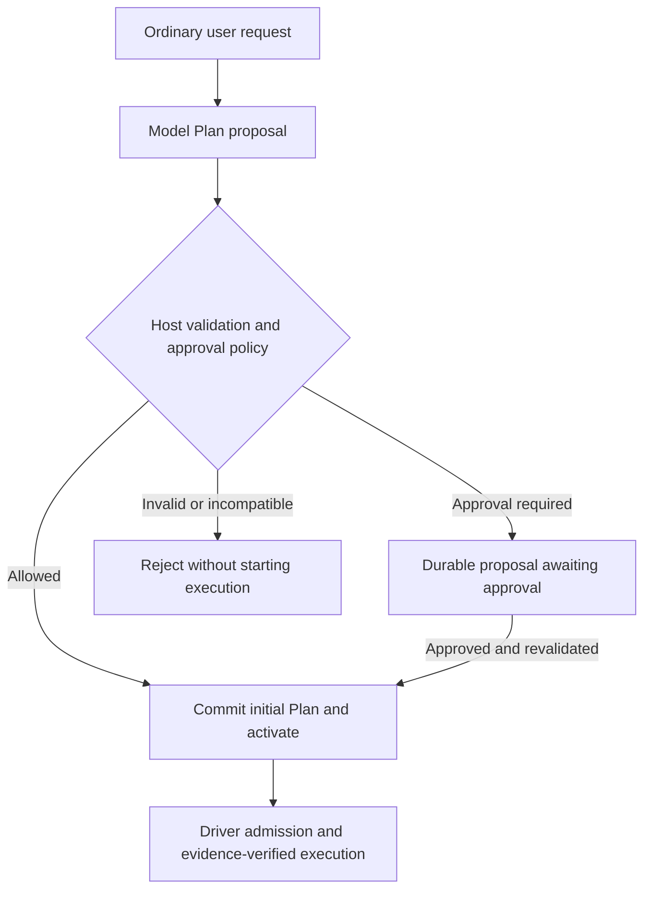
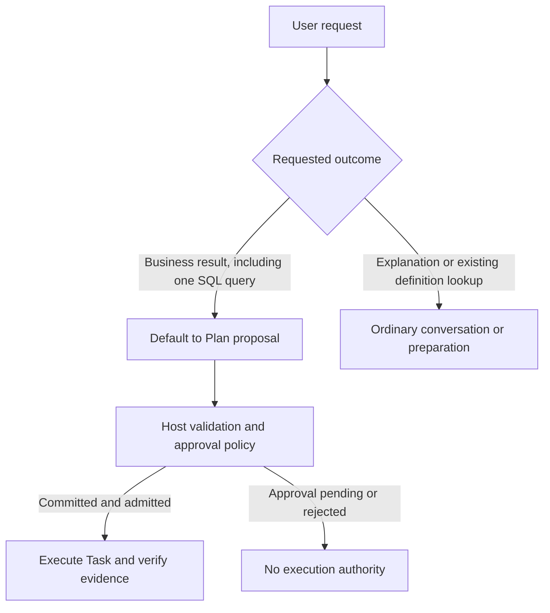
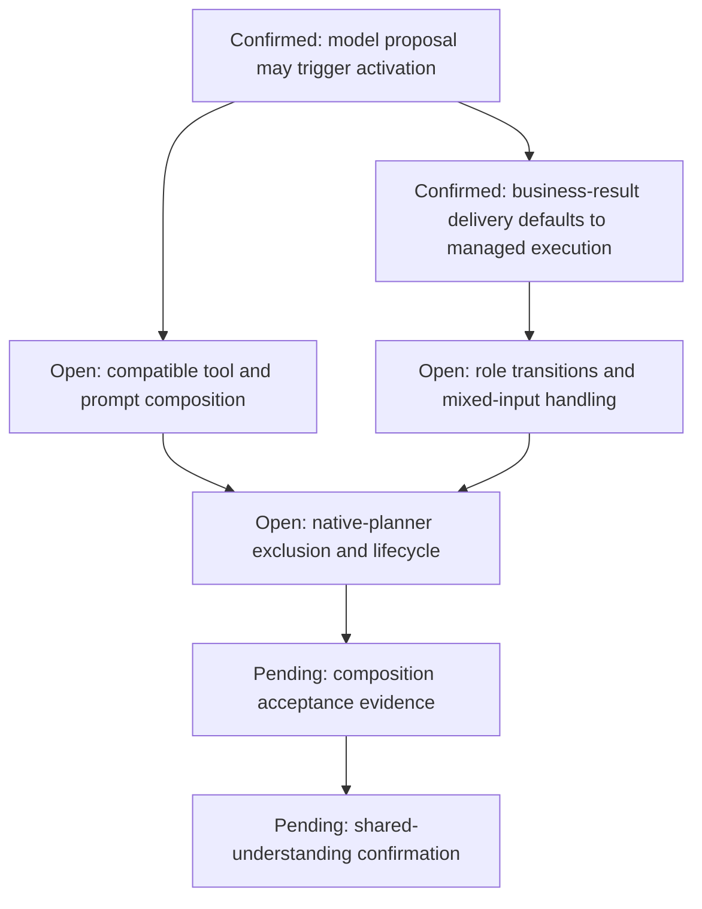

# G16 — Model tools and cross-preset composition

**Type**: grilling
**Status**: claimed
**Assignee**: QoderWork session mucgjrxxqljpkscl (2026-09-22)
**Current standing**: Task DAG is a preset-orthogonal Cordis capability installed by an independent Bundle. It adds the same planning protocol, scoped model tools, Host integration, and Client surfaces to Agents using any preset; it does not create, copy, extend, or patch presets. [G25 Data-agent inner orchestration after Task DAG](G25-phase-gate-integration.md) fixes the data-agent target as ordinary Agent execution with split policy and validators, with any v1 phase-gate path kept opaque. This ticket is unblocked and now owns the remaining cross-preset activation, prompt, and tool-catalog composition decisions.
**Blocked by**: [G19 Cordis outer-loop driver](G19-cordis-outer-loop-driver.md) ✅, [G7 writeScopes conflict semantics](G7-writescopes-conflict-detection.md) ✅, [G25 Data-agent inner orchestration after Task DAG](G25-phase-gate-integration.md) ✅
**Blocks**: [G18 Community package and bundle topology](G18-community-package-and-bundle-topology.md), [G20 First-release scope, compatibility, and evaluation](G20-v1-scope-and-evaluation.md)

## Question

What model-facing tools and Cordis composition let the generic Task DAG capability add writable planning to any DSH Agent without becoming a preset, patching preset files, or creating ambiguous overlap with Goal, Todo, Plan Mode, and preset-owned execution policies?

Decide Task DAG activation, proposal and approval, query, completion-proposal and replan operations, service-owned transitions, actor views, cross-preset tool visibility, prompt guidance, and native planning-tool coexistence.

Define the DSH-native tool-policy contribution contract without changing upstream `ToolDefinition`. Ordinary tools remain registered on `ctx.tools`; optional Task DAG companion contributions classify L0–L2 effects and resolve resources, costs, read/write scopes, external-effect safety, retry behavior, cancellation/reconciliation coverage, and output/evidence mapping. Host policy may only tighten the result, and an unclassified tool fails loud only when used through a Plan-DAG Attempt.

## Inputs from prior decisions

The duplicated assumptions and phase-gate evidence gap are recorded in [G16 cross-preset and phase-gate consistency audit](../research/G16-preset-phase-gate-consistency-audit.md).

[G3 Preset-orthogonal Task DAG distribution](G3-preset-universality-strategy.md) fixes distribution: an independent Bundle installs one generic capability across presets, with no Task DAG preset and no preset patch.

[G13 ExecutionAttempt and correlation protocol](G13-task-work-correlation.md) fixes the model-facing authority boundary: Task objectives and acceptance criteria may be visible, but `ExecutionTicket`, Claim generation, revision fences, Binding identity, and cancellation authority are Host-injected. A `task-attempt` turn binds to exactly one Attempt, while ordinary turns may perform non-Plan work.

[G19 Cordis outer-loop driver](G19-cordis-outer-loop-driver.md) makes Task DAG the only cross-turn continuation owner while a Plan is active. Semantic grounding precedes clarification; automatic replan budgets remain Host-owned. Existing executor-local policies may run inside an Attempt but do not own the next Task.

[G25 Data-agent inner orchestration after Task DAG](G25-phase-gate-integration.md) excludes the complete phase state machine from the target architecture. Data-agent grounding, query admission, SQL validation, and evidence checks remain private execution contributions around the ordinary Agent loop. They may filter execution tools inside an Attempt but cannot control Task DAG orchestration-tool visibility; an opaque v1 phase-gate executor follows the same rule.

[G14 Durable events, projection, and Host/Client boundary](G14-task-graph-projection-boundary.md) makes the Bundle-owned Task DAG core, store, projection, outbox, Host adapters, Remotes, and Client adapters independent of preset files. Model tools translate business inputs into Host-neutral commands and never expose journal or outbox internals.

[G15 Current client placement](G15-current-client-placement.md) fixes one Session-scoped dock summary and one right-Sidebar tab with built-in fullscreen. Task DAG UI reads its own projection and never mirrors Todo.

[G7 writeScopes conflict semantics](G7-writescopes-conflict-detection.md) requires every Plan-path tool call to resolve `read-only`, `scoped-write`, or `unbounded-write` intent before admission and to reject targets outside the immutable `ExecutionTicket` before an external effect.

## Decisions in progress

1. **Preset-orthogonal capability**: installing the Bundle makes Task DAG available to `standard`, `data-agent`, `semantic-layer-management`, and other presets through the same Cordis capability. A Session still selects one business preset. Task DAG does not become another preset or require a second Agent.
2. **Single planning authority when active**: a Session with an active Task DAG Plan does not expose `todo_write`, Goal mutation tools, or Plan Mode as a second writable planning system. Deployments without the Bundle retain existing behavior. No Todo mirror or bidirectional synchronization ships.
3. **Four model intents**: `task_plan_propose`, `task_graph_get`, `task_completion_propose`, and `task_replan_request` are the first-release model tools. Approval, Attempt lifecycle, cancellation, verdicts, revision fencing, Hold release, and administrative control remain Host, user, driver, adapter, verifier, or Service commands.
4. **Role-scoped visibility**: ordinary and orchestrator turns see plan proposal and query; Attempt-bound workers see query, completion proposal, and replan request; terminal read-only turns see query. Visibility never grants authority, and Task DAG Service validates every command. Preset-owned inner policies may filter their execution tools but do not own Task DAG orchestration-tool visibility.
5. **Durable approval**: low-risk additive read-only proposals may commit under the closed Host policy. Risky or unknown changes create a durable Proposal and Approval Hold; Client, Remote, or human commands approve or reject against the exact Plan revision after revalidation. Model calls never wait on an ephemeral in-turn approval promise.
6. **Create once, patch thereafter**: an initial Plan supplies the complete Task and dependency set. Later proposals use atomic `add-task`, `update-task`, `supersede-task`, `add-dependency`, or `remove-dependency` operations. Host injects `baseRevision`; stale patches fail closed; Tasks are never physically deleted.
7. **Evidence-mapped completion**: a completion proposal maps every acceptance criterion to current-Attempt named outputs. Host resolves names to authoritative `OutputRef` and `EvidenceRecord` values; model prose is a claim, not evidence. Only verifiers and Task DAG Service can commit completion.
8. **Role working views**: `task_graph_get` derives a bounded view from the complete `TaskGraphView`. Orchestrators receive the current Plan structure; workers receive their Task, direct inputs, Attempt summary, budget, and related Holds; verifiers receive criteria, proposal, and evidence; terminal readers receive the final summary. Models do not author revision fences or receive journal history and native executor references.
9. **Per-call tool policy**: a versioned companion registry resolves `ToolExecutionSpec` from parsed arguments and Host-injected Attempt context before effects. It declares actual L0–L2 class, reservations, read/write intent, scopes, retry/cancellation/reconciliation behavior, and output/evidence mapping. Host overlays only tighten. Scoped shadow tools require matching scoped policy; missing policy fails Plan-path execution without changing ordinary non-Plan behavior.

### Confirmed activation trigger

An ordinary turn may propose a Plan without a separate user command to enable managed execution. The Host validates the proposal and applies the existing approval policy; a committed initial Plan may activate managed execution without a second activation confirmation. A pending proposal does not authorize execution. Risky or unknown operations still require the existing durable approval path. Installing the Bundle alone does not create an executable Plan, and a model proposal does not supply Attempt authority.



The highest-ROI slice reuses proposal validation and admission for one read-only data-agent Task without an additional activation-mode service or dedicated model classifier. Planning and verification still add work; their runtime and model-cost impact is unmeasured.

### Confirmed request-to-Plan guidance

Business-result delivery defaults to managed execution, including a single-SQL question such as yesterday's new-user count. One Task is sufficient for that result and its verification; internal tool calls do not each become a Task. Explaining a metric or consulting an existing definition remains ordinary conversation or preparation. This guidance does not add a complexity classifier, grant execution authority, or independently prohibit all ordinary non-Plan tool use. Proposal validation, approval, Attempt admission, and evidence verification still apply.



## Source constraints for remaining decisions

These findings constrain the unfinished design; they are not a resolution or a claim that a Task DAG Bundle has passed integration testing.

### Registration, visibility, and execution are distinct

The [Tools registry](../../../packages/core/tools/src/index.ts) applies `restrict()` to inherited definitions, then merges exact-scope registrations outside that filter. Exact-Agent registration can preserve Task DAG's own contributions, but it does not bypass assembly filters or execution guards. `guard()` permits denial only; another listener cannot force an allowed outcome after a guard rejects it. A removed business tool must not be restored under the guise of adding orchestration tools.

The same registry presents native tools differently from PTC, the mode that invokes tools through a code program. PTC exposes `run_code` directly and lists underlying tools in its generated SDK; model-direct calls to those underlying tools are rejected. Four Task DAG intents therefore do not imply four native schemas in every preset. A role filter must account for both model schemas and the generated SDK, not just a displayed list.

The [current phase-gate](../../../packages/data/phase-gate/src/phase-gate.ts) filters the assembled tool list and separately rejects calls outside its phase whitelist. Exact-scope registration or adding schemas back cannot establish compatibility with that implementation. G25's optional opaque executor remains conditional on G17's adapter design; this inspection does not certify it or select it for release.

### Role selection precedes the final pre-step check

The [Agent loop](../../../packages/core/agent-loop/src/agent.ts) claims input, assembles the prompt and tools, and only then runs `agent/pre-step`. The [Inbox](../../../packages/core/agent-loop/src/inbox.ts) claims all next-step input and, at a next-turn boundary, at most one queued turn. Its synchronous claimed notifications precede assembly, but the [Agent dispatcher](../../../packages/core/agent/src/dispatch.ts) does not await notification listeners and contains their errors. Those notifications can identify candidates; they cannot serve as a durable acknowledgement or an awaited authorization check.

A pre-step rejection closes the turn as blocked without restoring the claimed input to Inbox. Role preparation therefore needs an explicit treatment of mixed input, an existing turn binding, rejection, and redelivery. Changing a role only in pre-step does not rebuild the assembly already produced. The delivery and acknowledgement obligations remain owned by [G14 Durable events, projection, and Host/Client boundary](G14-task-graph-projection-boundary.md).

The [System Prompt service](../../../packages/core/system-prompt/src/index.ts) restores an effective `complete` section as the only system section after the assembly waterfall, and runtime-context suppression clears contexts at that same final stage. Registration alone does not prove that an added instruction reaches the request. Compatibility evidence must inspect the final model-visible input rather than only registered contributions.

A proposal committed by one tool call cannot revise the tools already sent with that model request. The [tool-call loop](../../../packages/core/agent-loop/src/tool-calls.ts) also processes the remaining calls in the response after a `concludesTurn` result. In the Tools registry, guards run after pre-execute, but `tools/execute` may still await before the body starts; body dispatch re-resolves the definition and cancellation state, not every business guard. The design must therefore cover authorization changes during that interval instead of treating a single guard check as sufficient.

### Native planning has entrances outside model tools

The [command registry](../../../packages/interaction/commands/src/index.ts) supports exact-Agent command shadowing, but direct service calls do not pass through model-tool guards. [Goal](../../../packages/goal/goal/src/index.ts) exposes mutation Remotes, and [Plan Mode](../../../packages/plan/plan-mode/src/index.ts) exposes `set` as a public service method. Tool hiding and `/goal` or `/plan` command shadowing alone therefore do not establish service-level exclusivity. The generic Remote gateway has not been fully audited in this checkpoint; no universal Remote-interception mechanism is assumed.

The [Goal round driver](../../../packages/goal/goal-round-driver/src/index.ts) has no public per-Plan suspend-and-drain operation. Its ordered disposal is not a Session-level ownership handoff. The [Agent lifecycle provider](../../../packages/core/agent-loop/src/index.ts) cancels and waits for idle during normal Agent disposal, whereas [Agent disposal notifications](../../../packages/core/agent/src/index.ts) do not await listeners. Bundle teardown needs its own ordered cleanup and cannot use a notification alone as proof that native work or Task DAG storage has drained.

### Focused evidence

On 2026-09-22, the following existing core test selection passed 58 tests; 62 PTC tests were excluded by the name filter. It exercises scoped registration, restriction, guards, and PTC presentation. It does not test a Task DAG Bundle, native-planner handoff, phase-gate compatibility, or role recovery.

```sh
pnpm exec vitest run packages/core/tools/tests/scoped.spec.ts packages/core/tools/tests/ptc.spec.ts -t 'restrict\(\)|scoped tool registration|scoped execution dispatch|mode-aware wire contribution|denies a model-direct native-tool call under PTC mode'
```

## Discussion checkpoint

The activation trigger and business-result default are confirmed. Tool composition, role transitions, native-planner exclusion, lifecycle handling, and overall shared understanding remain open. This ticket stays claimed; downstream tickets are not unblocked by the source findings or focused core tests.



## Remaining decisions

- Define cross-preset tool-catalog composition so Task DAG orchestration tools remain available independently of preset-owned execution filtering, without re-adding ordinary tools a preset intentionally denied. Include native and PTC presentation and the actual callable definitions.
- Define prompt guidance and the exact transition between ordinary, orchestrator, Attempt-bound, and terminal contexts without making a preset or model choose infrastructure fields. Cover same-response activation, mixed input, and rejection/redelivery.
- Define native planning coexistence across tools, prompt guidance, human commands, direct service calls, and Remotes. Distinguish installed-but-inactive behavior from the confirmed active-Plan rule.
- Define the Bundle and plugin rows, registration lifetimes, compatibility probes, and removal behavior, including in-flight work; G18 owns final package names and public-package grouping.

## Comments

- 2026-09-22：本会话 Q1 用户选择“模型提案触发”。普通对话可由模型主动提出计划，Host 按既定规则验证与批准后接管，不再要求用户单独开启任务模式；高风险或未知操作仍按已有规则等待人工审批。本轮只确定触发权，不将所有普通请求默认任务化，也不预先确定角色切换时机。
- 2026-09-22：本会话 Q2 用户选择“业务结果交付默认纳管”。单条 SQL 问数也默认通过 Task 执行与验证；解释指标、查阅已有口径保持普通对话。此确认不等于禁止所有非 Plan 工具调用，也不决定安装后未激活时的原生规划行为。
