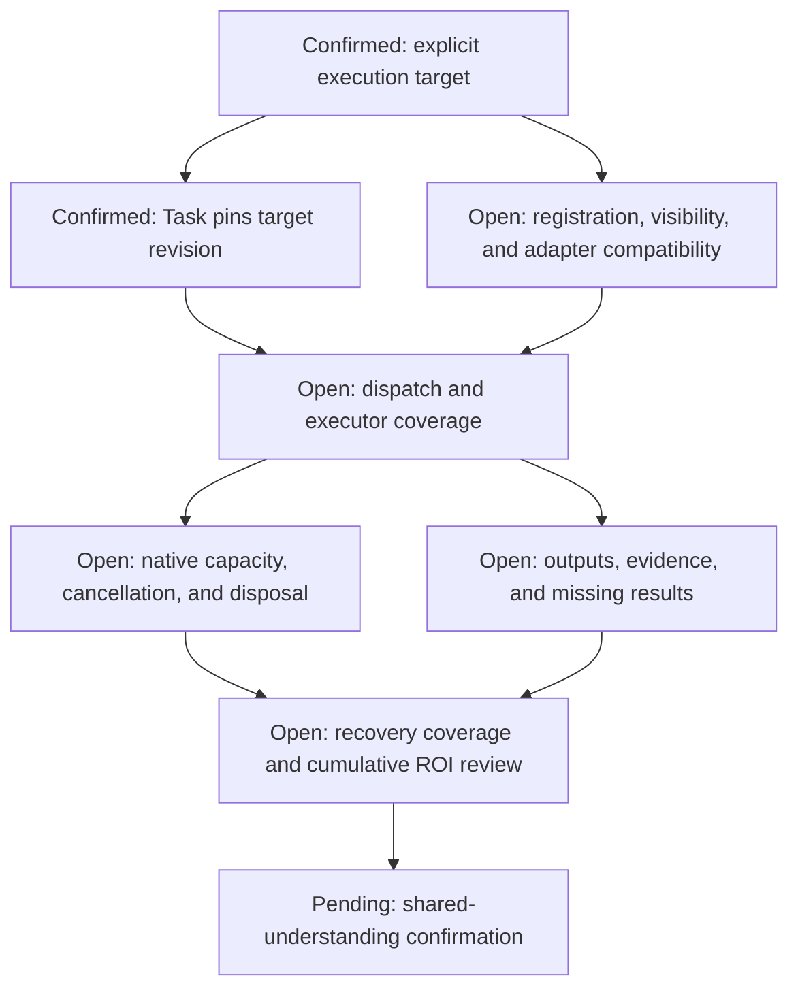

# G17 — Executor adapters

**Type**: grilling
**Status**: claimed
**Assignee**: QoderWork session mucgkb90iwnukhr7
**Blocked by**: [G13 ExecutionAttempt and correlation protocol](G13-task-work-correlation.md) ✅, [G19 Cordis outer-loop driver](G19-cordis-outer-loop-driver.md) ✅, [G7 writeScopes conflict semantics](G7-writescopes-conflict-detection.md) ✅, [G25 Data-agent inner orchestration after Task DAG](G25-phase-gate-integration.md) ✅
**Blocks**: [G9 Optional Agent Teams adapter](G9-team-task-upstream-integration.md), [G10 Subagent execution adapter](G10-subagent-tree-upstream-integration.md), [G18 Community package and bundle topology](G18-community-package-and-bundle-topology.md), [G20 First-release scope, compatibility, and evaluation](G20-v1-scope-and-evaluation.md)

## Question

How does an Attempt execute through the current Agent, a skill, subagent, workflow, ordinary tools, manual work, or the data-agent executor without copying those capabilities' state machines?

For each executor, define capability matching, concrete binding, native concurrency, Attempt Group participation, dispatch, causal correlation, cancellation, outcome settlement, named output and evidence mapping, recovery coverage, and missing-data behavior. Skills are execution methods, not Task instances. Native subagent catalogs and workflow events remain authoritative for their internal lifecycle.

Define a typed, versioned executor-adapter contribution interface so future query engines, workflows, subagent providers, and data pipelines join without driver `if/else` branches. This ticket must decide the smallest Cordis mechanism that satisfies that interface and prove registration ownership, disposal, scoped visibility, and failure behavior through an existing or minimal prototype; it must not assume `inject + register + effect` before that proof. Descriptors declare capacity keys, cancellation/reconciliation/resume support, reserved future Attempt Group support, output/evidence projection, failure classification, retry safety, and compatibility. A missing or incompatible adapter fails loud. The target data-agent adapter runs the ordinary Agent loop with private grounding, query-admission, and evidence-validation contributions. The first release may also wrap the current phase-gate as an opaque compatibility adapter, but no phase identity enters Task DAG contracts and no one-provider Attempt-policy seam is published. No executor-local policy may become a second outer-loop owner or control Task DAG orchestration-tool visibility.

## Inputs from the G13 resolution

[G13 ExecutionAttempt and correlation protocol](G13-task-work-correlation.md) fixes the adapter contract: every ordinary Attempt has one primary Binding; nested tool, subagent, workflow, and external-effect work uses child Bindings; skill use is method metadata rather than a fabricated lifecycle. Adapters receive Host-created context and use the merge-extensible typed reference map. When native identity is unavailable before dispatch, the Host persists a `dispatching` Binding under its preallocated `ExecutionBindingId`, flushes the intent, starts the executor, and then attaches the native reference; ambiguous startup becomes `unknown`, not an assumed retry. Adapters submit idempotent Host commands for native outcomes, cancellation, external-effect certainty, outputs, evidence, and late results, never infer authority from trace or lineage, and preserve one causal owner per native execution.

## Inputs from the G19 resolution

The data-agent adapter consumes the selected data scope, metric and concept definitions, labels, default caliber, and Ontology relations before reporting ambiguity. It records stable semantic references or definition digests with the Attempt's model-visible input, maps residual ambiguity to a Task-scoped clarification request, maps absent grounding to decline, and never transfers semantic-layer or phase lifecycle ownership into the Task DAG. The adapter also exposes enough structured failure and changed-premise facts for bounded local repair and configured affected-subgraph replan.

[G25 Data-agent inner orchestration after Task DAG](G25-phase-gate-integration.md) fixes two data-agent adapter modes with one external contract. The target mode invokes the ordinary Agent plus split policy and validators. An optional v1 compatibility mode invokes the current phase-gate opaquely and returns the same clarification, output/evidence, decline, failure, and cancellation categories. Adapter selection is deployment configuration; Tasks, Attempts, and consumers do not branch on phase state.

## Inputs from the G14 resolution

Executor adapters implement Host-neutral Task DAG ports. Core `ExecutionBinding` records contain `HostBindingId`, purpose, parentage, generation, and opaque adapter-owned native references rather than DSH identifier unions. Task DAG SQLite commit is the intent durability barrier; current-Agent delivery additionally uses the outbox, source-owned `deliveryId`, Session flush and correlation verification, acknowledgement, and pre-step fencing.

## Inputs from the G7 resolution

Each write-capable executor adapter resolves one complete `read-only | scoped-write | unbounded-write` intent before admission. Scoped resources use versioned `scheme`, `authority`, hierarchical `segments`, and `exact | subtree`; the adapter owns provider normalization, safe labels, actual-target checks, and optional native enforcement. Every adapter consumes the immutable Attempt ExecutionTicket, child Bindings may only narrow its scopes, and unavailable required protection rejects dispatch rather than silently downgrading. The adapter reports `admission-only | target-validated | native-enforced` without changing the core overlap rule.

## Discussion checkpoint

This ticket remains claimed; the full design and shared understanding are not yet confirmed. The [execution glossary](../CONTEXT.md) records settled terms.

## Comments

- Q1：用户确认首版采用显式执行目标。规划者从部署提供的目录选择具名目标，Task 不保存 DSH 实现类名或 phase 状态；运行前检查目标的能力、权限和版本，并在准入时固定本次 Attempt 的具体适配器。缺失或不满足条件时明确阻塞，不自动替换执行器。
- Q1 scope：能力需求匹配与自动选路归入 [Advanced routing, parallelism, and optimization](G24-advanced-routing-and-parallelism.md)。触发条件为多个可替换执行器或跨部署计划复用产生可测的手工映射成本；该后续决定能力描述、候选消歧和选择理由，不改变已准入 Attempt 的固定执行语义。
- Q2：用户确认 Task 在计划提交时锁定执行目标的行为定义修订，启动前验证该修订仍可用且满足要求；目标修订不可用则阻塞，并按已有 Plan 变更权限显式更新 Task，不自动采用现行修订。不要求保留历史插件或建设自动迁移系统；未改变目标行为定义的兼容性修复不必生成新的目标修订。目标修订与 npm 包版本、凭证轮换分离。
- Q3：用户确认同一执行目录内的目标标识不得隐式覆盖。作用域只过滤可见性；局部插件不能用同一个稳定标识替换另一目标，重复注册明确失败。显示名称不作为身份；目标可见性不授予执行权限，仍须通过 Task DAG 准入与命令权限检查。
