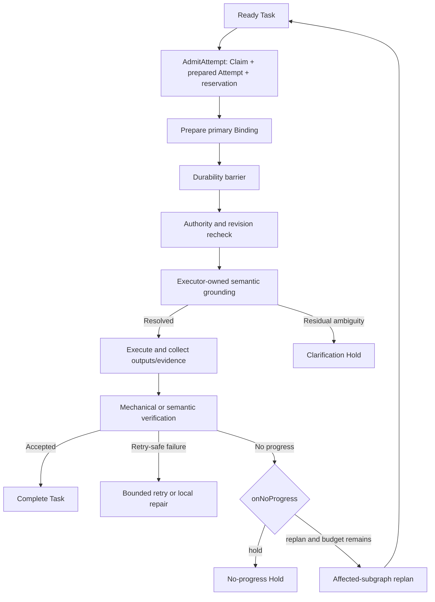

# G19 — Cordis outer-loop driver, verification, and budgets

**Type**: grilling
**Status**: resolved 2026-09-15
**Blocked by**: [G13 ExecutionAttempt and correlation protocol](G13-task-work-correlation.md) ✅
**Blocks**: [G14 Durable events, projection, and Host/Client boundary](G14-task-graph-projection-boundary.md), [G16 Model tools and preset composition](G16-todo-coexistence-and-preset-composition.md), [G17 Executor adapters](G17-native-source-adapters.md), [G7 writeScopes conflict semantics](G7-writescopes-conflict-detection.md), [G18 Community package and bundle topology](G18-community-package-and-bundle-topology.md), [G20 First-release scope, compatibility, and evaluation](G20-v1-scope-and-evaluation.md)

## Question

What bounded outer-loop policy advances the Plan DAG through public Cordis extension points without modifying `agent-loop`?

Define ready selection, atomic claim-and-Attempt admission, concurrent Tasks, explicit same-Task Attempt Groups, task-scoped input, layered-revision checks in `agent/pre-step`, actor permissions, protected-tool enforcement, verifier dispatch, hybrid mechanical/semantic recovery, local repair, replan escalation, human precedence, proposal approval, holds, no-progress detection, persisted budgets, and named Stop Reasons.

Resolve continuation ownership with `goal-round-driver` and phase-gate: one plugin owns automatic continuation, while others contribute inner policy or evidence.

Before resolution, perform a cumulative ROI and scope audit across every accepted choice: compare user value against implementation, maintenance, runtime, token, and evaluation cost; remove or defer machinery whose marginal value is not justified; and link every deferral to a named follow-up.

## Resolution

Adopt a **single DSH-native outer-loop driver with deterministic Host admission, durable Attempt authority, evidence-gated completion, and bounded recovery**. A Plan-DAG-enabled profile disables upstream `goal-round-driver`; the Task DAG driver alone starts cross-turn automatic work through public Agent, Session, Tools, projection, and Cordis composition points. Independent Tasks may execute concurrently, while each Task has at most one active Attempt in the first release. Executor-owned semantic grounding precedes clarification, Run-level automatic replanning is configurable with `hold` as the default, phase policy remains inside an executor adapter, and every deferred optimizer or integration has a named follow-up.

Research and audit basis:

- [Concurrent durable admission frontier](../research/G19-concurrent-admission-frontier.md)
- [Human-input routing frontier](../research/G19-human-input-routing-frontier.md)
- [2026 H2 no-progress papers](../research/G19-no-progress-papers-2026h2.md)
- [Frontier Agent no-progress implementations](../research/G19-no-progress-agent-frontier.md)
- [No-progress ROI synthesis](../research/G19-no-progress-roi-synthesis.md)
- [Cumulative outer-loop ROI audit](../research/G19-outer-loop-cumulative-roi-audit.md)

### Decisions

1. **One cross-turn owner**: the Task DAG driver is the only automatic continuation owner in a Plan-DAG-enabled profile. The profile disables upstream `goal-round-driver` through composition without modifying its source. Ordinary DSH profiles retain upstream behavior. Phase-gate or other inner policies may use `inject()`/step-local mechanisms inside an Attempt but never schedule the next Task.
2. **Ready versus admissible**: readiness is durable DAG state—hard dependencies at the required assurance, no blocking Task Hold, and no active claim. Admission additionally checks executor availability, capacity, Run/Task budget, actor permission, write-scope policy, and current Run Holds. Resource waiting does not masquerade as dependency blocking.
3. **Deterministic ordering**: candidates sort by `priority DESC`, current readiness epoch `readySinceSeq ASC`, then `taskId ASC`. The scheduler skips candidates that do not currently fit and continues scanning, preventing head-of-line blocking. Model arbitration, duration prediction, critical-path scheduling, aging, preemption, and multi-tenant fairness are deferred.
4. **Independent concurrency**: one admission cycle may select a conflict-free set of independent Tasks up to installed adapter capacity. The current Agent is one execution lane; query, subagent, workflow, skill, and other adapters expose their own capacity. No plugin-wide fixed subagent/workflow cap is introduced.
5. **Same-Task concurrency deferred**: the domain retains Attempt Group identities and policy vocabulary, but the first-release runtime visibly rejects Attempt Group admission. It never silently starts one member or serializes a requested group. Group budget, winner/quorum, aggregation, loser cancellation, unknown outcomes, recovery, and UI belong to the advanced-routing follow-up.
6. **Serialized admission cycle**: one process-local driver scans candidates without awaiting, uses one mutable capacity/conflict ledger, and submits independent `AdmitAttempt` commands in stable order. Each command atomically creates the Claim, `prepared` Attempt, and portable budget/resource reservation; there is no durable business-level wave authority.
7. **Durability before action**: the driver prepares each primary Binding before dispatch; its preallocated `ExecutionBindingId` is the durable provisioning identity, not a second dispatch-intent id. No model request, adapter dispatch, or external effect starts until a successful `ctx.sessions.flush(session)` covers its admission, Binding, or effect intent. A flush failure starts no uncovered work and stops automatic work visibly. The public rule fixes the durability barrier, not the number of flush calls; batching independent intents is deferred to [Advanced routing, parallelism, and optimization](G24-advanced-routing-and-parallelism.md).
8. **Post-flush revalidation**: because Plan, Hold, permission, or user state may change while flush awaits, every admitted Attempt is rechecked before dispatch. Invalid Attempts are not dispatched and are released, cancelled, or superseded through a later durable mutation.
9. **Layered revision fencing**: full `planRevision` is retained for audit, not used as a global equality gate. Authority checks use the current `taskRevision`, `claimGeneration`, relevant dependency assurance, Run-control state/revision, policy version, actor role, and message/input digest. Unrelated Plan or UI changes do not invalidate active work.
10. **Step and tool fences**: Task-scoped current-Agent messages carry the execution envelope. The Task DAG `agent/pre-step` listener validates before and after downstream `next()` and rejects stale messages before they enter model history, restoring unrelated claimed messages. `tools/pre-execute` and settlement repeat the authority checks; old results cannot complete a newer Task revision.
11. **Role-layered model context**: every executor receives identity/fencing metadata plus Task objective, criteria, permitted inputs, direct accepted predecessor OutputRefs/EvidenceRefs, policy, and budget. The main orchestrator additionally receives bounded Plan awareness; workers do not receive the complete DAG by default and use logged, scoped read tools when authorized.
12. **Semantic grounding before clarification**: user input temporarily blocks new admission while it is routed, but orchestration does not treat an unresolved surface phrase as proof of ambiguity. The active executor first applies its authoritative domain context. For data-agent this includes the selected data scope, retrieved metric and concept definitions, preferred and alternative labels, declared default caliber, and Ontology relations. A unique or declared-default meaning proceeds and records the selected semantic references; multiple viable non-default meanings, conflicting definitions, missing required scope, or risky write ambiguity create a correlated Clarification Hold. No grounding yields an explicit decline rather than a generic clarification. Ordinary Enter defaults to the durable Queue; explicit Steer targets the next safe step with revision/generation fencing; explicit Cancel names the Agent, Task, Attempt, executor job, or Run. Destructive routes never come from free-text classification alone.
13. **BTW scope**: explicit BTW is low-risk, read-only, has no Attempt authority or Plan mutation, and does not enter the parent model history. It may ship only by reusing an existing one-shot completed-prefix fork with empty tool scope; otherwise it is deferred rather than creating a new Session subsystem. The first release runs no online input classifier and only logs explicit route choices/outcomes for later offline evaluation.
14. **Actor authority**: users hold authenticated control authority; the main orchestrator may commit a closed allowlist of low-risk, reversible, budget-neutral Plan patches; all unknown, budget-increasing, assurance-lowering, access-expanding, write-target, completed-result, active-Attempt, or unknown-effect changes create Approval Holds. Workers update only their Attempts and submit proposals; drivers schedule; adapters submit native observations; verifiers submit verdicts. Payload actor ids never authenticate callers.
15. **Protected tools**: Task-DAG policy classifies operations as L0 context read, L1 Task-causal execution, L2 external effect, or L3 Host control. L1 requires valid Attempt authority; L2 additionally persists effect intent and applies risk/approval policy; L3 is never granted through model tool JSON. `tools/pre-execute` performs asynchronous checks/correlation and `ctx.tools.guard()` provides monotonic final denial. Tool visibility remains UX, not authorization.
16. **DSH-native extensibility**: ordinary tools continue registering on `ctx.tools`; Task-DAG companion contributions register scoped L0–L2 policy through a typed registry, with Host overlays only tightening policy and unclassified Plan-path use failing loud. Multiple concrete executors justify one versioned executor-adapter registry. The first release does not publish a one-provider AttemptPolicy, RecoveryPolicy, human-classifier, BTW-session, or RunController seam.
17. **Two-stage completion**: `SettleAttempt` rechecks required Bindings, cancellation, external effects, accepted OutputRefs and EvidenceRecords, Claim generation, and relevant revisions, then atomically records the terminal Attempt outcome, releases the Claim, and creates the CompletionProposal or failure/reconciliation facts. The settlement is durable before downstream readiness changes. Task state becomes verifying rather than completed. Registered mechanical verifiers run first; semantic verification is dispatched durably only when a criterion requires it. Verifier absence or failure is `inconclusive`, never silent attestation.
18. **Criterion assurance**: hard dependencies, data queries, writes, numerical calculations, external publication, and final formal delivery require `verified` by default. Explicit low-risk leaf criteria may accept `attested`. Executors cannot lower assurance; lowering it is a high-risk Plan mutation requiring approval.
19. **Budget model**: a durable Run ledger tracks limits, reserved, and consumed portable dimensions; Task policy caps Attempts, concurrent Attempts, verifier retries, repairs, replans, and phase-local retries. `AdmitAttempt` reserves the Attempt budget atomically with the Claim and reconciles actual usage at settlement. Resume does not reset usage. Hard first-release dimensions are portable counts such as Attempts, active slots, query submissions, model requests, verifier runs, repairs, replans, and external-effect count. Provider tokens, currency, scan bytes, and time are observational unless the selected provider declares reliable enforcement.
20. **Budget exhaustion**: insufficient budget records a structured `budget_exhausted` Stop Reason and prevents new admission; it does not immediately fail the Run. Existing Attempts normally settle unless policy requests cancellation. A user may increase budget, reduce the Plan, cancel, or fail the Run; policy changes are versioned and historical usage remains.
21. **Deterministic bounded recovery**: adapters/verifiers submit structured failure observations. The Host computes an execution-relevant `failureKey` from normalized failure class, executor, canonical input/SQL digest, target, effect identity, and evidence—not from prose, Attempt id, or revision alone. Only transient, adapter-declared retry-safe failures use bounded mechanical retry. `unknown` external outcomes enter reconciliation Holds. Further execution after failure requires an observable premise change; repeating an already failed premise creates a Task-scoped `no_progress` Hold. No general Progress Vector, semantic progress judge, learned stopper, or public RecoveryPolicy seam ships in the first release.
22. **Repair and replan policy**: the first release persists configurable `onNoProgress: hold | replan` policy with `hold` as the deployment default and a versioned automatic-replan budget. `hold` stops model calls and presents actionable facts. `replan` queues a bounded affected-subgraph orchestrator turn only after durable facts change an execution premise; the Host builds its Run-scoped context from the committed Plan revision and Hold/Stop references rather than fabricating a Task `ExecutionTicket`. Every patch still passes risk-tiered authority. Exhausted budget, an unchanged premise, or an ineffective patch returns to Hold.
23. **Typed Holds**: Task/Run Holds are the authoritative admission barriers and record reason, actor, time, release condition, release authority, and `automatic | explicit` resume mode. Clarification, accepted approval, safe budget update, executor recovery, verification evidence, and resolved reconciliation can resume automatically after a complete state recheck. Manual pause and no-progress under `hold` mode require explicit action; `replan` mode may resume only through its bounded, validated replan path. Releasing one Hold never bypasses another.
24. **Stop history without duplicate blockers**: the driver appends one `RunStopRecord` when it transitions from runnable to quiescent, using a small closed core code plus references to every contributing Hold, Task, and Attempt. Holds remain source of truth. Resume appends a record linked to the stop record after all blockers, revisions, capacity, and budgets are rechecked. First-release Client UI shows current state and the latest Stop Record; full history/trace navigation is deferred.
25. **First-release phase boundary**: a phase-gated data-agent execution is an opaque executor-bound Task Attempt. Its adapter consumes the semantic layer and Ontology, records the selected semantic references or definition digests needed to reconstruct model-visible grounding, and maps residual ambiguity to a Task-scoped clarification request. It returns final outputs, evidence, decline, or failure without transferring ownership of metric, concept, relation, phase, counter, timeline, or resume state to the Task DAG. Full durable phase integration remains a follow-up.
26. **Scope/ROI ceiling**: the first release adds no online human-input classifier, semantic scheduler, critical-path optimizer, same-Task group execution, public recovery/inner-policy/Run-control seam, full phase runtime, or history explorer. The cumulative ROI audit is an implementation ceiling; any reintroduction requires its named follow-up and new evidence.

### Highest-ROI implementation slice

The first implementation slice proves one end-to-end data-agent Task: semantic grounding, deterministic admission, atomic Claim and Attempt creation, primary Binding durability, one current-Agent or phase-gated executor lane, output/evidence settlement, criterion verification, portable budgets, and an actionable Hold or configured bounded replan. Independent multi-Task admission and additional executor adapters follow within the first release. Flush batching, critical-path scheduling, model arbitration, semantic progress judging, speculative Attempts, and other throughput or cost optimizations require measured evidence in their named follow-ups.

### Consequences

- [Durable events, projection, and Host/Client boundary](G14-task-graph-projection-boundary.md) defines the required events, whole-value projection, Hold/StopRecord history, revisions, budgets, verifier intents, and replay semantics.
- [Model tools and preset composition](G16-todo-coexistence-and-preset-composition.md) defines the actor-facing tools, Plan-DAG profile rows, tool-policy contributions, prompt guidance, and explicit Goal-driver disablement.
- [Executor adapters](G17-native-source-adapters.md) maps each native executor to capacity, dispatch, cancellation, reconciliation, failure classification, output, and evidence without copying its lifecycle.
- [writeScopes conflict semantics](G7-writescopes-conflict-detection.md) defines which known writes exclude concurrent admission and which enforcement claims are honest.
- [Community package and bundle topology](G18-community-package-and-bundle-topology.md) preserves the public-interface budget and installable Cordis composition.
- [First-release scope, compatibility, and evaluation](G20-v1-scope-and-evaluation.md) validates the ROI ceiling, deterministic scheduling, false-stop/wasted-compute trade-off, current-state UI, and explicit rejection of deferred capabilities.
- Advanced Attempt Groups, routing, progress/fairness policy, durability-barrier batching, full phase integration, Goal/Plan integration, history inspection, generic Run control, automatic input routing, and external-effect recovery remain in their named follow-ups.

## Inputs from the G13 resolution

[G13 ExecutionAttempt and correlation protocol](G13-task-work-correlation.md) requires the driver to admit a semantically fixed Attempt with one primary Binding, bind one current-Agent turn to at most one Attempt, inject rather than solicit the `ExecutionTicket`, and use idempotent Host-validated commands. The driver atomically admits the Claim and `prepared` Attempt, creates the root Binding and changes the Attempt to `running`, enforces a durability barrier before dispatch, and requests settlement only after required Bindings, cancellation, outputs, evidence, external effects, Claim generation, and revisions pass a final recheck. Semantic retry creates a new `attemptNo` and `retryOfAttemptId`; cancellation freezes new work; unknown external effects block readmission through a reconciliation Hold. The driver may consume authoritative Bindings, OutputRefs, EvidenceRecords, and verdicts, but never ExecutionObservations, late results, or native success alone as completion authority.

## Comments

- 2026-09-15：用户确认领域语义解析先于人工澄清。data-agent 必须先消费已选择数据域、`MetricDefinition`、`ConceptDefinition`、别名、`caliber_variants` 中声明的默认口径与 Ontology 关系；唯一或声明默认的口径直接进入执行，只有多个仍然有效且无默认的口径、定义冲突、缺少数据域或高风险写入目标歧义才创建关联到 Task revision 的 Clarification Hold。无可用语义 grounding 时明确 decline。

- 2026-09-15：用户确认首版包含可配置自动重规划，`onNoProgress` 默认仍为 `hold`。显式启用 `replan` 后，driver 仅在持久化事实改变执行前提、预算允许且风险策略通过时启动受影响子图的 orchestrator turn；预算耗尽、前提未变或 patch 无效时回到 Hold。

- 2026-09-15：用户确认按 ROI 切片实现。首个端到端切片聚焦 data-agent 单 Task 的语义 grounding、耐久 admission/Binding、证据验证、Hold 与受限 replan；并发扩展在首版后续切片完成，flush 批处理、关键路径调度、模型仲裁及其他不影响基础体验的性能优化进入具名 Follow-up。
