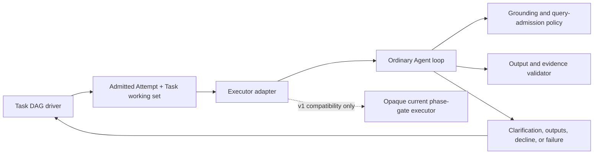

# G25 — Data-agent inner orchestration after Task DAG

**Type**: grilling
**Status**: resolved 2026-09-22
**Current standing**: Task DAG is the sole outer-loop orchestration owner. The target data-agent Attempt uses the ordinary Agent loop with private grounding, query-admission, and evidence-validation contributions; the complete four-phase phase-gate is not part of the long-term architecture. A first release may retain the existing phase-gate only behind an opaque compatibility executor while G20 verifies the replacement path and removal criteria.
**Blocked by**: [G12 Plan DAG ownership boundary](G12-task-graph-authority.md) ✅, [G19 Cordis outer-loop driver](G19-cordis-outer-loop-driver.md) ✅, [G25a Phase-gate incremental-value experiment](G25a-phase-gate-incremental-value-experiment.md) ✅
**Blocks**: [G16 Model tools and cross-preset composition](G16-todo-coexistence-and-preset-composition.md), [G17 Executor adapters](G17-native-source-adapters.md), [G20 First-release scope, compatibility, and evaluation](G20-v1-scope-and-evaluation.md), [PG1 Phase-gate durable-state evaluation](../../data-agent/tickets/phase-misc/PG1-phase-gate-session-events.md)

## Decision

Task DAG replaces phase-gate as the owner of planning, cross-turn continuation, Attempts, Holds, budgets, replanning, and completion verification. A data-agent executor receives one immutable Task working set and returns clarification, named outputs and evidence, decline, or failure; it never schedules the next Task or owns Plan progress.

The complete `UNDERSTANDING → GROUNDING → GENERATION → INTERPRETATION` state machine is not retained as the target inner orchestration. Its useful deterministic behavior is decomposed into private data-agent contributions around the ordinary Agent loop: semantic grounding before execution, query admission after definition loading, SQL critique, and SQL-quality approval, same-SQL enforcement, and output/evidence validation. These contributions do not create durable phase identity or a second planning system.

## Ownership

- **Task DAG domain and driver** own Plan revisions, Task readiness, Attempt admission, `ExecutionTicket`, Holds, budgets, replanning, verification, stop decisions, and cross-turn continuation.
- **Executor adapters** own dispatch to current Agent, subagent, workflow, manual, or data-agent execution and map native outcomes into Attempt outputs, evidence, clarification, decline, failure, and cancellation facts.
- **Data-agent policy and validators** consume semantic definitions and own grounding precedence, query-admission checks, SQL validation, and business-result support checks. They may deny or classify an execution action but cannot select the next Task or hide Task DAG orchestration tools.
- **The current phase-gate runtime** may remain only as an adapter-private compatibility implementation. Task DAG does not persist, project, resume, or expose its phase index, phase counters, fallback state, tool whitelist, or control markers.

## Interface consequences

The first release does not publish a generic `AttemptPolicy`, inner-orchestration, or phase-state interface solely for the data-agent implementation. G16 may define companion tool-policy metadata required for Task DAG admission, and G17 may define the executor-adapter interface required by independently evolving executors; neither interface exposes phase concepts. A reusable inner-policy capability requires a second independent provider and a separate ROI decision.

Task DAG orchestration-tool visibility is preset-orthogonal and independent of data-agent execution filtering. Data-agent policy may filter ordinary execution tools inside its Attempt, but it cannot remove `task_graph_get`, completion proposal, or replan-request access granted by the active Task DAG role.

## First-release compatibility and exit

G20 may include an opaque phase-gate compatibility executor only when it is the smallest migration path for an existing data-agent profile. The adapter accepts the same Task working set and returns the same executor outcome categories as the target ordinary-Agent path. It exposes no phase records to Task DAG, Client, SDK, or public configuration.

G20 owns the compatibility exit criteria. Removal requires the split policy/validator path to cover the supported data-agent behavior, keyless snapshots, real-query evaluation, clarification and decline semantics, and failure mapping without a Session or Task DAG data migration. Compatibility is a temporary implementation choice, not a second target architecture.

## Excluded architecture

- No durable phase records or phase-owned resume protocol.
- No phase nodes in the Task DAG.
- No phase progress UI.
- No public phase or inner-policy API.
- No phase whitelist ownership of Task DAG model tools.
- No hybrid in which Task DAG and phase-gate both own planning or continuation.

## Evidence

The [G25a final report](../experiments/g25a-phase-gate/report.md) found no severe-unsupported reduction for the complete state machine, lower final case-level `pass^3` correctness than the policy arm, paired intervals without a positive effect, and multiple cost measures above the locked 30% threshold. The result supports decomposition of useful validation behavior, not expansion of the state machine.

## Comments

- 2026-09-17：用户选择先执行 [G25a Phase-gate incremental-value experiment](G25a-phase-gate-incremental-value-experiment.md)，再用实测结果决定完整四阶段状态机的保留、拆分或退役。
- 2026-09-22：用户确认最终架构。Task DAG 独占外层编排；普通 Agent 加拆分后的 policy/validator 是目标执行路径；完整 phase-gate 仅可作为 v1 不透明兼容执行器，不建设阶段持久化、阶段 UI 或公共 inner-policy API。
