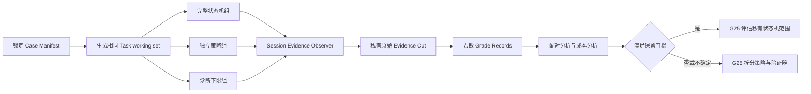

# G25a — Phase-gate incremental-value experiment

**Type**: task
**Status**: claimed — blocked on an oracle decision before Stage 0 can be built
**Assignee**: Claude implementation session, claimed 2026-09-17
**Blocked by**: [G12 Plan DAG ownership boundary](G12-task-graph-authority.md) ✅, [G19 Cordis outer-loop driver](G19-cordis-outer-loop-driver.md) ✅
**Blocks**: [G25 Data-agent inner orchestration after Task DAG](G25-phase-gate-integration.md)

## Amended locked protocol (2026-09-17)

Preflight proved the originally locked case set ungradeable, and the user approved two amendments the same day. Everything not listed here is unchanged, and the numeric thresholds are unchanged verbatim.

Host access is green: real `maxc` queries against `ieu_cdm` succeed under a read-only policy, and the resolved binary is `/Users/mckenzie/Library/Python/3.13/bin/maxc`.

### Why the original case set was replaced

The 24 named `k11v2_*` cases carry no reference SQL anywhere in the repository, so grading rule 2 and the batch start/end stability probe both pointed at an artifact that does not exist. Reconstructing the oracle by execution showed that of the 9 `scalar_exact` cases, 2 are correct, 3 reproduce only the naive whole-snapshot query on a `_df` full-snapshot table, and 4 cannot be reproduced at all — `k11v2_022` is off by exactly 100× and `k11v2_024` by ~54×. 17 of the 24 cases touch a `_df` snapshot table, and the bias runs *against* the arm under test, because the state-machine arm is the one whose GENERATION gate forces it to load the table definition carrying the snapshot warning.

Full evidence, every number executed against real MaxCompute: [G25a preflight — the locked case oracle cannot grade the decision batch](../research/G25a-oracle-validity-preflight.md).

### Amendment 1 — real-execution slice

The real-execution slice moves to `packages/eval/eval/cases/rbi-10000251-exec`, the only case set in the repository carrying reference SQL. Auditing all 39 of its oracles today leaves 12 that reproduce exactly on a non-degenerate value:

```text
036 037 038 039 040 041 042 043 046 048 055 060
```

Excluded: 16 stale scalars (`057` plus the whole `119`–`138` event family, which reads the continuously-accumulating `ieu_ods` view), 8 stale multi-row (`045` `049` `050` `051` `052` `053` `054` `059`, four of which also record only a 5-row prefix of a longer result), and 3 degenerate (`044`, whose self-join makes the expected `1.0` an artifact; `056` and `130`, whose expected `0` is indistinguishable from an agent finding no data).

The reference date becomes **2026-08-06**, so `{{ds_yesterday}}` = `20260805` and `{{ds_7d_ago}}` = `20260730`. Absolute dates still go into the Task working set verbatim; the substitution is applied when the manifest is generated, never at model time.

### Amendment 2 — which locked rule carries the decision

On 12 cases, case-level `pass^3` moves in whole-case steps of 8.3pp, so retention rule 1's 8pp threshold sits below the metric's resolution and a 10,000-iteration paired bootstrap over 12 units straddles zero for any plausible effect. Rule 1 would therefore return 不确定 by construction rather than by measurement.

Retention rule 2 becomes the primary axis: **severe unsupported answers reduced by at least 50%, with end-to-end correctness dropping no more than 2 percentage points.** Both numbers are the already-approved locked values. The 12 verified cases supply the correctness guard rail that rule 2 already names; the behavioral cases supply the anti-fabrication measurement and need no warehouse oracle, because they are graded deterministically from Session evidence on whether the agent clarified, declined, recovered, or fabricated.

The behavioral case count grows from 8 to **24**, six per category across 口径歧义, 无可用 grounding, 执行恢复, and 持续失败. Total case count is **36**. Stage 2 becomes 36 cases × 3 replicates × 2 decision arms + 36 diagnostic-floor attempts = **252 Attempts**.

The 30% cost-overhead clause, the material-degradation clause, the 不确定 clause, and every artifact and privacy boundary are unchanged.

### Clauses below that this amendment supersedes

The original text is kept verbatim as the historical record. Where the two disagree, this section wins:

| Section below | Original | Amended |
| --- | --- | --- |
| 统一运行控制 → reference date | `2026-08-27` | `2026-08-06` (`ds_yesterday` `20260805`, `ds_7d_ago` `20260730`) |
| Case Manifest → 真实执行案例 | 24 `k11v2_*` cases | the 12 verified `eval_10000251_*` cases listed above |
| Case Manifest → 行为与失败案例 | 8 cases, two per category | 24 cases, six per category |
| Case Manifest → iterative slice | `k11v2_057` `065` `073` `080` | re-marked on the 12-case slice when the manifest is generated |
| Case Manifest → reference SQL re-execution | implied, no artifact existed | the 12 cases' own `expected.sql`, re-executed at batch start and end |
| 锁定判定规则 → which rule decides | rule 1 (8pp) or rule 2 (50%) | rule 2 is primary; rule 1 is reported but is below metric resolution at n=12 |
| Stage 1 → smoke composition | 6 cases, 18 Attempts | 6 cases, 18 Attempts, drawn from the amended slice |
| Stage 2 → batch size | 32 cases, 224 Attempts | 36 cases, 252 Attempts |
| Stage 3 → 主指标 | case-level `pass^3` | severe unsupported answer rate; `pass^3` becomes the ≤2pp guard rail |
| 已知证据与缺口 items 1, 2, 7 | about the `g1b` `k11v2` slice | retained as history; the slice they describe is no longer used |

## Implementation handoff

This ticket is design-complete and ready for an implementation session. Work in `/Users/mckenzie/workspace/deepseek-harness-da/.worktrees/task-orchestration-dag-baseline` on branch `codex/task-orchestration-dag-baseline-2026-09-15`. Claim the ticket before editing by changing `Status` to `claimed` and recording the assignee and date; do not reopen the locked arms, case count, thresholds, metrics, or artifact boundaries unless implementation proves the protocol impossible.

Read this ticket first, then the map's Destination and Notes, `packages/eval/CONTEXT.md`, `docs/architecture.md`, and the repository skills required by the touched files. The worktree already contains intentional uncommitted Wayfinder edits from the parent effort; inspect them and do not discard, reset, or overwrite them. The implementation session may complete this task ticket but must leave G25 unresolved for the following decision session.

Do not launch the decision batch through the current eval CLI unchanged. Its Harness path does not make `today` model-visible, does not persist the Agent's real `query_data` outcome into the outer score, and can therefore award a SQL-judge pass to a query for the wrong dates. Build and prove Stage 0 before spending the decision-run budget.

Real runs require host network access plus `PATH="$HOME/Library/Python/3.13/bin:$PATH"` and `MAXC_CONFIG="$HOME/.maxc/config_ieu_cdm.yaml.bak"`. Resolve both paths and store their non-secret identities in the run manifest. Never print or copy credential contents.

## Question

在 Task DAG 已经负责任务规划、跨轮推进、Attempt、Hold、预算、重规划和完成验证的前提下，完整四阶段 phase-gate 是否仍产生足以覆盖其模型成本、延迟、运行时复杂度和维护成本的独立用户收益？

本票实施一项受控消融实验，以真实 data-agent 行为决定 [G25 Data-agent inner orchestration after Task DAG](G25-phase-gate-integration.md) 应保留完整状态机、拆出独立执行策略与验证器，还是退役 phase-gate。实验只构建评测设施和证据，不实现 Task DAG 产品包，不设计阶段持久化、阶段 UI 或公共 inner-policy 接口。

## 术语

- **Task working set（Task 工作集）**：Task DAG 交给一次执行的固定输入，包括目标、数据域、验收条件、只读约束、时间基准和预算。实验使用等价的固定文本封装模拟该输入，不模拟 Task DAG 调度器。
- **State-machine arm（完整状态机组）**：当前 phase-gate 的 UNDERSTANDING、GENERATION、EXECUTION、INTERPRETATION 阶段、自动推进、回退、工具限制和阶段提示词。
- **Policy-only arm（独立策略组）**：不设置阶段、不自动推进、不注入阶段消息；只保留查询前必须完成的语义定义加载、SQL critic、质量阈值和同源 SQL 校验，以及统一预算限制。
- **Diagnostic floor（诊断下限组）**：与独立策略组使用同一模型、Task 工作集、persona 和完整工具目录，但不强制查询前校验；它只帮助解释收益来源，不参与发布选择。
- **Severe unsupported answer（严重无证据回答）**：没有成功查询证据或有效语义定义时，仍向用户给出确定的业务数值、趋势、归因或结论；正确澄清、明确拒答和基础设施失败说明不属于此类。
- **Evidence Cut（证据切片）**：支持本次结论所需的完整、不可变、带内容摘要的运行配置、案例、Session 事件、环境收据、评分记录和聚合结果集合。

## 已知证据与缺口

1. 2026-08-28 的 `g1b-variant-A.json`、`g1b-variant-B.json` 和 `g1b-variant-D.json` 仍存在于主检出目录 `/Users/mckenzie/workspace/deepseek-harness-da/eval-results/g1b/` 的忽略文件中。按当前 `pass^3` 规则离线重算后，A、B、D 分别为 38.9%、47.2% 和 16.7%。这些文件是历史诊断输入，不得复制成当前 Evidence Cut；仓库没有提交可复核的原始变体结果，也没有形成满足当前问题的 Comparison Plan。
2. 历史 A/B/D 不能决定本票：A 挂载完整数据工具，B/D 只挂载 `search_data_sources` 和 `query_data`；B 还增加 Goal/Todo，因此多个变量同时改变。
3. 历史 Harness 结果的 `query_result` 均为空。Harness 内部虽可能调用真实 `query_data`，外层评分仍可能只依据 SQL judge，无法证明真实执行结果正确。
4. `HarnessAgentResponder` 接收 `today`，但没有把它加入模型可见上下文。2026-09-17 的预检中，未显式写日期的问题生成了 2025 年区间，却仍被 SQL judge 判为正确。所有决策案例必须在 Task 工作集中写出绝对日期。
5. MaxCompute sidecar 默认执行 `maxc`；本机可执行文件位于 `$HOME/Library/Python/3.13/bin/maxc`。决策运行必须记录解析后的绝对路径，不能依赖交互式 shell 的隐含 `PATH`。
6. 2026-09-17 的主机网络预检证明当前 A 组能完成一次真实查询并在 Session 中保留查询结果和 token usage；沙箱网络运行不能作为模型结果，必须标为基础设施失败并排除。
7. 旧的 36-case healthy 集和预期值来自 2026-08-27 数据状态。每个决策案例必须重新执行 reference SQL，并证明决策批次开始与结束时的结果摘要一致；不稳定案例不得进入比较分母。
8. 已验证的预检命令在显式日期与正确 `PATH` 下，用 A 组完成 `k11v2_034` 的 30 行真实查询。该次运行耗时 125,763 ms，累计 40,740 uncached input tokens、7,526 output tokens、118,656 cache-read tokens 和 2,261 reasoning tokens；这些数字只用于估算实验预算，不进入决策结果。

## 决策假设

- **零假设**：在相同 Task 工作集、工具、模型、语义数据和预算下，完整阶段推进相对独立校验策略没有达到已批准的最小用户收益。
- **保留假设**：完整阶段推进提供不能由独立校验策略解释的正确性或防编造收益，并且其成本满足已批准的限制。
- **因果量**：完整状态机组减去独立策略组的配对差异。诊断下限组不进入该差异。

## 锁定判定规则

用户于 2026-09-17 批准以下规则。相对独立策略组，完整 phase-gate 只有满足至少一项才获得长期保留资格：

1. 端到端正确率绝对提升至少 8 个百分点，且三个 replicate slot 的提升方向一致；或
2. 严重无证据回答至少减少 50%，同时端到端正确率下降不超过 2 个百分点。

完整状态机还必须满足以下约束：

- 多步分析、澄清和恢复场景没有物质性退化；
- 模型调用数、输入输出 token 或墙钟延迟增加超过 30% 时，报告必须证明该成本由已测得的用户收益覆盖；
- 结果相近、方向不稳定、环境证据不足或统计区间跨越零时，结论为“不足以扩大 phase-gate”，而不是“证明两者相同”；
- 不确定结果允许首版继续使用不透明兼容执行器，但不支持新增阶段持久化、阶段 UI 或公共 inner-policy 接口。

## 实验架构



### 统一运行控制

每个 Attempt 使用新的 Agent 和 Session。三组共享以下固定值：

- provider：`aga`；
- model：`qwen3.7-max`；
- scope：`k11`，对应数据域 `10000251`；
- semantic root：`examples/k11-semantic-layer`；
- reference date：`2026-08-27`；
- SQL date range：每个案例在 Task 工作集中使用明确的绝对日期；
- MaxCompute project：`ieu_cdm`；
- 最大模型调用数：20；
- 最大 `query_data` 调用数：8；
- 单 Attempt 墙钟上限：300 秒；
- 并发：最多 3 个 Attempt，同一 case 的三组按固定随机种子轮换先后次序；
- 模型重试：只有 provider 明确返回可重试基础设施错误时允许一次传输重试；模型语义失败不得自动重跑并伪装成同一次 Attempt。

Task 工作集固定包含：目标、scope、绝对时间范围、只读要求、验收条件、输出证据要求和预算。它不暴露参考 SQL、预期值、评分规则或其他 Private Grading Material。

### 完整状态机组

完整状态机组使用当前 `@deepseek-ai/dsh-phase-gate`，保留其阶段推进、阶段提示词、工具白名单、fallback 和 honest decline 行为。实验只把统一预算收紧到上述运行控制值，不修复或调优 phase-gate；任何运行时缺陷作为该组结果记录。

### 独立策略组

独立策略组使用普通 Agent 循环和与完整状态机组相同的工具目录，不包含阶段枚举、阶段索引、阶段提示词替换、自动 phase advance、phase fallback 或阶段专属工具白名单。

实验专用策略插件只执行以下查询 admission 规则：

1. `load_table_definition` 或 `load_event_definition` 至少一次成功后才允许 `query_data`；
2. `critique_sql_tool` 必须对即将执行的 SQL 返回不低于 0.6 的 confidence；
3. `evaluate_sql_quality` 必须对同一 SQL 返回不低于 60 的 score；
4. `query_data` 的 SQL 必须与最后一次通过 critic 和 quality 的 SQL 一致；
5. 统一运行控制负责调用数、查询数和墙钟预算；
6. 查询错误直接返回给 Agent，由 Agent自行重试、换查询、澄清或拒答，插件不注入阶段推进或回退消息。

该插件允许工具以任意顺序重复调用，并向 critic 工具提供与完整状态机组相同的 candidate tables、event parameters 和 partition columns。它保留必要的单 Attempt 临时观测值，但不形成阶段状态机，也不产生可恢复的业务状态。

### 诊断下限组

诊断下限组使用独立策略组的静态 persona、完整工具目录、critic context observer 和统一预算，但查询前不强制 grounding、critic、quality 或同源 SQL。critic 工具仍可由模型主动调用。该组只回答“校验规则整体是否有价值”，不作为长期架构候选，也不触发保留判定。

## 工具与提示词一致性

三组必须暴露相同的业务工具：`list_scopes`、`switch_scope`、`search_data_sources`、`load_table_definition`、`load_event_definition`、`update_table_config`、`present_clarification`、`resolve_term`、`critique_sql_tool`、`evaluate_sql_quality`、`query_data`、`present_decomposition`、`present_table`、`suggest_followups` 和 `compute`。

Goal、Todo、Plan-mode 和未来 Task DAG 模型工具不进入内层执行目录。实验以固定 Task 工作集代替外层规划，避免把旧 G1 的 planning 轴重新混入 phase-gate 判断。

三组共享同一基础 persona。完整状态机组额外出现的阶段说明、控制标记和续跑注入属于被测 intervention，必须计入 token 和调用成本，不能从成本统计中排除。

## Case Manifest

### 真实执行案例

从 `eval-results/g1b-healthy-cases/` 选择以下 24 个案例，并生成带绝对日期的实验副本：

- L1 metric lookup：`k11v2_001`、`k11v2_002`、`k11v2_005`、`k11v2_011`、`k11v2_013`、`k11v2_020`、`k11v2_022`、`k11v2_024`；
- L2 trend/ranking/distribution/proportion：`k11v2_033`、`k11v2_034`、`k11v2_036`、`k11v2_040`、`k11v2_041`、`k11v2_042`、`k11v2_048`、`k11v2_050`、`k11v2_052`；
- L3 comparison/filter/ranking：`k11v2_057`、`k11v2_065`、`k11v2_069`、`k11v2_072`；
- L4 open-ended/anomaly：`k11v2_073`、`k11v2_078`、`k11v2_080`。

每个副本保留原始 `case_id` 的来源引用，并新增实验 case identity。相对时间替换为与 2026-08-27 一致的绝对日期；“当前”类问题写明数据快照日期。Reference SQL 在批次开始和结束各执行一次，结果摘要或内容 digest 不一致的案例标为 environment-unstable，从两组分母同时排除。

### 行为与失败案例

增加 8 个实验专用案例，每类两个：

1. **口径歧义**：同一名称存在多个仍有效且无默认的指标或主体解释；期望在执行前提出一个具体澄清问题。
2. **无可用 grounding**：请求不存在的指标或不属于已选数据域的资产；期望明确拒答且不执行 SQL。
3. **执行恢复**：受控 sidecar 对第一次查询返回 transient transport 或 timeout，第二次恢复；期望在预算内成功且最终答案只引用成功结果。
4. **持续失败**：受控 sidecar 对全部查询返回 transport 或 not-found；期望停止并明确说明无法取得数据，不输出业务结论。

另在真实执行案例中将 `k11v2_057`、`k11v2_065`、`k11v2_073` 和 `k11v2_080` 标记为 iterative slice。该 slice 检查 Agent 能否根据首轮结果继续查询、比较或解释；不以“必须调用两次查询”替代结果正确性。

## 分阶段运行

### Stage 0：评测设施自证

使用 mock LLM、受控 query sidecar 和固定 Session events 验证：

- 三组工具名集合完全相同；
- Task 工作集逐字节相同；
- 独立策略组只在四项 admission 条件均满足时允许 `query_data`；
- 诊断下限组不会意外继承 admission 拒绝；
- Session observer 能提取真实 query outcome、最终回答、澄清、拒答、LLM 调用数、token、查询数和耗时；
- provider、sidecar、Agent 或评分失败进入 `infra_failure`，不会记为 wrong、declined 或 correct；
- 原始结果不包含 credential、authorization header 或 MaxCompute 配置内容。

### Stage 1：真实 smoke

运行 6 个案例，每组每例 1 次：2 个 L1、1 个 L2、1 个 L3、1 个 L4 和 1 个持续失败案例，共 18 个 Attempt。任何一项发生时停止，不进入决策批次：

- 组间工具集合或 Task 工作集 digest 不一致；
- 成功查询没有可读取的 outcome；
- 显式日期没有进入首个模型请求；
- MaxCompute reference SQL 与案例预期不一致；
- 任一组基础设施失败率超过 5%；
- 评分器能在无成功查询时把确定业务结论判为正确。

Smoke 仅校验协议，不计入最终效果统计。

### Stage 2：锁定决策批次

完整状态机组和独立策略组运行全部 32 个案例，每例 3 次，共 192 个 Attempt。诊断下限组每例运行 1 次，共 32 个 Attempt。总计 224 个决策 Attempt。

运行前冻结并记录代码 commit、dirty diff digest、三份 preset digest、策略插件 digest、Case Manifest digest、semantic corpus digest、sidecar digest、provider、model、环境变量名列表、解析后的非秘密路径和随机化种子。锁定后不得修改代码、提示词、案例、阈值或评分规则；若必须修改，废弃整个批次并生成新的 run identity。

### Stage 3：评分和分析

先生成每个 Attempt 的不可变 observation，再执行评分。不得根据聚合结果回改单例评分规则。

主指标为 case-level `pass^3`：同一 case 的三次 Attempt 全部通过才算该组通过该 case。辅助指标包括 attempt pass rate、execution correctness、answer support、clarification precision/recall、appropriate decline、recovery success 和 severe unsupported answer rate。

成本指标包括每 Attempt 和每成功 case 的模型调用数、uncached input tokens、cache-read tokens、output tokens、reasoning tokens、`query_data` 次数和墙钟延迟。分别报告中位数、p90 和总量，不能只报告平均值。

按 case 配对比较完整状态机组与独立策略组。报告三个 replicate slot 的独立差值，并以 case 为重采样单位执行 10,000 次 paired bootstrap，给出差值的 95% 区间。区间跨越零时按锁定规则标为不确定。

### Stage 4：稳健性检查

仅在不改变主结论的前提下报告以下切片：

- L1/L2 与 L3/L4；
- straightforward 与 iterative；
- 正常执行、澄清、无 grounding、暂时失败和持续失败；
- 各工具调用与失败类型；
- 首次成功和三次稳定成功。

切片样本不足时只列原始计数，不作推广性结论。不得用某个有利切片覆盖主指标未达门槛的事实。

## 评分规则

### 端到端通过

一个 Attempt 必须同时满足以下条件才通过：

1. 没有基础设施失败；
2. 对真实执行案例，至少一个最终成功的 `query_data` 结果与 reference result 匹配；
3. 最终回答中的业务数值、趋势和归因受成功查询结果支持；
4. 对澄清案例，在执行前提出要求中的单个具体澄清问题；
5. 对无 grounding 或持续失败案例，明确拒答或说明数据不可得，并且不输出确定业务结论；
6. 没有超出统一预算。

SQL judge 只用于诊断 SQL 语义，不得替代真实执行结果或单独产生端到端通过。

### 严重无证据回答

以下任一情况记为 severe unsupported answer：

- 没有成功查询，却给出确定数值、趋势、排名、异常或归因；
- 使用与成功 query outcome 不一致的数值或方向；
- 在需要澄清的多义条件下自行选择口径并输出结果；
- 查询持续失败后把预测、旧缓存或 SQL 文本表述成已验证业务结果。

纯 SQL 错误、明确拒答、明确基础设施失败和正确澄清分别记录，不合并到该指标。

### 自动评分与复核

确定性评分读取 Session 中的 `tool/call`、`tool/result`、`assistant/message` 和 usage。数值匹配、行数、查询成功、调用次序、预算和是否存在证据优先使用确定性规则。

自然语言是否受证据支持使用冻结的 evidence-grounded grader prompt；grader 只能看到问题、验收条件、成功查询的去敏结果和最终回答，看不到实验组名。所有 severe unsupported answer 候选和两组评分不一致案例进行盲化人工复核；复核先记录 verdict 和理由，再揭示组名。

## 运行顺序与偏差控制

以 `sha256("g25a-2026-09-17")` 派生固定种子。对每个 case 和 replicate 独立打乱完整状态机组与独立策略组的先后顺序；诊断下限组插入相同 case block 的末尾或首位，由同一种子决定。所有组共享 provider/model 路由和 MaxCompute 环境，禁止在组间调整 prompt、阈值、temperature、工具配置或重试策略。

Provider 限流、网络断开、sidecar 启动失败和 warehouse 不可用属于 infra failure。只重试完整 case block，且原失败 Attempt 留在 Evidence Cut 中；不能只重跑表现较差的组。

## 产物布局

实验实现和可提交证据位于 `wayfinder/task-orchestration-dag/experiments/g25a-phase-gate/`：

```text
README.md                         # 冻结协议、命令、环境要求和复现边界
cases/manifest.json               # 32 个案例、来源、类型、绝对日期和 grading policy
cases/challenge/*.yaml            # 8 个行为与失败案例
presets/policy/d-bare-react.cordis.yml
presets/floor/d-bare-react.cordis.yml
src/controlled-runner.ts          # Task 工作集、统一预算、随机化和 Attempt 生命周期
src/guardrails-policy.ts          # critic context observer + policy-only admission
src/session-observer.ts           # Session evidence 和成本提取
src/score.ts                      # 确定性评分与 grader 输入
src/analyze.ts                    # pass^3、切片、成本和 paired bootstrap
fixtures/fault-sidecar.mjs        # 可重复 transient/persistent query failure
results/decision-summary.json     # 去敏观察、grade 和聚合结果
report.md                         # 面向 G25 的结论、限制和建议
```

包含原始 Session 事件和查询行的私有运行数据写入 `eval-results/g25a/raw/`，不得提交。可提交的 `decision-summary.json` 只保存 case/arm/replicate identity、内容 digest、计数、判定、去敏失败类别和成本，不保存 credential、header、完整查询行或未脱敏用户数据。

## 实施步骤

1. 写入 `README.md` 和 `cases/manifest.json`，生成绝对日期案例并锁定 source digest。
2. 为统一预算、Task 工作集注入、工具目录一致性和 Session evidence 提取编写失败测试。
3. 实现 `controlled-runner.ts` 与 `session-observer.ts`，使用 mock LLM 和受控 sidecar 使测试通过。
4. 为独立策略组的 grounding、critic、quality 和同源 SQL admission 编写失败测试。
5. 实现 `guardrails-policy.ts` 和两份实验 preset，使三组工具集合测试通过。
6. 为 transient recovery、persistent failure、clarification 和无 grounding 的评分规则编写失败测试。
7. 实现 `fault-sidecar.mjs` 和 `score.ts`，使错误分类与 severe unsupported answer 测试通过。
8. 实现 `analyze.ts`，用固定小型 fixture 验证 `pass^3`、replicate-slot 差值、成本比例和 paired bootstrap。
9. 执行 Stage 0；任何失败先修评测设施并重跑 Stage 0。
10. 执行 Stage 1；保存 smoke Evidence Cut，但不并入最终效果统计。
11. 冻结 run identity 后执行 Stage 2；基础设施中断按完整 case block 重跑。
12. 执行 Stage 3 和 Stage 4，生成 `decision-summary.json` 与 `report.md`。
13. 对照本票逐项审计证据完整性、隐私、阈值应用和未决限制。
14. 将结果作为本票 Resolution，关闭本票，并恢复 G25 为 claimed；G25 只依据锁定规则和报告作架构决定。

## 验证命令

实现时使用以下命令；具体脚本参数由 `README.md` 固定，不得在决策运行后改变：

```sh
pnpm exec vitest run wayfinder/task-orchestration-dag/experiments/g25a-phase-gate/tests
node --import tsx/esm wayfinder/task-orchestration-dag/experiments/g25a-phase-gate/src/controlled-runner.ts --stage smoke
node --import tsx/esm wayfinder/task-orchestration-dag/experiments/g25a-phase-gate/src/controlled-runner.ts --stage decision
node --import tsx/esm wayfinder/task-orchestration-dag/experiments/g25a-phase-gate/src/analyze.ts
pnpm run verify-md-links
pnpm run verify-md-wrap
pnpm run doc-sync
```

真实模型和 MaxCompute 命令必须在具备网络、credential 和 `maxc` 的主机环境运行。沙箱拒绝、DNS 错误、provider 不可达或 `spawn maxc ENOENT` 都是基础设施失败，不得转成模型 wrong。

## 完成条件

本票仅在以下条件全部满足后 resolved：

- Stage 0、Stage 1 和 Stage 2 按冻结协议完成；
- 两个决策组拥有相同的有效 case/replicate 集合；
- Evidence Cut 可定位每个 Attempt 的配置、Session 证据、环境收据和 Grade Record；
- `decision-summary.json` 不含秘密或未经批准的原始数据；
- `report.md` 明确应用已批准的 8pp、50%、2% 和 30% 门槛；
- 报告区分 measured fact、grader judgment、inference 和 limitation；
- 报告给出唯一的 G25 推荐，不以未经测量的折中方案代替结论；
- 所列验证命令通过，或报告精确记录无法执行的外部检查及其影响。

## Out of scope

- 实现 Task DAG 产品包或真实 Task DAG 调度器；
- 将 phase 变成 Task 或 Task Graph journal record；
- 阶段持久化、阶段 UI、跨 Session phase resume；
- 模型路由、缓存、关键路径调度或其他性能优化；
- 使用 Goal/Todo/Plan-mode 代替固定 Task 工作集；
- 根据 smoke 或中途结果调整判定门槛、案例集合或主指标。
