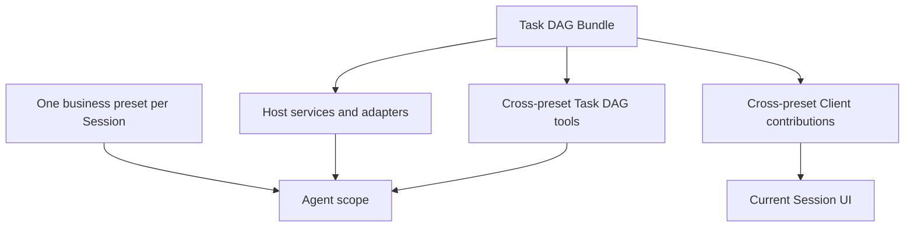

# G3 — Preset-orthogonal Task DAG distribution

**Type**: grilling
**Status**: resolved
**Current standing**: Task DAG is an opt-in, preset-orthogonal Cordis capability distributed through an independent Bundle. Installing the Bundle makes the capability available to Agents using any preset without creating, copying, extending, or patching those presets. [G14 Durable events, projection, and Host/Client boundary](G14-task-graph-projection-boundary.md) supersedes the original Session-event persistence mechanism; [G16 Model tools and cross-preset composition](G16-todo-coexistence-and-preset-composition.md) owns tool visibility and native planning-tool coexistence; [G25 Data-agent inner orchestration after Task DAG](G25-phase-gate-integration.md) owns whether phase-gate remains, is refactored, or is retired.
**Blocked by**: [G1 DAG data model decision](G1-dag-data-model-decision.md) ✅
**Blocks**: —

## Question

How does the Task DAG capability become available across presets without coupling its identity or lifecycle to any one Agent composition?

## Resolution

Task DAG ships as an independent Bundle and generic Cordis capability. The Bundle installs Host services, DSH adapters, model-tool Consumers, and Client contributions once per profile; each Session continues to select exactly one business preset such as `standard`, `data-agent`, or `semantic-layer-management`.

The capability is available across presets through ordinary scoped Cordis dispatch and Host Bindings. A preset neither owns Task DAG state nor becomes a prerequisite for its installation. Missing optional executors reduce the available execution methods but do not disable planning, persistence, projection, or Client inspection.

No `dag-standard`, `dag-data-agent`, or other derived preset is required. The Bundle does not copy or patch preset files. Profile composition is the installation choice; per-Session Task DAG activation and model-tool coexistence are separate policy decisions owned by G16.

## Superseded original mechanics

The original resolution used a terminal-state tool, `dag/*` DSH Session events, `ctx.tools.restrict()`, and phase nodes. Later decisions replaced those mechanics:

- G14 makes the independent Task DAG SQLite journal, projection, outbox, and Host Bindings authoritative instead of DSH Session events.
- G16 defines the current model tools and cross-preset planning-tool policy; host-level `tools.restrict()` cannot remove same-name or newly registered preset-scoped tools reliably.
- G12 defines a Task as executable work and excludes phases from the Task model.
- G19 keeps any executor-local orchestration opaque to the first-release Task DAG.
- G25 must first decide whether phase-gate remains after Task DAG; phase events and phase UI are conditional consequences, not prerequisites for Task DAG distribution.
