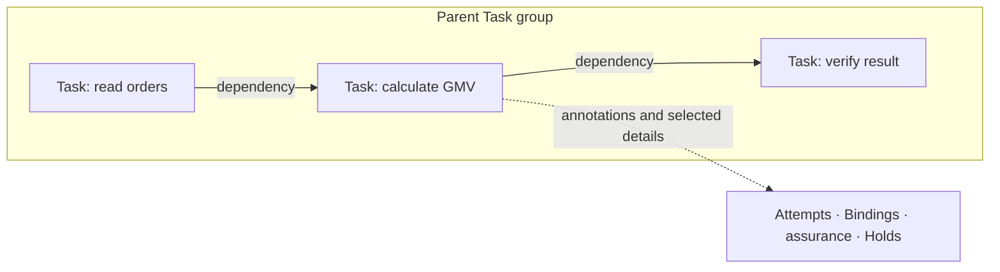
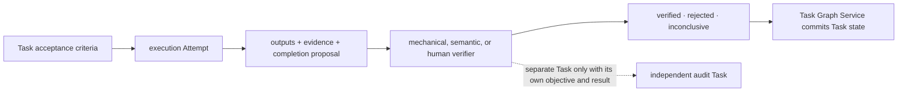
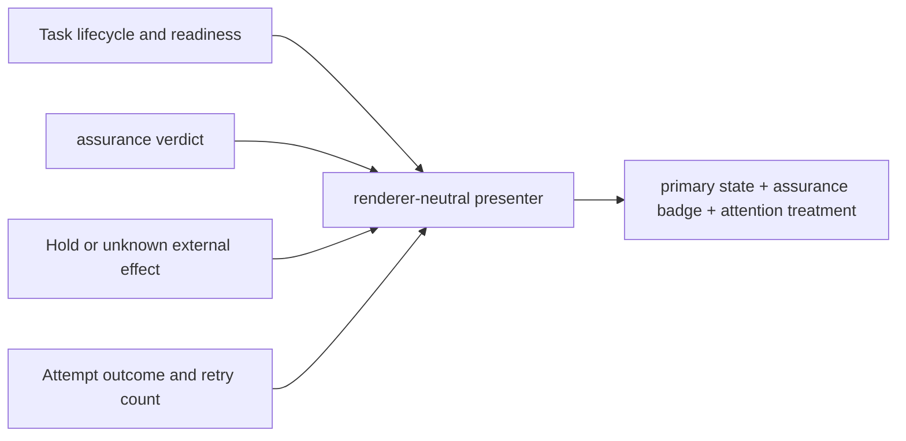
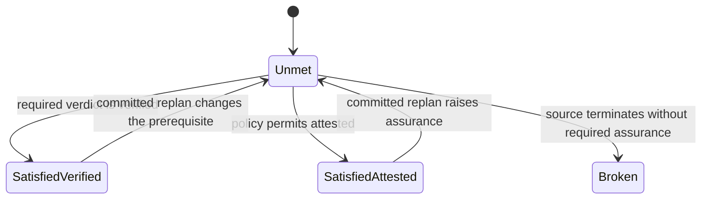
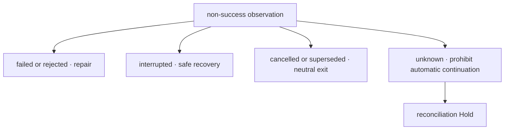
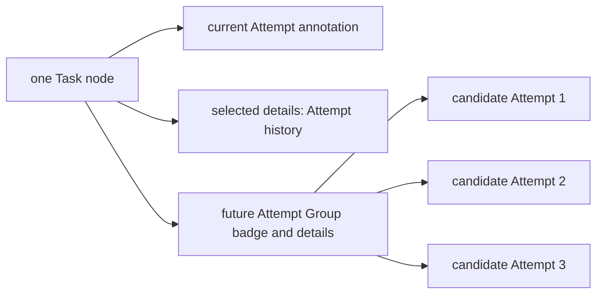
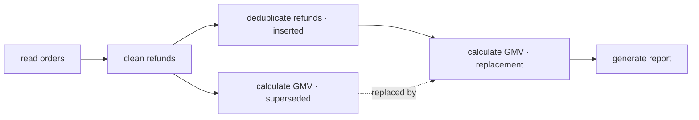
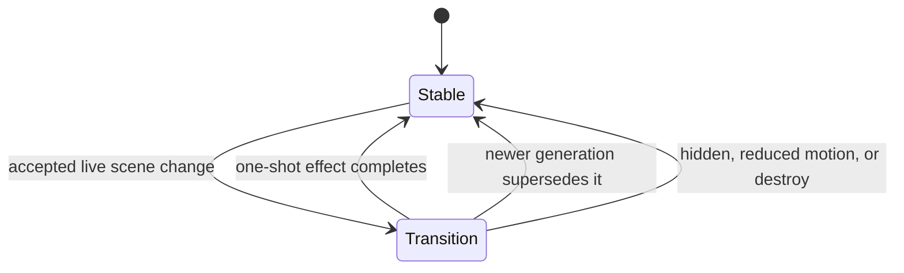

# G4 — Animation and edge design

**Type**: grilling
**Status**: resolved 2026-09-16
**Assignee**: Codex · 2026-09-16
**Blocked by**: [G15 Current client placement](G15-current-client-placement.md), [R5 G6 renderer adapter stability](R5-g6-renderer-adapter-stability.md)
**Blocks**: [G8 Global progress wavefront](G8-z-enhancement-global-progress-wavefront.md), [G20 First-release scope, compatibility, and evaluation](G20-v1-scope-and-evaluation.md)

## Context retained from G2

The accepted prototype distinguishes dependencies, containment, and execution correlations; makes active work visible; turns completed dependency paths green; highlights upstream and downstream relations on hover; and disables continuous motion under reduced-motion preference. G6 5.1.1 required explicit draw in the tested update path, and continuous dash animation worked through the display-object animation API.

The container and renderer API are not stable inputs. Current DSH has newer right-sidebar and global-panel lifecycles, upstream does not own G6, and the prototype reaches renderer implementation details.

## Question

How should renderer-neutral Task, Attempt, assurance, hold, dependency, containment, execution, and unknown states be presented and animated after client placement and renderer contracts are fixed?

Resolve insertion, execution, verification, completion, rejection, failure, cancellation, interruption, supersession, replan, Attempt Groups, reduced motion, animation cancellation, and whether containment is a group, edge, or view-dependent representation.

## Inputs from the R5 resolution

[R5 G6 renderer adapter stability](R5-g6-renderer-adapter-stability.md) fixes the motion ownership: G6-managed animation stays disabled in the first release, while the private renderer adapter owns approved semantic effects through cancellable `@antv/g` animation handles. Every state must remain legible without motion; hidden or reduced-motion views cancel effects; topology replacement reacquires display objects; and no G6 type or event escapes the adapter.

## Resolution

The first release uses a Task-only graph with independent lifecycle, assurance, and attention presentation. Dependency edges express prerequisite satisfaction. Containment is view-dependent display structure, while Attempts, execution Bindings, verification detail, and Holds remain inside their Task presentation. Motion is short, semantic, cancellable, and never required to understand current state.

### Task-only graph topology

The primary graph contains Task nodes and Plan relations. A dependency is a directed Task-to-Task edge. Containment is display metadata: an expanded view may render a parent group, while a compact or collapsed view preserves the parent label and omitted-child count without converting containment into a dependency.

Attempts, Host Bindings, dispatch and cancellation progress, assurance, EvidenceRecords, Holds, external-effect certainty, late results, and unknown values remain compact Task annotations plus selected-Task details. They do not become primary graph nodes or execution edges. This keeps the current graph aligned with user-visible work while [G22 Cross-session and multi-agent scheduling](G22-cross-session-multi-agent-scheduling.md), [G28 History, trace, and plan inspection](G28-history-trace-and-plan-inspection.md), and [G29 Typed task dataflow ports](G29-typed-dataflow-ports.md) own future agent-topology, execution-trace, and data-lineage views.

### Task-internal verification

Each Task owns acceptance criteria and a verification lifecycle. The executor submits outputs and evidence but cannot attest its own completion. Registered deterministic, semantic, or human verifiers submit criterion verdicts; the Task Graph Service validates them and is the only authority that commits the Task verdict. Verification becomes a separate Task only when it has an independently schedulable objective and result, not merely because it uses a separate process, model, or person.

A successful Attempt moves the Task to verification but does not display final success. The Task becomes verified only after the required criteria pass; rejected and inconclusive verdicts remain distinct from execution failure.

### Three-layer node status

A node presents three independent layers rather than persisting a combined UI status. The primary Task state communicates progression and terminal outcome; an assurance badge communicates `pending | verified | attested | rejected | inconclusive`; and an attention treatment communicates Holds or unknown external effects. Attempt outcome and retry count remain secondary annotations and never determine the Task color by themselves.

Only a completed Task with `verified` assurance receives the full success treatment. A settled successful Attempt remains verification-pending until a validated verdict commits Task completion. Attention treatment has the highest visual priority but does not replace or mutate the underlying Task, Attempt, or assurance values. The presenter derives this display priority from the complete current view.

| Information | Node presentation | Selected-Task details |
| --- | --- | --- |
| Task lifecycle and readiness | Primary label, icon, border, and fill | Exact state, readiness reasons, and revisions |
| Assurance | Text and icon badge | Criteria, verdicts, verifier identity, and evidence references |
| Hold or unknown external effect | Highest-priority attention marker | Reason, release condition, responsible actor, and effect certainty |
| Attempts and Bindings | Current Attempt and history count | Complete Attempt, Binding, cancellation, output, and late-result records |

### Dependency edges

A dependency edge presents whether its target Task's prerequisite is satisfied at the assurance required by that dependency. It does not mirror the source Task's Attempt outcome. A successful Attempt with pending verification leaves the edge unmet; `verified` satisfies the ordinary hard-dependency requirement, while an explicitly permitted `attested` result satisfies it with a distinct attestation marker.

An unmet dependency uses a neutral solid line. A satisfied dependency uses a success line and non-color completion marker. A source that reaches a terminal outcome without the required assurance uses an error line and blocking marker. Pointer or keyboard focus may highlight upstream and downstream paths without changing their semantic styles. Dependency edges never depict execution or data movement.

### Negative and uncertain states

Negative and non-success states do not collapse into one error treatment. `failed` and `rejected` require repair but distinguish execution failure from unmet acceptance criteria. `interrupted` identifies work that stopped without an uncertain external effect and may be retried. `cancelled` and `superseded` are neutral exits from the current plan. `unknown` identifies an unresolved external outcome, receives the strongest attention treatment, and remains blocked by a reconciliation Hold. A Hold presents its reason, release condition, and responsible actor without pretending to be an execution outcome.

Every treatment combines text and an icon with color. The renderer does not rely on color alone, and the selected-Task details preserve the exact Task, Attempt, assurance, Hold, and external-effect facts from which the presentation is derived. An unsupported or unrecognized state receives an explicit unknown or incompatible treatment; it never falls back to pending, completed, or another benign state.

### Attempts and Attempt Groups

A Task retains one graph node across retries and future same-Task concurrency. The node presents the current Attempt number, executor kind, active outcome, and prior-attempt count as compact annotations; selected-Task details present the complete Attempt, Binding, output, evidence, cancellation, and late-result history. An Attempt Group is a Task-local execution strategy and may use a stacked count or group badge, but its members never become Task nodes or Plan relations.

The first release visibly reports structured rejection when same-Task Attempt Group admission is requested. It starts neither one hidden member nor a serialized substitute. Future group execution can add member, winner, quorum, aggregation, and loser-cancellation details without changing graph topology. Work with independently meaningful objectives and results remains separate Tasks rather than an Attempt Group.

### Replan and spatial continuity

A committed replan presents the affected subgraph as a local Plan difference instead of replacing the graph as an unrelated scene. Tasks whose identities survive retain their selection and stable relative order where the layout permits it. New Tasks appear beside the affected dependency path; changed relations and state transitions receive one-shot emphasis without replaying unaffected branches.

A superseded Task remains visibly de-emphasized with its reason and replacement reference rather than disappearing immediately. When the selected Task is superseded, its details remain available with navigation to its replacement. [G11 DAG view simplification strategies](G11-dag-view-simplification-strategies.md) may later collapse terminal or superseded regions, but it must retain explainable omitted counts and replacement access. Layout stability is a best-effort presentation rule rather than persisted coordinates.

### Motion vocabulary

The first release uses only short, cancellable, one-shot motion for meaningful committed changes. Stable current state never depends on motion and does not run continuous edge flow, breathing, or wavefront effects. Active work remains legible through static text, icons, and styles.

| Scene change | Static result | Optional one-shot effect |
| --- | --- | --- |
| Initial snapshot, reload, or remount | Complete current graph | None; historical changes never replay |
| Task insertion | New node with an insertion annotation | Appear and emphasize the affected area |
| Attempt start | Running Task and current Attempt annotation | One border emphasis |
| Attempt retry | Updated Attempt number and history count | Annotation transition only |
| Completion proposal | Verifying Task with pending assurance | Primary state and assurance transition |
| Verified completion | Completed Task with verified assurance | Success transition and eligible local causal handoff |
| Attested completion | Completed Task with explicit attestation | Weaker transition that cannot resemble verified completion |
| Rejection or failure | Exact repair state | One error emphasis, then a static state |
| Hold or unknown external effect | Attention treatment and explanation | One attention emphasis, never continuous flashing |
| Cancellation or interruption | Exact neutral or recoverable state | One icon and style transition; no downstream handoff |
| Supersession or replan | Local Plan difference with stable identities | Affected-subgraph transition only |
| Frequent progress, token, duration, or evidence-count update | Updated annotation or details | No graph-level animation |

When a committed assurance verdict newly satisfies a dependency, the source Task, that dependency edge, and any target Task that consequently becomes ready may receive one bounded causal-transition effect. An edge may show its own satisfaction without signaling readiness when the target still has unmet prerequisites. This local handoff explains why work became ready; it does not depict data movement, cross unrelated branches, or implement the global wavefront deferred to [G8 Global progress wavefront](G8-z-enhancement-global-progress-wavefront.md).

The renderer derives transitions from the previous and next complete renderer-neutral scenes. It stores no animation state in the Task DAG. Batched changes produce one combined transition; a newer scene generation cancels stale effects and takes precedence. Hidden views, reduced-motion preference, zero-sized containers, topology replacement, and renderer destruction cancel active handles and apply the latest static state without catch-up animation.

### First-release boundary and ROI

This design gives data-agent users one readable answer to what work exists, why it is blocked, whether its result is trustworthy, and what requires attention. It preserves Task identity across retry and replan, prevents executor and trace detail from overwhelming the current graph, and prevents motion from implying execution facts that the Task DAG has not committed.

The implementation reuses the G15 current-Session sidebar and fullscreen placement, the G14 current projection, and the R5 private G6 adapter. It requires no second renderer, execution-node graph, animation event store, persistent layout coordinates, or new upstream DSH extension point. Existing G2 and G15 prototypes establish the interaction direction, so this ticket does not add a duplicate prototype.

Continuous progress effects remain in G8; display simplification remains in G11; agent topology remains in G22; history and trace inspection remain in G28; typed data lineage remains in G29; and measured large-graph renderer changes remain in [G34 Renderer scaling and replacement threshold](G34-renderer-scaling-and-replacement-threshold.md). No new follow-up ticket is required.
