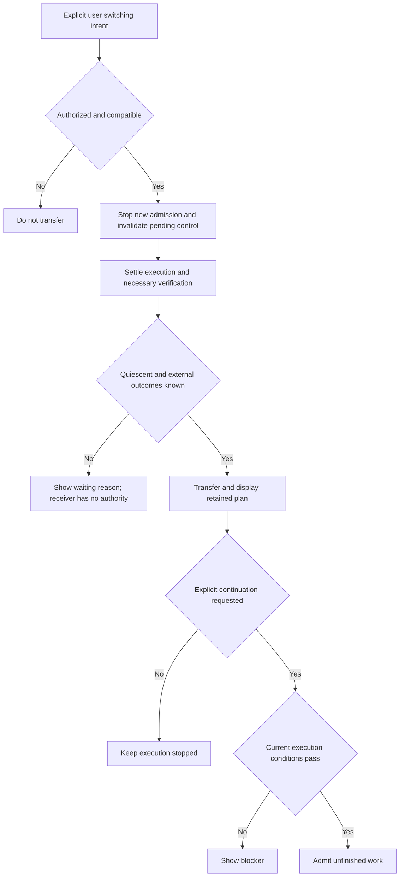

# G40 — Native planner same-Session handoff

**Type**: grilling
**Status**: open
**Blocked by**: [Model tools and cross-preset composition](G16-todo-coexistence-and-preset-composition.md), [Executor adapters](G17-native-source-adapters.md), [First-release scope, compatibility, and evaluation](G20-v1-scope-and-evaluation.md)
**Blocks**: —

## Question

How should an existing Session transfer planning control between native Todo, Goal, or Plan Mode and Task DAG while preserving committed work and keeping one writable planner and one continuation owner?

[Model tools and cross-preset composition](G16-todo-coexistence-and-preset-composition.md#confirmed-first-release-planner-scope) defers complete bidirectional switching from the first release rather than removing it from the long-term architecture. The first release chooses a planner for a fresh Session and rejects an unsupported in-Session switch explicitly; it does not silently migrate work or require a private upstream fork.

## Trigger and scope

Revisit when first-release use demonstrates material repeated work or lost context caused by opening another Session to change planners, and supported public interfaces make a safe implementation testable. Record that evidence and the implementation cost before enabling switching; deployment data does not activate it automatically.

Specify permission checks at every native mutation entry, pending runtime selections, automatic-continuation suspension, awaited quiescence, transfer ordering, retained state, late responses, control generations, reconnect/restart behavior, and re-entry. Verify tool, command, Remote, direct-Service, and asynchronous-review paths rather than assuming model-tool hiding enforces exclusivity. The selected first-release permissions and execution identities must remain valid without migration solely to add switching.

Keep Goal-to-Run objective mapping and coupled lifecycle semantics in [Goal and Plan DAG relationship](G26-goal-plan-dag-relationship.md). This ticket transfers control; it does not synchronize Todo with the Task Graph, migrate native tasks automatically, or make switching authorize execution. Crash recovery and external-effect settlement retain their existing owners.

## Reviewed product requirements

G16 re-Grilling records these inputs for the later implementation slice. This follow-up remains open: publication, detailed control generations, storage/restoration, authorization timing, restart behavior, and real-composition evidence still need specification and validation. These requirements do not restore switching as a first-release blocker. G16's overall shared-understanding confirmation accepts the Q9 implication from persistent planner selection.

### Natural drain

A switch request stops new work admission and lets started execution and necessary verification settle. Only quiescence and known external outcomes permit transfer. Switching alone does not cancel work; the user may separately request cancellation. An unresolved external effect leaves the receiving planner without execution authority. There is no fixed completion-time guarantee for long-running work. This keeps useful query results by default; cancellation and reconciliation remain necessary independent protocols.

### Explicit resumption

Returning control to a retained plan displays it without dispatching unfinished work. Explicit user continuation is required; one request may say both switch and continue. Current permissions, approvals, budgets, Holds, and external outcomes must still pass validation. Failed checks leave execution stopped with a visible reason. Completed work is never dispatched again merely because control returns; Todo display is not an executor. This separates plan inspection from new computation or writes without demanding a second UI action in every case.

### User-authorized transfer

The retained native-planner selection changes only through explicit authenticated user switching intent. Model proposal or ordinary Plan approval alone does not authorize transfer from unfinished native work. An action explicitly approving and requesting the switch may express both intentions; no particular button or natural-language classifier is specified. Compatibility and authorization precede admission freeze, drain, and transfer. No native Task migration or automatic resumption follows from transfer alone. This follows G16's confirmed persistent-selection rule rather than a new independent human answer.

### Pending native control requests

Invalidate native control requests that have not taken effect, with a visible outcome that the user may resubmit them if still needed. Old queued selections and late review responses cannot take effect after invalidation or revive on return. The initial handoff implementation does not retain a reconfirmation queue. Keep committed native plans, completed results, started execution, and necessary settlement and verification; invalidating control is not cancelling all work. Pending-request classification and exact invalidation timing must preserve that distinction. This trades repeated control requests for less queue persistence and UI complexity; it requires no additional model call.

## Acceptance evidence

A real-composition test must retain native plans and completed outputs across both directions; reject stale, queued, and late control requests; prove only the receiving owner gains authority after safe transfer; and cover blocked transfer, explicit cancellation, unresolved external outcomes, and reconnect. Report measured user benefit, model/latency cost, supported interface capabilities, and release compatibility. Source inspection alone is not passing acceptance evidence.
