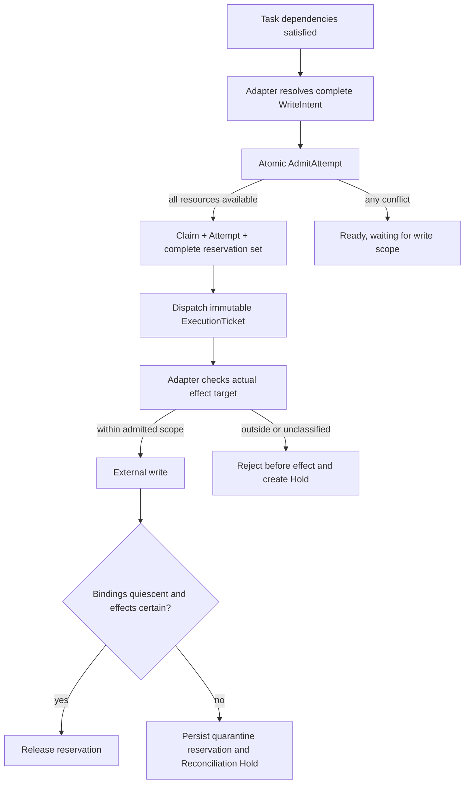

# G7 — writeScopes conflict semantics

**Type**: grilling
**Status**: resolved 2026-09-16
**Assignee**: Codex · 2026-09-16
**Blocked by**: [G19 Cordis outer-loop driver](G19-cordis-outer-loop-driver.md)
**Blocks**: [G16 Model tools and preset composition](G16-todo-coexistence-and-preset-composition.md), [G17 Executor adapters](G17-native-source-adapters.md), [G20 First-release scope, compatibility, and evaluation](G20-v1-scope-and-evaluation.md)

## Question

What guarantee does `writeScopes` provide to the scheduler: advisory warning, admission rule for known executors, or separate filesystem enforcement?

Define normalization, overlap, unknown scopes, concurrent Attempts, current-Agent versus delegated execution, and UI wording. Do not imply protection against uninstrumented writers unless a real enforcement provider owns that path.

## Inputs from the G14 resolution

`writeScopes` belongs to the Host-neutral Task DAG Task/Attempt protocol. DSH-specific path, tool, workflow, or external-system enforcement is supplied by executor adapters; the core stores normalized declared scopes and admission facts without importing DSH types. SQLite commit serializes admission decisions, while native enforcement and observations remain adapter-owned.

## Resolution

### Answer

`writeScopes` provides durable admission isolation for writes performed by Task-DAG-managed Attempts. The Task DAG prevents concurrently admitted managed writers from holding overlapping declared resources, but it does not claim to stop external or undeclared writers. Executor adapters may add target validation or native enforcement without changing the core admission rule.



### Domain terms and ownership

A **write intent** is the complete pre-admission declaration of whether an Attempt writes external state. A **write scope** is one normalized hierarchical resource selector inside a scoped write intent. A **write reservation** is the durable admission fact that excludes overlapping managed writers. A **write protection level** states what an executor proved beyond core admission isolation.

The Task value stores the current planned write intent. `AdmitAttempt` copies the validated intent into the immutable Attempt so later Task revisions cannot change an executing Attempt's authority. One Attempt owns one reservation set; child Bindings inherit or narrow that set and never own hidden reservations.

The Host-neutral protocol uses this conceptual model:

```text
type WriteIntent =
  | { kind: "read-only" }
  | { kind: "scoped-write", scopes: NonEmptyArray<WriteScope> }
  | { kind: "unbounded-write" }

WriteScope = {
  scheme: string,
  authority: string,
  segments: NonEmptyArray<string>,
  coverage: "exact" | "subtree"
}

WriteReservationSet = {
  attemptId: ExecutionAttemptId,
  admittedIntent: WriteIntent,
  state: "active" | "quarantined",
  unresolvedExternalEffects: ExternalEffectId[]
}

WriteProtection =
  | "admission-only"
  | "target-validated"
  | "native-enforced"
```

`scheme` includes the resource interpretation version, such as `maxcompute-resource@1`. `authority` distinguishes tenants, accounts, clusters, or other top-level ownership domains. `segments` contains the adapter-normalized hierarchy. `coverage: exact` selects one resource; `coverage: subtree` selects that resource and every descendant.

The core owns validation of the generic value, deterministic comparison, atomic reservation, release, replay, and projection. Executor adapters own provider identity resolution, aliases, case rules, encoding, partition ordering, safe display labels, actual-target checks, and native protection. DSH and Cordis types do not enter the domain records.

### Invariants

1. Every admitted Attempt has exactly one explicit `WriteIntent`; an absent or invalid intent never means read-only.
2. `read-only` creates no write reservation. `scoped-write` contains at least one normalized scope. `unbounded-write` acquires the TaskGraphStore-wide write barrier.
3. An Attempt's admitted intent is immutable. Plan or Task revisions require a new admission before changed scopes can authorize execution.
4. `AdmitAttempt` acquires the complete reservation set atomically with the Claim, prepared Attempt, budget and capacity reservations, and dispatch intent. A conflict commits none of those admission effects.
5. Active and quarantined reservation sets both participate in conflict detection.
6. A child Binding may use only the parent Attempt's admitted scopes or a subset. It cannot widen the set or create an independent reservation.
7. Dispatch, retry, cancellation, timeout, process loss, Session closure, and service restart never release a reservation by themselves.
8. A reservation releases only after every write-capable causal Binding is quiescent and every related external effect has a certain outcome.
9. An unknown external effect preserves the reservation as quarantined until reconciliation or an audited human resolution establishes a safe outcome.
10. Resource waiting is an admission condition, not a DAG dependency or Hold. The Task remains ready and is reconsidered after a conflicting reservation changes.
11. Protection levels affect diagnostics and permitted product wording, not the core overlap calculation.
12. The guarantee covers managed Attempts in one TaskGraphStore scheduling domain. External writers and work that bypasses the protocol remain outside the guarantee.

### Normalization and overlap

An adapter resolves all aliases and provider-specific identities before admission, emits versioned scopes, sorts them deterministically, removes exact duplicates, and removes a member already covered by another member's `subtree`. Invalid schemes, authorities, empty segments, unsupported versions, or ambiguous identities reject resolution before admission.

Two scopes conflict only when `scheme` and `authority` match and one of these conditions holds:

- both are `exact` and their segments are equal;
- the left scope is `subtree` and its segments are a prefix of the right scope;
- the right scope is `subtree` and its segments are a prefix of the left scope.

Different exact descendants do not conflict. A table-level `subtree` conflicts with every partition below that table. When a provider operation cannot be represented precisely, the adapter declares a safe ancestor with `subtree`. Provider-defined arbitrary comparator callbacks are excluded from the first release because they would make replay depend on plugin code and weaken the single deterministic core interface.

For example, separate MaxCompute partitions may execute concurrently:

```text
maxcompute-resource@1 / tenant-a.cn-shanghai / project-x / table / dwd_orders / partition / dt=2026-09-14 / exact
maxcompute-resource@1 / tenant-a.cn-shanghai / project-x / table / dwd_orders / partition / dt=2026-09-15 / exact
```

A schema change declares the table ancestor with `subtree` and therefore excludes both partition writers.

### Unknown targets and complex data-engineering work

`read-only`, `scoped-write`, and `unbounded-write` are distinct protocol variants. An empty list cannot represent an unknown target.

A complex data-engineering plan resolves dynamic targets through a read-only discovery Task, then creates or revises separately recoverable write Tasks whose scopes are complete before admission. The initial implementation does not enlarge an admitted scope at runtime. An execution that discovers an out-of-scope target stops before the external effect and creates a revision-linked Hold.

An explicitly classified legacy executor that may write but cannot determine a safe target uses `unbounded-write`. It is admitted only when no other managed writer is active and prevents any other managed writer from starting until its reservation releases. Verified read-only Attempts may still run, subject to their separate capacity and consistency policies. Missing metadata is a protocol error and creates `WriteScopeRequired`; it does not silently select the unbounded fallback.

### Concurrent admission

The SQLite store evaluates the complete scope set in one transaction. If any active or quarantined reservation conflicts, the candidate acquires nothing and the projection reports `waiting-for-write-scope` with the current blockers. The scheduler retains G19's stable `priority DESC, readySinceSeq ASC, taskId ASC` ordering and reevaluates ready candidates after reservation changes.

All-or-nothing acquisition prevents two Attempts from retaining different subsets and waiting on each other. A failed admission is not journaled as a new lifecycle transition on every retry; current waiting facts are derived from the ready Task, its immutable candidate scopes, and committed reservations. Successful admission and reservation release remain durable commits.

The first release uses one SQLite-backed Task DAG scheduling domain. Multi-process and cross-store coordination must preserve the same atomic result but belongs to the cross-session and advanced scheduling follow-ups.

### Execution enforcement

Every execution path receives the same immutable ExecutionTicket. The current-Agent Host adapter injects it into the Attempt-bound turn, and its protected-tool path rejects unclassified writes or actual targets outside the admitted set before tool execution. Delegated executor adapters receive the same ticket through their primary Binding; subagent, workflow, and nested tool Bindings retain the same Attempt and generation.

An adapter reports one protection level for the admitted execution:

- `admission-only`: the core excluded overlapping declared managed writers;
- `target-validated`: the adapter additionally proved the concrete requested target is inside the admitted set before the effect;
- `native-enforced`: the provider also applied a sandbox, lock, permission, transaction, or equivalent native restriction.

An adapter must not report a stronger level from model instructions, SQL comments, naming conventions, traces, or post-hoc observations. A required protection capability that is unavailable rejects admission and creates a typed Hold rather than silently weakening the policy.

### Reservation lifecycle and recovery

A reservation begins in the successful `AdmitAttempt` commit and survives dispatch failures, retries inside the same Attempt, cancellation requests, timeouts, process loss, Session closure, and service restart. The projection rebuilds active and quarantined reservation sets from the journal; there is no memory-only lock and no TTL-based release.

A safe terminal executor outcome releases the reservation in the commit that records quiescence and final external-effect certainty. A Task-level semantic retry creates a new Attempt and must reacquire its complete set. Verification uses immutable outputs, provider snapshots, or recorded evidence rather than treating the write reservation as a permanent data-version lock.

When an external write may have started but its result is unknown, the Attempt may settle as `unknown`, while its reservation set becomes `quarantined` and references the unresolved ExternalEffect records. Reconciliation may later establish `confirmed` or `rejected` and release the quarantine without reopening the terminal Attempt or completing the Task automatically.

There is no generic force-unlock operation. A human resolution records the actor, reason, evidence, affected ExternalEffects, and resulting certainty; it does not erase the unknown history or imply Task success. Authorization extensibility remains owned by the authorization follow-up.

### Projection and UI contract

Task readiness and write admission are separate values. The current TaskGraphView exposes a compact safe projection:

```text
WriteIsolationView = {
  intent: "read-only" | "scoped-write" | "unbounded-write",
  state: "not-required" | "available" | "reserved" | "waiting" | "quarantined",
  protection?: "admission-only" | "target-validated" | "native-enforced",
  scopes: WriteScopeSummary[],
  waitingOn: WriteReservationSummary[]
}
```

A `WriteScopeSummary` contains a stable opaque reference, adapter-supplied safe label, and `exact | subtree`; it does not expose credentials, transport references, or provider secrets. The canonical key remains in the journal and authorized diagnostics. Display labels never participate in conflict decisions. `protection` is absent for `read-only` because no write guarantee applies.

The UI says “waiting for write scope” for resource contention, “write target unknown; running serially” for an admitted unbounded writer, and “external result unknown; related writes paused” for quarantine. It may say “managed admission isolation”, “target validated”, or “executor native protection” according to the reported protection level. It must not say “resource locked”, “no other writer exists”, or “safe to retry” unless the corresponding provider fact is actually available.

### Failure semantics

| Condition | Result | Durable effect |
|---|---|---|
| Missing or invalid `WriteIntent` | `WriteScopeRequired` Hold | No Claim, Attempt, reservation, or dispatch |
| Unsupported scope version or unavailable normalizer | Compatibility or Host-unavailable Hold | No admission effects |
| Overlap with active or quarantined reservation | Ready but `waiting-for-write-scope` | No partial reservation and no new DAG edge |
| `unbounded-write` while another writer is active | Ready but waiting for the global write barrier | No partial reservation |
| Stale Task, Plan, Claim, or generation | Typed command rejection | No state change |
| Actual target is outside the admitted set | Reject before effect and create `WriteScopeViolation` Hold | Attempt proceeds to safe settlement after Bindings quiesce |
| Required target validation or native protection is unavailable | Typed protection-capability Hold | No dispatch under weaker protection |
| Cancellation confirmed before any uncertain effect remains | Settle cancelled and release | Atomic final facts and reservation release |
| External effect outcome unknown | Settle unknown and quarantine | Reservation continues to exclude conflicting writers |
| Service restarts | Replay journal and rebuild reservations | No automatic release or redispatch from elapsed time |

### First-release implementation slice

The first useful slice implements the three-state intent, versioned `exact | subtree` keys, deterministic normalization, all-or-nothing SQLite admission, the unbounded global write barrier, durable active and quarantined reservation sets, one target-validating data-agent executor, the current-Agent protected-tool check, and the compact TaskGraphView fields. First-release profiles and public commands reject runtime scope expansion, distributed locking, shared/read locks, predicate-level scopes, preemption, and unsupported protection claims with typed results; SQL semantic inference is absent rather than guessed. The owning follow-ups activate only after measured contention, latency, starvation, lost parallelism, or recovery burden demonstrates enough user or operating value to justify the additional mechanism.

### Acceptance requirements

The implementation plan and tests must make the following cases directly executable:

1. Adapter normalization maps equivalent provider identities to equal keys, isolates different authorities, sorts and deduplicates sets, removes scopes covered by a local `subtree`, and rejects malformed or unsupported values.
2. Exact siblings do not conflict; identical exact resources conflict; either ancestor `subtree` conflicts with its descendant; different schemes or authorities do not conflict.
3. Two concurrent SQLite admissions for the same scope produce exactly one successful Attempt and one ready waiting Task. A multi-scope conflict leaves no partial Claim, reservation, budget deduction, or outbox record.
4. `read-only` runs beside writers, scoped writers use normal overlap, and one `unbounded-write` excludes every other managed writer in the TaskGraphStore scheduling domain.
5. Stable priority and ready age determine which conflicting Task wins after replay and after reservation release; resource waiting never creates a DAG dependency or Hold.
6. Current-Agent tools and delegated child Bindings accept targets inside the ticket, reject wider or unclassified writes before provider invocation, and cannot create or expand reservations.
7. Protection capability downgrade fails loud. View and SDK output distinguish admission-only, target-validated, and native-enforced without claiming protection against external writers.
8. A crash after admission but before dispatch retains the reservation. A crash during `dispatching`, an unconfirmed cancellation, or an unknown external result creates or preserves quarantine and prevents automatic retry.
9. Confirmed completion, rejection, or cancellation releases the reservation only after every causal write Binding is quiescent. Restart reconstructs the same blockers from the journal, and elapsed time never releases them.
10. An audited human effect resolution can release quarantine only through the closed first-release command matrix; it retains the unknown history and does not complete the Task automatically.
11. TaskGraphView, TypeScript SDK, Python SDK, and Web fixtures project the same readiness, waiting, quarantine, protection, blocker, and safe-label values. Raw credentials and native references never enter the public view.
12. Keyless recorded-session coverage shows a data-agent partition conflict, a scope violation before tool execution, and an unknown external write that remains quarantined after replay. Provider e2e evidence verifies target validation only for adapters selected for the first release.

### Follow-ups

- [G17 Executor adapters](G17-native-source-adapters.md) owns concrete scope normalization, target extraction, protection capability reporting, and provider-specific enforcement.
- [G16 Model tools and preset composition](G16-todo-coexistence-and-preset-composition.md) owns protected-tool classification and fail-loud handling for unclassified tools inside a Plan-DAG Attempt.
- [G22 Cross-session and multi-agent scheduling](G22-cross-session-multi-agent-scheduling.md) owns preservation of the same reservation semantics across concurrent Runs, Sessions, workers, or stores.
- [G23 Automatic recovery and external-effect reconciliation](G23-recovery-and-external-effect-reconciliation.md) owns automatic provider lookup, webhook reconciliation, idempotent replay, compensation, and cross-process recovery for quarantined effects.
- [G24 Advanced routing, parallelism, and optimization](G24-advanced-routing-and-parallelism.md) owns runtime scope expansion, shared/read locks, predicate-level scopes, preemption, batching, contention metrics, and finer scheduling only after measured benefit.
- [G28 History, trace, and plan inspection](G28-history-trace-and-plan-inspection.md) owns reservation timelines and historical contention analysis beyond the current-state projection.
- [G33 Extensible Task Graph authorization policy](G33-extensible-task-graph-authorization-policy.md) owns extensible operator roles and delegated authority for manual external-effect resolution.
- [G20 First-release scope, compatibility, and evaluation](G20-v1-scope-and-evaluation.md) owns the final package boundary, supported adapter list, evaluation thresholds, and release proof for these acceptance requirements.

## Comments

- 2026-09-16：用户确认 `writeScopes` 对受 Task DAG 管理且已声明范围的 Attempt 提供强制准入隔离，而不是仅给出重叠警告；执行器原生锁、沙箱或权限控制是独立且可报告的增强能力，核心不声称阻止外部或未接入协议的写入者。复杂数据工程写入必须在准入前闭合资源清单：动态目标先通过只读发现 Task 确定并生成具体写入 Task；Attempt 启动后发现范围外目标时，在发生外部写入前停止并进入关联当前 Task revision 的 Hold，不在运行中自动扩大资源占用。
- 2026-09-16：用户确认 `writeScopes` 使用 adapter 生成的版本化层级资源键。每个键包含资源语义版本、authority、规范化 segments 与 `exact | subtree` coverage；Task DAG core 只验证该通用结构并执行同 scheme/authority 下的相等或祖先覆盖判断。adapter 负责供应商身份解析、大小写、编码、分区顺序和复杂操作的多键展开。不能精确表示时必须声明安全的上级 `subtree`；无法给出安全范围的写入不得作为已隔离任务参与自动并发。
- 2026-09-16：用户确认写入意图使用无歧义三态：`read-only` 明确证明不写外部资源；`scoped-write` 携带完整版本化层级范围；`unbounded-write` 明确可能写入但目标无法安全界定。显式 `unbounded-write` 仅在没有其他活动写 Attempt 时取得全局写入屏障并串行执行，期间阻止其他受管写入但不冒充具体资源锁；缺失或无效的写入意图是协议错误，进入 `WriteScopeRequired` Hold，不能猜测为只读或自动降级。
- 2026-09-16：用户确认所有执行方式共用同一隔离协议。write reservation 永远由 Task DAG 的 `ExecutionAttempt` 持有；current-Agent、tool、subagent、workflow 与数据 executor 都接收同一不可变 `ExecutionTicket`。同一 Attempt 的 child Bindings 只能继承或缩小已获准范围，不能扩大范围或另建隐藏占用；超范围或未分类写入必须在外部效果前拒绝并进入 Hold。adapter 可分别报告 `admission-only`、`target-validated` 与 `native-enforced` 能力，但保护等级只约束可宣称的保证，不改变核心准入语义。
- 2026-09-16：用户确认 write reservation 没有 TTL。它从 `AdmitAttempt` 的原子提交开始，只有所有可能写入的 causal Bindings 已达到静止状态且相关外部效果不再是 `pending | unknown` 时才能释放。超时、心跳丢失、Session 关闭、本地进程退出、服务重启或尚未确认的取消都不能自动解锁。结果未知时，Attempt 可结算为 `unknown`，但原范围转换为由 `ExternalEffectId` 与 Reconciliation Hold 持有的持久隔离占用；Task 级重试必须等待其安全解除。人工处理必须记录操作者、理由和证据，不能删除未知历史或自动完成 Task。
- 2026-09-16：用户确认多范围 Attempt 使用全有或全无准入。`AdmitAttempt` 在同一个 SQLite 事务中检查并取得完整 scope 集合，并与 Claim、prepared Attempt、预算/容量 reservation 和 outbox intent 一起提交；任一冲突就不保留任何部分占用。冲突 Task 仍是业务上 ready，仅投影为 `waiting-for-write-scope`，不创建 DAG dependency 或 Hold；reservation 释放后由 driver 按既定稳定优先级与 ready-age 重新准入。该语义消除部分占用死锁，并由 journal/projection 在重启后重建。
- 2026-09-16：用户确认 Task readiness 与 write admission 分离投影。Web 与 SDK 显示等待对象、`active | quarantined` 占用、`admission-only | target-validated | native-enforced` 保护等级以及 adapter 提供的安全资源名称；canonical key 仅进入 journal 与授权诊断，显示名称不参与冲突判断。只有 adapter 报告原生保护时才可使用对应文案，任何等级都不得声称阻止外部写入者。
