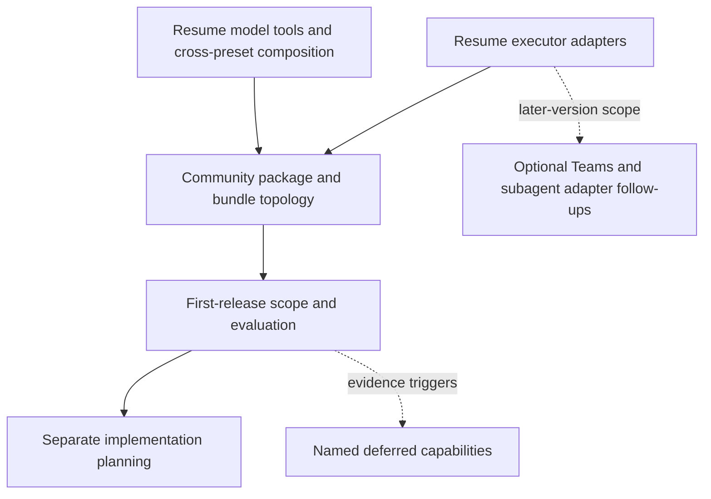

# T1 — Git checkpoint reconciliation and planning handoff

**Type**: task
**Status**: resolved
**Assignee**: QoderWork session mucqjd3zdn511699 (2026-09-22)
**Blocked by**: None; this administrative task preserves unfinished decision checkpoints rather than requiring their resolution.

## Question

How can the completed view-simplification decision and the unfinished model-tool and executor-adapter checkpoints remain recoverable and correctly indexed after concurrent work in the shared Git worktree?

Reconcile local and remote Git observations, preserve unrelated edits without treating them as validated fixes, retain published history, and record the next planning steps. This task does not resolve architecture questions, change product packages, push commits, or certify CI readiness.

## Comments

2026-09-22: Claimed for the user-authorized local Git cleanup and new commits. The view-simplification ticket is resolved; model-tool composition and executor adapters remain claimed checkpoints. No new architecture ticket is claimed or resolved by this administrative work.

## Answer

### Reconciled Git state

The ordinary origin fetch refspec tracks only `master`. Consequently, the local remote-tracking reference for the Task DAG branch remained at the view-simplification commit even after GitHub received the executor checkpoint, both merge-forward commits, and the bubblewrap CI fix. An explicit fetch of `refs/heads/codex/task-orchestration-dag-baseline-2026-09-15` into its matching `refs/remotes/origin/` reference reconciled the observations without changing Git configuration. At reconciliation, local and live remote heads matched; the local branch already contained `origin/master`.

Both published merges and the separate bubblewrap commit remain unchanged. No reset, rebase, force push, branch deletion, or new merge was needed. The [existing Task DAG PR](https://github.com/McKenzieIT/deepseek-harness-da/pull/167) reported `MERGEABLE` but `UNSTABLE` on 2026-09-22: Linux coverage, snapshots/artifacts, Windows coverage, and the aggregate check reported failure. Those results do not establish a shared root cause. Git reconciliation does not certify the CI fix or release readiness; this session neither reruns CI nor pushes its documentation commit.

### Preserved unrelated work

Five uncommitted test edits were isolated without modification: `packages/client/ui-semantic-layer/tests/DashboardView.spec.tsx`, `packages/client/ui-semantic-layer/tests/apply.client.spec.ts`, `packages/client/ui-semantic-layer/tests/useEvidenceQuery.client.spec.ts`, `packages/data/evidence-query/tests/file-backed-store.spec.ts`, and `packages/eval/eval-cli/tests/compare-runs.spec.ts`. They change assertions and callback bodies; they are not part of the three planning tickets and have not been accepted as tested fixes.

The recovery branch `backup/task-dag-before-git-cleanup-2026-09-22` preserves the original branch head. The named stash `task-dag: preserve unrelated unverified test edits before git cleanup 2026-09-22` preserves the five edits, and `backup/task-dag-unverified-test-edits-2026-09-22` pins that stash commit independently of its changing stash-list position. All three earlier stashes remain intact. Full-byte comparisons and SHA-256 checks matched every saved edit to the pre-cleanup copy and every restored tracked file to the original HEAD version.

To investigate these edits later, use a separate clean worktree based on `backup/task-dag-before-git-cleanup-2026-09-22`, then apply the pinned stash with `git stash apply backup/task-dag-unverified-test-edits-2026-09-22`. Keep both recovery references; do not treat a successful apply as test validation or silently fold these edits into planning work.

### Planning handoff

[DAG view simplification strategies](G11-dag-view-simplification-strategies.md#answer) is resolved and requires no new decision. [Model tools and cross-preset composition](G16-todo-coexistence-and-preset-composition.md#discussion-checkpoint) and [Executor adapters](G17-native-source-adapters.md#discussion-checkpoint) remain claimed, with their existing assignees and confirmed choices preserved byte-for-byte. A completed agent session or a saved commit does not close either decision ticket.

The suggested first-release sequence is to resume model tools and cross-preset composition, then executor adapters, one decision ticket per session. The former still owns final native/PTC tool and prompt composition, role changes, native-planner exclusion, and lifecycle handling. The latter still owns registration evidence, automatic executor coverage, dispatch, cancellation, outputs, and recovery. This order reduces integration rework; it does not add a new formal blocking edge between them. Each ticket still requires its own human discussion, evidence, and explicit resolution.

Only after both resolve may [Community package and bundle topology](G18-community-package-and-bundle-topology.md) proceed. [First-release scope, compatibility, and evaluation](G20-v1-scope-and-evaluation.md) additionally requires that topology decision. The next implementation plan follows those decisions, not this Git cleanup.

[Global progress wavefront](G8-z-enhancement-global-progress-wavefront.md) is the only unclaimed, unblocked architecture ticket, but it is a later-version effect, not a first-release dependency. [Optional Agent Teams adapter](G9-team-task-upstream-integration.md) and [Subagent execution adapter](G10-subagent-tree-upstream-integration.md) become unblocked after the executor decision; their current edges do not make them package-topology prerequisites. [Extended filtering](G36-extended-focus-and-filtering.md), [Structural summaries](G38-structural-aggregation-and-terminal-summaries.md), [Manual execution](G37-manual-execution-adapter.md), and [Advanced routing](G24-advanced-routing-and-parallelism.md) retain their existing dependencies and activation triggers.

### Git coordination for continuation

Use the current baseline as the integration worktree, with one writer owning its index, map, and Git operations at a time. Resume the two claimed tickets sequentially there, or explicitly hand each to a separate branch and worktree before concurrent writing. Read-only reviews may run in parallel. Concurrent workers do not stage, commit, merge, or push from the same shared index; the integration owner reconciles map and glossary edits and checks ticket identifiers before incorporating their commits.

Before comparing this feature branch with its remote, fetch its explicit ref as above; the master-only default fetch is not evidence of feature-branch freshness. Classify a change by its ticket or CI owner before staging exact paths. Diagnose the existing PR failures in a separate CI worktree and preserve the unverified test edits until that owner validates them. No hooks or check failures are bypassed to obtain a clean planning commit.

### Verification scope

The focused preservation check first rejected the old map for advertising claimed tickets as claimable, then passed after the index correction. It also checked five saved files, all three prior stashes, unchanged bytes for the three decision tickets, unique ticket identifiers, and the retained downstream dependencies. The backup patch passed `git apply --check` without changing the worktree. Explicit Wayfinder checks covered eleven Markdown files, eight Mermaid blocks, link targets and anchors, trailing newlines, and negative controls; these do not imply package, integration, or CI test coverage.
